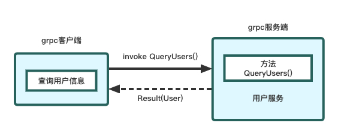
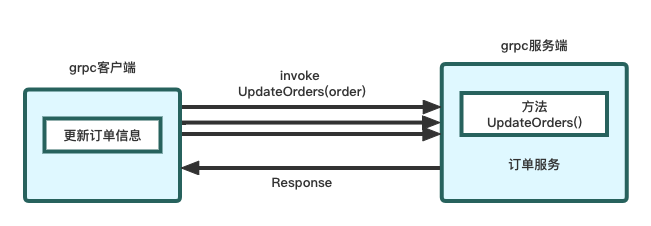
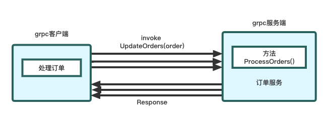

- [1. grpc介绍](#1-grpc介绍)
	- [1.1 什么是grpc](#11-什么是grpc)
	- [1.2 grpc与protocol buffers的关系](#12-grpc与protocol-buffers的关系)
	- [1.3 与其他rpc技术的对比](#13-与其他rpc技术的对比)
		- [1.3.1 HTTP](#131-http)
		- [1.3.2 Thrift](#132-thrift)
	- [1.4 小结](#14-小结)
- [2. 基于go语言实现一个简单grpc服务端和客户端](#2-基于go语言实现一个简单grpc服务端和客户端)
	- [2.1 前置准备](#21-前置准备)
	- [2.2 服务接口定义](#22-服务接口定义)
	- [2.3 服务端实现](#23-服务端实现)
	- [2.4 客户端实现](#24-客户端实现)
	- [2.5 运行](#25-运行)
- [3. grpc的通信模式](#3-grpc的通信模式)
	- [3.1 一元RPC模式](#31-一元rpc模式)
	- [3.2 服务器端流RPC模式](#32-服务器端流rpc模式)
	- [3.3 客户端流GRPC模式](#33-客户端流grpc模式)
	- [3.4 双向流RPC模式](#34-双向流rpc模式)
- [4. grpc的高阶使用](#4-grpc的高阶使用)
	- [4.1 负载均衡](#41-负载均衡)
		- [4.1.1 负载均衡器代理](#411-负载均衡器代理)
		- [4.1.2 客户端负载均衡](#412-客户端负载均衡)
		- [4.1.3 服务注册中心](#413-服务注册中心)
		- [4.1.4 名字解析](#414-名字解析)
	- [4.2 拦截器](#42-拦截器)
		- [4.2.1 服务端拦截器](#421-服务端拦截器)
		- [4.2.2 客户端拦截器](#422-客户端拦截器)
	- [4.3 grpc与http](#43-grpc与http)
	- [4.4 Prometheus集成](#44-prometheus集成)
		- [4.4.1 grpc-go服务端集成promethues](#441-grpc-go服务端集成promethues)
		- [4.4.2 grpc-go客户端集成promethues](#442-grpc-go客户端集成promethues)
- [5. 总结](#5-总结)

## 1. grpc介绍

### 1.1 什么是grpc

在了解什么是grpc前，需要先知道什么是rpc。所谓的rpc（Remote Procedure Call），即远程过程的调用协议，我们也经常称为进程间通信协议，它可以让调用远程的函数像调用本地函数一样简单方便。

微服务和云原生架构出现后，我们构建一个系统时，各个业务功能都被拆分成了不同的服务模块，我们称之为微服务。而不同微服务间需要进行访问或者相互调用，便需要我们在不同微服务间定义统一的通信协议，构建一套进程间（或服务间）的通信技术来连接这些微服务。

我们常用的HTTP协议本身也是一种rpc协议，另外常见的rpc协议还有facebook的thrift和google的grpc，下面章节也会对比下这两种常见的协议和grpc的差别。

grpc是google于2015年开源的rpc框架，它具备标准化、可通用和跨平台的特点。这些特点使得不同微服务间可以方便的进行调用外，还支持可拓展的负载均衡、链路跟踪、健康检查等特性。而底层的通信，grpc采用的是HTTP/2来进行，性能和效率上能够得到充分的发挥。grpc也加入了CNCF（云原生计算基金会），逐渐的也成为了主流的社区上rpc框架。


### 1.2 grpc与protocol buffers的关系

微服务间通信时，需要依赖统一的通信协议。这里我们暂且将主调方称为客户端，被调方称为服务端。

服务端需要先定义服务接口，这种服务接口的描述语言，我们便称之为**接口定义语言**（interface definition language，IDL），而protocol buffers便是grpc所使用的接口定义语言。

protocol buffers是一种语言中立、平台无关，用于实现结构化数据序列化的可扩展机制。根据该机制，服务接口将会定义一个文件扩展名为.proto的文件。如何使用protocol buffers不是本文的重点，具体可以参考[官网](https://developers.google.com/protocol-buffers)。

这里提供一个grpc官网给出的一个proto文件示例：
```protobuf
// The greeting service definition.
service Greeter {
  // Sends a greeting
  rpc SayHello (HelloRequest) returns (HelloReply) {}
}

// The request message containing the user's name.
message HelloRequest {
  string name = 1;
}

// The response message containing the greetings
message HelloReply {
  string message = 1;
}
```

我们通过proto文件定义好服务接口后，便需要根据这个定义生成服务端代码，我们称被生成的服务端代码为**服务端骨架**（skeleton）。

另一方面，还需要根据proto文件的服务接口定义生成客户端代码，这份代码我们称之为桩代码或者存根（stub）。有了桩代码后，客户端便可以像调用本地函数一样调用远程服务端的函数了。


Protocol buffers官方支持常用语言的代码生成，如go、c++、java、python等，可以查看这个[文档](https://developers.google.com/protocol-buffers/docs/tutorials)。如果官方没有提供，github上也有一些第三方开源库提供支持。

### 1.3 与其他rpc技术的对比

#### 1.3.1 HTTP

HTTP协议是我们日常开发中使用的最广的进程间通信协议，可以使用JSON、XML等作为传输的数据定义，结合REST风格搭建出一套简单易用的微服务系统。

而随着微服务的数量激增，网络结构越发复杂后，这种通信协议便会出现一些局限性了。

**它基于文本的低效消息协议**  
HTTP的双方在进行通信时，采用的是文本的传输协议，无论是JSON还是XML，这都是方便了人类可读，使用简单。而对于机器来说，这是一种相对低效的通信协议。

**程序间缺乏强类型接口**  
现如今，微服务大多采用不同的语言进行搭建。我们在定义服务接口时，经常使用约定的方式，或者借助一些服务定义技术（如OpenAPI/Swagger等）来进行描述，各个程序间基于这套描述来进行通信。

这种无法对服务接口进行明确定义和强类型限制的服务通信方式，会让服务间十分缺乏安全感。

#### 1.3.2 Thrift
thrift也是与grpc类似的rpc框架，由facebook开发，后面捐赠给了apache基金会。thrift同样有自己的接口定义语言，也需要生成对应的服务端和客户端代码，也意味着它也可以实现跨平台的通信。

但是两者还是有一些区别：
1. 在**传输性能**方面会弱于grpc。grpc是基于HTTP/2实现，传输效率高，且能支持像流这样的消息格式。
2. 第一点提到grpc支持流方式传输，不仅如此，grpc支持服务端和客户端双向流
3. 从社区活跃角度看，加入CNCF后的grpc势头更高，社区资源也相当丰富

### 1.4 小结
上面对grpc做了基本的介绍，本小接来总结下，我们总结下grpc存在的优势。
* **高效的进程间通信方式**。基于HTTP/2设计与实现的grpc，天然的具备高效的通信方式。
* **服务接口定义简单优雅**。基于protocol buffers的IDL来定义grpc服务，清晰明了，且具备多语言和强类型定义，服务间开发更加稳定。
* 支持**双工流**。grpc支持客户端和服务器端流传输，在服务定义中原生定义，使得流服务开发更加简便高效。
* **扩展支持丰富**。grpc还支持了丰富扩展，基于grpc协议，可以自行封装负载均衡、拦截器、认证加密等扩展功能。
* **与云原生系统结合更加紧密**。由于grpc加入了CNCF，该组织下的很多项目也都支持grpc作为通信协议（如Envoy），也可以使用prometheus来监控grpc服务。


## 2. 基于go语言实现一个简单grpc服务端和客户端

这一章节，我们将采用go语言来实现一个用户服务，并提供用户信息查询的功能。同时我们同样会采用go语言来实现一个客户端，完成对该用户服务的调用，即查询用户的信息。

需要说明的是，由于笔者熟悉的是go语言开发，因此在实现客户端和服务端上均采用了go语言，熟悉java的，也可以采用java实现客户端，做到真正的跨语言调用。



### 2.1 前置准备

在开始项目前，需要先将环境准备好
* go，建议1.15以上，即默认开启go module功能
* protoc，可以参考protocol buffers官网文档进行安装
* protoc-gen-go，为proto文件编译为go语言需要的插件
```
$ go install google.golang.org/protobuf/cmd/protoc-gen-go@v1.28
```
* protoc-gen-go-grpc，编译proto文件中的grpc服务的插件
```
$ go install google.golang.org/grpc/cmd/protoc-gen-go-grpc@v1.2
```

我们需要先创建一个example的项目目录，在该目录下面接着创建如下几个目录：
* userservice目录，用来存放服务端的源码
* userclient目录，用来存放客户端的源码
* user目录，用来存放proto文件和生成的go语言桩代码

目录结构如下：
```
example
  -- userservice
  -- userclient
  -- user
```

接下来在example根目录下，执行如下指令，完成go module初始化
```
$ go mod init example
```

### 2.2 服务接口定义

完成以上准备工作后，即可在user目录下创建user.proto文件，用来定义服务的接口，文件内容如下

```protobuf
syntax = "proto3";
package user;

option go_package = "example/user";

service UserService {
    rpc queryUsers(UserRequest) returns (UsersResponse) {}; 
}

message UserRequest {
    string user_name = 1;
}

message UsersResponse {
    int32 code = 1;
    string msg = 2;
    repeated User users= 3;
}

message User {
    int32 id = 1;
    string name = 2;
    int32 age = 3;
    int32 gender = 4;
}
```

这里我们定义了一个UserService的服务，该服务中包含一个方法queryUsers。同时我们定义了一个请求的结构（UserRequest）、响应的结构（UsersResponse）和一个用户结构（User）。

接下来我们便可以生成桩代码了
```sh
protoc -I=. \    ①
--go_out=. \     ②
--go_opt=paths=source_relative \    ③
--go-grpc_out=. \     ④
--go-grpc_opt=paths=source_relative \    ⑤
--go-grpc_opt=require_unimplemented_servers=false \    ⑥
./user/user.proto   
```
* ①，-I 用于指定依赖的proto文件所在的路径。如果有依赖其他的proto文件，可以指定多个路径
* ②，说明桩代码生成的路径，此处配置代表相对当前路径来生成桩代码
* ③，桩代码生成的一些额外配置，此处说明生成的目录根据proto文件所在的路径生成
* ④，说明grpc桩代码的生成路径，没有配置的话默认是不会生成grpc中service的桩代码的
* ⑤，同③，即grpc桩代码生成的路径根据proto文件所在的目录生成
* ⑥，说明是否需要兼容生成不实现服务端骨架代码的结构

执行后，生成的文件的目录结构如下
```
example
  -- userservice
  -- userclient
  -- user
    -- user_grpc.pb.go
    -- user.pb.go
    -- user.pb
```

注：**关于protoc指令中③、⑤和⑥，读者可以尝试删除后，看看目录的差别和服务端骨架实现的差异。**

### 2.3 服务端实现
这一步，我们要来实现proto文件中定义的UserService服务。protoc生成的go语言骨架代码时，会为每个service生成对应的接口，名字为**XXXServer**，其中XXX即为service的名字。

在我们这里即为
```go
type UserServiceServer interface {
	QueryUsers(context.Context, *UserRequest) (*UsersResponse, error)
}
```

值得注意的是，对于go语言，生成方法定义中，首个参数会是个context，目的是便于做超时和取消控制。

接下来就来实现该接口，完成我们的业务逻辑，在userservice下创建service.go文件

```go
package main

import (
	"context"
	"errors"
	pb "example/user"
	"log"
	"net"

	"google.golang.org/grpc"
)

var users = map[string]*pb.User{
	"Jerry": {
		Id:     1,
		Name:   "Jerry",
		Age:    21,
		Gender: 1,
	},
	"Jack": {
		Id:     2,
		Name:   "Jack",
		Age:    30,
		Gender: 1,
	},
}

type UserService struct{}

func (svc UserService) QueryUsers(ctx context.Context, userReq *pb.UserRequest) (*pb.UsersResponse, error) {
	u, ok := users[userReq.UserName]
	if !ok {
		return nil, errors.New("user not found")
	}

	resp := &pb.UsersResponse{	
		Code: 0,
		Users: []*pb.User{u},
	}

	return resp, nil
}
```

完成上述业务逻辑实现后，便可以实现grpc服务的注册和监听。
```go
func main() {
	s := grpc.NewServer()
	pb.RegisterUserServiceServer(s, &UserService{}) 

	log.Printf("start listen user service port:%d", 10000)

	ls, err := net.Listen("tcp", "127.0.0.1:10000")
	if err != nil {
		log.Fatal(err)
		return
	}

	if err := s.Serve(ls); err != nil {
		log.Fatalf("user service serve error:%v", err)
	}
}
```

关键步骤就是`pb.RegisterUserServiceServer()`，通过它将我们业务实现注册到服务中。至此完成了我们服务端的代码实现。

### 2.4 客户端实现
客户端的实现也比较简单，如下所示：

```go
package main

import (
	"context"
	"log"
	"time"

	pb "example/user"

	"google.golang.org/grpc"
	"google.golang.org/grpc/credentials/insecure"
)

func main() {
	conn, err := grpc.Dial("127.0.0.1:10000", grpc.WithTransportCredentials(insecure.NewCredentials())) ①
	if err != nil {
		log.Fatal(err)
		return
	}
	defer conn.Close()

	userSvcClient := pb.NewUserServiceClient(conn)

	ctx, cancel := context.WithTimeout(context.Background(), 100*time.Millisecond) 
	defer cancel()

	userReq := pb.UserRequest{
		UserName: "Jack",
	}
	resp, err := userSvcClient.QueryUsers(ctx, &userReq) ②
	if err != nil {
		log.Fatalf("query user fail:%v", err)
		return
	}

	log.Printf("%v", resp)
}

```

* 其中①指定了连接的相关配置，由于我们本地不采用SSL的方式连接服务端，因此需要指定`grpc.WithTransportCredentials(insecure.NewCredentials())`，表明不使用SSL通道。
* ②调用查询用户方法，将会返回用户信息的响应数据。

至此完成了客户端的开发，接下来便可以启动服务，完成客户端与服务端对话。

### 2.5 运行


首先启动用户服务
```sh
$ go run userservice/service.go
2022/11/02 12:58:24 start listen user service port:10000
```

接下来则启动客户端，发起对服务的请求。

```sh
$ go run userclient/client.go
```

## 3. grpc的通信模式

通过前两个章节，我们对grpc有了初步的认识，这一节我们将讲述grcp中不同的通信模式。前面提到，grpc因为采用HTTP/2实现的原因，也天然的支持流模式，在本节也将会学习如何使用grpc的流模式。

### 3.1 一元RPC模式
一元（Unary）rpc模式，也叫简单rpc模式，是我们使用的最广泛的rpc模式。我们之前的案例中便属于这种rpc模式，这里也就不再举例子。

一元模式下，客户端发送单个请求到服务端，服务端也响应单个请求给客户端。这种一来一回的模式非常容易实现，也适用于大多数进程间通信。

### 3.2 服务器端流RPC模式
服务器端流（server streaming）rpc模式，即客户端发送请求给服务端后，服务端会响应一个序列，这种多个响应组成的序列也被称为**流**。客户端则可以一直读取流中的数据，直到获取到流结束的标志为止。


接下来通过一个例子来了解下这种rpc模式。

创建服务定义如下
```protobuf
syntax = "proto3";
package order;

option go_package = "example/order";

import "google/protobuf/wrappers.proto";

service OrderService {
    rpc queryOrders(google.protobuf.StringValue) returns (stream Order) {}; 
}

message Order {
  int32 id = 1;
  repeated string goods = 2;
  float price = 3;
}
```

* 首先我们引入了一个protocol buffers的官方库wrappers.proto，它提供了一些常见的message类型，可以帮助我们减少代码量。
* 重点就是queryOrders方法的返回类型Order处增加了一个stream的描述，用来说明是一个流类型的返回。

同样的用protoc生成桩代码
```sh
protoc -I=. -I=<your_google_proto_path>/src \        ⍉ 5h43m master!?
--go_out=. \
--go_opt=paths=source_relative \
--go-grpc_out=. \
--go-grpc_opt=paths=source_relative \
--go-grpc_opt=require_unimplemented_servers=false \
./order/order.proto
```

接下来看下如何编写服务端骨架代码

```go
package main

import (
	pb "example/order"
	"log"
	"net"
	"strings"

	"google.golang.org/grpc"
	"google.golang.org/protobuf/types/known/wrapperspb"
)

type OrderService struct{}

func (svc OrderService) QueryOrders(search *wrapperspb.StringValue,
	stream pb.OrderService_QueryOrdersServer) error { ①
	for _, o := range orderMap {
		for _, g := range o.Goods {
			if !strings.Contains(g, search.Value) {
				continue
			}

			err := stream.Send(o) ②
			if err != nil {
				return err
			}
			log.Printf("found order:%v", o)
			break
		}
	}

	return nil
}

func main() {
	... // 这里服务注册的实现参考之前的案例
}
```

从①中可见，OrderService接口的QueryOrders方法定义不再和之前一样需要context，而是除了请求参数外，还提供了一个流类型的参数，并且返回值也只有error了。

在②中，通过调用流参数stream的send方法，返回给客户端查询到的订单数据。接下来具体看看流模式下客户端如何接收服务端的响应。

```go
client := pb.NewOrderServiceClient(conn)

ctx, cancel := context.WithTimeout(context.Background(), 100*time.Millisecond)
defer cancel()

stream, err := client.QueryOrders(ctx, &wrapperspb.StringValue{Value: "iphone"})
if err != nil {
	log.Fatalf("query order fail:%v", err)
	return
}

for {
	order, err := stream.Recv()
	if err != nil {
		if err == io.EOF {
			break
		}
		log.Fatalf("receive order stream error:%v", err)
		continue
	}
	log.Printf("query order: [%+v]", order)
}
```

客户端的实现和一元流的模式还是比较相似的，只是接收服务端响应时，需要循环来处理多个响应，直到接收到流结束的标志。

### 3.3 客户端流GRPC模式
客户端流（client streaming）rpc模式，即客户端会发送多个请求给服务端，不再是单个请求。而服务器端则会返回一个响应给客户端。

需要注意的是：服务端不一定需要等到接收到所有客户端的请求后再进行处理，也可以接收到流中的一条或者多条消息后在处理和返回响应。



```protobuf
syntax = "proto3";
package order;

option go_package = "example/order";

import "google/protobuf/wrappers.proto";

service OrderService {
    rpc updateOrders(stream Order) returns (google.protobuf.StringValue) {};
}

message Order {
  int32 id = 1;
  repeated string goods = 2;
  float price = 3;
}
```

proto的定义和服务端流类似，把请求参数换成了流类型。接下来看下服务端实现逻辑：

```go
type OrderService struct{}

func (svc OrderService) UpdateOrders(stream pb.OrderService_UpdateOrdersServer) error {
	for {
		order, err := stream.Recv()
		if err != nil {
			if err == io.EOF {
				log.Println("receive finish")
				return stream.SendAndClose(&wrapperspb.StringValue{Value: "receive finish"})
			}
			log.Fatalf("receive order error:%v", err)
			continue
		}

		orderMap[order.Id] = order
	}
}
```

客户端的的实现如下所示

```go
stream, err := client.UpdateOrders(ctx)
if err != nil {
	log.Fatalf("update order fail:%v", err)
	return
}

if err := stream.Send(&pb.Order{
	Id:    1,
	Goods: []string{"iphone14", "ipad", "airpods"},
	Price: 10000,
}); err != nil {
	log.Fatalf("send order fail:%v", err)
	return
}

if err := stream.Send(&pb.Order{
	Id:    2,
	Goods: []string{"iphone14", "macbook pro"},
	Price: 20000,
}); err != nil {
	log.Fatalf("send order fail:%v", err)
	return
}

response, err := stream.CloseAndRecv()
if err != nil {
	log.Fatalf("close stream fail:%v", err)
	return
}
log.Printf("update order resp:%v", response)
```

与服务端流不同的是，客户端流结束发送后，需要通过**CloseAndRecv**来表明流结束发送，并且接受服务端响应。

### 3.4 双向流RPC模式
双向流（Bidirectional）rpc模式，顾名思义就是客户端和服务端均采用流的方式进行通信。这种模式必须由客户端发起，之后则完全基于grpc客户端和服务器端的程序逻辑。



这里以一个处理订单作为例子，客户端调用处理订单方法，服务端接收到请求后，当收到的订单大于一定数量，则会进行发货，返回发货信息。

此处客户端可以不断发送订单信息，服务端也可以通过流的方式不断接收进行处理。

```protobuf
syntax = "proto3";
package order;

option go_package = "example/order";

import "google/protobuf/wrappers.proto";

service OrderService {
    rpc processOrders(stream google.protobuf.Int32Value) returns (stream ShipmentOrder) {};
}

message ShipmentOrder {
  int32 order_id = 1;
  string status = 2;
}
```

服务端骨架实现如下：
```go
type OrderService struct{}
func (svc OrderService) ProcessOrders(stream pb.OrderService_ProcessOrdersServer) error {
	maxBatch := 2

	var shipOrders []*pb.ShipmentOrder
	for {
		order_id, err := stream.Recv()
		if err != nil {
			if err == io.EOF {
				for _, shipOrder := range shipOrders {
					stream.Send(shipOrder)
				}
				return nil
			}
			log.Fatalf("receive order err:[%v]", err)
			return err
		}

		shipOrders = append(shipOrders, &pb.ShipmentOrder{
			OrderId: order_id.Value,
			Status:  "shipped",
		})
		if len(shipOrders) == maxBatch {
			for _, shipOrder := range shipOrders {
				stream.Send(shipOrder)
			}
			shipOrders = []*pb.ShipmentOrder{}
		}
	}
}
```

客户端代码如下所示
```go
stream, err := client.ProcessOrders(context.Background())
if err != nil {
	log.Fatalf("process order fail:%v", err)
	return
}

if err := stream.Send(wrapperspb.Int32(1)); err != nil {
	log.Fatalf("send order fail:%v", err)
	return
}
if err := stream.Send(wrapperspb.Int32(2)); err != nil {
	log.Fatalf("send order fail:%v", err)
	return
}
if err := stream.Send(wrapperspb.Int32(3)); err != nil {
	log.Fatalf("send order fail:%v", err)
	return
}

ch := make(chan struct{})
go func() {
	for {
		shipOrder, err := stream.Recv()
		if err != nil {
			if err == io.EOF {
				close(ch)
				break
			}
			continue
		}
		log.Printf("ship order: [%v]\n", shipOrder)
	}
}()

if err := stream.CloseSend(); err != nil {
	log.Fatalf("close stream error:%v", err)
}
<-ch
```

有几点需要关注：
* 客户端可以并发的读取和写入同一个流
* 流的操作完全独立，客户端和服务器端可以按照任意顺序进行读取和写入

## 4. grpc的高阶使用
从这一章节开始，我们将会学习使用一些更加高阶的功能，熟悉并掌握这些功能，能够让我们的微服务赋予更加强大的功能。

### 4.1 负载均衡
在之前的例子中，客户端发起对服务端的请求时，都是采用固定的ip和端口，但是我们实际项目中，我们的服务为了满足更高的可用性和并发能力都会启用多个实例（节点）。另一方面，在如今云原生的场景下，容器编排（kubernetes）越来越普及，实例的节点ip也并不总是固定不变。因此这种访问服务端的方式在实际项目中并不合适。

正因如此，当客户端请求服务端时，便需要根据一定的负载均衡策略去选择可以访问的节点。而作为grpc，在实现负载均衡这块，可以采用如下三种方式：
1. 负载均衡器代理
2. 客户端负载均衡

接下来会来介绍这几种方式，重点将会介绍服务发现的方式。

#### 4.1.1 负载均衡器代理


这种方式下，客户端请求的是负载均衡器，由负载均衡器根据一定策略挑选后端的节点，再将请求转发给该节点。

负载均衡器需要选择能够支持HTTP/2的，或者直接挑选能够支持grpc的，例如nginx、envoy代理。

#### 4.1.2 客户端负载均衡
这种方式，负载均衡器将会放置在客户端内，由客户端来选择服务实例的节点。因此客户端需要知道服务端的所有节点信息，并具备节点的管理和选择的能力。


grpc目前支持了客户端的负载均衡，在节点挑选的策略上，默认支持两种：
1. pick_first，尝试连接第一个，默认策略
	1. 如果能够连接成功，就会将该地址用于所有的 RPC
	2. 如果失败，则会尝试下一个地址
3. round_robin，轮询每个后端节点，做到雨露均沾

```go
serverPolicy := `{
	"loadBalancingConfig": [ { "round_robin": {} } ]
}`

conn, err := grpc.Dial(
	"demo://order",
	grpc.WithDefaultServiceConfig(serverPolicy),
	grpc.WithTransportCredentials(insecure.NewCredentials()),
)
if err != nil {
	return err
}
defer conn.Close()
```

这里出现一个特殊的字符串”demo://order“，其中demo代表模式名（Scheme），order代表服务名（Service）。由于建立连接时不再采用ip+端口方式，grpc通过这种模式+服务名的方式去匹配到服务节点集合，并根据**WithBalancerName**指定的策略，挑选出一个节点进行连接。

至于模式和服务是如何被解析为实际的ip和端口的，下一结会来重点讲述，这里暂先略过。

然而，这种将负载均衡器放置在客户端的方式，会让客户端显得臃肿了一些，客户端除了完成自身的请求与响应的处理外，还需要负责服务端实例节点的维护，在服务端节点下线时，客户端需要及时进行剔除。

随着云原生生态的发展，服务注册与发现越来越被广泛的用在微服务中，通过这种方式不仅可以实现多实例的负载，还能实现实例的动态选择和限流等容灾功能，进而实现更强大的分布式微服务集群的管理，接下来我们便来介绍这种使用方式。

#### 4.1.3 服务注册中心


这里引入了一个”服务注册中心“的组件，微服务上线时，需要主动向注册中心注册节点，上报自己的ip和端口。也就是说，注册中心维护了注册上去的这些微服务的节点信息。

客户端请求服务接口时，将会分为以下几步：
1. 向注册中心询问要访问的服务的节点信息，即ip和端口等
2. 注册中心根据负载均衡策略，从已注册上去的服务实例中挑选出实例，将实例信息返回给客户端
3. 客户端获取到实例信息后，则可以直接向服务实例发起请求

常用的服务注册中心有：consul、eureka、etcd，还有腾讯开源的[北极星](https://github.com/polarismesh/polaris-go)

不难发现，其实上述1和2的过程就是服务名解析的过程。对于grpc-go来说，天然支持了名字解析的功能，只需要将注册中心查询实例节点的过程，按照grpc-go协议的规则封装即可。

以腾讯的北极星为例子，我们只需要实现一个北极星名字解析的插件，便能够实现实例节点的发现。

借助名字解析后，我们的客户端代码实现又变得相对简单了一些
```go
service := fmt.Sprintf("%s://%s", schema, serviceName)
conn, err := grpc.Dial(service,
		 grpc.WithTransportCredentials(insecure.NewCredentials())
... // 错误处理

makeGrpcRequest(conn)
```

#### 4.1.4 名字解析
这一节，我们就来重点学学，如何在grpc-go中实现一个名字解析器的插件。

根据grpc-go框架要求，我们需要实现如下两个接口：
* resolver.Builder接口，用来创建名字解析器（resolver），该接口包含如下两个方法
	* Build()，用于创建解析器resolver，grpc在调用Dial建立连接时，会采用同步（synchronously）的方式调用该方法
	* Scheme()，用于返回该解析器的模式，例如上述案例中的”demo“
* resolver.Resolver接口，名字解析器，它会监听该服务名下实例节点的变化，该接口包含如下两个方法
	* ResolveNow()，解析目标名字。它需要被设计成支持并发调用的功能。
	* Close()，关闭解析器

接下来，我们便来实现一个简单的名字解析器。将"demo://myService.order"解析到 127.0.0.1:10000 和 127.0.0.1:10001上。

首先，先实现resolver.Resolver接口
```go
var serviceCenter = map[string][]string{
	"myService.order": {
		"127.0.0.1:10000",
		"127.0.0.1:10001",
	},
}

type demoResolver struct {
	target resolver.Target
	cc     resolver.ClientConn
	rn     chan struct{}
	wg     sync.WaitGroup
}

func (r *demoResolver) watcher() {
	defer r.wg.Done()

	ticker := time.NewTicker(5 * time.Second) 
	defer ticker.Stop()

	for {
		select {
		case <-r.rn:  ①
		case <-ticker.C: ②
		}

		// 从注册中心获取所有节点
		addrs, ok := serviceCenter[r.target.URL.Host] ③
		if !ok {
			continue
		}

		state := &resolver.State{}
		for _, addr := range addrs {
			state.Addresses = append(state.Addresses, resolver.Address{
				Addr: addr,
			})
		}
		r.cc.UpdateState(*state)
	}
}

func (r *demoResolver) ResolveNow(resolver.ResolveNowOptions) {
	select {
	case r.rn <- struct{}{}:
	default:
	}
}

func (r *demoResolver) Close() {}
```

通过①和②，实现定时监控节点变化。③处，构建一个服务注册中心的映射，实际项目中可以换为对应的服务注册组件来获取，例如consul、北极星等。

接下来实现resolver.Builder接口

```go
type DemoResolverBulder struct{}

func (builder *DemoResolverBulder) Build(target resolver.Target,
	cc resolver.ClientConn,
	opts resolver.BuildOptions) (resolver.Resolver, error) {
	demoResolver := &demoResolver{
		target: target,
		cc:     cc,
		rn:     make(chan struct{}),
	}

	demoResolver.wg.Add(1)
	go demoResolver.watcher()
	demoResolver.ResolveNow(resolver.ResolveNowOptions{})

	return demoResolver, nil
}

func (receiver *DemoResolverBulder) Scheme() string {
	return "demo"
}
```

最后，注册该builder即可：
```go
func init() {
	resolver.Register(&DemoResolverBulder{})
}
```

之后，我们便可以采用如下方式连接服务端
```go
conn, err := grpc.Dial(
	"demo://myService.order",
	grpc.WithTransportCredentials(insecure.NewCredentials()),
)
if err != nil {
	return err
}
defer conn.Close()
```

以上便是实现一个名字解析器的过程，具体grpc是如何调用我们注册的demo名字解析器，可以自行研究下grpc-go的源码，之后也会写一篇关于底层源码分析的文章来描述。

这里也给出两个名字解析器的真实案例，感兴趣可以阅读，提高对解析器实现的理解：
1. grpc-go dns解析器源码：https://github.com/grpc/grpc-go/blob/master/internal/resolver/dns/dns_resolver.go
2. 腾讯北极星grpc插件源码：https://github.com/polarismesh/grpc-go-polaris/blob/main/resolver.go

注意：解析器只是解析出了该名字下所有的实例节点，而真正发起请求的时候，节点的选择并不是解析器的职责。之前提到grpc-go默认支持了两种负载均衡策略，我们也同样可以定制实现其他的策略，具体可以参考`balancer.Builder`接口的定义，本文就不再说明。

### 4.2 拦截器
有时我们期望服务端在执行远程方法之前或者之后，抑或客户端在调用远程方法之前或者之后，执行一些通用的逻辑，例如认证、监控上报等，grpc为我们提供了拦截器（interceptor）的功能。

grpc的拦截器根据rpc的模式，分为
* 一元拦截器（unary interceptor），用于一元rpc模式
* 流拦截器（streaming interceptor），用于流rpc
这两种拦截器可以用于服务端，也可以用于客户端。

#### 4.2.1 服务端拦截器
顾名思义，是在服务端的远程方法执行之前或者之后执行的一段逻辑。


**一元拦截器**
需要实现UnaryServerInterceptor类型的函数，并在创建grpc服务的时候注册进去即可。
```go
func orderInterceptor(ctx context.Context,
	req interface{},
	info *grpc.UnaryServerInfo,
	handler grpc.UnaryHandler) (resp interface{}, err error) {
	log.Printf("before handle: %s", info.FullMethod)
	ctx = context.WithValue(ctx, "foo", "bar")

	result, err := handler(ctx, req)

	log.Printf("after handle, result:%v, err:%v", result, err)
	return result, err
}

func main() {
	s := grpc.NewServer(grpc.UnaryInterceptor(orderInterceptor))
	...
}
```

从代码可以看出，通过`handler(ctx, req)` 便可以区分请求之前和之后的处理逻辑，达到请求拦截和响应拦截的效果。

**流拦截器**
需要实现StreamServerInterceptor类型函数，并在创建grpc服务的时候注册进去即可。
```go
func orderStreamInterceptorfunc(srv interface{},
	ss grpc.ServerStream,
	info *grpc.StreamServerInfo,
	handler grpc.StreamHandler) error {
	log.Printf("before steaming handle: %s", info.FullMethod)

	err := handler(srv, ss)
	if err != nil {
		log.Printf("handle error:%v", err)
	}

	return err
}

func main() {
	s := grpc.NewServer(grpc.StreamInterceptor(orderStreamInterceptorfunc))
	...
}
```

#### 4.2.2 客户端拦截器
当客户端发起对服务端的请求时，可以在请求发起前后进行拦截，执行一些通用的逻辑。


**一元拦截器**
需要实现UnaryClientInterceptor类型函数，并注册到grpc.Dial中。
```go
func orderUnaryClientInterceptor(ctx context.Context,
	method string,
	req, reply interface{},
	cc *grpc.ClientConn, invoker grpc.UnaryInvoker, opts ...grpc.CallOption) error {
	log.Printf("invoke remote method:%s", method)

	err := invoker(ctx, method, req, reply, cc, opts...)
	if err != nil {
		log.Printf("invoke err:%v", err)
	}

	return nil
}

func main() {
	conn, err := grpc.Dial("127.0.0.1:10000",
		grpc.WithUnaryInterceptor(orderUnaryClientInterceptor),
		grpc.WithTransportCredentials(insecure.NewCredentials()))
	...
}				
```

**流拦截器**
需要实现StreamClientInterceptor类型函数，并注册到grpc.Dial中。
```go
func orderStreamInterceptor(ctx context.Context,
	desc *grpc.StreamDesc,
	cc *grpc.ClientConn,
	method string,
	streamer grpc.Streamer,
	opts ...grpc.CallOption) (grpc.ClientStream, error) {
	log.Printf("invoke remote method:%s", method)

	stream, err := streamer(ctx, desc, cc, method, opts...)
	if err != nil {
		log.Printf("streamer err:%v", err)
	}
	return stream, err
}

func main() {
	conn, err := grpc.Dial("127.0.0.1:10000",
		grpc.WithStreamInterceptor(orderStreamInterceptor),
		grpc.WithTransportCredentials(insecure.NewCredentials()))
	...
}		
```

### 4.3 grpc与http
有些时候，我们的客户端并不一定具备grpc协议（protocol buffers）的接入能力，例如一些web端，这时候我们期望服务端能够提供的是基于HTTP协议的接口服务。

作为后台服务，我们也经常期望能够使用统一的技术栈来构建系统，降低服务间的维护成本。而作为grpc-go也确实提供了这样的网关插件，用来实现反向代理的功能，进而能够实现将restful json api转化为grpc。


接下来看看如何实现一个接收http请求的grpc服务。

首先定义proto协议
```protobuf
syntax = "proto3";
package gateway;

option go_package = "example/gateway";

import "google/protobuf/wrappers.proto";
import "google/api/annotations.proto";

service Greeter {
    rpc SayHello(HelloRequest) returns (HelloReply) {
        option (google.api.http) = {
            post: "/api/hello" ①
            body: "*" ②
        };
    }

    rpc Echo(google.protobuf.StringValue) returns (google.protobuf.StringValue) {
        option (google.api.http) = {
            get: "/api/echo/{value}" ③
        };
    }
}

message HelloRequest {
    string name = 1;
}

message HelloReply {
    string message = 1;
}
```

这里我们引入了一个新的依赖”google/api/annotations.proto“。这个依赖可以在[google api](https://github.com/googleapis/googleapis)中可以找到，我们需要将这个依赖下载下来，放置到相关目录下。

我们为`SayHello`和`Echo`都添加了grpc/http的映射：
* ① 说明http请求的method为post请求，且路径为”/api/hello“
* ② 消息体映射使用了“*”，表示没有在路径模板绑定的所有字段都应该映射到请求体中
* ③ URL 路径模板是 ”/api/echo/{value}“，传入的值作为路径参数

接下来便可以使用protoc编译该文件了，不过在编译之前，我们还需要安装grpc-gateway插件。
```sh
$ go install github.com/grpc-ecosystem/grpc-gateway/v2/protoc-gen-grpc-gateway
```

安装完成后，便可以进行桩代码编译了
```sh
$ protoc -I=. -I=<your_google_proto_path>/src \
--go_out=. \
--go_opt=paths=source_relative \
--go-grpc_out=. \
--go-grpc_opt=paths=source_relative \
--go-grpc_opt=require_unimplemented_servers=false \
--grpc-gateway_out=. \
--grpc-gateway_opt=paths=source_relative \
./gateway/gateway.proto
```

接下来便可以编写服务端代码了
```go
package main

import (
	"context"
	pb "example/gateway"
	"fmt"
	"log"
	"net"
	"net/http"

	"github.com/grpc-ecosystem/grpc-gateway/v2/runtime"
	"google.golang.org/grpc"
	"google.golang.org/grpc/credentials/insecure"
	"google.golang.org/protobuf/types/known/wrapperspb"
)

func main() {
	s := grpc.NewServer()
	pb.RegisterGreeterServer(s, &GreeterService{})

	addr := "127.0.0.1:10000"
	ls, err := net.Listen("tcp", addr)
	if err != nil {
		log.Fatal(err)
		return
	}

	go func() {
		log.Fatalln(s.Serve(ls))
	}()

	mux := runtime.NewServeMux()
	err = pb.RegisterGreeterHandlerFromEndpoint(context.Background(), mux, addr, []grpc.DialOption{
		grpc.WithTransportCredentials(insecure.NewCredentials()),
	})
	if err != nil {
		log.Fatalln(err)
		return
	}

	if err = http.ListenAndServe("127.0.0.1:8080", mux); err != nil {
		log.Fatalln(err)
	}
}

type GreeterService struct{}

func (svc *GreeterService) SayHello(ctx context.Context, req *pb.HelloRequest) (*pb.HelloReply, error) {
	fmt.Println("hello:", req.Name)
	return &pb.HelloReply{Message: fmt.Sprintf("Hello %s", req.Name)}, nil
}

func (svc *GreeterService) Echo(_ context.Context, req *wrapperspb.StringValue) (*wrapperspb.StringValue, error) {
	fmt.Println("echo:", req.Value)
	return &wrapperspb.StringValue{Value: req.Value}, nil
}
```
1. 首先我们和往常一样启动了一个grpc服务，监听在10000端口上
2. 接下来我们使用grpc的代理handler注册grpc服务的端点（endpoint），并创建http服务，监听在8080端口上，反向代理我们的grpc服务

启动服务后，便可以发送http请求了：
```sh
$ curl http://127.0.0.1:8080/api/echo/jim
$ curl -L -X POST 'http://127.0.0.1:8080/api/hello' \
-H 'Content-Type: application/json' \
-D '{
    "name": "jack"
}'
```

关于grpc网关的更多信息，可以查看其官方文档，[grpc-gateway](https://grpc-ecosystem.github.io/grpc-gateway/)

### 4.4 Prometheus集成
Prometheus 是一个用于系统监控和警告的开源工具集，是云原生生态下最受欢迎的监控系统。另外它和grpc一样，也是CNCF基金会的成员。

这里简单介绍下Prometheus：

Prometheus集群会调用目标服务（例如grpc-go服务）的“/metrics”接口来收集该服务的度量指标。Prometheus集群会存储收集到的数据，我们可以基于一些规则进行数据的统计、聚合，便于我们观察系统的各项指标，也可以使用像Grafana这样的工具进行更强大的可视化，也可以针对异常的指标生成告警。

关于promethues的使用不是本文的重点，可以自行查阅文档。接下来我们来看看，如何在grpc-go的服务下集成promethues监控。

#### 4.4.1 grpc-go服务端集成promethues
```go
package main

import (
	"context"
	pb "example/gateway"
	"fmt"
	"log"
	"net"
	"net/http"

	grpc_prometheus "github.com/grpc-ecosystem/go-grpc-prometheus"
	"github.com/prometheus/client_golang/prometheus"
	"github.com/prometheus/client_golang/prometheus/promhttp"
	"google.golang.org/grpc"
	"google.golang.org/grpc/credentials/insecure"
	"google.golang.org/protobuf/types/known/wrapperspb"
)

var (
	reg         = prometheus.NewRegistry() ①
	defaultGrpcMetrics = grpc_prometheus.NewServerMetrics() ②

	// Create a customized counter metric.
	sayHelloCount = prometheus.NewCounterVec(prometheus.CounterOpts{
		Name: "greeter_sayHello_count",
		Help: "Total number of RPCs handled on the server.",
	}, []string{"name"}) ③
)

func init() {
	reg.MustRegister(defaultGrpcMetrics, sayHelloCount) ④
}

func main() {
	s := grpc.NewServer(
		grpc.UnaryInterceptor(grpc_prometheus.UnaryServerInterceptor))
	pb.RegisterGreeterServer(s, &GreeterService{})
	
	defaultGrpcMetrics.InitializeMetrics(s) ⑤

	addr := "127.0.0.1:10000"
	ls, err := net.Listen("tcp", addr)
	if err != nil {
		log.Fatal(err)
		return
	}

	go func() {
		http.ListenAndServe("0.0.0.0:9092", promhttp.HandlerFor(reg, promhttp.HandlerOpts{})) ⑥
	}()

	log.Fatalln(s.Serve(ls))
}

type GreeterService struct{}

func (svc *GreeterService) SayHello(ctx context.Context, req *pb.HelloRequest) (*pb.HelloReply, error) {
	sayHelloCount.WithLabelValues(req.Name).Inc() ⑦
	fmt.Println("hello:", req.Name)
	return &pb.HelloReply{Message: fmt.Sprintf("Hello %s", req.Name)}, nil
}
```
* ①，创建promethues指标注册中心，它会持有系统中所有注册的数据收集器。如需添加新的收集 器，就要在这个注册中心中对其进行注册。
* ②，会创建一些内部预先定义好的标准grpc指标，例如grpc远程方法的执行次数等
* ③，创建一个自定义的指标，这里是用于上报sayHello方法的指标
* ④，往注册中心注册所有指标
* ⑤，初始化所有的标准度量指标
* ⑥，为 Prometheus 创建 HTTP 服务器。在端口9092上以上下文 /metrics 开头的路由用来进行度量指标收集。
* ⑦，上报指标

#### 4.4.2 grpc-go客户端集成promethues
```go
package main

import (
	"bufio"
	"context"
	"fmt"
	"log"
	"net/http"
	"os"
	"strings"
	"time"

	pb "example/gateway"

	grpc_prometheus "github.com/grpc-ecosystem/go-grpc-prometheus"
	"github.com/prometheus/client_golang/prometheus"
	"github.com/prometheus/client_golang/prometheus/promhttp"
	"google.golang.org/grpc"
	"google.golang.org/grpc/credentials/insecure"
)

func main() {
	reg := prometheus.NewRegistry()
	grpcMetrics := grpc_prometheus.NewClientMetrics()
	reg.MustRegister(grpcMetrics)

	conn, err := grpc.Dial(
		"127.0.0.1:10000",
		grpc.WithUnaryInterceptor(grpcMetrics.UnaryClientInterceptor()),
		grpc.WithTransportCredentials(insecure.NewCredentials()),
	)
	if err != nil {
		log.Fatal(err)
	}

	defer conn.Close()

	go func() {
		http.ListenAndServe("0.0.0.0:9094", promhttp.HandlerFor(reg, promhttp.HandlerOpts{}))
	}()

	client := pb.NewGreeterClient(conn)

	// 每隔3秒，调用远程方法
	go func() {
		for {
			_, err := client.SayHello(context.Background(), &pb.HelloRequest{Name: "Test"})
			if err != nil {
				return
			}
			time.Sleep(3 * time.Second)
		}
	}()

	// 这里便于我们退出客户端
	scanner := bufio.NewScanner(os.Stdin)
	for scanner.Scan() { 
		if strings.ToLower(scanner.Text()) == "n" {
			os.Exit(0)
		}
	}
}
```

客户端的实现和服务端没太大差别，主要将grpc_prometheus.NewServerMetrics()换成`grpc_prometheus.NewClientMetrics()`，因此这里也不展开讲了。

## 5. 总结
grpc的生态非常的庞大，社区上有非常丰富则组件能够帮助我们实现更加健壮的系统，例如日志系统集成、链路跟踪等等，后面有时间再继续补充上去。
