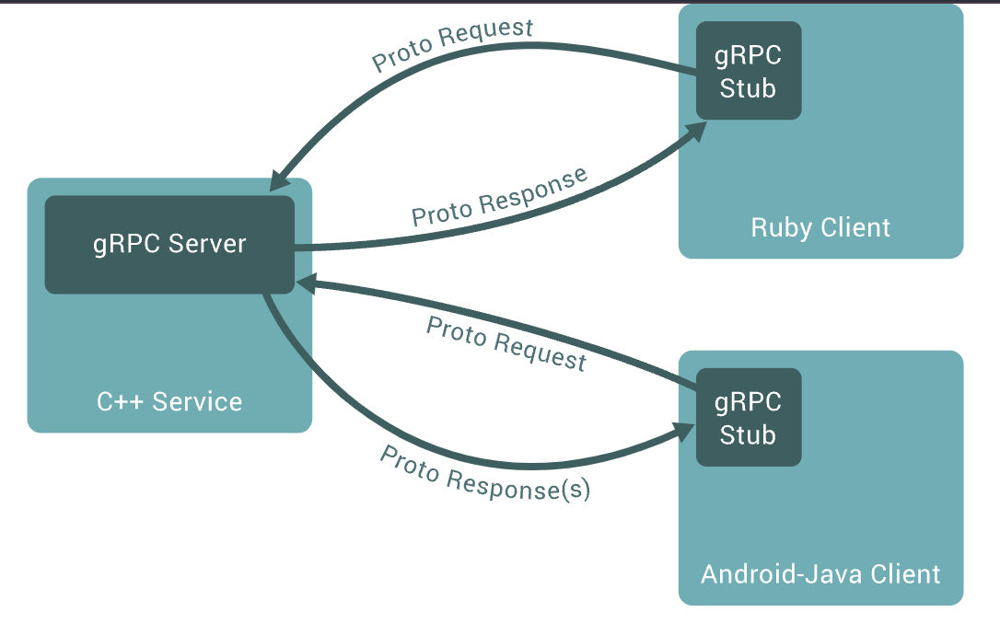

```toc
```

## 1. grpc介绍

### 1.1 什么是grpc

在了解什么是grpc前，需要先知道什么是rpc。所谓的rpc（Remote Procedure Call），即远程过程的调用协议，我们也经常称为进程间通信协议，它可以让调用远程的函数像调用本地函数一样简单方便。

微服务和云原生架构出现后，我们构建一个系统时，各个业务功能都被拆分成了不同的服务模块，我们称之为微服务。而不同微服务间的需要进行访问或者相互调用，这便需要我们在不同微服务间定义统一的通信协议，构建一套进程间（或服务间）的通信技术来连接这些微服务。

我们常用的HTTP协议本身也是一种rpc协议，另外常见的rpc协议还有facebook的thrift和google的grpc，下面章节也会对比下这两种常见的协议和grpc的差别。

grpc是google于2015年开源的rpc框架，它具备标准化、可通用和跨平台的特点。这些特点使得不同微服务间可以方便的进行调用外，还可以支持可拓展的负载均衡、链路跟踪、健康检查等特性。而底层的通信，grpc采用的是HTTP/2来进行，性能和效率上能够得到充分的发挥。grpc也加入了CNCF（云原生计算基金会），逐渐的也成为了主流的社区上rpc框架。



### 1.2 grpc与protocol buffers的关系

微服务间通信时，需要依赖统一的通信协议。这里我们暂且将主调方称为客户端，被调方称为服务端。

服务端需要先定义服务接口，这种服务接口的描述语言，我们便称之为**接口定义语言**（interface definition language，IDL），而protocol buffers便是grpc所使用的接口定义语言。

protocol buffers是一种语言中立、平台无关，用于实现结构化数据序列化的可扩展机制。根据该机制，服务接口将会定义一个文件扩展名为.proto的文件。如何使用protocol buffers不是本文的重点，具体可以参考[官网](https://developers.google.com/protocol-buffers)。

这里提供一个grpc官网给出的一个proto文件示例：
```protobuf
// The greeting service definition.
service Greeter {
  // Sends a greeting
  rpc SayHello (HelloRequest) returns (HelloReply) {}
}

// The request message containing the user's name.
message HelloRequest {
  string name = 1;
}

// The response message containing the greetings
message HelloReply {
  string message = 1;
}
```

我们通过proto文件定义好服务接口后，便需要根据这个定义生成服务端代码，我们称被生成的服务端代码为**服务端骨架**（skeleton）。

另一方面，还需要根据proto的服务接口定义生成客户端代码，这份代码我们称之为桩代码或者存根（stub）。有了桩代码后，客户端便可以像调用本地函数一样调用远程服务端的函数了。


Protocol buffers官方支持常用语言的代码生成，如go、c++、java、python等，可以查看这个[文档](https://developers.google.com/protocol-buffers/docs/tutorials)。如果官方没有提供，github上也有一些第三方开源库提供支持。

### 1.3 与其他rpc技术的对比

#### 1.3.1 HTTP

HTTP协议是我们日常开发中使用的最广的进程间通信协议，可以使用JSON、XML等作为传输的数据定义，结合REST风格搭建出一套简单易用的微服务系统。

而随着微服务的数量激增，网络结构越发复杂后，这种通信协议便会出现一些局限性了。

**它基于文本的低效消息协议**  
HTTP的双方在进行通信时，采用的是文本的传输协议，无论是JSON还是XML，这都是方便了人类可读，使用简单。而对于机器来说，这是一种相对低效的通信协议。

**程序间缺乏强类型接口**  
现如今，微服务大多采用不同的语言进行搭建。我们在定义服务接口时，经常使用约定的方式，或者借助一些服务定义技术（如OpenAPI/Swagger等）来进行描述，各个程序间基于这套描述来进行通信。

这种无法对服务接口进行明确定义和强类型限制的服务通信方式，会让服务间十分缺乏安全感。

#### 1.3.2 Thrift
thrift也是与grpc类似的rpc框架，由facebook开发，后面捐赠给了apache基金会。thrift同样有自己的接口定义语言，也需要生成对应的服务端和客户端代码，也意味着它也可以实现跨平台的通信。

但是两者还是有一些区别：
1. 在**传输性能**方面会弱于grpc。grpc是基于HTTP/2实现，传输效率高，且能支持像流这样的消息格式。
2. 第一点提到grpc支持流方式传输，不仅如此，grpc支持服务端和客户端双向流
3. 从社区活跃角度看，加入CNCF后的grpc势头更高，社区资源也相当丰富

### 1.4 小结
上面对grpc做了基本的介绍，本小接来总结下，我们总结下grpc存在的优势。
* **高效的进程间通信方式**。基于HTTP/2设计与实现的grpc，天然的具备高效的通信方式。
* **服务接口定义简单优雅**。基于protocol buffers的IDL来定义grpc服务，清晰明了，且具备多语言和强类型定义，服务间开发更加稳定。
* 支持**双工流**。grpc支持客户端和服务器端流传输，在服务定义中原生定义，使得流服务开发更加简便高效。
* **扩展支持丰富**。grpc还支持了丰富扩展，基于grpc协议，可以自行封装负载均衡、拦截器、认证加密等扩展功能。
* **与云原生系统结合更加紧密**。由于grpc加入了CNCF，该组织下的很多项目也都支持grpc作为通信协议（如Envoy），也可以使用prometheus来监控grpc服务。


## 基于go语言实现一个简单grpc服务端和客户端

## grpc的通信模式
### 一元RPC模式
### 服务器端流GRPC模式
### 客户端流GRPC模式
### 双向流RPC模式

## grpc的高阶使用
### 负载均衡
### 拦截器
### 超时和取消
### 多路复用
### 元数据
### 基于TLS的grpc服务

## grpc扩展
### 使用grpc实现一个http协议的服务
### grpc的健康检查

