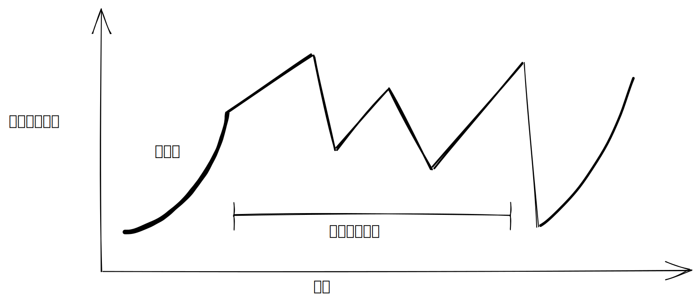
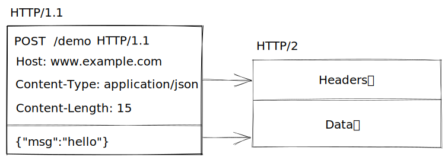
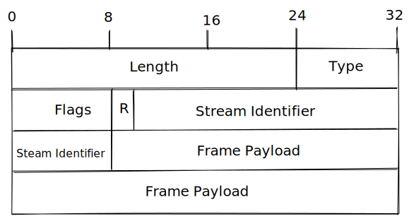
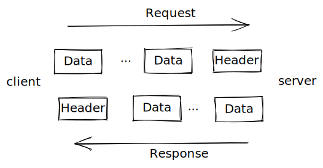
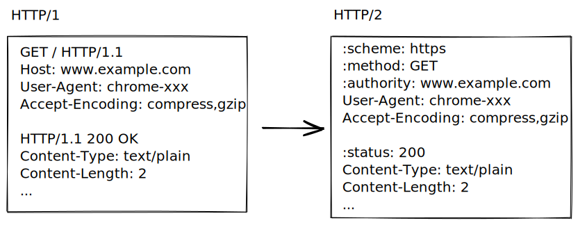
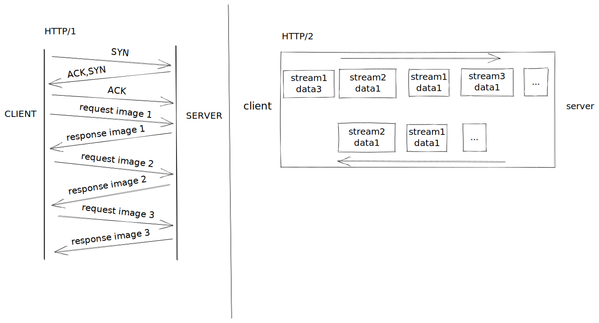
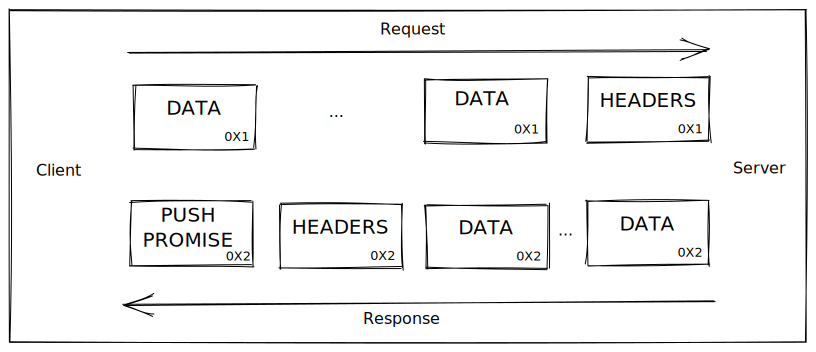
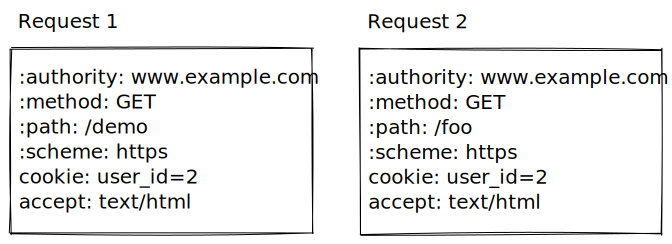

```toc
```

##  1. HTTP的演进
###  1.1 HTTP/1 及其缺陷
众所周知，HTTP/1.0是HTTP协议的首个完整版本，它在协议中描述了我们常用的一些概念，例如首部（Header）、响应码（Status Code）、重定向（Redirect）、更多的方法（Post、Put、Delete等）。

而到了HTTP/1.1又带来了众多新的概念，例如缓存首部、OPTIONS方法、Upgrade首部、Range请求、管道化（Pipelining）、压缩和传输编码（transfer-encoing）。

然而随着Web越来越复杂，访问一个页面需要获取的资源越来越多，HTTP/1的一些缺陷也带来了性能上的问题。这里列举了几个比较重要的问题。

**队头阻塞（Head-of-line blocking，或缩写为HOL blocking）**

当我们的网站需要获取多份资源时（例如多张图片），HTTP/1协议下，如果只使用一个连接，则需要完成发起请求、等待响应这一对操作后，才可以发起下一次请求。在获取响应的过程中，一旦发生了任何问题，剩余的所有请求都会被阻塞住，此时页面也将无法渲染导致最终失去响应。

为了解决这种问题，浏览器一般都会开启多个连接来并发请求，然而每个连接依旧会受到“队头阻塞“的影响。

**低效的TCP**

我们知道TCP是一种可靠性非常高的通信协议，它通过滑动窗口和拥塞控制，保证了即使在最差的网络下数据也能的可靠的传输。其中有个非常重要的概念叫“**慢启动**”，它是用来探索当前连接对应**拥塞窗口**的大小，目的是用来让新的连接了解当前网络状况，避免给已经拥堵的网络继续添堵。

注：拥塞窗口指的是，在接收方确认接收到数据包前，发送方可以发送的包的数量。


然而这种方式虽然让网络避免了拥堵，却让通信的效率非常的低下。多次的数据往返才能确认最佳拥塞窗口，而且实际的实现中，遇到丢包的情况，拥塞算法通常会选择缩小拥塞窗口。甚至遇到超时时，甚至会重置拥塞窗口导致重新进入慢启动阶段。

**首部臃肿**

HTTP/1请求的首部是无法进行压缩的，现如今Web页面中加入的首部越来越多，大小也越来越多，无法压缩的首部也势必给通信效率带来不良的影响。

正因为HTTP/1存在的众多问题，社区上出现了很多针对性的优化，例如优化DNS查询、缓存机制、代码压缩、避免CSS/JS阻塞等。如果能从协议上去解决这些问题，才是问题最好的解决方式。

###  1.2 HTTP/2
HTTP/2的协议基础来源于Google提出的SPDY协议，SPDY提出的多路复用、帧和首部压缩这些功能，也被最终整合进了HTTP/2协议中。

HTTP/2包含如下几种特性：
1. 多路复用，允许同时通过单一的HTTP/2连接发起多重的请求-响应信息，很好的解决了浏览器限制同一个域名下的请求数量的问题，同时也更容易实现全速传输
2. 不再使用文本形式传输数据，而是采用二进制传输
3. 首部压缩
4. 服务器推送，改变了传统的“请求-应答”工作模式，服务器不再是完全被动地响应请求，也可以新建“流”主动向客户端发送消息。

## 2. 实现一个简单的HTTP/2服务
我们经常会搭建一些web服务用来提供一些http restful的api接口，通常使用的是HTTP/1.1的协议，是否也可以升级为HTTP/2呢？这里我们将以go语言搭建的http服务为例子，看看在go语言的场景下怎么实现一个HTTP/2的web服务。

### 2.1 TLS证书
HTTP/2协议中并没有要求必须使用TLS，然而当前主流的浏览器已都不支持非TLS的HTTP/2，也就是要求服务器端实现HTTPS。作为安全的角度，这也是合理的。

正因为如此，HTTP/2协议的握手分两种方式：
1. **h2**。这种握手方式下，要求必须使用TLS加密，在TLS握手期间会顺带完成HTTPS/2协议的协商，如果协商失败（比如客户端不支持或者服务端不支持），则会使用HTTPS/1继续后续通讯。
2. **h2c**。不使用TLS，而是多了一次基于HTTP协议的握手往返来完成向HTTP/2协议的升级，一般不建议使用

申请TLS证书的方式有很多。
* 可以自行采用openssl生成自签名证书
* 去Let's Encrypt中申请证书。
* 一些第三方网站也提供签发一些证书

作为实例，我们使用第一种方式生成我们的签名证书，这种证书只能用在本地调试使用，浏览器是无法认识的。

```bash
$ openssl genrsa -out key.pem 2048
$ openssl req -new -x509 -sha256 -key key.pem -out cert.pem -days 365 -subj "/cn=demo.example.com"
```

执行后，便拥有证书的私钥**key.pem**和对应的证书**cert.pem**。

### 2.2 实现HTTP2服务
go语言是原生支持HTTP/2的，当服务端使用TLS时，便会默认启用HTTP/2。

那么首先就来看下服务端的实例代码：

```go
package main

import (
	"log"
	"net"
	"net/http"
	"os"
)

func main() {
	h := http.HandlerFunc(func(w http.ResponseWriter, r *http.Request) {
		w.Write([]byte("ok"))
	})

	l, err := net.Listen("tcp", ":443")
	if err != nil {
		panic(err)
	}

	path, _ := os.Getwd()
	certFile := path + "/cert.pem"
	keyFile := path + "/key.pem"
	log.Fatal(http.ServeTLS(l, h, certFile, keyFile)) 
}
```

和go通常创建一个服务端的代码类似，只是这里换成使用**ServeTLS**，进而使用我们在上一节使用的证书和私钥。

对于客户端来说，最重要的就是实现transport，它会用来处理底层的通信协议。

```go
path, _ := os.Getwd()
caCert, err := ioutil.ReadFile(path + "cert.pem")
if err != nil {
	log.Fatalf("Reading server certificate: %s", err)
	return
}
caCertPool := x509.NewCertPool()
caCertPool.AppendCertsFromPEM(caCert)
cfg := &tls.Config{
	RootCAs: caCertPool,
	InsecureSkipVerify: true,
}

client := http.Client{
	Transport: &http2.Transport{
		TLSClientConfig: cfg,
	},
}

resp, err := client.Get("/demo")
```

需要注意的是，正式环境下，是不需要在客户端配置证书的，也就是不需要有caCertPool，因为我们这里是自签发的证书，故才需要在客户端进行配置来识别自定义的证书。

## 3. HTTP/2通信原理
这一节开始，我们一起来学习HTTP/2的底层的通信原理。需要理解的是，即使HTTP/2采用了不同于HTTP/1的设计，它的目的还是在传输应用层的HTTP数据。

### 3.1 帧
不同于HTTP/1使用纯文本的方式进行通信，HTTP/2将数据以 **帧（Frame）** 为单位，并采用**二进制**进行编码后进行传输通信。



将HTTP协议中的Header和Body，分别用帧结构进行编码，在帧结构中定义帧的长度等数据结构，占用的数据空间也得到减少。


* Length，3个字节，表示帧的长度
* Type，1个字节，表示当前帧的类型（下面会说）
* Flags，1个字节，具体帧类型的标识
* R，1个位，保留位，不要设置
* Stream Identifier，31位，每个流的唯一ID
* Frame Payload，长度可变，帧的内容，长度即为Length设置

在HTTP/1中，由于采用的是纯文本，为了保证文本的完整性，请求必须发送完才可以发送下一个。

而HTTP/2采用帧后，数据可以被拆分成不同的帧再进行发送，相互的顺序无需相互依赖，在收到所有帧后再进行拼接。

说明说道Type指定的是当前帧的类型，目前使用的帧类型有：
* DATA，用于传输HTTP消息体
* HEADERS，用于传输HTTP首部
* FRIORITY，用于指定或重新指定引用资源的优先级
* RST_STREAM，用于通知流的非正常终止
* PUSH_ PROMISE：提示客户端，服务器要推送东西
* PING，测试连接可用性和往返时延
* GOWAY，告诉对方，当前端已经结束
* WINDOW_UPGRADE，协商一端要接收多少字节（用于流量控制）
* CONTINUTION，用于扩展HEADER数据块

### 3.2 流
上面说到，HTTP/2将数据以 **帧（Frame）** 为单位，并采用**二进制**进行编码后进行传输通信。因此便引入了 **流（Stream）** 的概念。这些二进制帧，将以流的方式进行传输。

由于HTTP请求头和请求体都被分成了不同的二进制帧，经过分帧后，在同一个TCP连接上的请求，便可以交错进行，响应也同理。它们会通过流ID来标识帧所属的流（帧首部的第6-9字节）。



#### 3.2.1 消息
前面讲帧的时候说到，HTTP/2中帧分为两种，一种是首部（HEADERS）帧和数据（DATA）帧，对应了HTTP/1中的请求（响应）头和请求（响应）体。

其中首部的定义有了一些区别



HTTP/2将以前HTTP/1的请求和状态行首部都进行了重新的定义，定义上更加清晰了。其他更多的首部帧定义这里就不多举例了。

#### 3.2.2 多路复用
HTTP/2的多路复用，可以让我们在一个TCP上同时发送多个请求，不会出现以前HTTP/1中必须等待上一个请求得到响应后才能发送下一个。这也是借助分帧和流的实现的。

这里对比下，客户端向服务端请求3张图片为例子，HTTP/1和HTTP/2的差别。HTTP/2经过多路复用后，请求的效率得到大幅度的提高。



#### 3.2.3 服务端推送
HTTP/2另一个重要的功能更便是服务端推送，它可以让服务端主动推送一些资源给客户端。HTTP/2设计了一套机制来确保推送的安全性和性能问题。

当服务器端要推送一个资源时，会构造一个 **PUSH_PROMISE** 帧，这个帧定义了很多重要信息，这里列举几个：
* 首部帧中的流ID用来响应关联的请求。服务器端推送的数据，一定是能关联到客户端已发送的某个请求的。例如客户端请求了一个HTML文件，此时服务器端要顺便把css文件也发送给客户端，就会使用客户端请求HTML对应的流ID写入PUSH_PRIMISE帧中。
* 被推送的对象必须是可以缓存的。
* :method首部的值必须是安全的，也即必须是幂等的方法，例如GET请求

值得注意的是：客户端的流ID会从1开始，每开启一个流，都会增加2，也即之后都会一直使用奇数作为流ID。而服务端在PUSH_PROMISE说明开启流时，流ID会从2开始，之后一直使用偶数作为流ID。



当然，客户端是可以选择拒接接受服务端的推送的。客户端在接收到服务端发送过来的PUSH_PROMISE帧后，通过解析帧首部信息发现，里面的数据不是自己需要的（或者已经在本地缓存中存在），则可以根据自己的原因拒绝接受服务器推送，例如发送重置帧（RST_STREAM）或者协议错误帧（PROTOCOL_ERROR）。

然而，作为服务端是可以选择发送完PUSH_PROMISE帧后，立即推送资源的，也就是不等待客户端是否接受的请求。这种做法可能会导致推送大量不正确的资源，带来服务器端的性能损耗，因此如果使用了服务器端推送，需要关注到这种情况。

### 3.3 首部压缩
对于首部的压缩，HTTP/2没有采用在HTTP/1.1中被广泛使用GZIP，而是自研出了**HPACK方案**。

大多时候，客户端发起请求时，很多请求头在每次请求过程中都是相同的。


例如上述两个请求，除了请求路径，其他首部都是相同的。那是不是每次都需要发送这些首部呢，是否可以节省一些资源。这就是HPACK要做的。

当使用HTTP/2时，客户端和服务端都会维护一张首部表，用来记录首部信息和对应的索引。

例如客户端发送请求时，包含了如下首部，便会建立这样一张表。而服务端接收到请求后也会建立这样一张表。

|  索引   | 首部名称  | 值 | 
|  ----  | ----  | ----  |
| 20  | header1 | foo |
| 21  | header2 | bar |
| 22  | header3 | hello |

下一次请求时，需要再次发送这些首部，则可以直接发送 [20,21,22]。服务端接收到后，根据索引直接查表即可，极大的降低了请求中需要传输的信息大小。

## 4. 总结
HTTP/2虽然提供了众多的特性，但是一些依旧存在一些问题。

首先是**队头阻塞**依旧没有彻底解决。前面说到队头阻塞是因为TCP协议为了保证可靠性导致的，即使是HTTP/2，传输层的通信协议依旧是TCP，因此这个问题并没有算彻底解决。

另外，TCP连接的建立需要经过几轮RTT后才能进行数据传输，如果进而加上TLS连接的RTT（1-2个），连接建立的开销还是挺大的。

这些问题与其说是HTTP/2的问题，更应该说是TCP天然存在的缺陷。正因为如此，Google提出了QUIC（Quick UDP Internet Connection）协议，从名字也能看到它基于UDP协议之上来设计，一方面采纳了HTTP/2的优点，同时加入了加解密、身份认证等特性。

期待未来QUIC能够进一步得到普及。