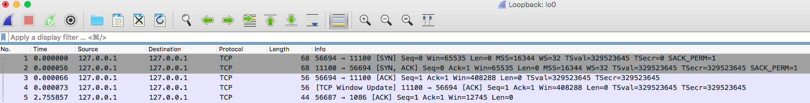
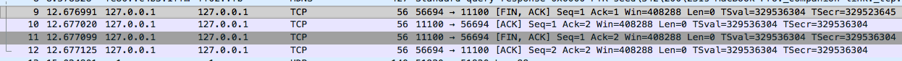
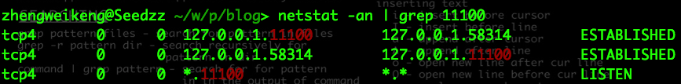
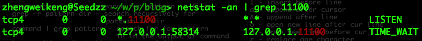

## tcp建立连接
tcp连接的建立需要经历”三次握手“的过程。过程和两端的状态如下

1. client端为closed状态，服务端为listen状态
2. client发送SYN包（值为j）到server端，此时client进入`SYN_SENT`状态，此为第一次握手。
3. server端收到SYN包后，发送一个ACK（值为seq+1）确认包和SYN（值为k）给client，此时server进入`SYN_RCVD`状态。此为第二次握手。
4. client收到SYN+ACK包后，向server发送一个ACK（值为k+1），此时客户端便进入`ESTABLISHED`状态。server收到ack包后也进入`ESTABLISHED`状态，完成第三次握手。

client和server两端状态变化如下：

client:  
CLOSED->SYN_SEND->ESTABLISH  
server:  
CLOSED->LISTEN->SYN_RECV->ESTABLISH

通过wireshark来看看实际的握手流程

首先通过`nc`工具监听一个端口
```bash
$ nc -lk 11100
```
接下来用`nc`作为客户端连接该端口
```bash
$ nc localhost 11100
```
接下来用wireshark抓包，如图:  


前三条数据，明显就是握手过程，需要注意的是，在wireshark的seq number是经过转化的相对数值。

#### 问题一：为什么是3次握手，不是2次或者4次呢？  
无论任何时候，我们都得假设网络是不可靠的，也就是说任何时候都可能丢包或者包延时到达。  
如果只通过两次握手，client发送一个A请求，由于网络原因，没有那么快送达server端。此时client便废弃该请求，重新发起请求B，请求B成功送达server端，并得到响应。  
如果此时便建立连接，若之前的请求A终于到达server端了，由于请求的格式都是正常的，于是也发送响应回去client，而client则认为该请求已经被废弃。于是server端就一直挂着这个请求，造成资源浪费。

那为什么不是4次或者5次呢？  
在客户端最后发完ack包后，服务端依旧可以回复一个ack的ack包，其实这是可以的，但是如此下去便进入一个死循环了，既然可以4次，也可以有40次、400次。  
在网络不可靠的前提下，即使在多次ack也无法保证是可靠的，因此也就没必要再多余的进行反复确认了。

#### 问题二：包的序号从0或者1开始么？  
包的序号不是从0后者1开始的，每个连接的起始序号都不一样。想象如下场景，A连上B后，给B发送了1、2、3个包，但是3号包绕路了，B一直没收到。  
此时A断线了，重连上B后，又发送了1、2号包，B也都收到了。此时那个绕路的3号包到达B了，B会认为它就是下一个包，于是发生了错误。

#### 问题三：如果服务端没有收到最后的ack包，客户端可以开始发数据么？
是可以的，而且实际上也是这么做的，因为客户端在收到服务端的syn和ack包后，就已经进入`ESTLIBASHED`状态，可以开始发数据。  
但是如果此时服务端一直没有收到ack包，那么通过滑动窗口机制，窗口大小会不断缩小，最终客户端会堵塞住，无法发包。   

#### 问题四：客户端尝试与服务器未对外提供服务的端口建立TCP连接，会怎么样？
```bash
nc 127.0.0.1 1100
```
这里我们请求去连接本地的1100端口，由于本地并没有监听该端口，肯定连不上，但是我们要看看具体收到什么数据

可以看到，服务端回复了一个叫`RST`的包给客户端，即`RESET`包。客户端收到该包就知道服务端无法建立连接了。


## tcp连接释放
Tcp释放连接的过程需要经历“四次挥手”的过程。
1. 由于服务端和客户端都可以主动断开连接，因此两端应该描述为发送方和接收方，此时两端状态均为`ESTLIBASHED`
2. 发送方发送一个FIN包给接收方，告诉对方要断开连接了，此时发送方进入`FIN_WAIT_1`状态
3. 接收方收到FIN包后，为了告诉发送方已经收到FIN包，于是发送ACK包给发送方，此时接收方进入`CLOSE_WAIT`状态
4. 发送方收到ACK包后，进入`FIN_WAIT_2`状态
5. 接收方在确认自己没有数据要发给发送方时，便会发送[FIN, ACK]包给发送方，告诉它我也要断开连接了，此时接收方进入`LAST_ACK`，等待发送方最后的ACK包
6. 发送方收到FIN包后，回复给接收方一个ACK包，此时自己进入`TIME_WAIT`状态，间隔2个MSL（Maximum Segment Lifetime，报文最大生存时间）后断开连接进入`CLOSED`状态。
7. 接收方收到ACK后，就进入`CLOSED`状态

因此发送方和接收方会经历如下状态的转移  
发送方:
FIN_WAIT_1->FIN_WAIT_2->TIME_WAIT->CLOSED  
接收方:
CLOSE_WAIT->LAST_ACK->CLOSED

同建立连接一个道理，基于网络不可靠的原因，最后接收方收到ACK后，如果再回复ACK的ACK，便进入死循环了，所以到收到ACK就完成断开了流程了。

同理，我们也通过wireshark看下具体连接断开的数据传输流程。


#### 问题一：为什么接收方在FIN包后不能一次性发送ACK和FIN包给发送方，就像建立连接时一次性发送SYN和ACK包一样。
在收到FIN包，只是发送方这边不再发送数据了，但是接收方可能还有数据在发送给发送方，所以此时不能直接断开连接，也因此不能立马发送FIN包。  
因此接收方先回了一个ACK包，等到确认自己没有数据要发给发送方了，自己也会做一些结束连接的准备，之后便再发送FIN包给发送方。

#### 问题二：CLOSE_WAIT的解释。  
我们知道接收方在接收到FIN后，发送ACK之前会进入CLOSE_WAIT，如果长期处于这个状态，或者说出现大量CLOSE_WAIT，说明ACK包一直没有发出，这时候就应该检查代码了。 

#### 问题三：这个TIME_WAIT的作用是什么？  
这个[博客](http://www.cnblogs.com/Jessy/p/3535612.html)是这么解释的。

原因有二：
1. 保证TCP协议的全双工连接能够可靠关闭
2. 保证这次连接的重复数据段从网络中消失

如果发送方在发送ACK后直接CLOSED了，那么由于IP协议的不可靠性或者是其它网络原因，导致接收方没有收到发送方最后回复的ACK。那么接收方就会在超时之后继续发送FIN。

此时由于发送方已经CLOSED了，就找不到与重发的FIN对应的连接，最后接收方就会收到RST而不是ACK，接收方就会以为是连接错误把问题报告给高层。  

这样的情况虽然不会造成数据丢失，但是却导致TCP协议不符合可靠连接的要求。  

所以，发送方不是直接进入CLOSED，而是要保持TIME_WAIT，如果再次收到接收方的FIN包后可以继续回复ACK包，这能够能够保证对方收到ACK，最后正确的关闭连接。

第二个原因，如果发送方直接CLOSED，然后又再向接收方发起一个新连接，我们不能保证这个新连接与刚关闭的连接的端口号是不同的。也就是说有可能新连接和老连接的端口号是相同的。  

一般来说不会发生什么问题，但是还是有特殊情况出现：假设新连接和已经关闭的老连接端口号是一样的，如果前一次连接的某些数据仍然滞留在网络中，这些延迟数据在建立新连接之后才到达接收方，由于新连接和老连接的端口号是一样的，又因为TCP协议判断不同连接的依据是socket pair。  

于是，TCP协议就认为那个延迟的数据是属于新连接的，这样就和真正的新连接的数据包发生混淆了。

所以TCP连接还要在TIME_WAIT状态等待2倍MSL，这样可以保证本次连接的所有数据都从网络中消失。  

#### 问题四：如果接受方在收到FIN包后就跑路或者回复完ACK就跑路了，会怎么样？
发送方在发送完FIN包后进入`FIN_WAIT_1`，收到ACK包就进入`FIN_WAIT_2`。协议上并没有规定，如果发送方一直卡在FIN_WAIT状态怎么办，但是linux系统有做一些处理。  
linux设置了一个超时时间`tcp_fin_timeout`，超过这个时间就可以不用管另外一端了。

#### TIME_WAIT注意事项  
从事例我们知道，主动关闭连接的一方会经历TIME_WAIT状态，在该状态下的socket是不会被回收的。而如果是服务器端主动关闭连接，则可能会面临处于大量TIME_WAIT的情况（因为连接很多嘛），会严重影响服务器的处理能力。  
怎么解决呢，那就减少服务器端TIME_WAIT的时间咯。

综上所述，发送方和server从建立连接到断开连接，整个状态的变化如下：

client:  
CLOSED->SYN_SEND->ESTABLISH->FIN_WAIT_1->FIN_WAIT_2->TIME_WAIT->CLOSED  
server:  
CLOSED->LISTEN->SYN_RECV->ESTABLISH->CLOSE_WAIT->LAST_ACK->CLOSED

## 连接异常断开分析
上面描述的都是连接正常断开的情况下，两端的状态的变化。如果不是正常断开呢，如进程被杀掉了，机器断电了会怎么样呢？

我们可以做几个实验  
首先启动一个tcp服务，这里直接使用`nc`命令行监听一个断开`11100`。然后我们用netstat查看下tcp的状态。
```bash
$ nc -lk 11100

$ netstat -an | grep 11100
```


接下来我们模拟客户端连接
```bash
$ nc localhost 11100

$ netstat -an | grep 11100
```


通过上图，我们知道服务端是fork了一个子进程来处理客户端连接。

两端都已经建立连接完毕，接下里我们做一些异常断开。

### 其中一端的连接被kill
我们先kill掉客户端的进程
```bash
$ ps aux | grep -v grep | grep "nc localhost 11100"
```

```
$ kill 56881

$ netstat -an | grep 11100
```


## websocket
tcp是传输层的协议，tcp三次握手后，应用层协议http也便建立了连接。而对于当今web的发展情况，http仍有许多瓶颈。

1. 一条连接只能发送一个请求。
2. 请求只能从客户端开始。客户端不可以接收除响应以外的指令。
3. 请求/响应首部未经压缩发送，首部信息越多延迟越大。
4. 发送冗长的首部。每次互相发送相同的首部造成较多的浪费。
5. 可任意选择数据压缩格式。非强制压缩发送。

虽然已经出现了很多解决方案，如ajax、comet，但是他们最终使用的都是http协议，因此也无法从根本上解决这些瓶颈。  
因此也就诞生了一个新的通信协议,WebSocket协议，一种全双工通信协议。

该通信协议建立在http协议的基础之上，因此连接的发起方仍然是客户端，在http连接建立之后，再将协议升级为webSocket连接，在webSocket连接建立之后，客户度和服务器端都可以主动向对方发送报文信息了。

建立webSocket连接，需要先建立http连接，并在此基础上再进行一次”握手“。

client会发起一个”握手“的请求，请求首部含有upgrade:websocket（还有其他首部，具体看如下示例）。服务器端返回一个101状态码，确认转换协议。完成握手后便可以使用websocket协议进行通信。

Client（request）
```
GET /chat HTTP/1.1
Host: server.example.com
Upgrade: websocket
Connection: Upgrade
Sec-WebSocket-Key: AQIDBAUGBwgJCgsMDQ4PEC==
Origin: http://example.com
Sec-WebSocket-protocol: chat, superchat
Sec-WebSocket-Version: 13
```
Sec-WebSocket-Key其值采用base64编码的随机16字节长的字符序列，服务器端根据该域来判断client确实是websocket请求而不是冒充的，如http
Sec-WebSocket-protocol使用的子协议
Sec-WebSocket-Version该值必须是13

Server（response）
```
HTTP/1.1 101 switching Protocols
Upgrade: websocket
Connection: Upgrade
Sec-WebSocket-Accept: dGhlIHNhbXBsZSBub25jZQ==
Sec-WebSocket-Protocol: chat
```
Sec-WebSocket-Accept值是由client请求首部中的Sec-WebSocket-Key做SHA-1 hash计算，然后再把得到的结果通过base64加密而来

连接建立后，通信的url格式如下：  
ws://example.com/  
wss://example.com/

#### 参考资料
1. [TCP的三次握手(建立连接）和四次挥手(关闭连接）](http://www.cnblogs.com/Jessy/p/3535612.html)
2. [服务器TIME_WAIT和CLOSE_WAIT详解和解决办法](http://www.cnblogs.com/sunxucool/p/3449068.html)
3. [TCP 协议（半打开）](https://blog.csdn.net/q1007729991/article/details/69948617)
4. [针对TCP连接异常断开的分析](https://www.cnblogs.com/549294286/p/5208357.html)