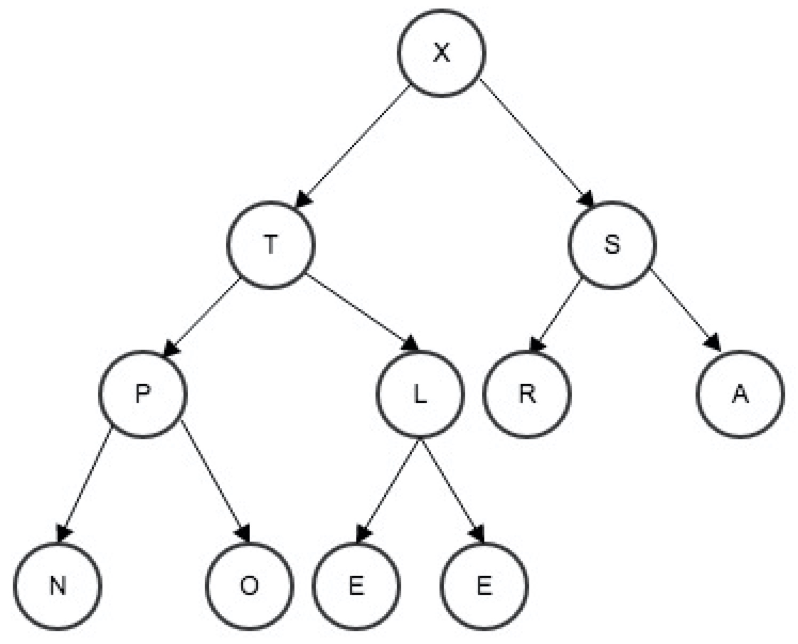

> 循序渐进

### 选择排序
这是一种最简单的排序，它会遍历的找到集合中最小的元素，让它与第一个元素交换位置，接下来从剩下的元素中找到最小的，与集合中的第二个元素交换位置，如此往复，直到最后完成排序。

```javascript
const Selection = (coll) => {
  const len = coll.length
  for(var i = 0; i < len; i++) {
    var min = i
    for(var j = i+1; j < len; j++) {
      if(coll[j] < coll[min]) min = j
    }

    // 交换元素
    exchange(coll, i, min)
  }
}
```
这种排序的过程如下
```
const arr = [2, 4, 1, 3, 5]
Selection(arr)

i  min   0    1    2    3    4
         2,   4,   1,   3,   5
0   2    2,   4,   1,   3,   5
1   2    1,   4,   2,   3,   5
2   3    1,   2,   4,   3,   5
3   3    1,   2,   3,   4,   5
4   4    1,   2,   3,   4,   5
```
#### 总结：
选择排序的时间复杂度为O(N^2)。

长度为N的集合，选择排序总共会进行N次的交换，每一次交换都会有N-1-i的比较，因此总共会有(N-1)+(N-2)+...+(N-1-i)~N^2次的比较。

### 插入排序
跟我们打牌时整理牌的方式很像，将每一张牌插入到有序牌中的适当的位置。例如我习惯从左到右按照从小到大排序，我拿到牌后，会将手上的牌从左到右，将小的牌往前面插入。

```javascript
const Insertion = (coll) => {
  const len = coll.length
  for(var i = 1; i < len; i++) {
    var min = i
    for(var j = i; j >= 1 && coll[j] < coll[j-1]; j--) {
      exchange(coll, j, j-1)
    }
  }
}
```
这种排序的过程如下
```
const arr = [8, 4, 2, 3, 1]
Insertion(arr)

i  j   0    1    2    3    4
       8    4    2    3    1
1  0   4,   8,   2,   3,   1
2  0   2,   4,   8,   3,   1
3  1   2,   3,   4,   8,   1
4  4   1,   2,   3,   4,   8

const arr = [8, 7, 6, 5, 4]
Insertion(arr)

i  j   0    1    2    3    4
       8    7    6    5    4
1  0   7,   8,   6,   5,   4
2  0   6,   7,   8,   5,   4
3  0   5,   6,   7,   8,   4
4  0   4,   5,   6,   7,   8
```
可以明显地看到，每次插入的时候，都会将待插入位置右边的元素往后移动。

#### 总结：

长度为N的集合，可以有如下集中情况。

在最理想的情况（集合已经是有序的），只需要N-1次比较，0次交换。

最坏的情况下（集合是逆序的），比较次数1+2+...+N-1=N^2/2，同时交换次数也是一样的1+2+...+N-1=N^2/2。

平均的情况下，只有一半的元素需要向右移动，因此比较次数是最坏情况下1/2，即比较次数是N^2/4，和N^2/4的交换次数。

因此插入排序的时间复杂度为O(N^2)

总体来说，插入排序还是会比选择排序快。

### 希尔排序
希尔排序是插入排序的优化版，提高了插入排序的速度。从上面的例子我们可以看到，插入排序只会交换相邻的元素，当最小的元素在集合的一边时，插入排序算法则需要将该元素进行N-1次移动到另一边。

希尔排序采用交换不相邻的元素，以达到对集合中局部是有序的，最终使用插入排序将局部有序的集合排序。

希尔排序的思想是使得集合中任意间隔为h的元素都是有序的，这也会产生h个独立的有序集合。

先看例子

```javascript
const Shell = (coll) => {
  const len = coll.length
  var h = 1
  while (h < len/3) h = 3 * h + 1 // 1, 4, 13, 40,...

  while (h >= 1) {
    for (var i = h; i < len; i++) {
      for (var j = i; j >= h && coll[j] < coll[j-h]; j-=h) {
        exchange(coll, j, j-h)
      }

      h = h/3
    }
  }
}
```

这种排序的过程如下
```
const arr = [83, 72, 69, 76, 76, 83, 79, 82, 84, 69, 88, 65, 77, 80, 76, 69]
Shell(arr)
          0    1    2    3    4    5    6    7    8    9    10   11   12   13   14   15
          83   72   69   76   76   83   79   82   84   69   88   65   77   80   76   69
13-sort   80   72   69   76   76   83   79   82   84   69   88   65   77   83   76   69
4-sort    76   69   69   65   77   72   76   69   80   83   79   76   84   83   88   82
1-sort    65   69   69   69   72   76   76   76   77   79   80   82   83   83   84   88
```

和之前插入排序的算法比较来看，插入排序每次比较的间隔都是1，现在我们的间隔是13、4和1，可以发现，经过前两次的排序，使得最后一次的排序移动距离缩短。

每一次排序，都会有局部是有序的。
```
0   4   8    12
1   5   9    13
2   6   10   14
3   7   11   15
```
观察可看到，0，4，8，12下的元素都是有序的，其他也一样。这样便可以构成集合内有很多有序子集合。

插入排序的结论我们知道，当集合不是序列不是最坏的情况（倒序集合），插入排序的效率还是相对会好一些的。

因此我们才会将一个较为混乱的集合，变成一个内部局部有序的集合，这样也就提高了插入算法的效率。

综上，我们也明白了，最重要的还是要找到那个h，它到底应该是多少，上面例子中是13，4和1。那应该怎么确定这个数呢？

这个也没有一个唯一的答案。不过一般都还是会采用1，4，13，40，121...这样的间隔来进行排序。

某种程度来说，希尔排序对一些中等的集合，运行时间还是可以接受的，毕竟代码量也少，需要的内存空间也不多。

#### 总结：
希尔排序的执行时间依赖于增量序列。

好的增量序列的共同特征：

1. 最后一个增量必须为1；
2. 应该尽量避免序列中的值(尤其是相邻的值)互为倍数的情况。

希尔排序的时间性能优于直接插入排序的原因：

1. 当文件初态基本有序时直接插入排序所需的比较和移动次数均较少。
2. 当n值较小时，n和  的差别也较小，即直接插入排序的最好时间复杂度O(n)和最坏时间复杂度0(N^2)差别不大。
3. 在希尔排序开始时增量较大，分组较多，每组的记录数目少，故各组内直接插入较快，后来增量di逐渐缩小，分组数逐渐减少，而各组的记录数目逐渐增多，但由于已经按di-1作为距离排过序，使文件较接近于有序状态，所以新的一趟排序过程也较快。

当刚开始元素很无序的时候，步长最大，所以插入排序的元素个数很少，速度很快；当元素基本有序了，步长很小，插入排序对于有序的序列效率很高。所以，希尔排序的时间复杂度会比O(N^2)好一些。

### 冒泡排序
这种排序会将元素像气泡一样，向前移动。

```javascript
const Bubble = (coll) => {
  const len = coll.length
  var swapped
  for(var i = 0; i < len - 1; i++) {
    swapped = false
    for(var j = 0; j < len - 1 - i; j++) {
      if(coll[j] > coll[j+1]) {
        exchange(coll, j, j+1)
        swapped ＝ true
      }
    }
    if(!swapped)
      return
  }
}
```
这种排序的过程如下
```
const arr = [8, 5, 1, 6, 3]
Bubble(arr)

i  j   0    1    2    3    4
       8    5    1    6    3
0  4   5,   1,   6,   3,   8
1  3   1,   5,   3,   6,   8
2  2   1,   3,   5,   6,   8
3  1   1,   3,   5,   6,   8

const arr = [8, 7, 6, 5, 4]
Bubble(arr)

i  j   0    1    2    3    4
       8    7    6    5    4
0  4   7,   6,   5,   4,   8
1  3   6,   5,   4,   7,   8
2  2   5,   4,   6,   7,   8
3  1   4,   5,   6,   7,   8
```
可以看到，第i次排序，都会将i+1个元素中最大的一个向右冒泡移动。

#### 总结：
上述冒泡的代码是经过改进后的，即我们加上了swapped来判断外0到len-1-i这多个元素是否已经是是排好顺序的元素，这样可以让我们避免去循环遍历它们。

这个改进后的冒泡，最好情况下（集合都是顺序的），只需要比较N-1次即可。

最坏情况下（集合是倒序的），需要1+2+...+N-1=N^2/2次的比较次数。

平均况下，需要N^2/4次的比较次数。

总的来说冒泡排序的时间复杂度为O(N^2)

### 快速排序
快速排序是一个使用得较为广泛的算法，速度也比一般的算法快一些。

快排采用了分治的排序算法，将一个集合分割成两个子集合，将两个子集合独立排序。

这时会有某个切分的位置，在该位置左边的元素都是小于该切分位置的元素，该位置右边的元素都大于切分位置的元素。

在得到左右两个的子集合后，也即明确知道右边的集合中的元素都是大于左边集合的元素的。同理左右两边的集合再做同样的分割操作，这样便得到4个子集合，如此重复，直到排完序。

所以我们知道，其实首先就是要在一个乱序的集合中，找到一个这样的切分位置，符合上面所述的标准。一般我们这么做，随意的取一个集合中的元素，从该位置起从左向右扫描，直到找到一个大于等于它的元素。再从右向左扫描，直到找到一个比它小的元素，将这两个元素交换位置，如此继续。当两个指针相遇时，我们只需要将我们选取的切分元素和左子集合右侧的元素交换位置，然后返回这个右侧元素的位置即可。

可以看看这张图：


我们选取第一个元素K，最后分割后的两个集合，以K为中心，左侧元素全部小于K，右侧元素全部大于K。

看下实现算法：

```javascript
const partition = (coll, lo, hi) => {
  const i = lo + 1
  const j = hi
  const v = coll[lo]

  while(true) {
    // 直到找到一个大于v的元素
    while (coll[i++] < v) {
      if (i === hi) break
    }

    // 直到找到一个小于v的元素
    while (v < coll[j--]) {
      // if (j === lo) break
    }
    if (i >= j) break
    exchange(coll, i, j)
  }

  exchange(coll, lo, j)
  return j
}

const Quick = (coll, lo, hi) => {
  if (hi <== lo) return 

  var j = partition(coll, lo, hi)
  Quick(coll, lo, j-1)
  Quick(coll, j+1, hi)
}

var coll = [7, 5, 8, 4, 3, 6, 1]
Quick(coll, 0, coll.length - 1)
```

我们来看看排序过程
```
第一趟排序：
6 5 1 4 3 
7 
8

第二趟排序：
3 5 1 4 
6 
7 
8

第三趟排序：
1
3
5 4
6
7 
8

第四趟排序：
1
3
4 5 
6
7
8

完成排序
1 3 4 5 6 7 8
```

虽然快排实现起来简单，但是还是有很多要注意的地方。

1. 扫描的时候索引是否越界。
2. 何时终止循环。尤其要注意集合中的元素和气氛元素相同时的情况。
3. 小心使用递归。

长度为N的无重复集合排序，快速排序平均需要2NlgN次比较次数（证明就算了）。即使存在重复元素的集合也不会大于该值。

#### 潜在问题
这种基本实现的快速排序算法，有个问题会导致算法十分低效。例如，如果第一次从最小的元素切分，第二次从第二小的元素切分，如此这般，每次调用只会移除一个元素，这回导致一个大的集合需要切分很多次。

因此我们需要在快速排序前，对集合进行随机排序，避免这种情况发生。

还有一种问题，当集合中存在大量重复元素，甚至全部都是重复元素时，算法依旧会去排序，这就显得很多余了。

#### 改进

1. 对于小集合，快速排序比插入排序慢。因此我们在排序小集合时，可以将排序切换成插入排序。
  ```javascript
    // 将这句换掉
    if (hi <== lo) return

    // 换成。M是个参数，一般5-15之间的数都可以接受
    if (hi <== lo + M) {
      Insertion(arr, lo, hi)
      return
    }
  ```

2. 对于存在大量重复元素的集合，我们可以使用三向切分的快速排序来解决。从左到右遍历集合，维护一个指针lt使得a[lo..lt-1]中的元素都小于v，一个指针gt使得a[gt+1..hi]中的元素都大于v，一个指针i使得a[lt..i-1]中的元素都等于v，a[i...gt]中的元素还未确定。
  ```javascript
    const Quick3way = (coll, lo, hi) => {
      if(hi <== lo) return

      var lt = lo
      var i = lo + 1
      var gt = hi
      var v = a[lo]

      while (i <== gt) {
        if (a[i] < v) {
          exchange(coll, lt++, i++)
        }
        else if (a[i] > v) {
          exchange(coll, i, gt--)
        }
        else i++
      } // 现在 a[lo..lt-1] < v = a[lt..gt] < a[gt+1..hi] 成立
      Quick3way(coll, lo, lt-1)
      Quick3way(coll, gt, hi)
    }
  ```

### 浅谈堆排序
所谓的堆排序，维基百科是这么解释的：

堆排序（Heapsort）是指利用[堆](https://zh.wikipedia.org/wiki/%E5%A0%86_(%E6%95%B0%E6%8D%AE%E7%BB%93%E6%9E%84))这种数据结构所设计的一种排序算法。堆积是一个近似完全二叉树的结构，并同时满足堆积的性质：即子结点的键值或索引总是小于（或者大于）它的父节点。

通过实际例子来理解会更清晰。



从上图可以看到，每个节点的特点就是，它都会大于它的左右子节点，而它的根节点（图中为X），是最大的一个节点，我们称这种堆为最大堆。反之则为最小堆。

使用这种数据结构的排序，则为堆排序。因此，我们在对集合排序的过程，其实就是在建堆的过程。

以建立一个最大堆为例子，排序过程中，当遇到比父节点还大的元素，该元素则需要上浮，当遇到小于父节点的元素，则需要下沉。

当最大堆构建完成后，我们想插入一个元素时，只需要将该元素插入底部，判断是否会破坏堆的结构，如果插入的元素大于父节点，则需要上浮，直到合适的位置。

当构建成一个堆后，此时只是满足了堆的条件，但是可能还不是有序的，毕竟左右子节点的顺序是未知的，所以还需要进行二次排序。

假设我们要建立的是一个递增的集合，可以删除堆中顶部元素，放入堆底部最后一个元素交换，底部元素到顶部之后，逐步下沉至合适的位置。

当我们想在最大堆中删除一个最大的元素，也即是删除根节点的元素，这时我们可以将堆中的最后一个元素移到根节点，让该元素下沉到合适的位置。

### 稳定排序和非稳定排序
所谓的稳定和非稳定排序，就是排序前后，两个元素相对位置是否变化，如果没有变化则是稳定排序，反之则是非稳定排序。

如5,6（1）,1,4,3,6（2）这么一个序列：

如果排序后的序列是1,2,3,4,5,6（1），6（2）那我们则会说这次排序使用的算法是稳定排序算法。

如果排序后的序列是1,2,3,4,5,6（2），6（1）那我们则会说这次排序使用的算法是非稳定排序算法。

选择排序，插入排序，冒泡排序都是稳定排序算法。

快速排序，希尔排序都是非稳定排序算法。

未完待续...
