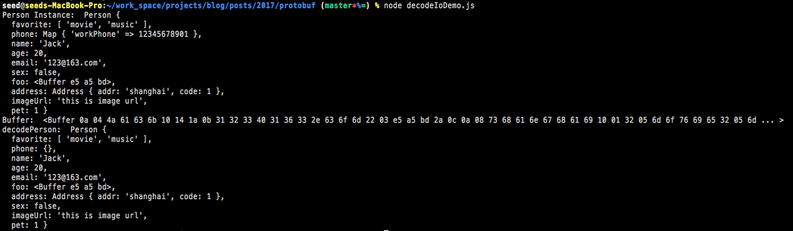
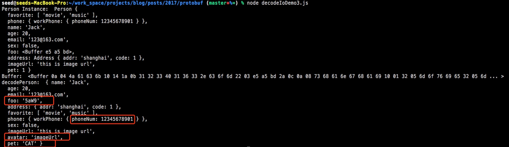

> 阅读该文需要你对node.js的Buffer有一定的基础

## 什么是protobuf？
protobuf是google开源项目，是一种数据交换的格式，主要用于不同端（客户端和服务器端），不同平台（如java和node.js）的数据通信，它相比xml和json，对数据进行了压缩，使得传输更加高效。

举个例子，客户端和服务器端采用tcp连接，客户端传递数据时，需要将对象，序列化成二进制传递出去。  
服务器端接收后，将这段二进制解析出来。而这个序列化和反序列化的过程需要按照某种协议来做，protobuf就扮演了这样一个协议。

## 安装protobuf
### 方法一
到 [protobuf github](https://github.com/google/protobuf/releases)下载对应平台的release包，解压后安装

```bash
$ ./configure --prefix=/usr/local/protobuf
$ make
$ make check
$ make install
```

### 方法二
直接使用protobuf docker镜像，可以无需安装即可使用，更加简单的方便

```
docker pull znly/protoc
```

具体参考 [znly/protoc](https://hub.docker.com/r/znly/protoc/) 文档

## 使用Google官方protobuf
我们会使用Node.js来编写案例，并且采用docker镜像的方式来编译proto文件。

假设有这么一个案例，客户端和服务器端采用websocket建立连接，此时客户端用户填写了一个表单需要提交给服务器端，如果采用json的方式传递数据，会比较占流量，对用户也不好，因此我们将数据变成二进制，使得传输更加的轻量，提高了传输效率。

在node中，该二进制即为buffer。

首先我们需要定义一个数据格式，用于数据通信
```proto
syntax = "proto3";

message Person {
  string name=1;
  int32 age=2;
  string email=3;
  bytes foo=4; 
}
```

我们定义了一个person的数据格式，接下来我们可以使用protoc编译这个文件，我们通过刚才拉取的proto镜像来编译。因为安装protoc需要你的机器满足安装protoc需要的依赖库，会比较麻烦，对于初学者肯定想快速使用，而不是把时间浪费在安装上，那么docker就是最好的选择了。
```bash
$ cd ./protos

$ docker run --rm -v $(pwd):$(pwd) -w $(pwd) znly/protoc --js_out=import_style=commonjs,binary:. -I. *.proto
```
编译成commonjs格式的js代码，供node.js使用。

如果是前端可以采用Closure imports方式编译。
```
docker run --rm -v $(pwd):$(pwd) -w $(pwd) znly/protoc --js_out=library=base.js.,binary:. -I. *.proto
```

由于我们是在服务端使用的，所以我们采取了第一种commonjs的编译方式，编译之后即可看到base_pb.js文件  
打开文件我们可以看到第一行代码引入了谷歌的protobuf的js库，因此这里我们需要自己手动install下这个库

```bash
$ npm install google-protobuf
```

接下来我们就可以直接使用，创建demo.js
```javascript
// demo.js
const {Person, Address, Phone} = require('./protos/person_pb')

const person = new Person()
person.setName('Tom')
person.setAge(10)
person.setEmail('test@outlook.com')
const buf = Buffer.from('好')
person.setFoo(buf.toString('base64'))

const address = new Address()
address.setAddr('shanghai')
address.setCode(1)
person.setAddress(address)

person.setFavoriteList(['movie', 'music'])

const phone = new Phone()
phone.setPhoneNum(12345678901)
const phoneMap = person.getPhoneMap()
phoneMap.set('workPhone', phone)

person.setSex(false)

person.setImageUrl('www.baidu.com')

person.setPet(1)

console.log('Name: ', person.getName())
console.log('Age: ', person.getAge())
console.log('Email: ', person.getEmail())
console.log('Foo:', person.getFoo())
console.log('Foo as: base-64', person.getFoo_asB64())
console.log('Foo as: Uint8Array', person.getFoo_asU8())
console.log('Address: ', person.getAddress().toObject().addr)
console.log('Favorite: ', person.getFavoriteList())
console.log('workPhone', person.getPhoneMap().get('workPhone').getPhoneNum())
console.log('Sex: ', person.getSex() ? 'male' : 'female')
console.log('Avatar: ', person.getImageUrl())
console.log('Pet: ', person.getPet())
console.log(person.toObject())

// 构造成一个buffer对象
// const personBuff = person.serializeBinary()
// console.log('serialize: ', personBuff)

// 解析客户端传递过来的二进制流，并且反序列化成一个对象
// const deserPerson = Person.deserializeBinary(personBuff)
// console.log('deserialize: ', deserPerson.toObject())
// console.log('Foo: ', Buffer.from(person.getFoo_asB64(), 'base64').toString())
```

运行结果如下：


person实例即为proto文件中定义的message实例，该实例有一些方法供我们使用，主要是一些获取字段的方法：
1. getter和setter方法，用于获取字段和为字段赋值，如果字段类型为bytes，则还会有`getXxx_asB64`和`getXxx_asU8`两个方法用于获取base64和Uint8Array格式的数据
1. toObject，会返回proto中的message所定义的object对象
1. closeMessage，对message实例和它的属性进行深拷贝

我们在对proto文件编译的时候，有这么一段指令：`--js_out=import_style=commonjs,binary:.`  
其中有个binary的定义，这是protoc提供给我们的编译的备选项，binary这个备选项可以使得生成的js文件能够将对象编译成proto，也可以将proto二进制数据反序列化成对象，即会提供如下几个方法：
1. deserializeBinary，反序列化一个protocol buffer二进制数据成一个object对象
1. serializeBinary，序列化一个对象成protocol buffer二进制数据

具体参考 [文档](https://developers.google.com/protocol-buffers/docs/reference/javascript-generated) 中关于Messages的描述。

使用时发现一个问题，如果message中有个字段类型是bytes的话，在js中使用setter时需要先变成将buffer转成base64再set，不然serializeBinary的时候会报错。
```javascript
const buf = Buffer.from('好')
person.setFoo(buf)
// 此时会报错
person.serializeBinary()
```

## 使用decodeIO的protobuf.js
在githu上还有另外一个javascript的protobuf库，[protobuf.js](https://github.com/dcodeIO/ProtoBuf.js) 使用起来更简单方便，我在实际项目中使用的也是这个

该库有个命令行工具，可以将proto文件编译成静态的js库，和上面用protoc编译一样。也可以将proto文件转化成对应json格式的文件，这个我们后面讲。

我们先对我们的proto文件编译成静态js库，先安装protobuf.js，然后编译proto文件  

```bash
npm i protobufjs -g
pbjs -t static-module -w commonjs -o person_pb2.js *.proto
``` 

接下来仿照之前的案例用该库来实现

```javascript
const {Person, Address, Phone} = require('./protos/person_pb2')

const personObj = {
  name: 'Jack',
  age: 20,
  email: '123@163.com',
  sex: false
}

const addressObj = {
  addr: 'shanghai',
  code: 1
}
const address = Address.create(addressObj)
personObj.address = address

const favorite = ['movie', 'music']
personObj.favorite = favorite

personObj.phone = {
  'workPhone': {
    phoneNum: 12345678901
  }
}

personObj.avatar = 'imageUrl'
personObj.imageUrl = 'this is image url'

personObj.pet = 1

const err = Person.verify(personObj)
if (err) return console.error(err)

const person = Person.create(personObj)

const buffer = Person.encode(person).finish()
console.log('Person Instance: ', person)
console.log('Buffer: ', buffer)

// >>>>>>>>>>>>> like client
const decodePerson = Person.decode(buffer)
console.log('decodePerson: ', Person.toObject(decodePerson, {longs: Number}))
```
同理运行这个程序依旧需要在我们的项目安装protobuf.js，`npm i protobufjs`
运行结果如下：  


protobuf.js库的执行
依照decodeIO官网的图示  


我们需要按照几个步骤来生成对应buffer对象，并进行处理
1. 定义一个原始的js对象，如上面的personObj，为该对象添加proto文件描述的对应的属性
1. 调用Message.verify对该原始js对象值进行校验，如上面的`const err = Person.verify(personObj)`
1. 依据proto文件描述的，实例化Message对象，即调用Message.create方法，如上面的`const person = Person.create(personObj)`
1. 将Message实例转化为buffer对象，即调用Message.encode方法，如上面的`const buffer = Person.encode(person)`
1. 将上一步的buffer对象传输给另一端，另一端则接收，采用Message.decode处理，如上面的`const decodePerson = Person.decode(buffer)`

需要注意proto定义中的几个数据类型：
1. bytes类型，使用Node.js的话，可以使用Buffer对象
1. message类型，如address，只需要实例化一个Address的对象即可，过程是一样的
1. enum类型，是一个整型的枚举值，在填充的数据中只需要声明对应的索引即可
1. repeated类型，需要一个数组
1. map类型，就用js中原生的map
1. oneof类型，如果一个message中，某一项有多种不同类型的值就使用oneof取其一，需要先声明所需存储的Key名，如案例中的`personObj.avatar = 'imageUrl'`，在定义该Key对应的值，如`personObj.imageUrl = 'this is image url'`

### protobufjs另外一种使用方式
在某些情况下，人们无法预先知道 .proto 文件，他们需要动态处理一些未知的 .proto 文件。

```javascript
const protobuf = require("protobufjs")

// proto文件的路径
protobuf.load('./protos/person.proto', (err, root) => {
  const Person = root.lookupType('Person')
  const Address = root.lookupType('Address')
  const Phone = root.lookupType('Phone')

  const personObj = {
    name: 'Jack',
    age: 20,
    email: '123@163.com',
    sex: false
  }
  
  personObj.foo = Buffer.from('好')
  
  const addressObj = {
    addr: 'shanghai',
    code: 1
  }
  const address = Address.create(addressObj)
  personObj.address = address
  
  const favorite = ['movie', 'music']
  personObj.favorite = favorite
  
  personObj.phone = {
    'workPhone': {
      phoneNum: 12345678901
    }
  }
  
  personObj.avatar = 'imageUrl'
  personObj.imageUrl = 'this is image url'
  
  personObj.pet = 1
  
  const error = Person.verify(personObj)
  if (error) return console.log(err)

  const person = Person.create(personObj)
  
  const buffer = Person.encode(person).finish()
  console.log('Person Instance: ', person)
  console.log('Buffer: ', buffer)
  
  // >>>>>>>>>>>>> like client
  const decodePerson = Person.decode(buffer)
  console.log('decodePerson: ', Person.toObject(decodePerson, {longs: Number}))
})
```
运行结果和之前是一样的

还有一种做法，我们事先将proto文件编译成json
```bash
$ pbjs -t json person.proto -o bundle.json
```

接着直接在代码中使用该json文件

```javascript
// 当采用json的方式时，这个包不包含解析器，包更小
const protobuf = require("protobufjs/light")
const bundle = require('./protos/bundle.json')

const root = protobuf.Root.fromJSON(bundle)
const Person = root.lookupType('Person')
const Address = root.lookupType('Address')
const Phone = root.lookupType('Phone')

const personObj = {
  name: 'Jack',
  age: 20,
  email: '123@163.com',
  sex: false
}

personObj.foo = Buffer.from('好')

const addressObj = {
  addr: 'shanghai',
  code: 1
}
const address = Address.create(addressObj)
personObj.address = address

const favorite = ['movie', 'music']
personObj.favorite = favorite

personObj.phone = {
  'workPhone': {
    phoneNum: 12345678901
  }
}

personObj.avatar = 'imageUrl'
personObj.imageUrl = 'this is image url'

personObj.pet = 1

const error = Person.verify(personObj)
if (error) return console.log(error)

const person = Person.create(personObj)

const buffer = Person.encode(person).finish()
console.log('Person Instance: ', person)
console.log('Buffer: ', buffer)

// >>>>>>>>>>>>> like client
const decodePerson = Person.decode(buffer)
console.log('decodePerson: ', Person.toObject(decodePerson, {longs: Number, enums: String, bytes: String}))
```
运行结果和之前基本是一样的，但是注意我们最后一行代码toObject的时候，传了一些其他的参数，用于转化一些值。 


相关参数说明如下：
```
var object = AwesomeMessage.toObject(message, {
  enums: String,  // 将枚举值转化为对应的Key
  longs: String,  // 将long类型转化为string
  bytes: String,  // 将bytes转化为base64
  defaults: true, // 包含默认值
  arrays: true,   // 即使数组没有值，让该数组出现在message实例中，填充空数组
  objects: true,  // 同上，所谓空对象
  oneofs: true    // 包含被设置值的字段名称
})
```

官方是这么说的：
推荐在生产环境中采取这种将所有proto编译成单独的json文件的方式，减少网络请求，也可以避免过度解析

## 参考
1. [google protobufers](https://developers.google.com/protocol-buffers/)
1. [如何使用protobuf](https://ivweb.io/topic/59759fbc97baaa5723b4df69)