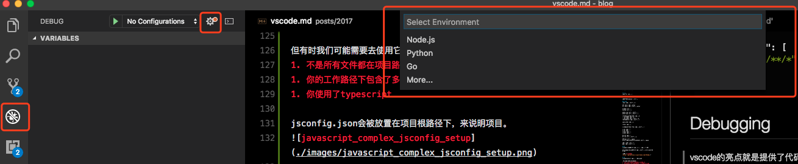
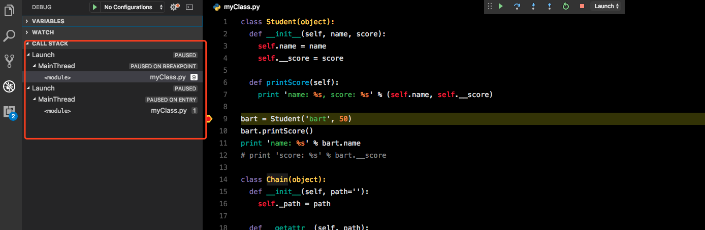
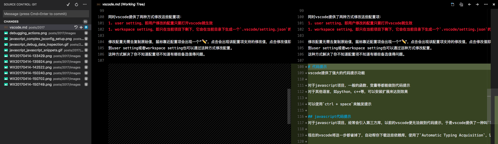

> 从去年年初开始便将编辑器由sublime换成了vscode，觉得非常好用，故做一些使用记录

**注意：以下所有操作均在mac环境下执行**

# 常用功能和快捷键
vscode的界面如下所示：

## 布局和侧边栏

打开和关闭侧边栏(side bar)：`cmd + b`

在编辑区（edit group）打开一个新的栏：`cmd + \`

不在编辑区的当前激活栏打开文件，而是在第二个栏打开文件，有如下几种方式：  
1. 按住cmd，之后点击文件
1. `cmd + p`，选择文件后，`cmd + enter` 

切换编辑区的栏目: `cmd + 1|2|3`

为了尽可能的使用屏幕，一般我们都会将活动栏和侧边栏收起来，通过快捷键快速调出  

其中vscode提供了一种Zen Mode，进入该模式会隐藏所有栏目，并进入全屏，让我们充分利用屏幕  
进入Zen Mode：`cmd + k, z`
侧边栏显示资源管理器：`cmd + shift + e`  
侧边栏显示搜索区：`cmd + shift + f`  
侧边栏显示版本管理区：`ctrl + shift + g`  
侧边栏显示调试区：`cmd + shift + d`  
侧边栏显示扩展区：`cmd + shift + x`

默认情况下编辑区中多个栏目是水平方向的，我们也可以变成垂直方向：`alt + cmd + 1`

关闭编辑区文件：`cmd + w`  
关闭所有在编辑区打开的文件：`cmd + k + w`

## 命令面板
快速选择和打开文件：`cmd + p`，输入要打开的文件名的几个字母

显示最近打开的几个文件，并选择和打开它：`ctrl + shift + tab`，通过tab切换

输入一些vscode内置或者插件提供的命令：`cmd + shift + p`

跳转到当前鼠标所在文件中的某个函数或者变量的定义中：`cmd + shift + o`

跳转到指定行数：`ctrl + g`

## 面板
显示和隐藏面板：`cmd + j`

显示和隐藏面板中的debug栏：`cmd + shift + y`

显示和隐藏面板的terminal栏：`ctrl + ` `

## 基本功能
删除一行：`cmd + shift + k`

向后插入一行空行：`cmd + enter`  
向前插入一行空行：`cmd + shift + enter`

向下移动一行：`alt + ↓`  
向上移动一行：`alt + ↑`

拷贝当前行到下一行：`alt + shift + ↓`  
拷贝当前行到上一行：`alt + shift + ↑`  

选中当前单词，并逐步选中后续相同的单词：`cmd + d`  
查找下一个选中的单词：`cmd + g`  
查找上一个选中的单词：`cmd + shift + g`  
选择所有出现的当前选择：`cmd + shift + l`

逐步撤销鼠标的操作：`cmd + u`

选中当前行：`cmd + i`

跳到括号的一端，无论是左括号还是右括号：`cmd + shift + \`

跳到行首：`cmd + ←`  
跳到行尾：`cmd + →`  
跳到文件头：`cmd + ↑`  
跳到文件尾：`cmd + ↓`  

添加行注释：`cmd + /`  
添加块注释：`ctrl + shift + a`

触发代码提示：`ctrl + space`  
由于与alfred的快捷键冲突了，我将其代码提示修改为了：`shift + space`
 
保存全部：`cmd + alt + s`
另存为：`cmd + shift + s`

# 主题
vscode默认提供了一些主题，使用`cmd + k` + `cmd + t`选择主题

另外vscode也提供了icon的主题，使用`cmd + shift + p`，输入icon，选择文件图标主题

更多的主题到[vscode官网](https://marketplace.visualstudio.com/VSCode)下载

# 配置
vscode有许多配置，通过`cmd + ,`查看所有默认配置项

同时vscode提供了两种方式修改这些配置项：  
1. user setting，即用户修改的配置只要打开vscode就生效
1. workspace setting，即只在当前项目下剩下，它会在当前目录下生成一个`.vscode/setting.json`的文件，在文件中修改配置

修改配置无需去复制原始值，鼠标靠近配置项会出现一个“✏️”，点击会出现该配置项支持的修改值，点击修改值即可将配置添加到user setting或者workspace setting中。  
到user setting或者workspace setting也可以通过这种方式修改配置。  
这种方式解决了你不知道配置项不知道有哪些备选值得问题。

# 代码提示
vscode提供了强大的代码提示功能

对于javascript项目，一般的函数、变量等都能做到代码提示  
对于其他语言，如python，c++等，可以安装扩展来达到效果  

可以使用`ctrl + space`来触发提示

## javascript代码提示
对于javascript项目，经常会引入第三方库，以前的vscode便无法做到代码提示，于是vscode提供了一种叫`TypeScript type declaration`的东西，它能帮主typescript和javascript做到代码提示，需要自己去下载相应的typing库，如node.d.ts

现在的vscode将这一步都省掉了，自动帮你下载这些依赖库，使用了`Automatic Typing Acquisition`，让你无需担忧

当你使用`require`或者`import`时，便会自动帮你下载type declaration文件，以提供代码提示，大部分第三方库都能被下载到，你可以到[TypeSearch](http://microsoft.github.io/TypeSearch/)查找

## 关于jsconfig.json
jsconfig.json文件是用来说明项目是个javascript项目，一般情况下，我们都不需要定义这个文件。

但有时我们可能需要去使用它：  
1. 不是所有文件都在项目路径下，最明显的就是项目分为前端目录和后端目录
1. 你的工作路径下包含了多个项目
1. 你使用了typescript

jsconfig.json会被放置在项目根路径下，来说明项目。  


jsconfig.json配置
```json
{
    "compilerOptions": {
        "target": "ES6"
    },
    "exclude": [
        "node_modules"
    ],
    "include": [
        "src/**/*"
    ]
}
```

# Debugging
vscode的亮点就是提供了代码调试的功能，无论是javascript还是python都能支持很好的断点调试功能。

## 如何调试

简单的对当前文件进行调试：`F5`

更加高级的调试需要进入调试视图  
使用`cmd + shift + d`进入调试视图  


选择你的环境，例如Node.js，会在`.vscode`目录下生成一个`launch.json`的配置文件  
```json
{
  "version": "0.2.0",
  "configurations": [
    {
      "type": "node",
      "request": "launch",
      "name": "launch app",
      "program": "${workspaceRoot}/app.js",
      "env": {
        "NODE_ENV": "development"
      }
    },
    {
      "type": "node",
      "request": "attach",
      "name": "Attach to Process",
      "processId": "${command:PickProcess}",
      "port": 5858
    }
  ]
}
```
这个文件定义了如何启动一个应用，vscode提供了两种方式（launch和attach）启动我们的应用。常用的是第一种，即launch的启动方式。

可以通过**Add Configuration**的方式添加配置，并配合使用代码提示功能进行配置。

我们看下我们的第一项配置
```json
{
  "type": "node",
  "request": "launch",
  "name": "launch app",
  "program": "${workspaceRoot}/app.js",
  "env": {
    "NODE_ENV": "development"
  }
}
```
我们定义了使用node启动应用，并且是launch方式启动，name给我们的这项配置起个名字，program说明启动文件的路径，env指定启动的环境变量

配置完后就可以使用`F5`启动了，会按照配置启动调试。之后就是跟正常的浏览器调试一样了：  
* Continue / Pause F5
* Step Over F10
* Step Into F11
* Step Out ⇧F11
* Restart ⇧⌘F5
* Stop ⇧F5

## 多目标调试
vscode支持同时启动多个调试目标，如下图所示，我们启动了两个调试


通过切换线程可以完成调试功能

另外vscode还提供配置的方式同时启动多目标调试
```
{
    "version": "0.2.0",
    "configurations": [
        {
            "type": "node",
            "request": "launch",
            "name": "Server",
            "program": "${workspaceRoot}/server.js",
            "cwd": "${workspaceRoot}"
        },
        {
            "type": "node",
            "request": "launch",
            "name": "Client",
            "program": "${workspaceRoot}/client.js",
            "cwd": "${workspaceRoot}"
        }
    ],
    "compounds": [
        {
            "name": "Server/Client",
            "configurations": ["Server", "Client"]
        }
    ]
}
```
上述配置多了个`compounds`配置，里面配置需要同时启动的目标，之后在选择要启动的调试任务名  
  
`F5`启动调试

vscode除了提供了debug视图，还提供了debug面板，使用`cmd + shift + y`调出面板

vscode的调试功能还有其他额外的功能，如条件断点，打断点是输入条件，只有条件满足了才进入断点

# 代码片段
我们使用代码提示时，可以提高我们的开发速度，有时我们也想定制一些自己的代码模板，vscode提供了代码片段的功能  


进入代码提示编辑区（Code > Preferences > User Snippets），选择你想使用的语言，例如javascript
```json
{
	 "Print to console": {
		"prefix": "log",
		"body": [
			"console.log('seed: ', $1)"
		],
		"description": "Log output to console"
	},
  "For Loop": {
    "prefix": "for",
    "body": [
      "for (var ${1:index} = 0; ${1:index} < ${2:array}.length; ${1:index}++) {",
      "\tvar ${3:element} = ${2:array}[${1:index}];",
      "\t$0",
      "}"
    ],
    "description": "For Loop"
  },
}
```
之后，当我们在js文件下使用log时便会出现log的代码提示，输入for也会输入for的代码提示。  
注意上述的$1、${1:index}、${2:array}和${3:element}，当我们使用代码提示的代码片段后，便可以使用tab切换一些代码片段的位置，动态改变一些变量

# Git版本管理
vscode内置了git的版本管理功能，使得我们不用切换到命令行就可以完成git的操作  


同时提供了git视图，帮助我们完成git的操作  
  


通过vscode提供的版本管理，我们可以查看修改差异


# 后记
其实vscode还有很多强大的功能，如果全部收起来都可以写好几篇文档了，详细的文档应该去看vscode的 [官网](https://code.visualstudio.com/docs)

例如vscode在1.11.0中集成了ripgrep，使得其搜索功能得到了非常大的提高  
还有vscode也提供了编写任务的功能，我们可以编写一些自己的task，如编译打包之类的  
vscode还提供了丰富的插件库，也提供了丰富的API给予开发者开发自己的插件

未来会有更多的功能，期待吧！
