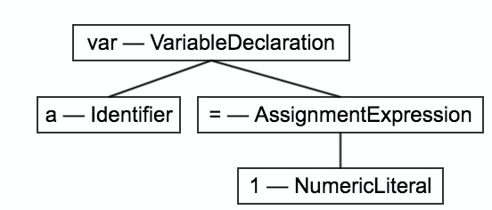

# 编译
传统的编译型语言，在代码执行前都会经过“编译”，过程如下
1. 分词/词法分析（Tokenizing/Lexing）。简单来说就是拆解代码串，变成一个个代码块，如`var a = 1;`，则会变成: var、a、=、1、;
2. 解析/语法分析（Parsing）。该过程就是将经过词法分析后产生的各个代码块逐个转换成代表程序语法结构的树，该树称为“抽象语法树”（Abstract Syntax Tree，AST），如图一。
3. 代码生成。将抽象分析树转化成可执行代码称为代码生成，该过程便与语言、目标平台等信息有关。

  
图一

大多数语言都会在执行前将代码进行编译，待编译成功后再执行代码，即编译和执行是分开的。然而javascript不同，它是在执行前马上编译，编译结束后即刻执行，这个间隔非常短暂。

# 作用域
常见的作用域分为动态作用域和词法作用域，javascript采用的是词法作用域

## 词法作用域
简单的说，词法作用域是由你在写代码时将变量和块作用域写在哪里来决定的。

词法作用域在查找变量的时候，会从当前作用域开始查找，如果当前作用域无法找到，则会向上一层的作用域查找，直到最顶层找到为止。

```javascript
function foo (a) {
  var b = a * 2
  function bar (c) {
    console.log(a, b, c)
  }

  bar(b * 3)
}

foo(2) // 2, 4, 12
```
1. foo在当前的全局作用域下，直接获得。
2. foo创建的作用域下有三个标识符：a、b、bar
3. bar所创建的作用域包含了一个标识符：c

在执行`console.log(a, b, c)`时，会开始查找a，b，c三个变量的引用。其中只有c变量在该作用域中被找到，a和b无法被找到，则想上一层作用域foo的作用域开始查找，都被找到了，此时查找到这里就停止了，不会再向上一层（foo所在的作用域）查找了。

值得注意的是，在查找的过程中，引擎不会关心该变量在该作用的哪个地方，只要能在作用域查找到即可。

## 动态作用域
简单理解就是作用域在代码执行的时候才被动态确定，而不是写代码的时候确定作用域。动态作用域不关心函数和作用域是如何声明以及在哪里声明的，它只关心在何处调用，即动态作用域是基于调用栈的。

考虑如下代码：
```javascript
function foo () {
  console.log(a)
}

function bar () {
  var a = 3
  foo()
}

var a = 2
bar()
```
由于javascript是词法作用域，所以console.log会打印出2。

如果换做动态作用域，用于是在代码执行的时候确定的作用域，所以此时console.log会打印出3。过程如下：
1. foo作用域中无法查找到a的引用，此时会顺着调用栈，在调用foo的地方查找a。
2. 由于foo是在bar中调用的，此时变回查找bar的作用域，找到了a的引用。

虽然javascript是词法作用域，但是它的this机制却很像动态作用域。

# var、const、let的差别
## 变量提升和暂时性死区
三者都会遵循词法作用域，只是使用var声明变量，无论写在作用域的哪里都是一样的
```javascript
function foo () {
  console.log(a)
  var a = 1
}
foo() // undefined
```
如上述代码，虽然a在console.log的后面被声明，但是依然能被打印，不会报错说查找不到变量的引用。  
这说明使用var声明的变量会发生“变量提升”，变量在声明之前可以使用，值为`undefined`，即声明是在编译阶段进行的，赋值是在执行阶段才会进行。

有一个需要注意的是，函数声明和变量声明都会被提升，只是函数声明会优先被提升。
```javascript
foo()

var foo

function foo () {
  console.log(1)
}

foo = function () {
  console.log(2)
}
```
此时会输出1，上述代码可以认为会变成下面的代码
```javascript
function foo () {
  console.log(1)
}

foo()

foo = function () {
  console.log(2)
}
```

而使用const和let则不会发生变量提升的现象
```javascript
var = 2
function foo () {
  console.log(a)
  const a = 1
}
foo() // 此处会报错: Uncaught ReferenceError: a is not defined
```
此时这种现象称之为暂时性死区，即变量在被声明之前是不可以被使用的，同时也不会受外部的影响

## 块作用域
在es5中，只有函数作用域和全局作用域，这在很多场景都会有局限性，无法控制变量的作用范围。因此在es6中采用了const和let来规范了变量的作用域。

const和let的作用域是块级作用域，可以简单的认为作用域只在{}之间
```javascript
if (true) {
  var a = 1
  const b = 2
}
console.log(a) // 1
console.log(b) // Uncaught ReferenceError: b is not defined
```

## 不允许重复声明
采用const和let是不能重复声明变量的
```javascript
const a = 1
const a = 2 // Identifier 'a' has already been declared
```

# 函数参数默认值作用域
当函数设置了参数默认值时，函数进行声明初始化时，参数会形成单独的作用域，等到声明结束后，该作用域会消失
```javascript
var x = 1
function fn (x, y = x) {
  console.log(y)
}
fn(2) // 2
```
调用fn函数是，参数会形成单独的作用域，而y的默认值是x，会获取这个单独作用域中x的值。

```javascript
var x = 1
function fn (y = x) {
  x = 2
  console.log(y)
}
fn() // 1
```
fn函数的参数形成单独的作用域，由于参数x在fn调用时没有赋值，所以会向上一级作用域查找而得到1，因此y为1

# 闭包
当函数可以记住并访问自己所在的作用域时，就产生了闭包，即便该函数是在当前作用域之外执行。

```javascript
function foo () {
  var a = 2

  function bar () {
    console.log(a)
  }

  return bar
}

var baz = foo()
baz() // 2
```

例子中bar所创建的作用域能够访问foo所创建的作用域，foo执行后返回了bar函数给变量baz。  
正常来说，foo执行结束后，foo内部的作用域应该会被垃圾回收器销毁，但是由于闭包的原因，阻止了这个销毁的过程。  
foo的作用域在执行结束之后仍然存在，这是由于bar还在使用该作用域。bar()持有foo的作用域的引用，这个引用就是闭包。
