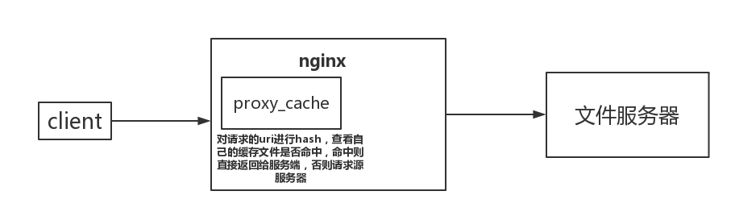

# ngx_http_proxy_module
当使用nginx作为静态文件的服务器时，会希望nginx能够缓存一些静态文件，这样便不用每次都去目标服务器获取，直接使用nginx缓存的即可，该模块便提供了这个功能



## 使用proxy_cache
首先配置proxy_cache_path
```nginx
http {
  ...

  proxy_cache_path /Users/seed/work_space/nginxTmp levels=1:2 keys_zone=tmp-test:100m inactive=7d max_size=1000g;

  ...
}
```
配置说明：
1. 第一个值为缓存文件的存储的目录
2. levels设置缓存文件目录层次；levels=1:2 表示两级目录
3. keys_zone设置缓存名字和共享内存大小
4. inactive在指定时间内没人访问则被删除，默认是是10分钟
5. max_size 最大缓存空间，如果缓存空间满，默认覆盖掉缓存时间最长的资源。

还有其他的配置项，具体可以查看Nginx文档

接下来配置proxy_cache
```nginx
server {
  listen 8887;
  server_name 127.0.0.1;

  location /tmp-file/ {
    proxy_cache tmp-test;
    proxy_cache_valid 200 206 304 301 302 10d;
    proxy_cache_key $uri;
    proxy_set_header Host $host:$server_port;
    proxy_set_header X-Real-IP $remote_addr;
    proxy_set_header X-Forwarded-For $proxy_add_x_forwarded_for;

    proxy_pass http://127.0.0.1:8888/;
  }
}
```
配置说明：
1. proxy_cache_valid，对httpcode为200…的缓存10天
2. proxy_cache_key，定义缓存唯一key,通过唯一key来进行hash存取
3. proxy_set_header，自定义http header头，用于发送给后端真实服务器。
4. proxy_pass，指代理后转发的路径，注意是否需要最后的/

这样便配置完了

假设我们的文件服务器上有个app.js的文件，正常来说我们可以通过访问`127.0.0.1:8888/app.js`来获取该文件，现在我们通过proxy_cache的方式来获取文件，并缓存在nginx的机器上

访问地址`127.0.0.1:8887/tmp-file/app.js`，由于是第一次访问，所以查看文件服务器的访问日志可以看到有访问记录，并且在`/Users/seed/work_space/nginxTmp`目录下产生了一个文件`5/6b/b139f8819150f74b451cd38f224ba6b5`

当再次访问时，文件服务器的访问日志则没有新的记录了，说明nginx直接使用了缓存文件返回了。

这个流程如下：
1. nginx将uri进行hash，去查看是否有缓存文件可以使用
2. 如果有缓存文件，直接返回；否则去请求目标服务器后进行缓存，之后返回给客户端

## 手动清除文件
通过配置`proxy_cache_purge`可以通过访问一个链接达到清除缓存文件的效果
```nginx
server {
  listen 8887;
  server_name 127.0.0.1;

  location ~ /purge(/.*) {
    allow 127.0.0.1;
    deny all;
    proxy_cache_purge tmp-test $uri;
  }

  location /tmp-file/ {
    proxy_cache tmp-test;
    proxy_cache_valid 200 206 304 301 302 10d;
    proxy_cache_key $uri;
    proxy_set_header Host $host:$server_port;
    proxy_set_header X-Real-IP $remote_addr;
    proxy_set_header X-Forwarded-For $proxy_add_x_forwarded_for;

    proxy_pass http://127.0.0.1:8888/;
  }
}
```
访问`127.0.0.1:8887/purge/app.js`便可以清除缓存文件

## 让某些文件不缓存
```
server {
  listen 8887;
  server_name 127.0.0.1;

  if ($request_uri ~ .*\.(html)$) {
    set $cookie_no_cache 1;
  }

  location ~ /purge(/.*) {
    allow 127.0.0.1;
    deny all;
    proxy_cache_purge tmp-test $uri;
  }

  location /tmp-file/ {
    proxy_cache tmp-test;
    proxy_cache_valid 200 206 304 301 302 10d;
    proxy_cache_key $uri;
    proxy_set_header Host $host:$server_port;
    proxy_set_header X-Real-IP $remote_addr;
    proxy_set_header X-Forwarded-For $proxy_add_x_forwarded_for;

    proxy_no_cache $cookie_no_cache

    proxy_pass http://127.0.0.1:8888/;
  }
}
```
这样当访问`127.0.0.1:8887/tmp-file/index.html`时便不会缓存


参考文档：
[nginx proxy_cache 缓存配置](https://blog.csdn.net/dengjiexian123/article/details/53386586)