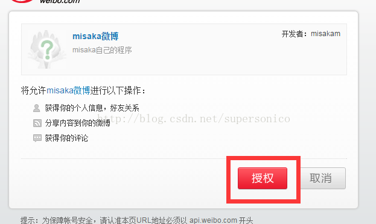
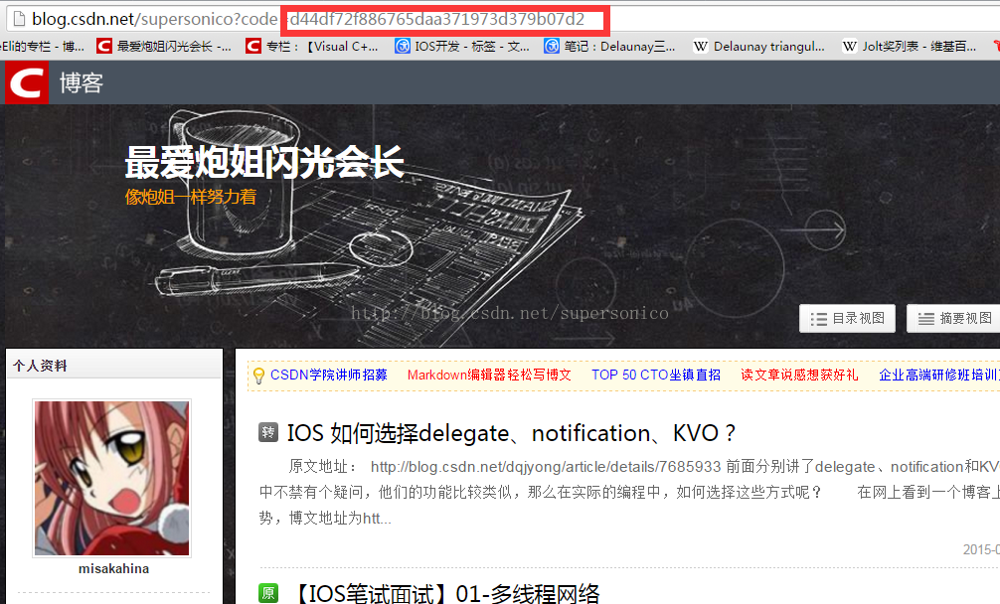

# 为什么需要oauth2？
理解oauth2需要先知道它的应用场景。举个常见的应用场景：

app一般都有微信登录的功能，通过微信登录后app就能拿到微信用户的基本信息，如昵称、头像等等（无法拿到手机号码），那app是通过什么样的方式拿到的，微信登录的过程又是怎么样的。

假设我们自己做这样的功能，最简单的做法就是让用户输入微信的用户名和密码去登录微信，然后拿到这些信息。  
但是这么做是很不安全的，首先你的密码会暴露给app，不怀好意的app便可以记录这个密码。另外通过这种方式登录了微信，app就能肆意获取自己想要的信息，导致微信账户的安全受到威胁。

因此我们需要一种方式，让第三方应用，即我们的app能够通过某种方式安全的获取信息，而且这个方式是受控制，也即权限是受控制的，这便是oauth2的作用。

## auth2的流程
既然我们不能让用户直接通过输入用户名和密码的方式来授权，应该怎么做呢。oauth2的流程如下：
1. 客户端需要用户授权时，会告知用户此时需要您的授权了，例如用户点击了微信登录
2. 用户同意给客户端授权，例如用户同意进行微信登录
3. 客户端使用2中获得的授权，向认证服务器申请令牌，例如app通过这个授权向微信认证服务器申请令牌
4. 认证服务器对客户端进行授权校验，确认无误后，发放令牌，例如微信认证服务器校验app的信息无误后发放令牌
5. 客户端使用该令牌去资源服务器获取资源，例如app通过这个token去微信的资源服务器获取用户的信息
6. 资源服务器校验令牌无误后，返回资源给客户端，例如微信资源服务器返回用户信息给app

oauth这里涉及到几个主体：
1. Third-party application，也可说是客户端，它可以使我们常见的app、web应用、pc应用或者也可是服务端
2. HTTP service，即服务提供商，例如上述的微信
3. Resource Owner，资源拥有者，就是我们的用户
4. User Agent，一般就是浏览器
5. Authorization server，认证服务器，就是服务提供商的认证服务器，例如上述的微信认证服务器
6. Resource server，资源管理器，就是服务提供商的资源管理器，例如上述微信提供用户信息的用户资源管理器

上述流程图片来描述的话就是：


那怎么样给客户端授权码就很重要了。

## 四种授权模式
首先我们需要知道的是，oauth2的所有过程采用的通信方式都是Http，也即oauth2是基于http进行通信的。

### 授权码模式（authorization code）
1. 需要用户授权的时候，将用户导向服务提供商的认证服务器，并且提供跳转URI给认证服务器，这个URI一般是客户端的后台服务器的一个接口
2. 用户自行选择是否同意授权
3. 如果用户同意授权，则认证服务器会生成一个授权码，并且跳转到之前客户端提供的URI上
4. 客户端收到授权码后，将该授权码和之前提供的跳转URI提供给认证服务器，这一步用户无感知。
5. 认证服务器校验授权码和URI，通过后生成令牌，通过跳转回客户端指定URI，并且发放令牌，也可能会多返回一个刷新令牌

#### Web应用案例
来看看在Web应用上，例如我们的网站，采用微博登录时具体的OAUTH2流程：
```
假设微博认证服务器的地址是： https://api.weibo.com/oauth2/authorize
认证服务器申请令牌的地址是： https://api.weibo.com/oauth2/token

假设我们自己的网站地址是（用于回调uri）： https://www.myWeb.com/cb
```

首先需要现在微博的开放平台下面申请client_id，有了这个id才可以进行后续的操作。

第一步，网站提供微博登录的按钮，点击后跳转到认证服务器上，并带上如下参数：
  * response_type：授权类型，我们采用授权码模式，所以为code，必填项
  * client_id：客户端的唯一标志，必填项
  * redirect_uri：重定向URI，必填项
  * scope：权限申请范围，可选项
  * state：客户端当前状态，可以为任何值，认证服务器会原封不动返回，可选项
因此我们的调用的地址为： 
```
https://api.weibo.com/oauth2/authorize?response_type=code&client_id=5abcd&redirect_uri=https://www.myWeb.com/cb
```

第二步，这时浏览器已经跳转到微博的页面，和我们自己的网站已经没有任何关系。  
如果用户在服务提供方也没有登录，会让用户先登录，即让用户使用用户名密码登录。但是这里由于是在服务提供方那边，所以是安全的。用户如果不同意授权，也会跳转回刚才指定的URI。  


如果用户已经登录过，则会出现提示用户授权的页面



第三步，如果同意授权，微博认证服务器会生成授权码，并用302跳转回刚才指定的URI，并带上这个授权码，https://www.myWeb.com/cb?code=aoqisx333  
这个授权码和刚才登录的用户是一对一对应的。



第四步，我们网站此时已经拿到了code，便可以向认证服务器申请令牌，并带上如下参数：
  * grant_type：授权模式，此处为authorization_code，必填项
  * code：授权码，必填项
  * redirect_uri：重定向URI，必须与之前提供的一致，必填项
  * client_id：客户端唯一标志，必填项
  客户端通过post调用的地址为：https://server.example.com/oauth/token?code=aoqisx333&grant_type=authorization_code&redirect_uri=https://www.myWeb.com/cb&client_id=5abcd

第五步，微博认证服务器校验通过后，返回如下字段：
  * access_token：访问令牌，必选项
  * token_type：令牌类型，大小写不敏感，可以是bearer或者mac类型，必填项
  * expires_in：过期时间，单位为秒，可选项，如果没指定，需要通过其他方式指定
  * refresh_token：刷新令牌，用来获取下一次的访问令牌，可选项
  * scope，权限范围，如果与客户端申请的范围一致，此项可省略

例如之前的post调用返回:
```json
{
    "access_token": "a8ae6a78-289d-4594-a421-9b56aa8f7213",
    "token_type": "bearer",
    "expires_in": 1999,
    "refresh_token": "ce3dd10e-ec60-4399-9076-ee2140b04a61",
    "scope": "read write trust"
}
```

至此已经完整了获取令牌的过程，通过access_token获取相应的资源。

另外我们可以通过refresh_token来重新更新access_token，例如访问如下的地址：  
https://server.example.com/oauth/token?grant_type=refresh_token&refresh_token=ce3dd10e-ec60-4399-9076-ee2140b04a61&client_id=5abcd&client_secret=abcdefg

返回的结果和之前一样的：  
```json
{
    "access_token": "436423b4-fc22-4f41-8186-d8706ae9396f",
    "token_type": "bearer",
    "expires_in": 1999,
    "refresh_token": "ce3dd10e-ec60-4399-9076-ee2140b04a61",
    "scope": "read write trust"
}
```

**为什么不能直接获得access_token，而是需要先通过授权码code来获取token？**
如果access_token是直接通过302跳转传到我们的网站的，那么中间人就可以拦截到这个token，造成安全漏洞。而只是返回code的话，没有client key是无法获取到token的。

可能有人会想说可以用https，这样中间人就无法拦截了。但是作为认证服务器并不能保证所有请求的客户端都是支持https的。

#### app应用案例
对于app来说，大部分情况下采用微信（或微博）登录的目的都是获取微信（或微博）的用户信息，例如头像、昵称和城市等等。然后将这些用户信息存储在服务端。通常的做法都是放在服务端在做整个过程，客户端也不会拿到accss_token。

以微信登录为例子，首先还是需要到微信开放平台下申请一个client_id。

第一步，app上提供微信登录的功能，用户点击微信登录后，app激活微信，此时会跳转到微信，已经和自己的app没有关系，此时会带上回调activity，即我们自己的app。  
如果用户没有登录微信，用户需要先登录微信。如果用户已经登录微信，则微信会显示提示用户授权的页面。  


第二步，用户允许登录后，同样会向微信认证服务器发起post请求，并带上相应的参数，即client_id、redirect_uri等信息，微信认证服务器认证成功后会生成授权码code，经由微信跳转回到我们的app，也带上了授权码code。

第三步，我们的app拿到code后，向我们app自己的服务器发起请求，将code带上（如果服务器没有存储客户端的client_id和redirct_uri等参数，则也需要带上这个参数），我们的服务器根据这些参数像用户认证服务器发起获取accss_token的请求。

第四部，我们自己的服务器获取到access_token后便可以用它去获取用户信息了，然后将用户信息存储到数据库中，并返回客户端登录成功。

### 简化模式（implicit grant type）
1. 客户端将用户导向认证服务器
2. 用户选择是否授权给客户端
3. 如果用户通过授权，认证服务器跳转到客户端指定的URI，并在URI的HASH部分包含访问令牌
4. 客户端通过脚本获取访问令牌

这种模式下，无需通过code换取token，听起来好像不是很安全，但是其实是借助了一种巧妙的方式实现。

同样用微博登录为案例，假设我们自己有网站`http://www.myWeb.com`

1. 用户访问我们的网站，然后选择采用微博登录。
2. 用户点击微博登录后，我们的链接`http://www.myWeb.com/login/weibo`会302跳转到微博的授权页面，假设为`http://weibo.oauth.com/authorize`，并且会带上如下参数：
    ```
    http://weibo.oauth.com/authorize
      ?client_id=abc
      &response_type=token 
      &redirect_uri=http://www.myWeb.com
      &scope=read
      &state=LxfKVRpEwa4lnPEvmx9LbbXSRIVUMaju
    ```  
3. 这是用户依旧有两种情况：
   1. 用户尚未在微博中登录过，则需要用户进行微博登录，此时在微博体系下，和我们的网站已经没有任何关系。
   2. 用户已经在微博中登录过，则展示授权页面，让用户确认授权。
4. 用户授权通过后，微博认证服务器会校验client_id和redirect_uri，通过后则生成access_token，并拼在redirect_uri，作为响应头中的location字段返回给浏览器。
    ```
    302 HTTP/2.0
    location: http://www.myWeb.com#access_token=11112333
    ```
5. 浏览器获取到响应后做302跳转，此处重点就是发起跳转的请求地址是`http://www.myWeb.com`，并不会携带access_token。
5. 浏览器拿到我们网站的页面后，通过javascript获取url中的fragement里的access_token，并向微博资源服务器发起请求获取用户信息。

以上整个过程没有code出现，只用了一次校验就获取到了token。主要就是第五步中token是在fragement中的。如果最后的302跳转地址是`http://www.myWeb.com?access_token=11112333`，那么这个参数也会被发送到服务器，中间人就可以拦截到该参数了。

而浏览器发起请求时，会忽略fragement，也即`#`后面的都会被忽略掉，因此oauth2协议里便利用了这一点，302跳转里采用的是fragement的方式来携带token。

但是这里有一点需要注意，第4步中，认证服务器返回时，中间人依旧可以进行拦截，进而获取你响应头里的location信息，这样便可以获取到你的token了，这样也一样不安全了。  
这的确是其中的一个漏洞，如何解决这个问题呢？很简单，采用`Https`即可，这样会返回的数据就被加密了。

### 密码模式（Resource Owner Password Credentials Grant）
其实这种模式就是用户提供用户名和密码给客户端，客户端去认证服务器获取令牌。

这种模式一般使用在内部系统，或者客户端和服务提供商是一个主体的，两者是可以互相信任的才会使用这种模式

### 客户端模式（Client Credentials Grant）
由客户端自己向服务提供商进行认证，用户属于客户端用户体系里的，和服务提供商没有关系。流程如下：
1. 客户端向认证服务器进行身份认证。
2. 认证服务器校验身份成功后，返回访问令牌给客户端。

参考资料：  
[关于 OAuth2.0 安全性你应该要知道的一些事](https://www.chrisyue.com/security-issue-about-oauth-2-0-you-should-know.html)  
[简述 OAuth 2.0 的运作流程](https://www.barretlee.com/blog/2016/01/10/oauth2-introduce/)  
[移花接木：针对OAuth2的攻击](http://insights.thoughtworkers.org/attack-aim-at-oauth2/)  
[How secure is Oauth 2.0 Implicit Grant?](https://stackoverflow.com/questions/14297805/how-secure-is-oauth-2-0-implicit-grant)