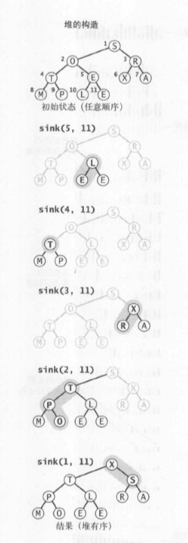

# 堆的算法
在算法中，堆是一种数据结构，它是一颗二叉树，如下图所示：  


我们常说的堆一般指的是二叉堆，即用二叉树来构建的一种数据结构。  
当一颗二叉树的每个节点都大于等于它的两个子节点时，它被称为堆有序  
能够用堆有序的完全二叉树排序的元素就是二叉堆

会采用数组来存放元素，其中，树的每一层都会被填满，除了最后一层，最后一层会从一个节点的左子树开始填。堆采用数组的方式来存储，如`[16, 14, 10, 8, 7, 9, 3, 2, 4, 1]`。给定数组A，其树的根为A[1]，给定某个节点的下标为i，则左儿子和右儿子的下边可以简单的被计算出来:
1. left：i * 2
2. right：(i * 2) + 1
3. parent：i / 2，向下取整

观察上面的计算公式，我们知道在计算机里，可以通过左移和右移来计算与2的乘法和除法，因此也有了如下公式：
1. left：i的二进制左移1位
1. right：i的二进制左移1位并在低位中+1
1. parent：i的二进制右移1位得到i/2

**高度为h的堆中，最多和最好的元素个数？**  
最多元素的情况就是左右子节点全部存在，每一层都会基于上一层的节点个数*2：  
1 + 1 * 2 + 1 * 2 * 2 + ... + 1 * 2^(h) = 1 + 2 + 2^2 + ... + 2^h = 2^(h+1) - 1

最少元素的情况就是最后一层一直一个节点，可以退化成求(h-1)高度的最大元素个数+1，即为2^h

**含N个元素的堆的高度为多少？**  
高度为logN，其中log为以2为底

**高度为h，至多有多少个节点？**  
至多有n/(2^(h+1))，向下取整

二叉堆包含两种：最大堆和最小堆。
1. 最大堆：A[parent(i)] >= A[i]
2. 最小堆：A[parent(i)] <= A[i]

## 堆算法之上浮
当堆中的某个元素发生变化，导致比父元素大时，需要重新调整堆，这时可以采用上浮的方式，逐次判断父节点和变化元素的大小，并且进行交换
```java
private void swim(int k) {
  while (i > 1 && less(k/2, k)) {
    exchange(k/2, k);
    k = k / 2;
  }
}
```

## 堆算法之下沉
当堆中的某个元素发生变化，导致比子元素小时，需要重新调整堆，这时可以采用下沉的方式，和自己的两个子节点中较大者进行交换
```java
private void sink(int k) {
  while(2 * k <= heapLength) {
    int j = 2 * k;
    if (j < heapLength && less(j, j+1)) j++;
    if(!less(k, j)) break;
    exchange(k, j);
    k = j;
  }
}
```

当需要插入新元素时，可以将元素加到数组的末尾，然后将这个元素上浮到合适的位置。

当需要删除最大元素时，从顶端删去最大的元素，将数组的最后一个元素放到顶端，然后不断下沉。

这两个操作都能满足操作的用时和队列的大小成对数关系。

也因此优先级队列一般都会采用二叉堆来实现。简单来说，优先级队列是一种队列，它满足可以插入元素，并且能够删除最大元素。

```
对于一个含有N个元素的基于堆的优先队列，插入元素操作只需不超过(lgN + 1)次比较；删除最大元素的操作需要不超过2lgN次比较。
```

以下代码就是一个采用二叉堆实现的优先队列
```java
public class MaxPQ<Ket extends Comparable<Key> {
  private Key[] pq; // 基于堆的完全二叉树
  private int N = 0; // 存储于pq[1..N]中，pq[0]没有使用

  public MaxPQ(int maxN) {
    pq = (Key[]) new Comparable(maxN + 1);
  }

  public boolean isEmpty() {
    return N == 0;
  }

  public int size() {
    return N;
  }

  public void insert(Key v) {
    pq[++N] = v;
    swim(N);
  }

  public Key delMax() {
    Key max = pq[1];
    exchange(1, N--);
    pq[N + 1] = null;
    sink(1);
    return max;
  }

  private boolean less(int i, int j)
  private void exchange(int i, int j)
  
  private void swim(int k) {
    while (i > 1 && less(k/2, k)) {
      exchange(k/2, k);
      k = k / 2;
    }
  }

  private void sink(int k) {
    while(2 * k <= heapLength) {
      int j = 2 * k;
      if (j < heapLength && less(j, j+1)) j++;
      if(!less(k, j)) break;
      exchange(k, j);
      k = j;
    }
  }
}
```

# 堆排序
堆排序简单来说，就是利用堆的性质来进行排序。

堆排序是一种就地排序，在任何时候数组中只有常数个元素存储在输入数组之外。  
运行时间：O(nlogn)

我们知道堆的高度为O(logN)，下沉时间顶多为O(logN)，即O(h)，h为堆的高度

将一个无序的数组序列进行堆排序，有两个步骤：
1. 将数组构建成一个满足二叉堆性质的数组，即建堆
2. 对这个二叉堆进行排序，即排序

## 建堆
建堆是指将数组中的数据最终变成符合堆的特性的顺序，一般采用自底向上的方式来建堆，每次都是在做maxHeapify的过程，建堆的运行时间为O(N)
```javascript
function sink(arr, k, N) {
   while(2 * k <= heapLength) {
      int j = 2 * k;
      if (j < heapLength && less(j, j+1)) j++;
      if(!less(k, j)) break;
      exchange(k, j);
      k = j;
    }
}

function buildMaxHeap(arr) {
  const arrLen = arr.length
  for (let i = arrLen / 2; i >= 1; i--) {
    sink(arr, i, arrLen)
  }
}
```



## 堆排序算法
当我们需要将乱序的数组进行堆排序时，会分为两步：
1. 建堆
2. 排序

如果是递增排序，可以采用建立最大堆的方式；如果是递减排序，可以采用建立最小堆的方式。

排序过程：
1. 取出第一个元素，将最后一个元素放到堆顶，必然会引起堆结构被破坏，此时开始调整堆结构。
2. 取出此时的对顶元素，和倒数第二个元素交换，再次调整。
3. 不断重复，知道再无元素可以取。此时会构建出一个递增排序的新堆。

简单来说，堆排序是由构建初始堆+交换堆顶元素和末尾元素并重建堆两部分组成。

```javascript
function sink(arr, lo, hi) {
  while(2 * k <= heapLength) {
      int j = 2 * k;
      if (j < heapLength && less(j, j+1)) j++;
      if(!less(k, j)) break;
      exhange(k, j);
      k = j;
    }

    
  while(2 * k <= N) {
    j = 2 * k
    if (j < N && less(j, j+1)) j++
    if (!less(k, j)) break
    exchange(k, j)
  }
}

function sortHeap(arr) {
  const len = arr.length
  while(len > 1) {
    exchange(arr, 1, len--)
    sink(arr, i, len)
  }

  // let len = arr.length
  // for (let i = len - 1; i >= 0; i--) {
  //   const tmp = arr[i]
  //   arr[i] = arr[0]
  //   arr[0] = tmp
  //   len -= 1
    
  //   maxHeapify(arr, 1, len)
  // }
}
```
运行时间：
构建初始堆+堆元素交换 = O(N) + O(swap)  
堆元素交换运行时间=log(N-1) + log(N-2) + ... + log(1) = O(NlogN)

因此运行时间为 = O(N) + O(NlogN) = O(NlogN)

## 结论
一个堆的高度为 logN，因此在堆中插入元素和删除最大元素的复杂度都为 logN。

对于堆排序，由于要对 N 个节点进行下沉操作，因此复杂度为 NlogN。

堆排序时一种原地排序，没有利用额外的空间。

现代操作系统很少使用堆排序，因为它无法利用缓存，也就是数组元素很少和相邻的元素进行比较。

如果想要对一个10亿的大规模数据选出最大的N个，应该怎么做？  
是否需要对10亿个数据进行排序，然后取前十个呢？  
这很不现实，其实我们采用优先级队列可以避免这种做法。  
只需要创建一个能存储N个元素的队列即可，然后不断将元素入队，当大于N个元素的时候，就删除最小的元素。最终队列会被填满，此时的N个元素即为最大的N个元素