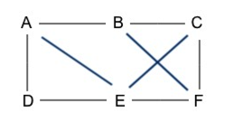
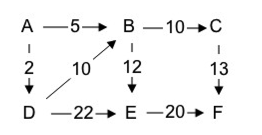
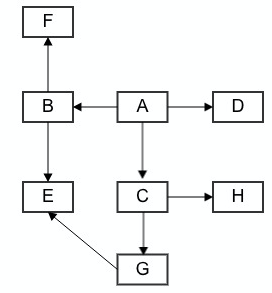

# 图
## 基本概念
图是一种非线性结构



其中图的元素称之为**顶点**。  
顶点与顶点的可以建立关系，即用上面的线建立连接，称之为**边**。  
每个顶点会有多条边和其他顶点连接，这个边的个数叫做**度**   

有时候边是有方向的，例如社交关系图谱中，A关注了B，但是B不一定有关注A，因此A到B的边是由`A--->B`。拥有方向的图称之为**有向图**，没有方向的称之为**无向图**


有向图中，也有度的概念，但是分为入度(in-degree)和出度(out-degree)。
1. 入度，有多少条边指向这个顶点
2. 出度，这个顶点有多少条边指向其他顶点

有时候，我们的每条边都有自己的大小，称之为**权重**，例如A地到B地是5分钟，但是C地道B地却是10分钟，B有两条边都指向它，但是它们的权重是不一样的。



图的类别中有两种类型：
1. 稀疏图，即顶点很多，但是每个顶点边不多。
2. 稠密图，即顶点很多，而且只有少数的顶点没有边。

## 图的存储方法
### 邻接矩阵（Adjacency Matrix）
邻接矩阵的意思，就是采用二维数组的方式来存储图的顶点。

如果是无向图，如果顶点i和顶点j有边连接，则将数组的a[i][j]和a[j][i]都置为1。
```
1 --- 3
|     |
|     |
2 --- 4
```
则：a[1][2]、a[1][3]、a[2][1]、a[2][4]、a[3][1]、a[3][4]、a[4][3]、a[4][2]均为1    
用矩阵来表示的话如下：
```
      |- 0 1 1 0 -|
adj = |  1 0 0 1  |
      |  1 0 0 1  |
      |- 0 1 1 0 -|
```

如果是有向图的话，如果边是由i指向j，则a[i][j]置为1。
```
1 ---> 3
∧      |
|      |
|      ∨
2 ---> 4
```
则a[1][3]、a[2][1]、a[2][4]、a[3][4]均为1    
用矩阵表示的话如下：
```
      |- 0 0 1 0 -|
adj = |  1 0 0 1  |
      |  0 0 0 1  |
      |- 0 0 0 0 -|
```

如果有向图是由权重的话，则用对应的权重值代替1
```
    2
 1 ---> 3
 ∧      |
4|      |3
 |      ∨
 2 ---> 4
    5
```
则a[1][3]=3，a[2][1]=4，a[2][4]=5，a[3][4]=3   
用矩阵表示的话如下：
```
      |- 0 0 3 0 -|
adj = |  4 0 0 5  |
      |  0 0 0 3  |
      |- 0 0 0 0 -|
```

#### 优缺点
通过邻接矩阵基于数组实现，存储简单，使用方便，效率高。另外采用邻接矩阵可以很方便计算，例如计算最短路径，采用矩阵的运算就能方便的做计算。

而矩阵的缺点也很明显，就是占用空间大。例如一个5个顶点的图，不管每个顶点有没有边，都需要一个25大小的数组。

例如无向图，a[i][j]和a[j][i]都需要存储对应的值，但是其实我们只需要存储一个就够了。换句话说，我们只需要存储矩阵对角线的上半部分或者下半部分即可。

### 邻接表（Adjacency list）
采用链表的方式来存储图的顶点。

每个顶点都对应一条链表，链表中存储的是与该顶点相连的其他顶点。

对于有向图，链表存储的就是指向顶点指向的其他顶点


对应的邻接表为：


对于无向图，链表中存储的是跟这个顶点有相关联的顶点。例如，i和j之间有边，则i的链表中需要存储j，而j的链表中也需要存储i。

#### 优缺点
和邻接矩阵相反，邻接表的优点就是空间占用低，只需要对有边的顶点放进链表中。

但是缺点就是查询效率低，例如要查找A是否有到D的边，就得遍历A的链表去查询。

但是为了提高查找效率，我们可以采用其他数据结构来代替链表，如平衡二叉查找树，也可以用跳表或者散列表。

## 代码实现
```go
import (
	"container/list"
	"fmt"
)

// 创建无向图邻接表
func createAdjlist(size int) []list.List {
	adj := make([]list.List, size)
	return adj
}

// 无向图添加元素
func addUndirectEdge(adj []list.List, s, t int) {
	adj[s].PushBack(t)
	adj[t].PushBack(s)
}

// 有向图添加元素
func addEdge(adj []list.List, s, t int) {
	adj[s].PushBack(t)
}
```

## 图的应用
### 广度优先算法（Breadth-First-Search，BFS）
广度优先算法，回答两类问题：
1. 从节点A出发，有前往节点B的路径么
2. 从节点A出发，前往节点B的哪条路径最短。



假设上图为好友关系图，A想要找E，他先在自己的好友中查找，存在E么，发现只有B、C、D，不符合结果，于是继续在朋友的朋友查找。  
开始分别查找B、C、D的好友，其中B的好友中有E，C和D都没有，因此A-->B->E是最短路径。  
这里虽然C的好友G中，他的好友也有E，但是我们并没有去寻找这层关系。我们认为关系层次越短，越满足我们的要求。

广度优先算法利用这种特点，先检查第一层关系，如果不满足则继续寻找第二层关系，直到最终找到目标顶点。

算法的实现思路可以利用队列来做：
1. A入队初始化，之后A出队，查找A关联的顶点，即BCD，并将B、C、D入队，此时队列BCD。
1. 将B出队，发现自己不满足条件，查找B相关联的顶点，即E和F，并将E和F入队，此时队列为CDEF。
2. 将C出队，发现自己不满足条件，查找C相关联的顶点，即G和H，并将G和H入队，此时队列DEFGH
3. 将D出队，发现自己不满足条件，查找D相关联的顶点，由于没有，因此放弃，此时队列EFGH。
4. 将E出队，发现自己满足条件，而且自己是B将其入队的，因此E的上级为B，而B是由A将其入队的，因此B的上级为A，最终路径为A-->B-->E，而且为最短路径。

具体算法实现的时候，我们还需要记录该顶点是否已经访问过，如果已经访问过，则需要忽略。

实例代码如下：
```go
func bfs(adj []list.List, s, t int) {
	if s == t {
		return
	}

	size := len(adj)
	visited := make([]bool, size)
	visited[s] = true

	queue := list.New()
	queue.PushBack(s)

	prev := make([]int, size)

	for i := 0; i < size; i++ {
		prev[i] = -1
	}

	for queue.Len() != 0 {
		// 队首出队
		w := queue.Remove(queue.Front()).(int)

		// 遍历相关联的顶点
		for q := adj[w].Front(); q != nil; q = q.Next() {
			val := q.Value.(int)
			// 该路径没有访问过
			if !visited[val] {
				prev[val] = w
				if val == t {
						print(prev, s, t)
						return
				}

				// 设置给顶点已经访问过
				visited[val] = true
				// 入队
				queue.PushBack(val)
			}
		}
	}
}

func print(prev []int, s, t int) {
	if prev[t] != -1 && t != s {
		print(prev, s, prev[t])
	}
	fmt.Print(t, " ")
}
```

#### 时间复杂度和空间复杂度
最坏情况下，需要遍历整个图才能找到目标顶点，这个时间为O(E)，E为边(edge)数。而每个顶点都需要进出一遍队列，进出队列的时间为O(1)，最多为顶点的个数O(V)，V为顶点(vertice)个数，因此最坏情况下时间复杂度为O(V+E)。    
如果一个图的所有顶点都是连通的话，那么E肯定是大于等于V-1，因此`O(V+E) = O(E+1+E) = O(E)`

空间复杂度的话，由于需要几个辅助变量，visited、queue、prev，他们的最大个数就是顶点的个数，因此空间复杂度是O(V)

### 深度优先算法（Depth-First-Search）
这种搜索方式，会先选择一条路径不断深入走下去，直到无法再深入时才返回。再不断重复其他路径。


还是以这幅图片来讲。

1. A可能先到C，发现C可以去H和G。
2. 然后去了H后，发现不能继续前进了，就放弃了。
3. 然后去了G，发现G可以继续去E，然后去了E，发现找到目的地了。
4. 找到目的地后，A的其他顶点就可以不用继续深入了。

由此可见，深度优先算法，可能找到的并不是最短路径。它的思想是一种回溯思想，可以采用递归的方式来实现。

实现代码如下：
```go
var found = false

func dfs(adj []list.List, s, t int) {
	found = false
	size := len(adj)

	visited := make([]bool, size)

	// 访问路径
	prev := make([]int, size)

	for i := 0; i < size; i++ {
		prev[i] = -1
	}

	recurDfs(adj, s, t, visited, prev)
	fmt.Println("\ndfs:")
	print(prev, s, t)
}

func recurDfs(adj []list.List, w, t int, visited []bool, prev []int) {
	if found {
		return
	}

	visited[w] = true
	if w == t {
		found = true
		return
	}

	for q := adj[w].Front(); q != nil; q = q.Next() {
		val := q.Value.(int)
		if !visited[val] {
			prev[val] = w
			recurDfs(adj, val, t, visited, prev)
		}
	}
}
```

#### 时间复杂度和空间复杂度
最坏情况下，深度优先算法会把每条边都深入走一遍，因此其时间复杂度为O(E)，E为边的个数。

空间复杂度的话，深度优先算法需要存储一些临时变量，如prev、visited，它们都和顶点的个数成正比，最大不会超过顶点个数。因此空间复杂度为O(V)，V为顶点的个数。
