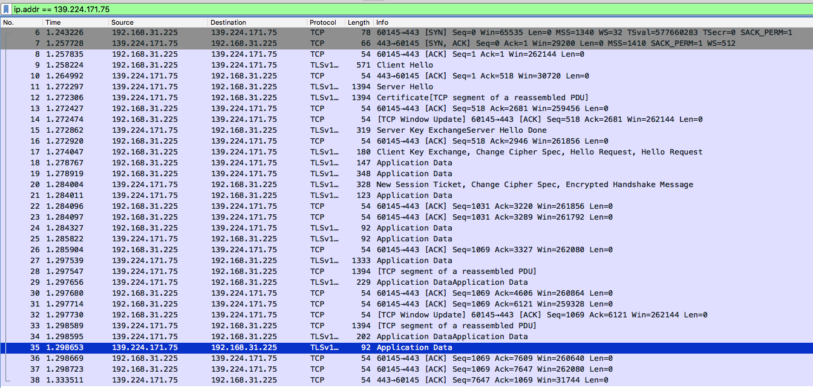
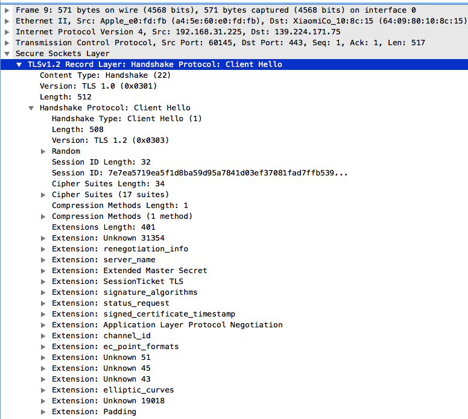
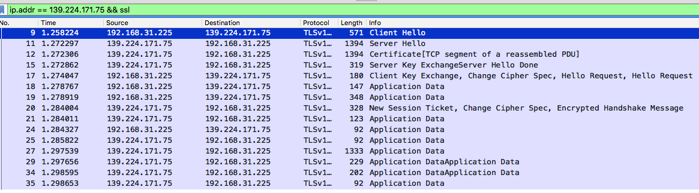
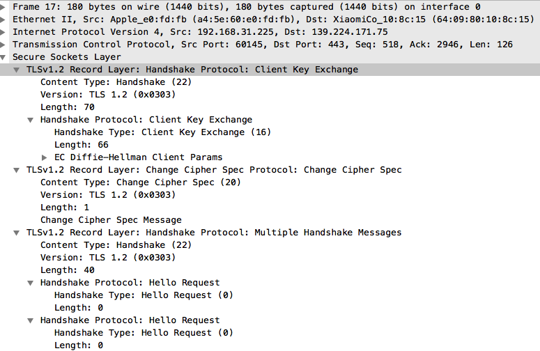

# 为什么要用Https
首先，我们得知道通过http的访问的域名，所有数据都是明文裸露在网络上的，也就是说任何人都可以看到你们双方通信的数据，甚至可以随意篡改数据，由于是明文的，接收的一端是无法感知数据是否被篡改的。这对于一些敏感的数据，如密码、金额等就会有严重的影响。

既然数据在网络是明文的，那我们就可以对数据进行加密，接收的人进行解密就可以看到真实数据了。

没错，的确是这样的。https的也的确是这么做得，但是它的加密和解密流程比这个复杂很多。

我们先从最简单的说起。

如果要对数据加密，有两种方式：

方式一，我们使用同一把锁对数据进行加密，这把锁我们称之为密钥，客户端用这把密钥对数据加密后，服务端用这把密钥对数据解密；反之也是如此。加密和解密都用同一把密钥的加解密算法就是对称加密。  
这看起来好像挺好的，但是问题来了。客户端怎么拿到这把密钥呢？如果是服务端传给它，那么密钥也等同于裸露在网络上了，同样可以被中间人给截获，那客户端加密的数据就能够被拥有密钥的中间人解密了，所以这种方式是不行的。

方式二，我们让客户端用一把锁对数据加密，服务端用另一把锁对数据解密，用来加密的锁任何人都可以获得，但是解密的锁只有服务端才有，用来加密的锁称之为公钥，用来解密的锁称之为私钥，这种加密和解密所有的锁不一样的加密算法就是非对称加密。服务端可以把公钥传递给客户端，这样即使中间人拿到公钥，由于他没有私钥也无法解密数据。  
这看起来也挺好的，但是问题还是来了，客户端凭什么相信收到的公钥就是准确合法的呢？因为任何人都可以生成公私钥，那中间人一样也可以，它生成了公私钥后，拦截了客户端的请求，把公钥给客户端，然后之后就可以用自己的私钥去解密客户端的数据。

因此基于SSL的http，即https便诞生了。

简单来说，就是让服务端证明它是合法的，更加严格的话，还学要让客户端也证明它也是合法的。

举个生活的例子，我们要证明一个人的身份，我们可能会查看他的身份证。为什么呢？因为身份证是国家合法机构颁发的，里面包含这个人的基本信息。

https也是这样子来做的。以浏览器为例子，浏览器访问一个https的网站时，网站会给浏览器一个证书，然后浏览器验证证书后如果合法，那么就会信任这个网站，于是放心进行访问。当然这是简单的描述，后面我们回来说说具体的细节。

# https的访问过程
我们知道http是应用层协议，数据会从应用层到达传输层，经由tcp协议后封装后再经由下层协议最终传输到网络。

为了对数据进行加密，便构建出了一个安全层，它在应用层和传输层中间，也即http和tcp中间，这个安全层采用的协议就是ssl或者更为现代的TLS协议，如下图所示：  

理解https的访问过程，感觉最好的方式就是抓个包，从实际的包中理解整个过程，比死记硬背好多了。

上图是我用浏览器做为客户端访问了一个https的get接口通过wireshark抓取到的包，具体的流程如下：
1. 当我们用客户端采用Https协议访问域名时，客户端便会与服务端的443建立连接，也就是会先进行tcp的三次握手。
2. 双方连接建立完成后，客户端会通过明文发送`Client Hello`请求，请求中会包含客户端一些ssl的数据，主要包括：
    * 支持的最高TSL协议版本，例如有：TLSv1.2 Record Layer: Handshake Protocol: Client Hello
    * 可够选择的加密套件候选列表，Cipher Suites
    * 支持的压缩算法列表，compression methods
    * 随机数，Random，这会用于后续的加密密钥的生成。
    * 一些扩展字段，Extennsions
    
3. 服务端收到后都会先回复ack给客户端，客户端收到服务器的数据也会回复ack给服务器，所以我们可以看到有很多tcp协议的数据往来。为了简单起见，我们可以只查看tls的数据，在wireshark中输入`ip.addr == 139.224.171.75 && ssl`，则有如下：
  
4. 服务端在收到客户端的`Client Hello`请求后也会告诉客户端协商之后的加密方式，会告诉客户端采用的tls版本，选择的加密套件，选择的压缩算法，还有一串随机数，会用于后续的加密密钥的生成，也会有一些扩展字段。
  
5. 之后服务端便开始将自己的证书发送给客户端，而这个证书的内容是用了权威结构CA进行加密的（或者说是签名），包含的主要内容：
    * issuer，证书是谁颁发的。
    * subject，证书是颁发给谁的
    * validity，证书的有效期
    * subjectPublicKeyInfo，证书中所包含的公钥信息，其中有algorithm签名算法和subjectPublicKey公钥内容。
    
6. 发完证书后，服务端就发送一个`Server Hello Done`的数据给客户端，告诉它已经没有其他数据要给了。
7. 接下来客户端就会开始校验证书，客户端会从自己内置的CA仓库中取出CA的公钥去解密（应该说是验证）出证书，证书的内容我们上面已经说过了，通过客户端访问的域名和证书内容进行对比和证书有效期等等可以校验证书的合法性。还有个问题就是怎么证明客户端的CA的公钥也是合法的，因此会不断往上追溯CA的CA，CA的CA的CA。
8. 如果客户端证书校验通过了，客户端会生成一个随机数字`Pre-master`，这时客户端有了三个重要的随机值，自己的randomKey和服务端的randomKey还有Pre-master，有这三个值，客户端和服务端都可以生成一样的对称密钥。
    * 客户端将Pre-master发送给服务端，即发送`Client Key Exchange`
    * 有了这个对称密钥，客户端就发送`Change Cipher Spec`，告诉服务端以后采用协商的通信密钥和加密算法进行加密通信。
    * 发送一个Encrypted Handshake Message给服务端，将已经商定好的参数等，采用协商的密钥进行加密，发送给服务端用于数据加密和验证，相当于尝试下，生成的对称加密的密钥能否使用。
    
9.  服务端采用私钥对数据进行解密，拿到Pre-master，同时自己还有了两个randomKey，以此生成了对称加密的密钥，回复客户端Change Cipher Spec，即同意客户端的方案。然后发送Encrypted Handshake Message试试密钥。
10. 至此，两端的ssl/tls握手的过程就完成了，双方都要一样的密钥用于加密数据，之后的数据通信过程，双方就拿着这个密钥进行加密和解密，而中间人也无法拿到这个密钥。

这里只是说到了客户端校验服务端，更加严格的场景还需要服务端验证客户端，那客户端也要有证书，而且这个证书服务端需要能够认可。

我们以前进行网银支付或者转账是会经常使用银行u盾这样的东西，插在电脑上，然后就能进行操作。其实这个u盾里装的就是客户端的证书。

现在我们明白了，整个https交互的过程不仅用到了非对称加密，也用到了对称加密。 

主要是因为非对称加密的算法会比较耗时，对称加密很快，因此我们只要保证我们的密钥足够隐蔽，不会被中间人获取到，我们便可以直接采用对称加密进行数据通信的。
