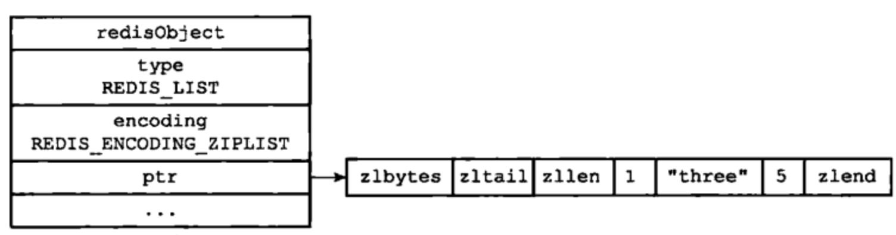
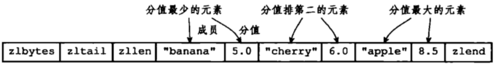
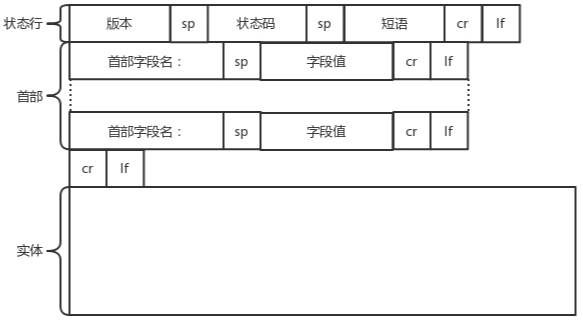

- [Database](#database)
  - [Mysql](#mysql)
    - [MySQL 的存储引擎有哪些?（InnoDB）为什么选 InnoDB?](#mysql-%E7%9A%84%E5%AD%98%E5%82%A8%E5%BC%95%E6%93%8E%E6%9C%89%E5%93%AA%E4%BA%9Binnodb%E4%B8%BA%E4%BB%80%E4%B9%88%E9%80%89-innodb)
    - [知道mysql的索引算法么？](#%E7%9F%A5%E9%81%93mysql%E7%9A%84%E7%B4%A2%E5%BC%95%E7%AE%97%E6%B3%95%E4%B9%88)
    - [为什么mysql要用b+树而不是b树或者其他树？](#%E4%B8%BA%E4%BB%80%E4%B9%88mysql%E8%A6%81%E7%94%A8b%E6%A0%91%E8%80%8C%E4%B8%8D%E6%98%AFb%E6%A0%91%E6%88%96%E8%80%85%E5%85%B6%E4%BB%96%E6%A0%91)
    - [MySQL 的聚簇索引和非聚簇索引有什么区别?](#mysql-%E7%9A%84%E8%81%9A%E7%B0%87%E7%B4%A2%E5%BC%95%E5%92%8C%E9%9D%9E%E8%81%9A%E7%B0%87%E7%B4%A2%E5%BC%95%E6%9C%89%E4%BB%80%E4%B9%88%E5%8C%BA%E5%88%AB)
    - [聊聊事务的隔离级别。你们生产用的什么事务隔离级别，为什么？](#%E8%81%8A%E8%81%8A%E4%BA%8B%E5%8A%A1%E7%9A%84%E9%9A%94%E7%A6%BB%E7%BA%A7%E5%88%AB%E4%BD%A0%E4%BB%AC%E7%94%9F%E4%BA%A7%E7%94%A8%E7%9A%84%E4%BB%80%E4%B9%88%E4%BA%8B%E5%8A%A1%E9%9A%94%E7%A6%BB%E7%BA%A7%E5%88%AB%E4%B8%BA%E4%BB%80%E4%B9%88)
    - [一条语句的执行过程](#%E4%B8%80%E6%9D%A1%E8%AF%AD%E5%8F%A5%E7%9A%84%E6%89%A7%E8%A1%8C%E8%BF%87%E7%A8%8B)
    - [mysql日志的写入方式是怎么样的？](#mysql%E6%97%A5%E5%BF%97%E7%9A%84%E5%86%99%E5%85%A5%E6%96%B9%E5%BC%8F%E6%98%AF%E6%80%8E%E4%B9%88%E6%A0%B7%E7%9A%84)
    - [主从复制的流程](#%E4%B8%BB%E4%BB%8E%E5%A4%8D%E5%88%B6%E7%9A%84%E6%B5%81%E7%A8%8B)
    - [如何保证数据库的主从一致性](#%E5%A6%82%E4%BD%95%E4%BF%9D%E8%AF%81%E6%95%B0%E6%8D%AE%E5%BA%93%E7%9A%84%E4%B8%BB%E4%BB%8E%E4%B8%80%E8%87%B4%E6%80%A7)
    - [分库分表后怎么保证主键仍然是递增的?](#%E5%88%86%E5%BA%93%E5%88%86%E8%A1%A8%E5%90%8E%E6%80%8E%E4%B9%88%E4%BF%9D%E8%AF%81%E4%B8%BB%E9%94%AE%E4%BB%8D%E7%84%B6%E6%98%AF%E9%80%92%E5%A2%9E%E7%9A%84)
    - [分库分表的数据源中假如存在主键冲突要怎么解决？](#%E5%88%86%E5%BA%93%E5%88%86%E8%A1%A8%E7%9A%84%E6%95%B0%E6%8D%AE%E6%BA%90%E4%B8%AD%E5%81%87%E5%A6%82%E5%AD%98%E5%9C%A8%E4%B8%BB%E9%94%AE%E5%86%B2%E7%AA%81%E8%A6%81%E6%80%8E%E4%B9%88%E8%A7%A3%E5%86%B3)
    - [数据库乐观锁的实现](#%E6%95%B0%E6%8D%AE%E5%BA%93%E4%B9%90%E8%A7%82%E9%94%81%E7%9A%84%E5%AE%9E%E7%8E%B0)
    - [瞬时写入量很大可能会打挂存储, 怎么保护?](#%E7%9E%AC%E6%97%B6%E5%86%99%E5%85%A5%E9%87%8F%E5%BE%88%E5%A4%A7%E5%8F%AF%E8%83%BD%E4%BC%9A%E6%89%93%E6%8C%82%E5%AD%98%E5%82%A8-%E6%80%8E%E4%B9%88%E4%BF%9D%E6%8A%A4)
    - [分库分表后怎么查询分页?](#%E5%88%86%E5%BA%93%E5%88%86%E8%A1%A8%E5%90%8E%E6%80%8E%E4%B9%88%E6%9F%A5%E8%AF%A2%E5%88%86%E9%A1%B5)
  - [Redis](#redis)
    - [Redis 有什么优点?](#redis-%E6%9C%89%E4%BB%80%E4%B9%88%E4%BC%98%E7%82%B9)
    - [redis的底层数据结构了解多少](#redis%E7%9A%84%E5%BA%95%E5%B1%82%E6%95%B0%E6%8D%AE%E7%BB%93%E6%9E%84%E4%BA%86%E8%A7%A3%E5%A4%9A%E5%B0%91)
    - [知道动态字符串sds的优缺点么？](#%E7%9F%A5%E9%81%93%E5%8A%A8%E6%80%81%E5%AD%97%E7%AC%A6%E4%B8%B2sds%E7%9A%84%E4%BC%98%E7%BC%BA%E7%82%B9%E4%B9%88)
    - [redis有哪些数据结构，分别使用在什么场景？](#redis%E6%9C%89%E5%93%AA%E4%BA%9B%E6%95%B0%E6%8D%AE%E7%BB%93%E6%9E%84%E5%88%86%E5%88%AB%E4%BD%BF%E7%94%A8%E5%9C%A8%E4%BB%80%E4%B9%88%E5%9C%BA%E6%99%AF)
    - [redis是如何清理过期key的？](#redis%E6%98%AF%E5%A6%82%E4%BD%95%E6%B8%85%E7%90%86%E8%BF%87%E6%9C%9Fkey%E7%9A%84)
    - [什么是缓存穿透？如何避免？什么是缓存雪崩？何如避免？](#%E4%BB%80%E4%B9%88%E6%98%AF%E7%BC%93%E5%AD%98%E7%A9%BF%E9%80%8F%E5%A6%82%E4%BD%95%E9%81%BF%E5%85%8D%E4%BB%80%E4%B9%88%E6%98%AF%E7%BC%93%E5%AD%98%E9%9B%AA%E5%B4%A9%E4%BD%95%E5%A6%82%E9%81%BF%E5%85%8D)
    - [redis分布式锁](#redis%E5%88%86%E5%B8%83%E5%BC%8F%E9%94%81)
    - [简述Redis分布式锁的缺陷？](#%E7%AE%80%E8%BF%B0redis%E5%88%86%E5%B8%83%E5%BC%8F%E9%94%81%E7%9A%84%E7%BC%BA%E9%99%B7)
    - [Redis里面有1亿个key，其中有10w个key是以某个固定的已知的前缀开头的，如何将它们全部找出来？](#redis%E9%87%8C%E9%9D%A2%E6%9C%891%E4%BA%BF%E4%B8%AAkey%E5%85%B6%E4%B8%AD%E6%9C%8910w%E4%B8%AAkey%E6%98%AF%E4%BB%A5%E6%9F%90%E4%B8%AA%E5%9B%BA%E5%AE%9A%E7%9A%84%E5%B7%B2%E7%9F%A5%E7%9A%84%E5%89%8D%E7%BC%80%E5%BC%80%E5%A4%B4%E7%9A%84%E5%A6%82%E4%BD%95%E5%B0%86%E5%AE%83%E4%BB%AC%E5%85%A8%E9%83%A8%E6%89%BE%E5%87%BA%E6%9D%A5)
    - [Redis 单线程如何处理那么多的并发客户端连接？](#redis-%E5%8D%95%E7%BA%BF%E7%A8%8B%E5%A6%82%E4%BD%95%E5%A4%84%E7%90%86%E9%82%A3%E4%B9%88%E5%A4%9A%E7%9A%84%E5%B9%B6%E5%8F%91%E5%AE%A2%E6%88%B7%E7%AB%AF%E8%BF%9E%E6%8E%A5)
    - [如何使用redis实现队列。又如何实现延时队列。](#%E5%A6%82%E4%BD%95%E4%BD%BF%E7%94%A8redis%E5%AE%9E%E7%8E%B0%E9%98%9F%E5%88%97%E5%8F%88%E5%A6%82%E4%BD%95%E5%AE%9E%E7%8E%B0%E5%BB%B6%E6%97%B6%E9%98%9F%E5%88%97)
    - [如何实现持久化](#%E5%A6%82%E4%BD%95%E5%AE%9E%E7%8E%B0%E6%8C%81%E4%B9%85%E5%8C%96)
    - [bgsave的原理](#bgsave%E7%9A%84%E5%8E%9F%E7%90%86)
    - [主从间的同步机制](#%E4%B8%BB%E4%BB%8E%E9%97%B4%E7%9A%84%E5%90%8C%E6%AD%A5%E6%9C%BA%E5%88%B6)
    - [主从同步可能出现的问题？](#%E4%B8%BB%E4%BB%8E%E5%90%8C%E6%AD%A5%E5%8F%AF%E8%83%BD%E5%87%BA%E7%8E%B0%E7%9A%84%E9%97%AE%E9%A2%98)
    - [说说Redis哈希槽的概念？](#%E8%AF%B4%E8%AF%B4redis%E5%93%88%E5%B8%8C%E6%A7%BD%E7%9A%84%E6%A6%82%E5%BF%B5)
    - [Redis如何使用事务？有什么缺点？](#redis%E5%A6%82%E4%BD%95%E4%BD%BF%E7%94%A8%E4%BA%8B%E5%8A%A1%E6%9C%89%E4%BB%80%E4%B9%88%E7%BC%BA%E7%82%B9)
    - [为什么 Redis 的事务不能支持回滚？](#%E4%B8%BA%E4%BB%80%E4%B9%88-redis-%E7%9A%84%E4%BA%8B%E5%8A%A1%E4%B8%8D%E8%83%BD%E6%94%AF%E6%8C%81%E5%9B%9E%E6%BB%9A)
    - [如何使用redis进行CAS修改缓存的值](#%E5%A6%82%E4%BD%95%E4%BD%BF%E7%94%A8redis%E8%BF%9B%E8%A1%8Ccas%E4%BF%AE%E6%94%B9%E7%BC%93%E5%AD%98%E7%9A%84%E5%80%BC)
    - [Redis如何做内存优化，如何回收进程？](#redis%E5%A6%82%E4%BD%95%E5%81%9A%E5%86%85%E5%AD%98%E4%BC%98%E5%8C%96%E5%A6%82%E4%BD%95%E5%9B%9E%E6%94%B6%E8%BF%9B%E7%A8%8B)
    - [Redis 常见的性能问题都有哪些？如何解决？](#redis-%E5%B8%B8%E8%A7%81%E7%9A%84%E6%80%A7%E8%83%BD%E9%97%AE%E9%A2%98%E9%83%BD%E6%9C%89%E5%93%AA%E4%BA%9B%E5%A6%82%E4%BD%95%E8%A7%A3%E5%86%B3)
- [数据结构和算法](#%E6%95%B0%E6%8D%AE%E7%BB%93%E6%9E%84%E5%92%8C%E7%AE%97%E6%B3%95)
  - [数据结构](#%E6%95%B0%E6%8D%AE%E7%BB%93%E6%9E%84)
    - [链表和数组的优缺点？](#%E9%93%BE%E8%A1%A8%E5%92%8C%E6%95%B0%E7%BB%84%E7%9A%84%E4%BC%98%E7%BC%BA%E7%82%B9)
    - [解决hash冲突的方法有哪些？](#%E8%A7%A3%E5%86%B3hash%E5%86%B2%E7%AA%81%E7%9A%84%E6%96%B9%E6%B3%95%E6%9C%89%E5%93%AA%E4%BA%9B)
  - [算法](#%E7%AE%97%E6%B3%95)
    - [从无限的字符流中, 随机选出 10 个字符](#%E4%BB%8E%E6%97%A0%E9%99%90%E7%9A%84%E5%AD%97%E7%AC%A6%E6%B5%81%E4%B8%AD-%E9%9A%8F%E6%9C%BA%E9%80%89%E5%87%BA-10-%E4%B8%AA%E5%AD%97%E7%AC%A6)
    - [M*N 横向纵向均递增的矩阵找指定数](#mn-%E6%A8%AA%E5%90%91%E7%BA%B5%E5%90%91%E5%9D%87%E9%80%92%E5%A2%9E%E7%9A%84%E7%9F%A9%E9%98%B5%E6%89%BE%E6%8C%87%E5%AE%9A%E6%95%B0)
    - [如何判断两个无环单链表有没有交叉点](#%E5%A6%82%E4%BD%95%E5%88%A4%E6%96%AD%E4%B8%A4%E4%B8%AA%E6%97%A0%E7%8E%AF%E5%8D%95%E9%93%BE%E8%A1%A8%E6%9C%89%E6%B2%A1%E6%9C%89%E4%BA%A4%E5%8F%89%E7%82%B9)
    - [如何判断两个有环单链表有没有交叉点](#%E5%A6%82%E4%BD%95%E5%88%A4%E6%96%AD%E4%B8%A4%E4%B8%AA%E6%9C%89%E7%8E%AF%E5%8D%95%E9%93%BE%E8%A1%A8%E6%9C%89%E6%B2%A1%E6%9C%89%E4%BA%A4%E5%8F%89%E7%82%B9)
    - [最短路算法](#%E6%9C%80%E7%9F%AD%E8%B7%AF%E7%AE%97%E6%B3%95)
    - [爬虫在抓取网页的时候，如何判断网址是否抓取过？假设你要爬取的10亿甚至更多的网页。](#%E7%88%AC%E8%99%AB%E5%9C%A8%E6%8A%93%E5%8F%96%E7%BD%91%E9%A1%B5%E7%9A%84%E6%97%B6%E5%80%99%E5%A6%82%E4%BD%95%E5%88%A4%E6%96%AD%E7%BD%91%E5%9D%80%E6%98%AF%E5%90%A6%E6%8A%93%E5%8F%96%E8%BF%87%E5%81%87%E8%AE%BE%E4%BD%A0%E8%A6%81%E7%88%AC%E5%8F%96%E7%9A%8410%E4%BA%BF%E7%94%9A%E8%87%B3%E6%9B%B4%E5%A4%9A%E7%9A%84%E7%BD%91%E9%A1%B5)
- [网络](#%E7%BD%91%E7%BB%9C)
  - [网络基础](#%E7%BD%91%E7%BB%9C%E5%9F%BA%E7%A1%80)
    - [一个请求的过程（或者说从浏览器地址栏输入www.baidu.com回车后发生的所有过程）](#%E4%B8%80%E4%B8%AA%E8%AF%B7%E6%B1%82%E7%9A%84%E8%BF%87%E7%A8%8B%E6%88%96%E8%80%85%E8%AF%B4%E4%BB%8E%E6%B5%8F%E8%A7%88%E5%99%A8%E5%9C%B0%E5%9D%80%E6%A0%8F%E8%BE%93%E5%85%A5wwwbaiducom%E5%9B%9E%E8%BD%A6%E5%90%8E%E5%8F%91%E7%94%9F%E7%9A%84%E6%89%80%E6%9C%89%E8%BF%87%E7%A8%8B)
    - [http请求包含哪些数据结构？](#http%E8%AF%B7%E6%B1%82%E5%8C%85%E5%90%AB%E5%93%AA%E4%BA%9B%E6%95%B0%E6%8D%AE%E7%BB%93%E6%9E%84)
    - [什么是http的长连接和短连接？如何配置使用长连接](#%E4%BB%80%E4%B9%88%E6%98%AFhttp%E7%9A%84%E9%95%BF%E8%BF%9E%E6%8E%A5%E5%92%8C%E7%9F%AD%E8%BF%9E%E6%8E%A5%E5%A6%82%E4%BD%95%E9%85%8D%E7%BD%AE%E4%BD%BF%E7%94%A8%E9%95%BF%E8%BF%9E%E6%8E%A5)
    - [https的建立过程](#https%E7%9A%84%E5%BB%BA%E7%AB%8B%E8%BF%87%E7%A8%8B)
    - [TCP的keep-alive的作用？它和http的keep-alive有什么差别](#tcp%E7%9A%84keep-alive%E7%9A%84%E4%BD%9C%E7%94%A8%E5%AE%83%E5%92%8Chttp%E7%9A%84keep-alive%E6%9C%89%E4%BB%80%E4%B9%88%E5%B7%AE%E5%88%AB)
    - [谈谈tcp的三次握手和四次挥手。为什么建立连接需要三次，而不是两次？](#%E8%B0%88%E8%B0%88tcp%E7%9A%84%E4%B8%89%E6%AC%A1%E6%8F%A1%E6%89%8B%E5%92%8C%E5%9B%9B%E6%AC%A1%E6%8C%A5%E6%89%8B%E4%B8%BA%E4%BB%80%E4%B9%88%E5%BB%BA%E7%AB%8B%E8%BF%9E%E6%8E%A5%E9%9C%80%E8%A6%81%E4%B8%89%E6%AC%A1%E8%80%8C%E4%B8%8D%E6%98%AF%E4%B8%A4%E6%AC%A1)
    - [tcp有哪些状态，相应状态的含义。](#tcp%E6%9C%89%E5%93%AA%E4%BA%9B%E7%8A%B6%E6%80%81%E7%9B%B8%E5%BA%94%E7%8A%B6%E6%80%81%E7%9A%84%E5%90%AB%E4%B9%89)
    - [三次握手时，如果服务端没有收到最后的ack包，客户端可以开始发数据么？](#%E4%B8%89%E6%AC%A1%E6%8F%A1%E6%89%8B%E6%97%B6%E5%A6%82%E6%9E%9C%E6%9C%8D%E5%8A%A1%E7%AB%AF%E6%B2%A1%E6%9C%89%E6%94%B6%E5%88%B0%E6%9C%80%E5%90%8E%E7%9A%84ack%E5%8C%85%E5%AE%A2%E6%88%B7%E7%AB%AF%E5%8F%AF%E4%BB%A5%E5%BC%80%E5%A7%8B%E5%8F%91%E6%95%B0%E6%8D%AE%E4%B9%88)
    - [为什么接收方在FIN包后不能一次性发送ACK和FIN包给发送方，就像建立连接时一次性发送SYN和ACK包一样。](#%E4%B8%BA%E4%BB%80%E4%B9%88%E6%8E%A5%E6%94%B6%E6%96%B9%E5%9C%A8fin%E5%8C%85%E5%90%8E%E4%B8%8D%E8%83%BD%E4%B8%80%E6%AC%A1%E6%80%A7%E5%8F%91%E9%80%81ack%E5%92%8Cfin%E5%8C%85%E7%BB%99%E5%8F%91%E9%80%81%E6%96%B9%E5%B0%B1%E5%83%8F%E5%BB%BA%E7%AB%8B%E8%BF%9E%E6%8E%A5%E6%97%B6%E4%B8%80%E6%AC%A1%E6%80%A7%E5%8F%91%E9%80%81syn%E5%92%8Cack%E5%8C%85%E4%B8%80%E6%A0%B7)
    - [如果大量出现CLOSE_WAIT状态，说明什么？](#%E5%A6%82%E6%9E%9C%E5%A4%A7%E9%87%8F%E5%87%BA%E7%8E%B0closewait%E7%8A%B6%E6%80%81%E8%AF%B4%E6%98%8E%E4%BB%80%E4%B9%88)
    - [TIME_WAIT的作用？以及出现大量TIME_WAIT的原因。](#timewait%E7%9A%84%E4%BD%9C%E7%94%A8%E4%BB%A5%E5%8F%8A%E5%87%BA%E7%8E%B0%E5%A4%A7%E9%87%8Ftimewait%E7%9A%84%E5%8E%9F%E5%9B%A0)
    - [如何优化time_wait？](#%E5%A6%82%E4%BD%95%E4%BC%98%E5%8C%96timewait)
    - [如果被断开的一方在收到FIN包后就跑路或者回复完ACK就跑路了，会怎么样？](#%E5%A6%82%E6%9E%9C%E8%A2%AB%E6%96%AD%E5%BC%80%E7%9A%84%E4%B8%80%E6%96%B9%E5%9C%A8%E6%94%B6%E5%88%B0fin%E5%8C%85%E5%90%8E%E5%B0%B1%E8%B7%91%E8%B7%AF%E6%88%96%E8%80%85%E5%9B%9E%E5%A4%8D%E5%AE%8Cack%E5%B0%B1%E8%B7%91%E8%B7%AF%E4%BA%86%E4%BC%9A%E6%80%8E%E4%B9%88%E6%A0%B7)
    - [如果出现大量的LAST_ACK状态，说明什么原因？](#%E5%A6%82%E6%9E%9C%E5%87%BA%E7%8E%B0%E5%A4%A7%E9%87%8F%E7%9A%84lastack%E7%8A%B6%E6%80%81%E8%AF%B4%E6%98%8E%E4%BB%80%E4%B9%88%E5%8E%9F%E5%9B%A0)
    - [DNS的查找过程](#dns%E7%9A%84%E6%9F%A5%E6%89%BE%E8%BF%87%E7%A8%8B)
    - [DNS使用的是TCP协议还是UDP协议？](#dns%E4%BD%BF%E7%94%A8%E7%9A%84%E6%98%AFtcp%E5%8D%8F%E8%AE%AE%E8%BF%98%E6%98%AFudp%E5%8D%8F%E8%AE%AE)
    - [滑动窗口和拥塞控制](#%E6%BB%91%E5%8A%A8%E7%AA%97%E5%8F%A3%E5%92%8C%E6%8B%A5%E5%A1%9E%E6%8E%A7%E5%88%B6)
    - [301和302有什么区别](#301%E5%92%8C302%E6%9C%89%E4%BB%80%E4%B9%88%E5%8C%BA%E5%88%AB)
    - [504和500有什么区别](#504%E5%92%8C500%E6%9C%89%E4%BB%80%E4%B9%88%E5%8C%BA%E5%88%AB)
    - [put和patch的差别](#put%E5%92%8Cpatch%E7%9A%84%E5%B7%AE%E5%88%AB)
    - [缓存头有哪些，如何使用？](#%E7%BC%93%E5%AD%98%E5%A4%B4%E6%9C%89%E5%93%AA%E4%BA%9B%E5%A6%82%E4%BD%95%E4%BD%BF%E7%94%A8)
  - [网络安全](#%E7%BD%91%E7%BB%9C%E5%AE%89%E5%85%A8)
    - [解决跨域的方式。重点是cors。](#%E8%A7%A3%E5%86%B3%E8%B7%A8%E5%9F%9F%E7%9A%84%E6%96%B9%E5%BC%8F%E9%87%8D%E7%82%B9%E6%98%AFcors)
    - [理解csrf](#%E7%90%86%E8%A7%A3csrf)
    - [理解xss](#%E7%90%86%E8%A7%A3xss)
    - [SYN Flood攻击](#syn-flood%E6%94%BB%E5%87%BB)
  - [网络通信](#%E7%BD%91%E7%BB%9C%E9%80%9A%E4%BF%A1)
    - [用过哪些RPC框架么，讲讲有缺点](#%E7%94%A8%E8%BF%87%E5%93%AA%E4%BA%9Brpc%E6%A1%86%E6%9E%B6%E4%B9%88%E8%AE%B2%E8%AE%B2%E6%9C%89%E7%BC%BA%E7%82%B9)
- [系统设计](#%E7%B3%BB%E7%BB%9F%E8%AE%BE%E8%AE%A1)
  - [微服务](#%E5%BE%AE%E6%9C%8D%E5%8A%A1)
    - [微服务数据一致性问题，如何解决？](#%E5%BE%AE%E6%9C%8D%E5%8A%A1%E6%95%B0%E6%8D%AE%E4%B8%80%E8%87%B4%E6%80%A7%E9%97%AE%E9%A2%98%E5%A6%82%E4%BD%95%E8%A7%A3%E5%86%B3)
  - [分布式](#%E5%88%86%E5%B8%83%E5%BC%8F)
    - [CAP](#cap)
    - [分布式系统的唯一id生成算法](#%E5%88%86%E5%B8%83%E5%BC%8F%E7%B3%BB%E7%BB%9F%E7%9A%84%E5%94%AF%E4%B8%80id%E7%94%9F%E6%88%90%E7%AE%97%E6%B3%95)
    - [某一个业务中现在需要生成全局唯一的递增 ID, 并发量非常大, 怎么做](#%E6%9F%90%E4%B8%80%E4%B8%AA%E4%B8%9A%E5%8A%A1%E4%B8%AD%E7%8E%B0%E5%9C%A8%E9%9C%80%E8%A6%81%E7%94%9F%E6%88%90%E5%85%A8%E5%B1%80%E5%94%AF%E4%B8%80%E7%9A%84%E9%80%92%E5%A2%9E-id-%E5%B9%B6%E5%8F%91%E9%87%8F%E9%9D%9E%E5%B8%B8%E5%A4%A7-%E6%80%8E%E4%B9%88%E5%81%9A)
    - [我现在要做一个限流功能, 怎么做?](#%E6%88%91%E7%8E%B0%E5%9C%A8%E8%A6%81%E5%81%9A%E4%B8%80%E4%B8%AA%E9%99%90%E6%B5%81%E5%8A%9F%E8%83%BD-%E6%80%8E%E4%B9%88%E5%81%9A)
    - [这个限流要做成分布式的, 怎么做?](#%E8%BF%99%E4%B8%AA%E9%99%90%E6%B5%81%E8%A6%81%E5%81%9A%E6%88%90%E5%88%86%E5%B8%83%E5%BC%8F%E7%9A%84-%E6%80%8E%E4%B9%88%E5%81%9A)
    - [分布式锁设置超时后，有没可能在没有释放的情况下, 被人抢走锁。有的话，怎么解决？](#%E5%88%86%E5%B8%83%E5%BC%8F%E9%94%81%E8%AE%BE%E7%BD%AE%E8%B6%85%E6%97%B6%E5%90%8E%E6%9C%89%E6%B2%A1%E5%8F%AF%E8%83%BD%E5%9C%A8%E6%B2%A1%E6%9C%89%E9%87%8A%E6%94%BE%E7%9A%84%E6%83%85%E5%86%B5%E4%B8%8B-%E8%A2%AB%E4%BA%BA%E6%8A%A2%E8%B5%B0%E9%94%81%E6%9C%89%E7%9A%84%E8%AF%9D%E6%80%8E%E4%B9%88%E8%A7%A3%E5%86%B3)
    - [不用zk的心跳, 可以怎么解决这个问题呢?](#%E4%B8%8D%E7%94%A8zk%E7%9A%84%E5%BF%83%E8%B7%B3-%E5%8F%AF%E4%BB%A5%E6%80%8E%E4%B9%88%E8%A7%A3%E5%86%B3%E8%BF%99%E4%B8%AA%E9%97%AE%E9%A2%98%E5%91%A2)
    - [如何保障分布式事务的一致性？](#%E5%A6%82%E4%BD%95%E4%BF%9D%E9%9A%9C%E5%88%86%E5%B8%83%E5%BC%8F%E4%BA%8B%E5%8A%A1%E7%9A%84%E4%B8%80%E8%87%B4%E6%80%A7)
  - [并发编程](#%E5%B9%B6%E5%8F%91%E7%BC%96%E7%A8%8B)
    - [CAS](#cas)
    - [COW](#cow)
  - [设计](#%E8%AE%BE%E8%AE%A1)
    - [如何设计一个短连接服务](#%E5%A6%82%E4%BD%95%E8%AE%BE%E8%AE%A1%E4%B8%80%E4%B8%AA%E7%9F%AD%E8%BF%9E%E6%8E%A5%E6%9C%8D%E5%8A%A1)
    - [当缓存需要更新的时候，你觉得应该怎么做才合理？](#%E5%BD%93%E7%BC%93%E5%AD%98%E9%9C%80%E8%A6%81%E6%9B%B4%E6%96%B0%E7%9A%84%E6%97%B6%E5%80%99%E4%BD%A0%E8%A7%89%E5%BE%97%E5%BA%94%E8%AF%A5%E6%80%8E%E4%B9%88%E5%81%9A%E6%89%8D%E5%90%88%E7%90%86)
- [语言](#%E8%AF%AD%E8%A8%80)
  - [golang](#golang)
    - [如何实现CAS。](#%E5%A6%82%E4%BD%95%E5%AE%9E%E7%8E%B0cas)
    - [关于golang for-range 的坑](#%E5%85%B3%E4%BA%8Egolang-for-range-%E7%9A%84%E5%9D%91)
    - [goroutine 是怎么调度的？](#goroutine-%E6%98%AF%E6%80%8E%E4%B9%88%E8%B0%83%E5%BA%A6%E7%9A%84)
    - [golang的gc算法](#golang%E7%9A%84gc%E7%AE%97%E6%B3%95)
    - [Golang 里的逃逸分析是什么？怎么避免内存逃逸？](#golang-%E9%87%8C%E7%9A%84%E9%80%83%E9%80%B8%E5%88%86%E6%9E%90%E6%98%AF%E4%BB%80%E4%B9%88%E6%80%8E%E4%B9%88%E9%81%BF%E5%85%8D%E5%86%85%E5%AD%98%E9%80%83%E9%80%B8)
  - [node.js](#nodejs)
    - [阻塞和非阻塞的区别和优缺点。同步和异步的区别和优缺点](#%E9%98%BB%E5%A1%9E%E5%92%8C%E9%9D%9E%E9%98%BB%E5%A1%9E%E7%9A%84%E5%8C%BA%E5%88%AB%E5%92%8C%E4%BC%98%E7%BC%BA%E7%82%B9%E5%90%8C%E6%AD%A5%E5%92%8C%E5%BC%82%E6%AD%A5%E7%9A%84%E5%8C%BA%E5%88%AB%E5%92%8C%E4%BC%98%E7%BC%BA%E7%82%B9)
    - [异步IO模型和事件循环机制](#%E5%BC%82%E6%AD%A5io%E6%A8%A1%E5%9E%8B%E5%92%8C%E4%BA%8B%E4%BB%B6%E5%BE%AA%E7%8E%AF%E6%9C%BA%E5%88%B6)
    - [为什么要有microtask和macrotask?](#%E4%B8%BA%E4%BB%80%E4%B9%88%E8%A6%81%E6%9C%89microtask%E5%92%8Cmacrotask)
    - [如何实现一个异步的reduce?](#%E5%A6%82%E4%BD%95%E5%AE%9E%E7%8E%B0%E4%B8%80%E4%B8%AA%E5%BC%82%E6%AD%A5%E7%9A%84reduce)
    - [V8内存控制和垃圾回收机制](#v8%E5%86%85%E5%AD%98%E6%8E%A7%E5%88%B6%E5%92%8C%E5%9E%83%E5%9C%BE%E5%9B%9E%E6%94%B6%E6%9C%BA%E5%88%B6)
    - [内存泄漏](#%E5%86%85%E5%AD%98%E6%B3%84%E6%BC%8F)
    - [javascript原型链和如何实现继承](#javascript%E5%8E%9F%E5%9E%8B%E9%93%BE%E5%92%8C%E5%A6%82%E4%BD%95%E5%AE%9E%E7%8E%B0%E7%BB%A7%E6%89%BF)
- [项目](#%E9%A1%B9%E7%9B%AE)
  - [为什么用rabbitmq，它有什么优缺点](#%E4%B8%BA%E4%BB%80%E4%B9%88%E7%94%A8rabbitmq%E5%AE%83%E6%9C%89%E4%BB%80%E4%B9%88%E4%BC%98%E7%BC%BA%E7%82%B9)
  - [为什么用mqtt，它有什么优缺点](#%E4%B8%BA%E4%BB%80%E4%B9%88%E7%94%A8mqtt%E5%AE%83%E6%9C%89%E4%BB%80%E4%B9%88%E4%BC%98%E7%BC%BA%E7%82%B9)
  - [用redis解决什么问题](#%E7%94%A8redis%E8%A7%A3%E5%86%B3%E4%BB%80%E4%B9%88%E9%97%AE%E9%A2%98)
  - [抽奖功能是怎么实现的](#%E6%8A%BD%E5%A5%96%E5%8A%9F%E8%83%BD%E6%98%AF%E6%80%8E%E4%B9%88%E5%AE%9E%E7%8E%B0%E7%9A%84)

# Database
## Mysql
[MySQL优化面试](https://juejin.im/post/5c6b9c09f265da2d8a55a855?utm_source=gold_browser_extension)

### MySQL 的存储引擎有哪些?（InnoDB）为什么选 InnoDB?
Memory、MyISAM、InnoDB。  
选择InnoDB:
1. 支持事务
2. 具有聚集索引
3. MVCC
4. 更完善的奔溃恢复，借助redo log和bin log，能实现更细粒度的数据恢复，基本能够恢复任意时刻的数据。

### 知道mysql的索引算法么？
[b+树](https://time.geekbang.org/column/article/77830)

### 为什么mysql要用b+树而不是b树或者其他树？
1. 首先b+树是一颗多叉树，相对于其他二叉树，深度更小，磁盘IO操作也相应变少。
2. 对比于B树来说，B+树节点不存储数据，叶子节点间采用了双向链表连接，使得叶子节点间可以顺序遍历，因此让区间查找得到实现。

### MySQL 的聚簇索引和非聚簇索引有什么区别?
1. 聚簇索引的叶子节点是数据节点，在mysql中，InnoDB引擎中，只有主键索引能被定义为聚集索引。
2. 非聚簇索引叶子节点是指向数据块的指针。mysql里是存储的是主键索引id。因此如果要查询的数据不在非聚集索引中的话，就得通过这个id做回表查询，即回到主键索引根据id查询。

### 聊聊事务的隔离级别。你们生产用的什么事务隔离级别，为什么？

### 一条语句的执行过程
1. 首先客户端会和服务端建立连接，mysql中由**连接器**负责这个过程。
2. 连接建立后，客户端会提供用户名和密码，MySQL**连接器**会负责权限的校验，以及查询该用户拥有的权限。
3. 如果语句是select查询操作，如果开启了查询缓存功能，则会先去查询缓存是否存在，如果存在则直接返回。如果不存在则继续。
4. 接下来，MySQL的分析器会进行语法分析和词法分析：
   * 词法分析，判断哪些词是关键词，例如select、where这些
   * 语法分析，判断SQL的语法是否正确
5. 在真正执行SQL前，MySQL的**优化器**会先进行优化，例如判断应该使用哪些索引，有join语句时候如何选择表的连接顺序。
6. 最后进入执行阶段，**执行器**在开始执行之前，会先判断是否有对表T的权限：
   * 如果没有则返回没有权限。
   * 如果有权限，执行器会根据表的引擎定义，让对应的引擎查询数据

**注意：**   
* 第2步中，当MySQL已经查询出权限后，只要这条连接还在，那么在这个过程中修改用户权限是不会生效的。
* 第2步中，连接完成后，如果一直没有操作，则连接会一直处于**Sleep**状态，一定时间后会被断开，该时间由**wait_timeout**配置
* 第2步中，查询缓存功能最好都是关闭的，因为一旦遇到更新操作，缓存就会被清除掉。在8.0版本，查询缓存功能已经被移除。
* 第4步中，如果有字段不存在，表不存在也会在这个阶段报错。

### mysql日志的写入方式是怎么样的？
WAL（Write ahead Log），先写日志，在写磁盘

### 主从复制的流程
1. 主库和从库间会建立一条长连接
2. 从库会开启两个线程
   1. IO thead，用于接收主库发送过来的binlog
   2. SQL thread，用于执行binlog中的sql
3. 主库的更新操作会写入binlog中，然后发送给从库
4. 从库的IO thread收到binlog后传给SQL thread，尤其执行sql，完成复制。

### 如何保证数据库的主从一致性

### 分库分表后怎么保证主键仍然是递增的?
* 借用第三方应用如memcache、redis的id自增器
* 单独建一张只包含id一个字段的表，每次自增该字段作为数据记录的id

 TDDL的办法：有一张专门用于分配主键的表，每次用乐观锁的方式尝试去取一批主键过来分配，假如乐观锁失败就重试   
 [分布式数据库中间件—TDDL的使用介绍](https://www.2cto.com/database/201806/752199.html)

### 分库分表的数据源中假如存在主键冲突要怎么解决？

### 数据库乐观锁的实现
乐观锁假设认为数据一般情况下不会造成冲突，所以只会在数据进行提交更新的时候，才会正式对数据的冲突与否进行检测，如果发现冲突了，则返回用户错误的信息，让用户决定如何去做。

实现乐观锁一般来说就是多个字段，例如版本号后者时间戳，然后更新的时候对比一下该值即可：  
```sql
> select name,salary,version from user where id=1;

> update user set salary=salary+1000, version=${version}+1 
where id=1 and version=${version};
```

### 瞬时写入量很大可能会打挂存储, 怎么保护?
断路器

### 分库分表后怎么查询分页?

## Redis
[redis题目](https://blog.csdn.net/u010682330/article/details/81043419)

### Redis 有什么优点?
1. 单线程，没有多进程和多线程间的切换开销。
2. 不会涉及到竞争和锁，性能得到提升
3. 基于内存涉及，在内存中进行数据的操作，性能比磁盘操作上几个量级。
4. 采用IO多路复用来提高IO的效率。

### redis的底层数据结构了解多少
最上层统一的头部
```c
struct RedisObject {
    int4 type;
    int4 encoding;
    int24 lru;
    int32 refcount;
    void *ptr;
}
```
ptr是个指针，指向具体的数据。

字符串采用动态字符串实现，数据结构为SDS，通过预先分配一个容量减少内存的频繁分配，也记录了字符串的长度大小。
```c
stuct SDS<T> {
    T capacity 
    T len
    byte flags
    byte[] content
}
```
而根据字符串的长度，采用了不同的方式存储字符串：
1. embstr，在字符串长度小于44字节时，使用这种格式存储。优点就是它只需要分配一次空间，redisObject和sds是连续的。缺点就是长度增加导致需要重新分配内存时，整个redisObject和sds都要重新分配。
   
2. raw，字符串长度大于44字节时，使用这种格式。优点就是在重新分配内存的时候只需要分配sds的。缺点就是它需要分配两次内存空间，分别要为redisObject和sds分配空间。
   

列表：
1. 在元素较少的时候（默认是512，redis.conf可配置），内部采用的是压缩列表（ziplist），通过分配一块连续的内存，将所有元素紧挨着一起存储。也因此导致了在扩容的时候，可能需要重新分配内存，将旧的内容拷贝到新的内存地址，在元素很多时就会损耗性能，所以ziplist不合适存储大型字符串。
    ```c
    stuct ziplist<T> {
        int32 zlbyts; // 整个压缩列表占用字节数
        int32 zltail_offset; // 最后一个元素距离列表起始位置的偏移量，用于快速定位最后一个节点，实现双向遍历。
        int16 zllength; // 元素个数
        T[]   entries; // 元素内容列表，挨个挨个紧凑存储
        int8  zlend;  // 标志压缩列表的结束，值恒为 0xFF
    }

    struct entry {
        int<var> prevlen; // 前一个 entry 的字节长度 当长度小于254字节，用1个字节存储；否则，用5个字节存储
        int<var> encoding; // 元素类型编码
        optional byte[] content; // 元素内容
    }
    ```
    
2. 在元素较多的时候，为了能够快速插入和删除，采用了链表（lintedlist）的方式实现。每个节点都需要存储前一个和后一个节点的地址，每一个指针需要占据8个字节（64位机器）。
    ```c
    struct listNode<T> {
        listNode* prev;
        listNode* next;
        T value;
    }
    struct list {
        listNode *head;
        listNode *tail;
        long length;
    }
    ```
    
3. 由于链表中每个节点中占据的空间较大（16个字节的指针空间），因此在后续的版本中，实现上被改为了快速列表（quicklist）。将linkedlist按段切分，每一段使用ziplist来紧凑存储，多个ziplist之间使用双向指针串起来。而且还可以对ziplist使用LZF算法进行了压缩存储。
    ```c
    struct ziplist_compressed {
        int32 size;
        byte[] compressed_data;
    }
    struct quicklistNode {
        quicklistNode* prev;
        quicklistNode* next;
        ziplist* zl; // 指向压缩列表 每个ziplist长度为8k，超出后就需要新起一个ziplist，该配置由list-max-ziplist-size决定。
        int32 size; // ziplist 的字节总数
        int16 count; // ziplist 中的元素数量
        int2 encoding; // 存储形式 2bit，原生字节数组还是 LZF 压缩存储。
        ...
    }
    struct quicklist {
        quicklistNode* head;
        quicklistNode* tail;
        long count; // 元素总数
        int nodes; // ziplist 节点的个数
        int compressDepth; // LZF 算法压缩深度。默认为0，即不压缩。通过list-compress-depth配置。
        ...
    }
    ```

hash哈希：
1. 在元素个数小于512个（set-max-intset-entries配置）并且每个元素长度小于64字节，采用ziplist实现
    ```
    hset profile name "tome"
    hset profile age 25
    hset profile career "Programmer"
    ```
    
1. 其他情况下采用hashtable实现。

字典中包含2个hashtable，通常其中一个是有值的，在扩容的时候需要分配新的hashtable，然后渐进式搬迁，一个hashtable用于存储旧值，一个用于存储新值。搬迁结束后，旧的hashtable会被删除。   
```c
struct dict {
    ...
    dictht ht[2];
}

struct dictht {
    dictEntry** table; // 二维
    long size; // 第一维数组的长度
    long used; // hash表中的元素个数
    ...
}

struct dictEntry {
    void* key;
    void* val;
    dictEntry* next; // 链接下一个entry
}
```
字典基于二维结构设计，其中第一维是数组，第二维是链表。数组中存储的是第二维链表中第一个元素的指针。  

关于字典的扩容：  
正常情况下，当hash表中元素的个数等于第一维数组的长度时，就会开始扩容，扩容的新数组是原数组大小的2倍。不过如果Redis正在做bgsave，为了减少内存页的过多分离 (Copy On Write)，Redis尽量不去扩容 (dict_can_resize)，但是如果hash表已经非常满了，元素的个数已经达到了第一维数组长度的5倍 (dict_force_resize_ratio)，说明hash表已经过于拥挤了，这个时候就会强制扩容。

关于字典的缩容：   
当 hash 表因为元素的逐渐删除变得越来越稀疏时，Redis 会对 hash 表进行缩容来减少 hash 表的第一维数组空间占用。缩容的条件是元素个数低于数组长度的 10%。缩容不会考虑 Redis 是否正在做 bgsave。

Set集合：
1. 当set集合容纳的元素都是整数并且元素较少的时候，内部采用intset来存储集合元素，它是一种紧凑的数组结构，同时支持16位、32位和64位整数
    ```c
    struct intset<T> {
        int32 encoding; // 决定整数位宽是16位、32位还是64位
        int32 length;  // 元素个数
        int<T> contents; // 整数数组，可以是16为、32位和64位
    }
    ```
    
2. 当set集合存储的不是整数时，采用了hash结构进行存储，只是里面的value都是NULL，其他特性和字典一模一样。

SortedSet：
1. 采用dict字典存储value和score值的映射关系
2. 元素数量小于128，元素长度都小于64字节，使用ziplist实现
    
3. 采用跳跃表skiplist来作为存储score的数据结构。并且在skiplist的forward指针上增加了一个span属性，用于表示从前一个节点沿着当前层的forward指针跳到当前这个节点中间会跳过多少节点。
    ```c
    struct zset {
        dict *dict;
        zskiplist *zsl;
    }
    struct zslforward {
        zslnode* item;
        long span;  // 跨度
    }
    struct zslnode {
        String value;
        double score;
        zslforward*[] forwards;  // 多层连接指针
        zslnode* backward;  // 回溯指针
    }
    struct zskiplist {
        zslnode* header; // 跳跃列表头指针
        int maxLevel; // 跳跃列表当前的最高层
        map<string, zslnode*> ht; // hash 结构的所有键值对
    }
    ```
    

[redis的五大数据类型实现原理](https://www.cnblogs.com/ysocean/p/9102811.html#_label0_1)

### 知道动态字符串sds的优缺点么？
优点：
1. sds结构会直接存储字符串长度，不需要遍历字符串就能得到长度。
2. 由于申请字符串空间的时候，会通过capacity多申请一些冗余空间，因此在执行append的时候，如果字符串长度不大，可以直接在原数组上直接进行，不需要重新分配空间。
3. 可以根据当前字符串的大小，定义len和capacity的字段大小，对内存使用得到优化
4. 根据字符串的长短采用embstr和raw结构来存储，提高性能。

缺点：
1. 基于优点的第二点，如果append的字符串很大，就需要重新分配空间，并且做字符串复制迁移，这个开销非常大。

### redis有哪些数据结构，分别使用在什么场景？
string、list、hash、sort、sortedset   
bitmap、geo、Pub/Sub  
hyperloglog、bloomfilter

### redis是如何清理过期key的？
[key过期处理](https://github.com/zhengweikeng/blog/blob/master/posts/2018/redis/%E8%BF%87%E6%9C%9Fkey.md)

### 什么是缓存穿透？如何避免？什么是缓存雪崩？何如避免？
[缓存](https://github.com/zhengweikeng/blog/blob/master/posts/2018/redis/%E4%BC%98%E5%8C%96.md)

### redis分布式锁
简单来说，分布式锁就是在执行一个操作前，先加上锁，操作执行结束后再释放锁。当有其他请求也要操作它时，就得先抢锁，如果抢不到就只能等待或者放弃。
[分布式锁之Redis实现](https://juejin.im/post/5c6e25aaf265da2dc538b4f9?utm_source=gold_browser_extension)

实现上一般是：
1. 先看是否已经加锁，如果加了，则放弃或者等待
2. 如果没有加锁，则上锁。
3. 为了避免异常（如机器宕机）导致锁没有得到释放，需要给锁加上超时时间，超时后释放锁
4. 以上过程都需要是原子的
```
> set myKey abc1234 ex 5 nx
```

### 简述Redis分布式锁的缺陷？
**第一个缺陷：**  
如果加锁后，业务逻辑执行时间过长，导致超时，那么此时锁就会被释放。导致另一个线程就提前得到了锁。   
因此一般来说，使用redis分布式不要用于长任务，否则出现这种错误可能需要人工接入。

但是如果业务代码允许这种其他线程提前得到锁，为了避免前一个线程释放锁时，释放错了，可以在value上设置一个随机数。在释放锁的时候判断该随机是否一致，一致的情况下才删除
```
# delifequals
if redis.call("get",KEYS[1]) == ARGV[1] then
    return redis.call("del",KEYS[1])
else
    return 0
end
```

**第二个缺陷：**  
在集群下，例如sentinel集群下是不安全的。  
例如一个线程在主节点上申请了一把锁，但是突然主节点挂了，而且该锁也还没同步给从节点。此时从节点升级为主节点，之后另外一个线程也来请求锁，由于此时主节点没有锁，所以能够加锁成功。

于是便有了redlock来解决这种情况。  
在使用redlock时，需要提供多个redis实例，这些实例都是主节点（一般不会有从节点）且相互独立。加锁的时候，会向这些实例发送set(key, value, nx=true, ex)的指令，只要过半的节点set成功，则认为加锁成功。释放锁时，需要向所有节点发送del指令。

例如js的[redlock库](https://github.com/mike-marcacci/node-redlock)  
```javascript
var client1 = require('redis').createClient(6379, 'redis1.example.com');
var client2 = require('redis').createClient(6379, 'redis2.example.com');
var client3 = require('redis').createClient(6379, 'redis3.example.com');
var Redlock = require('redlock');

var redlock = new Redlock(
	// you should have one client for each independent redis node
	// or cluster
	[client1, client2, client3],
	{
		// the expected clock drift; for more details
		// see http://redis.io/topics/distlock
		driftFactor: 0.01, // time in ms

		// the max number of times Redlock will attempt
		// to lock a resource before erroring
		retryCount:  10,

		// the time in ms between attempts
		retryDelay:  200, // time in ms

		// the max time in ms randomly added to retries
		// to improve performance under high contention
		// see https://www.awsarchitectureblog.com/2015/03/backoff.html
		retryJitter:  200 // time in ms
	}
);
```

### Redis里面有1亿个key，其中有10w个key是以某个固定的已知的前缀开头的，如何将它们全部找出来？
keys和scan

### Redis 单线程如何处理那么多的并发客户端连接？
虽然redis是单线程，但是它基于异步非阻塞IO，让线程在进行IO操作的时候，不会被阻塞。其他请求都可以进行多路复用，复用同一个线程来处理任务。

### 如何使用redis实现队列。又如何实现延时队列。
[队列和延时队列](https://juejin.im/book/5afc2e5f6fb9a07a9b362527/section/5afc3643518825672034404b)

### 如何实现持久化
1. RDB快照，会不断记录某一瞬间的数据，是一种全量备份
2. AOF日志，是一种增量备份。

bgsave做镜像全量持久化，aof做增量持久化。因为bgsave会耗费较长时间，不够实时，在停机的时候会导致大量丢失数据，所以需要aof来配合使用。在redis实例重启时，优先使用aof来恢复内存的状态，如果没有aof日志，就会使用rdb文件来恢复。

[redis持久化](https://github.com/zhengweikeng/blog/blob/master/posts/2018/redis/%E6%8C%81%E4%B9%85%E5%8C%96.md)

### bgsave的原理
fork和cow。

fork是指redis通过创建子进程来进行bgsave操作，cow指的是copy on write，子进程创建后，父子进程共享数据段，父进程继续提供读写服务，写脏的页面数据会逐渐和子进程分离开来。

### 主从间的同步机制
[主从复制](https://segmentfault.com/a/1190000015956556)

redis保证的是**最终一致性**，在主从节点发生网络分区时，主节点依旧可以对外提供服务，即可用性得到保障。  
当网络恢复时，redis从节点会追赶主节点同步数据，达到最终一致性。

### 主从同步可能出现的问题？
在增量同步的过程中，redis会将写指令记录在本地内存的buffer中，然后再异步的将buffer中的指令同步到从节点，从节点会一边执行同步指令，一边向主节点反馈同步偏移量，报告自己同步的情况。

但是buffer的大小是有限的（默认是1M，通过repl-backlog-size修改），如果buffer写满了，那么就会从头开始写，这样如果前面的内容还没被同步到从节点（例如出现网络分区），就会导致数据被覆盖掉。

当网络恢复时，已经有部分内容被覆盖掉了无法增量同步，于是redis会再次采取快照全量同步。  
此时buffer写操作还在继续进行，如果快中同步时间过长，buffer又再次被写满，导致内容又被覆盖，于是又发起快中同步，由此进入了死循环。

因此需要配置一个合理的buffer参数十分重要。

### 说说Redis哈希槽的概念？
Redis集群没有使用一致性hash,而是引入了哈希槽的概念，Redis集群有16384个哈希槽，每个key通过CRC16校验后对16384取模来决定放置哪个槽，集群的每个节点负责一部分hash槽。

假设有5个节点，此时16384个槽的分配如下：
* 0-3276属于node1
* 3577-6553属于node2
* 6554-9830属于node3
* 9831-13107属于node4
* 13108-16383属于node5

此时，当要请求一个key时，会将该key进行CRC16，然后对结果与16384取模，然后发送给集群的任何一个节点，每个节点都会共享其他节点的槽信息，如果接收的节点和模结果一致则处理请求，否则返回给客户端正确节点的信息，让客户端重新定位到正确的节点。

当需要扩容的时候，则需要从各个节点中将部分槽迁移到新的节点上，对应的数据也会被迁移过去。  

### Redis如何使用事务？有什么缺点？
[Redis的事务功能详解](https://www.cnblogs.com/kyrin/p/5967620.html)

### 为什么 Redis 的事务不能支持回滚？
1. 首先redis执行失败，一般都是命令的使用方式错误，例如对一个字符串做了incr操作。而这些错误应该在开发阶段就应该能够发现，一般不会出现在生产环境。
2. 首先redis和大部分数据库（如mysql）不一样，redis是先执行指令再写日志，只有指令执行成功了才会写日志。如果要支持回滚，那么事务过程中，成功的指令写了日志，失败的又没有写日志，那么就得标明哪些指令需要回滚，这样在日志传到备库时才能进行恢复。而这些都增加了redis事务执行的复杂性。
3. 正因为在回滚上做了妥协，才提供了更好的性能。

### 如何使用redis进行CAS修改缓存的值
```
WATCH myKey
val = GET myKey
val = val * 2

MULTI
SET myKey val
EXEC
```
WATCH一个key后，如果有指令修改了key，不论是watch所在的客户端还是其他客户端，都会导致事务执行失败。

### Redis如何做内存优化，如何回收进程？
redis基于对象引用计数来进行垃圾回收管理。
```c
typedef struct redisObject{
    int4 type;
    int4 encoding;
    int24 lru;
    //引用计数
    int32 refcount;
    void *ptr;
}
```
这里有个refcount，用于计算对象的引用计数
1. 创建一个新对象，属性 refcount 初始化为1
2. 对象被一个新程序使用，属性 refcount 加1
3. 对象不再被一个程序使用，属性 refcount 减1
4. 当对象的引用计数值变为0时，对象所占用的内存就会被释放

对象引用计数容易造成内存泄漏（例如A引用B，B引用C，C引用A），redis提供了几种策略来进行内存的优化和释放  
[maxmemory-policy](https://github.com/zhengweikeng/blog/blob/master/posts/2018/redis/%E5%86%85%E5%AD%98%E7%AE%A1%E7%90%86.md#maxmemory-policy)

另外refcount也会用于优化内存。
```
set k1 100
set k2 100
```
此时，redis只会创建一个redisObject对象，此时refcount=2，达到共享的作用。  


### Redis 常见的性能问题都有哪些？如何解决？
1. Master写内存快照，save命令调度rdbSave函数，会阻塞主线程的工作，当快照比较大时对性能影响是非常大的，会间断性暂停服务，所以Master最好不要写内存快照。
2. Master AOF持久化，如果不重写AOF文件，这个持久化方式对性能的影响是最小的，但是AOF文件会不断增大，AOF文件过大会影响Master重启的恢复速度。Master最好不要做任何持久化工作，包括内存快照和AOF日志文件，特别是不要启用内存快照做持久化,如果数据比较关键，某个Slave开启AOF备份数据，策略为每秒同步一次。
3. Master调用BGREWRITEAOF重写AOF文件，AOF在重写的时候会占大量的CPU和内存资源，导致服务load过高，出现短暂服务暂停现象。
4. Redis主从复制的性能问题，为了主从复制的速度和连接的稳定性，Slave和Master最好在同一个局域网内

# 数据结构和算法
## 数据结构
### 链表和数组的优缺点？

### 解决hash冲突的方法有哪些？

## 算法
### 从无限的字符流中, 随机选出 10 个字符
[蓄水池采样算法](https://github.com/aylei/interview)

### M*N 横向纵向均递增的矩阵找指定数
[search-a-2d-matrix-ii](https://leetcode.com/problems/search-a-2d-matrix-ii/)

### 如何判断两个无环单链表有没有交叉点

### 如何判断两个有环单链表有没有交叉点

### 最短路算法

### 爬虫在抓取网页的时候，如何判断网址是否抓取过？假设你要爬取的10亿甚至更多的网页。
[如何实现网页爬虫中的URL去重功能？](https://time.geekbang.org/column/article/76827)

# 网络
## 网络基础
### 一个请求的过程（或者说从浏览器地址栏输入www.baidu.com回车后发生的所有过程）
1. 首先浏览器会检查输入是否满足url的规范，满足后，检查是否带有协议和端口，没有的话采用默认协议http，端口采用80，而浏览器请求方法一般是GET；
2. 接着浏览器会将域名发送给DNS服务器，DNS服务器会根据浏览器所在区域返回一个离用户最近的机器的IP；
3. 浏览器所在机器收到IP后，会将域名和IP地址缓存在本地/etc/host文件，下次再访问就不需要进行DNS查询了；
4. 接下来浏览器收到IP，开始建立TCP连接，即tcp建立连接的三次握手：
    * 首先在传输层根据源端口和目标端口，还有序列号等封装TCP包头数据。
    * 经过网络层后，根据源IP和目标IP，还有使用协议版本等封装IP包头数据，和TCP包头拼接起来
    * 经过链路层后，如果不知道目标地址的MAC地址的话，还需要根据ARP协议发起MAC地址查询，查询到后根据源MAC地址和目标MAC地址封装MAC包头，和之前的数据拼接起来。
    * 最终经过物理层网卡将数据发送出去，数据经过网络中各个路由器转发后最终到达目标地址。
    * 目标地址物理层网卡收到数据后，经由上述相反的过程解析出包后，再用同样的封装过程应答数据，最终和浏览器建立连接
5. TCP连接建立完成后，浏览器开始根据HTTP协议构建请求数据：
    * 根据请求方法（GET方法）、URL（http://www.baidu.com）、版本（1.1还是2.0）封装请求行
    * 浏览器会根据一些默认的请求头部封装请求头
    * 最后会封装实体，一般来说GET请求不会有实体数据
6. 最后经过各个协议层封装数据后，从网卡发送出去，到达目标机器。
7. 目标机器一般是部署了负载均衡器的服务器，一般会对资源进行缓存，优化性能。于是负载均衡器查看缓存是否失效，
    * 如果失效了，则根据端口号，交由对应的应用进程处理，处理结束后返回http响应数据，即对应的页面：
        * 根据版本（1.1还是2.0）、状态码（200）和短语（ok）封装状态行
        * 根据一些响应头分装响应首部
        * 响应数据封装在实体部分
    * 如果缓存没有失效，则直接封装http响应数据，并在响应头中返回过期时间，状态码返回304
8. 浏览器收到响应后：
    * 根据返回的缓存策略，将文件缓存在本地，下一次时根据过期时间判断是否直接使用本地缓存，而不需要再发起请求
    * 开始渲染页面，最终展示出来。

### http请求包含哪些数据结构？
请求结构：  


响应结构：  


### 什么是http的长连接和短连接？如何配置使用长连接
短连接：请求结束后，连接就断开  
长连接：请求结束后，连接不断开，后续的请求复用这条连接。

服务端可以配置 keep-alive 开启长连接。  
例如nginx默认是开启keep-alive的，还可以配置长连接最多支持的请求数和超时时间。

此时http的响应头中会有
```
Connection: keepalive;
```

### https的建立过程
[https](https://github.com/zhengweikeng/blog/blob/master/posts/2018/%E7%BD%91%E7%BB%9C/https.md)

### TCP的keep-alive的作用？它和http的keep-alive有什么差别
tcp的keep-alive是用来试探对方连接是否还活着，通过定时发送一些探测包，如果对方连接还有效，那么就会回复探测包。   
如果对方已经关闭连接，会收到RST包，本方就可以关闭连接，系统回收资源。

而http的keep-alive则主要是用来复用tcp的连接，让多个请求复用一个连接发送，不需要重复建立连接，优化请求的性能。

### 谈谈tcp的三次握手和四次挥手。为什么建立连接需要三次，而不是两次？
[tcp连接建立与释放](https://github.com/zhengweikeng/blog/blob/master/posts/2016/tcp%E8%BF%9E%E6%8E%A5%E5%BB%BA%E7%AB%8B%E4%B8%8E%E9%87%8A%E6%94%BE.md)

### tcp有哪些状态，相应状态的含义。
建立连接   
1. 客户端：CLOSED --> SYN_SENT --> ESTABLISHED
2. 服务端：LISTEN --> SYN_RCVD --> ESTABLISHED

断开连接（客户端主动断开）
1. 客户端：ESTABLISHED --> FIN_WAIT_1 --> FIN_WAIT_2 --> TIME_WAIT --> CLOSED
2. 服务端：ESTABLISHED --> CLOSE_WAIT --> LASK_ACK --> CLOSED

### 三次握手时，如果服务端没有收到最后的ack包，客户端可以开始发数据么？
可以的。实际上也是这么做的。请求的数据也是随着最后一个ACK一起发送过去。

### 为什么接收方在FIN包后不能一次性发送ACK和FIN包给发送方，就像建立连接时一次性发送SYN和ACK包一样。
因为TCP连接是双工通信的，连接的双方都具备收数据和发数据的能力。当客户端发送FIN后，只是说明了客户端不再发数据了，但是客户端可能还在收数据，也就是服务端还在发数据，因此不能立马发送FIN包。

服务端先发送一个ACK包给客户端，等到自己已经没有数据要发送了再发送FIN包过去。

### 如果大量出现CLOSE_WAIT状态，说明什么？
被断开的一方，接收到对方的FIN包后，回复ACK并进入CLOSE_WAIT状态。如果一直处于该状态，说明自己一直没有发送FIN包给主动断开方，很可能是程序有bug了。

### TIME_WAIT的作用？以及出现大量TIME_WAIT的原因。
[TIME_WAIT的作用是什么](https://github.com/zhengweikeng/blog/blob/master/posts/2016/tcp%E8%BF%9E%E6%8E%A5%E5%BB%BA%E7%AB%8B%E4%B8%8E%E9%87%8A%E6%94%BE.md#%E9%97%AE%E9%A2%98%E4%B8%89%E8%BF%99%E4%B8%AAtime_wait%E7%9A%84%E4%BD%9C%E7%94%A8%E6%98%AF%E4%BB%80%E4%B9%88)

### 如何优化time_wait？
对于客户端利用Linux系统配置tcp_tw_reuse，开启使用端口重用，回收time_wait状态。
```
net.ipv4.tcp_tw_reuse=1
```

对于服务端，可以配置time_wait的最大数量，超出的直接关闭连接
```
net.ipv4.tcp_max_tw_buckets=262144
```

### 如果被断开的一方在收到FIN包后就跑路或者回复完ACK就跑路了，会怎么样？
发送方在发送完FIN包后进入FIN_WAIT_1，收到ACK包就进入FIN_WAIT_2。协议上并没有规定，如果发送方一直卡在FIN_WAIT状态怎么办，但是linux系统有做一些处理。   

```
net.ipv4.tcp_orphan_retries = 0 // 发送fin报文的重试次数，0相当于8
net.ipv4.tcp_fin_timeout = 60   // 保持在fin_wait_2状态的时间
```

### 如果出现大量的LAST_ACK状态，说明什么原因？
说明有大量的客户端在主动断开连接。  
另一方面，也说明自己一直到等待对方最后的ACK包，大量的LAST_ACK也说明很多ACK包都还没过来，是不是网络出现了什么问题。

### DNS的查找过程
假设查询www.163.com

1. 先查找**本地缓存**，一般是**/etc/host**文件，是否有域名对应的ip，有则使用该ip访问。没有则继续；
2. 向**本地域名服务器（本地DNS）**发起DNS请求，它也会去查询自己的缓存是否记录过，有则返回。没有则继续；
3. 本地DNS向**根域名服务器**发起请求，根域名服务器发现是以.com结尾的域名，则返回.com域名的**顶级域名服务器**地址，让本地DNS去查询顶级域名服务器。
4. 本地DNS收到回复后，向.com**顶级域名服务器**发起请求。顶级域名服务器将163.com对应的**权威域名服务器**返回给本地DNS。
5. 本地DNS收到回复后，向163.com的**权威域名服务器**发起请求，权威域名服务器将www.163.com的ip返回给本地DNS
6. 本地DNS收到ip后，将ip缓存起来，然后返回给客户端。

### DNS使用的是TCP协议还是UDP协议？
[DNS使用的是TCP协议还是UDP协议](https://benbenxiongyuan.iteye.com/blog/1088085)

### 滑动窗口和拥塞控制

### 301和302有什么区别
1. 301是永久重定向，搜索引擎在抓取新的内容的同时也将旧的网址替换为了重定向之后的网址，也即会废弃旧的地址。
2. 302是临时重定向，搜索引擎会抓取新的内容而保留旧的地址

采用302跳转的网页可能会带来**网页劫持**的问题。  
网址A做302跳转到B，大部分情况下搜索引擎都能抓取目标网址，即网址B。如果是这种情况，就不会有网页劫持问题。  
但是并不是所有搜索引擎都是如此，例如谷歌。在目标网址B是个非常长的网址，又含有各种特殊符号时，谷歌会觉得这是个不利于记忆的网址，因此会选择抓取网址A。这样就有可能导致网页劫持了。   
例如一个攻击者，随便做了个网页A，然后302跳转到排名很高的网页B，然后搜索引擎记录的是网页A，然后B就一直在给A做贡献了，导致A在搜索结果中很靠前。

另外一个302的问题，302重定向很容易被搜索引擎误认为是利用多个域名指向同一网站，那么你的网站就会被封掉，罪名是“利用重复的内容来干扰Google搜索结果的网站排名”。

### 504和500有什么区别
1. 504是请求超时
2. 500是服务器错误

### put和patch的差别
[put 和 patch](https://github.com/zhengweikeng/blog/blob/master/posts/2018/interview/http.md)

### 缓存头有哪些，如何使用？
[浏览器缓存浅析](https://github.com/zhengweikeng/blog/blob/master/posts/2015/%E6%B5%8F%E8%A7%88%E5%99%A8%E7%BC%93%E5%AD%98%E6%B5%85%E6%9E%90.md)

## 网络安全
### 解决跨域的方式。重点是cors。

### 理解csrf

### 理解xss

### SYN Flood攻击

## 网络通信
### 用过哪些RPC框架么，讲讲有缺点

# 系统设计
[系统设计入门](https://github.com/donnemartin/system-design-primer/blob/master/README-zh-Hans.md)

## 微服务
### 微服务数据一致性问题，如何解决？

## 分布式
### CAP
* C — Consistent，一致性
* A — Avaliablity，可用性
* P — Partition tolerance，分区容忍性

分布式系统的节点一般都是分布在不同机器上进行网络隔离，而有网络就会有网络断开的风险，网络断开的场景就叫”网络分区“。   
一旦出现网络分区，可用性就会搜到影响，例如主从同步节点网络断开，主节点无法将数据同步到从节点上，进而导致一致性受到影响，数据不一致。  

此时一般可以这么做：
1. 暂时停止节点的写入操作，借此维持节点间的一致性，直到网络恢复正常。
2. 允许暂时的数据不一致，这是节点的可用性可以得到保障。

简单来说，就是网络分区发生时，一致性和可用性无法两全。
1. 要么牺牲可用性，维持一致性。
2. 要么牺牲一致性，维持可用性，这种方式可以实现最终一致性。

### 分布式系统的唯一id生成算法
[分布式系统的唯一id生成算法你了解吗？](https://juejin.im/post/5c6be4086fb9a04a060570df)

### 某一个业务中现在需要生成全局唯一的递增 ID, 并发量非常大, 怎么做
TDDL 那样一次取一个 ID 段，放在本地慢慢分配的策略

### 我现在要做一个限流功能, 怎么做?
令牌桶

### 这个限流要做成分布式的, 怎么做?
令牌桶维护到 Redis 里，每个实例起一个线程抢锁，抢到锁的负责定时放令牌

### 分布式锁设置超时后，有没可能在没有释放的情况下, 被人抢走锁。有的话，怎么解决？
有可能，单次处理时间过长，锁泄露。换zk，用心跳解决

### 不用zk的心跳, 可以怎么解决这个问题呢?
每次更新过期时间时，Redis用MULTI做check-and-set检查更新时间是否被其他线程修改了，假如被修改了，说明锁已经被抢走，放弃这把锁。

### 如何保障分布式事务的一致性？
[分布式系统的事务处理](https://coolshell.cn/articles/10910.html)  
[对分布式事务及两阶段提交、三阶段提交的理解](https://www.cnblogs.com/AndyAo/p/8228099.html)

## 并发编程
### CAS
Compare and Swap，一种乐观锁的实现，简单来说就是不通过加锁的方式来解决并发情况下对共享变量的访问和修改。

### COW
[聊聊并发-Java中的Copy-On-Write容器]([https://link](http://ifeve.com/java-copy-on-write/))

## 设计
### 如何设计一个短连接服务
[长链接 转短链接URL的设计思路](https://blog.csdn.net/qq_33530388/article/details/78066538)

### 当缓存需要更新的时候，你觉得应该怎么做才合理？
[缓存更新的套路](https://coolshell.cn/articles/17416.html?hmsr=toutiao.io&utm_medium=toutiao.io&utm_source=toutiao.io&from=singlemessage&isappinstalled=0)

# 语言
## golang
### 如何实现CAS。

### 关于golang for-range 的坑
```go
package main

import "fmt"

func main() {
    slice := []int{0, 1, 2, 3}
    myMap := make(map[int]*int)

    for index, value := range slice {
        myMap[index] = &value
    }
    fmt.Println("=====new map=====")
    prtMap(myMap)
}

func prtMap(myMap map[int]*int) {
    for key, value := range myMap {
        fmt.Printf("map[%v]=%v\n", key, *value)
    }
}
```
此处会打印出：
```
=====new map=====
map[3]=3
map[0]=3
map[1]=3
map[2]=3
```
根本原因在于for-range会使用同一块内存去接收循环中的值。

修改range循环为如下：
```go
for index, value := range slice {
    num := value
    myMap[index] = &num
}
```
此时打印
```
=====new map=====
map[2]=2
map[3]=3
map[0]=0
map[1]=1
```

[go语言坑之for range](https://studygolang.com/articles/9701)

### goroutine 是怎么调度的？
**进程**  
cpu在切换程序的时候，如果不保存上一个程序的状态（也就是我们常说的context--上下文），直接切换下一个程序，就会丢失上一个程序的一系列状态，于是引入了进程这个概念，用以划分好程序运行时所需要的资源。因此进程就是一个程序运行时候的所需要的基本资源单位（也可以说是程序运行的一个实体）。

**线程**  
cpu切换多个进程的时候，会花费不少的时间，因为切换进程需要切换到内核态，而每次调度需要内核态都需要读取用户态的数据，进程一旦多起来，cpu调度会消耗一大堆资源，因此引入了线程的概念，线程本身几乎不占有资源，他们共享进程里的资源，内核调度起来不会那么像进程切换那么耗费资源。

**协程**  
协程拥有自己的寄存器上下文和栈。协程调度切换时，将寄存器上下文和栈保存到其他地方，在切回来的时候，恢复先前保存的寄存器上下文和栈。因此，协程能保留上一次调用时的状态（即所有局部状态的一个特定组合），每次过程重入时，就相当于进入上一次调用的状态，换种说法：进入上一次离开时所处逻辑流的位置。线程和进程的操作是由程序触发系统接口，最后的执行者是系统；协程的操作执行者则是用户自身程序，goroutine也是协程。

golang的调度器负责统筹调配go并发编程模型的三个要素：
* G（goroutine缩写），简单理解为待执行的并发任务
* P（processor缩写），用于将M和G连接起来
* M（machine缩写），指代的就是系统级线程


简单流程：
1. P维护的可运行G队列，依据先进先出获取一个G
2. P将G和M连接起来后，G得到执行
3. 当G发生了异步任务（如IO操作），此时P会将G和M分离，此时G独自等待异步任务的完成，将M提供给其他G使用
4. P继续从可运行队列中获取G，和之前被分离的M对接。
5. 当M不够用时，如之前被分离的G需要恢复执行了，调度器会向操作系统申请新的系统级线程。当M已无用时，调度器也会负责把它销毁掉。
6. 每次获取G的时候，也会先从存放空闲的G队列中获取。找不到空闲G时，就会去创建一个新的G，但是创建G的成本也是很低的，不会像创建进程或者线程一样需要通过操作系统来调用。

P的数量由`runtime.GOMAXPROCS()`来设置，一般设置成CPU的数量
```go
cpuNum := runtime.NumCPU()
runtime.GOMAXPROCS(cpuNum)
```

### golang的gc算法

### Golang 里的逃逸分析是什么？怎么避免内存逃逸？

## node.js
[node-interview-questions](https://github.com/jimuyouyou/node-interview-questions)   
[如何通过饿了么Node.js面试](https://elemefe.github.io/node-interview/#/sections/zh-cn/)

### 阻塞和非阻塞的区别和优缺点。同步和异步的区别和优缺点
[对异步非阻塞的理解](https://www.cnblogs.com/-900401/p/4015048.html)  
[深入了解几种IO模型（阻塞非阻塞，同步异步）](https://blog.csdn.net/zk3326312/article/details/79400805)

### 异步IO模型和事件循环机制
[node异步IO](https://github.com/zhengweikeng/blog/blob/master/posts/2018/js/4.异步.md)

### 为什么要有microtask和macrotask?
可能还是跟js一开始是浏览器搭载的语言有关。  
根据HTML Standard，在每个task运行完以后，UI都会重渲染，那么在 microtask中就完成数据更新，当前task结束就可以得到最新的UI了。反之如果新建一个task来做数据更新，那么渲染就会进行两次。

### 如何实现一个异步的reduce?
```javascript
async function asyncReduce(items=[], cb, result) {
  let i = 0;
  
  async function next(res, index) {
    res = await cb(res, items[index])
    if (index === items.length - 1) {
      return res
    }
    return await next(res, ++index)
  }
  
  return await next(result, i)
}

const items = [1,2,3,4,5]

asyncReduce(items, async (pre, item) => {
  await new Promise((r) => {
    setTimeout(() => {
      pre.push(item)
      r()
    }, 1000);  
  })
  return pre
}, [])
.then((result) => console.log(result))
```

### V8内存控制和垃圾回收机制
[V8 内存浅析](https://zhuanlan.zhihu.com/p/33816534)  
[V8 内存管理和垃圾回收机制总结](https://www.jianshu.com/p/455d0b9ef0a8)  
[node内存控制](https://www.jianshu.com/p/71a999baafbb)  

### 内存泄漏
[如何分析 Node.js 中的内存泄漏](https://zhuanlan.zhihu.com/p/25736931)

### javascript原型链和如何实现继承
[原型链和继承](https://github.com/zhengweikeng/blog/blob/master/posts/2018/js/6.%E5%8E%9F%E5%9E%8B.md)

# 项目
## 为什么用rabbitmq，它有什么优缺点

## 为什么用mqtt，它有什么优缺点

## 用redis解决什么问题

## 抽奖功能是怎么实现的