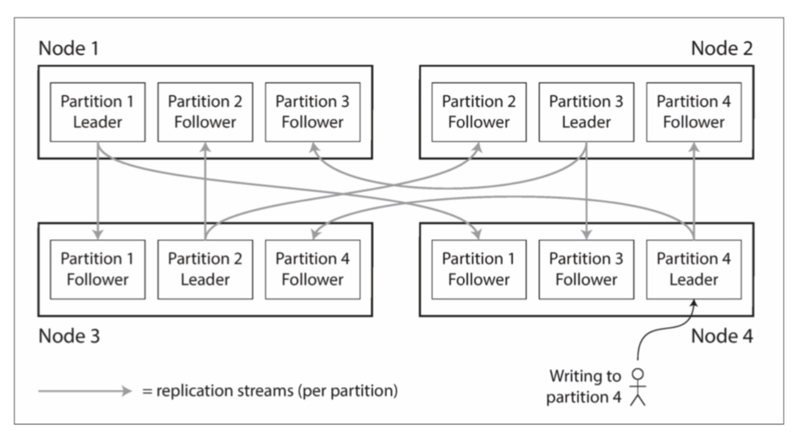
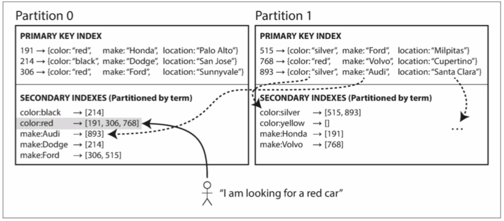

# 分区
这里的分区（partitions），也称为分片（sharding），是将大型数据库分解成小型数据库的方式。需要和网络分区（net splits）区分开，这是一种节点之间网络中的一种故障类型。

分区主要是为了可扩展性，不同的分区可以放在不共享集群中的不同节点上，因此大数据集可以分布在多个磁盘上，并且查询负载可以分布在多个处理器上。

## 分区与复制
分区通常与复制结合使用，使得每个分区的副本存储在多个节点上。这意味着，即使每条记录属于一个分区，它仍然可以存储在多个不同的节点上以获得容错能力。



## 键值数据的分区
如何决定哪些节点上存储哪些记录呢？分区的目标是将数据和查询负载均匀的分布在各个节点上。

如果分区不公平，则有些分区会比其他分区有更多的数据或查询，这称之为偏斜（skew）。

### 根据键的范围分区
一种分区的方式是为每个分区指定一块连续的键范围。例如数据库中主键id由1-1000的在分区1,1001-2000的在分区2。

即使如此，键的范围可能还是不一定均衡。例如有800个id小于1000的分布在分区1，是有200个1001-2000的分布在分区2。这就导致了分布不均，查询的时候也会造成负载不均衡。

### 根据键的散列分区
通过散列函数，将键散列后，分布在各个分区中。一旦你有一个合适的键散列函数，你可以为每个分区分配一个散列范围（而不是键的范围），每个通过哈希散列落在分区范围内的键将被存储在该分区中。

[WX20190815-233129@2x.png](../../images/WX20190815-233129@2x.png)

但是采用这种方式的分区，则没法进行范围查询了。

### 负载倾斜与消除热点
即使采用哈希分区的方式，也无法避免极端查询的情况。例如大批量读写操作都是针对同一个键，所有的请求都会被路由同一个分区中。典型的场景就是某个明星发布了一个消息，导致大量用户都去查询或者评论，那这个明星的id就会有大量的查询和写入。

目前数据库还没有方法来解决这种情况，只能在程序上解决。例如给一个火爆的主键，在开始或者结尾添加一个随机数。

但是这种方式，必须从所有主键分布中读取数据并将其合并。

## 分片与次级索引
主键索引能够准确唯一的定位数据，但是次级索引不具备这种能力，因此采用次级索引分区的话，它们不能整齐的映射到分区。有两种用次级索引对数据库进行分区的方法：
1. 基于文档的分区（document-based）
2. 基于关键词（term-based）

### 按文档的二级索引
首先需要先用主键索引对数据库进行分区，之后次级索引在每个分区中都对记录对应分区的主键id。


上图分区0是主键0-499的记录，分区1是500-999的记录，同时color是次级索引，当插入一条主键id是306，color是red的记录后，会在分区0添加一条记录，之后在color的id列表里加上306。

但是这种方式增加了查询的性能，在查询的时候需要查询所有分区，例如查询color为red时，需要查询0和1两个分区。

这种分区方式的次级索引，也称为本地索引（local index）。

### 根据关键词（Term）的二级索引
通过构建一个覆盖所有分区数据的全局索引，这样每个分区中的所有，不止会存储自己分区的主键索引id，还会存储其他分区的主键索引id。



首先规定首字母从a到r的颜色在分区0中，s到z的颜色在分区1中。假设要查找颜色为red的颜色，在在分区0中查找，查找到对应的主键id为191、306和768，而id为768的记录在分区1中，此时再到分区1找查找对应的记录。

这种索引就是关键词分区（term-partitioned），因为我们查找的关键词决定了索引的分区方式。

关键词分区的优点：读取更有效率，不需要分散/收敛所有分区。

关键词分区的缺点：
1. 写入速度较慢且较为复杂，因为写入单个文档现在可能会影响索引的多个分区（文档中的每个关键词可能位于不同的分区或者不同的节点上）。
2. 这种索引，可能分区的数据不是最新的，因为索引需要跨分区事务，而且并不是所有数据库都支持。另外很多时候更新通常是异步的，数据也会有一定的延迟。

## 分区再平衡
将负载从集群中的一个节点向另一个节点移动的过程称为再平衡（reblancing）。

再平衡最低要求：
1. 再平衡后，负载（数据存储，读取和写入）应该在集群中的节点之间公平地共享。
2. 再平衡发生时，数据库应该继续接受读取和写入。
3. 节点之间只移动必须的数据，以便快速平衡，并减少网络和磁盘I/O负载。

### 分区策略
#### 反面教材：hash mod N
将要分区的数据，提供一个哈希函数，对数据哈希后根据分区的数量进行取模，结果值就是对应的分区：
```
p = hash(key) mod N
```

这种方式，在调整分区的时候会很麻烦。例如有10个分区，则`hash(key) mod 10 = 6`，此时分区增加为11，则`hash(key) mod 11 = 7`，这时分区6的数据就都要迁移到7中来，这个过程是非常昂贵的。

#### 固定数量的分区
创建比节点更多的分区，并为每个节点分配多个分区，当有新的节点加入时，从旧的分区中抽取一部分分区到新的节点上。


一开始有4个节点，每个节点都有一些分区。当需要增加一个节点node4的时候，则可以从原先node0到node3中抽取一些分区出来到node4中。

删除节点也是同理，将待删除的节点中的分区添加到剩余的节点上。

这种方式，分区的数量不会改变，键所指定的分区也不会改变，唯一改变的就是分区所在的节点。而且这种变更不是即时的，需要一些时间，而旧的分区此时依然是读写的。

预估分区的数量是不容易的，
1. 如果分区非常大，再平衡和从节点故障恢复变得昂贵。
2. 如果分区非常小，则会产生太多的开销
3. 如果分区数量固定，但是变动数据非常大，性能也得不到保证。

#### 动态分区
当一个分区的数据超过一定限度，则自动分为两个分区。如果分区的数据被大量删除达到一个阈值，则可以和相邻的分区进行合并。

这样数据库一开始的时候只有一个分区，当数据不断增大后，就会自动拆分成两个分区，如此往复。而对于采用键范围的分区，需要提前知道键是如何分配的。

对于采用动态分区，内部也可以是范围和哈希分区，即范围达到一定程度后自动分区。

#### 按节点比例分区
分区数和节点数成正比，每个节点拥有固定数量的分区。分区的大小随着数据集的增大而增大，节点数量保持不变。增加节点时，分区变小。

当一个节点加入集群时，随机选择固定数量的现有分区进行拆分，然后占有这些拆分分区中每个分区的一半，剩余的分区留在原地。

随机选择分区边界要求使用散列的分区。

#### 运维：手动还是自动平衡
全自动交由系统来判断怎么分区，但是容易出现分配不均匀，导致网络或者节点负载过重，降低了性能。

因此可以通过系统分配分区，但是确定分区的时候，由人为进行再次确认，这样会好一些。

## 请求路由
请求的时候，需要知道请求哪个节点。因为随着分区重新平衡，分区对节点的分配也发生变化。这就涉及到服务发现。

1. 允许客户联系任何节点。如果该节点刚好有该请求的分区，则直接处理，否则将请求转发到适当的节点。
2. 将请求转发到路由层，由路由层判断应该在哪个节点，路由层不处理任何请求，仅做负载均衡
3. 客户端知道分区和节点的分配。


这些过程的实现都需要一种共识的协议，让所有节点和路由知道节点的变化。

对于zookeeper来说，每个节点上线会先去它那里注册自己，zookeeper就维护了一个分区和节点的映射。而客户端或者路由层只需要去订阅zookeeper，就可以知道分区和节点信息。分区和节点发生变化时，也可以实时接收到变更信息。
