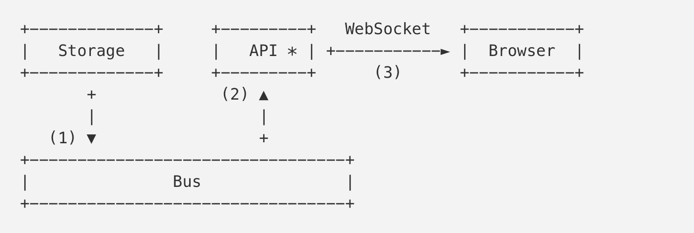

> 原文：https://medium.freecodecamp.org/million-websockets-and-go-cc58418460bb


# 1.介绍
在描述我们故事的上下文前，需要先解释下为什么我们需要这样一个服务。

Mail.Ru有很多有状态系统。用户邮件存储系统是其中一个。有很多方式可以跟踪系统状态的变化和系统事件。大部分都是通过定期轮询系统或者系统订阅的方式来实现状态的变化。

两种方式都有利和弊。但是对于邮件系统来说，应该是用户越快收到邮件越好。

邮件拉取涉及到每秒50000的http请求，但是有60%基本都是返回304状态，这意味着邮箱中是没有任何变化的。

因此，为了降低服务端的负载，和加快给用户发送邮件的速度，我们决定重新造轮子，写一个订阅/发布服务（就像众所周知的bus、message broker或者event channel），它会在一端当状态发生变化时触发推送，而另一端会订阅这个推送。

之前：  


现在：  


第一种方案展示的就是之前所说的，浏览器定期的轮询拉取api，询问存储器（邮箱服务）是否变化。

第二种方案描述了新的架构。浏览器通过订阅api建立一个WebSocket连接，它就是Bus服务的客户端。收到新的邮件后，存储器发送通知到Bus（1），Bus会相应的发送通知到它的订阅者（2）。API判断要接收通知的连接，将消息发送到用户的浏览器。

所以今天我们要聊的就是这个API或者WebSocket服务。进一步的，我会告诉你这个服务将会实现3百万的网络连接。

# 2.常用的方式
让我们来看看在没有任何优化的情况下，如何使用简单的go特性来实现服务器的某些部分。

在使用到`net.http`之前，我们先来说下如何发送和接收数据。构建在WebSocket协议之上的数据（例如JSON对象），在下文中将会被称之为包（packets）。

让我们开始先Channel结构，它包含了在WebSocket之上发送和接收包的逻辑。

## 2.1 Channel结构体
```go
// Packet 代表应用级别的数据
type Packet struct {
  ...
}

type Channel struct {
    conn  net.Conn    // WebSocket 连接
    send  chan Packet // 要发送的包队列
}

func NewChannel(conn net.Conn) *Channel {
    c := Channel{
        conn: conn,
        send: make(chan Packet, N)
    }

    go c.reader()
    go c.writer()

    return c
}
```

我希望你能注意到启动的读取和写入这两个goroutine。每个goroutine都需要有自己的内存堆栈，其初始大小大约为2-8KB，这取决于你的操作系统和GO的版本。

由于我们上面提到的会有3百万的连接数量，所有连接总共将会需要24GB的内存（4KB的堆栈大小）。而这还没包括为Channel分配的内存大小，对外发送的包`ch.send`还有其他内部属性。

## 2.2 I/O goroutine
让我们来看下“reader”的实现

```go
func (c *Channel) reader() {
    // 我们创建一个带缓冲功能的read，用于减少读取的系统调用
    buf := bufio.NewReader(c.conn)

    for {
        pkt, _ := readPacket(buf)
        c.handle(pkt)
    }
}
```

这里我们使用`bufio.Reader`来减少`read()`系统调用次数，也通过buf尽可能多的读取数据。在无限循环里，我们期望新的数据到来。请记住这句话：期望新的数据到来。我们等下还会回到这里。

我们将不考虑传入数据包的解析和处理，因为它对我们即将要讨论的优化并不重要。但是，buf值得我们关注：默认情况下，它是4KB，这意味着我们的连接还需要额外的12GB内存。对于“writer”也有一样的处境。

```go
func (c *Channel) writer() {
    buf := bufio.NewWriter(c.conn)
    
    for pkt := range c.send {
        _ := writePacket(buf, pkt)
        buf.Flush()
    }
}
```

我们遍历包发送管道`c.send`，然后将其写入buffer中。正如我们细心的读者已经猜到的那样，这是我们300万个连接的另外4KB和12GB内存。

## 2.3 HTTP
我们已经具备一个简单的`Channel`，现在我们需要有WebSocket连接和它一起工作。由于我们还处在常用的方式标题下，让我们以相应的方式来做。

> 注意：如果你不了解WebSocket是如何工作的，可以这么说，客户端切换为WebSocket协议是通过具体的http机制，即Upgrade实现的。在成功处理Upgrade请求后，服务端和客户端就通过TCP连接来交换二进制WebSocket数据帧。[这里](https://tools.ietf.org/html/rfc6455#section-5.2)有篇文章描述了连接中帧的结构。

```go
import (
    "net/http"
    "some/websocket"
)

http.HandleFunc("/v1/ws", func (w http.ResponseWriter, r *http.Request) {
    conn, _ := websocket.Upgrade(r, w)
    ch := newChannel(conn)
}) 
```
