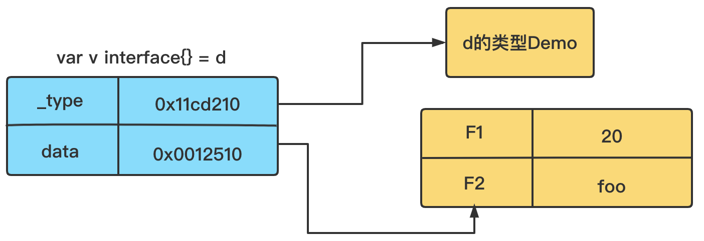
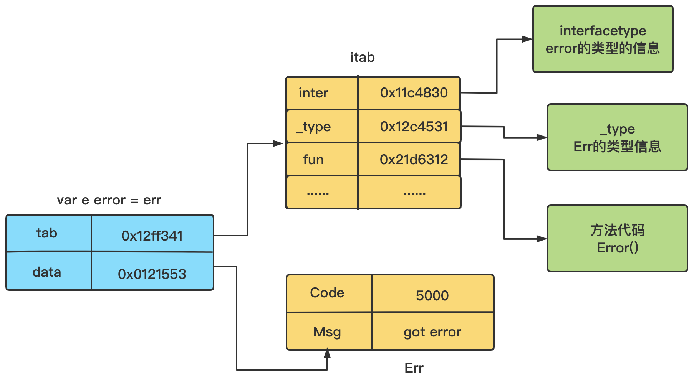

# 从一个例子聊聊Go的接口

## 一个有问题的案例

我们知道，go语言里，一个类型（例如结构体），在实现一个接口的时候，只需要其实现了这个接口里的所有方法，那么就算实现了该接口，而不需要像其他语言（例如java）一样显示的去声明实现某个接口。这种无侵入式的接口实现方式，也叫做“Duck typing”。

在接手一个项目时，曾遇到过这么一个问题，直接看代码

```go
type Err struct {
 Code  int32
 Msg   string
}

func (e *Err) Error() string {
 return fmt.Sprintf("[%d] %s", e.Code, e.Msg)
}
```

从上述代码段能知道，以上Err结构体实现了`error`接口。

在项目代码中，存在这样的函数代码：

```go
func someHandler() Err {
    ...
} 
```

虽然同样是返回错误，但是笔者觉得不是很优雅，于是在一次实现需求的时候，写了个类似这样的函数：

```go
func someNewHandler() error {
    // do some thing
    ...

    var err *Err
    if badCase() {
        err = &Err{Code: 5000, Msg:"got error"}
        return err
    }

    return err
}
```

之后在调用该函数的时候，这么写到：

```go
func Do() {
    err := someNewHandler()
    if err != nil {
        log.Errorf("error:%+v\n", err)
        // handle error...
        return
    }

    // do other things
    ...

    return
}
```

到这里，无论someHandler函数是否返回错误（无论这里的badCase()返回的是true还是false），Do中都是会进入错误处理逻辑。即只会打出如下日志：

```bash
error:<nil>
```

当时调试了很久，最终才发现是这块逻辑（someNewHandler）的问题。问题的根本还是对接口的认识不足，导致在这里栽了跟头。要想明白这里的缘由，就必须去了解接口的内部实现。

## 接口类型

在go中除了提供了我们上述提到的包含一些方法的接口类型之外，还提供了一种不带任何方法的接口类型，例如如下所示的接口：

```go
func Print(v interface{}) {
    log.Println(v)
}

type Demo struct {
    F1 int
    F2 string
}
func main() {
    d := Demo{
        F1: 20,
        F2: "foo",
    }
    Print(d)
}
```

这种接口类型可以让我们定义不限类型的参数。

现在我们知道接口类型有：

* 携带一个或者多个方法的接口
* 不带任何方法的接口

这两种类型的接口在go中对应的源码定义如下（源码位置$GOROOT/src/runtime/runtime2.go）：

```go
type iface struct {
    tab *itab
    data unsafe.Pointer
}

type eface struct {
    _type *_type
    data unsafe.Pointer
}
```

* iface，定义的是拥有方法的接口类型
* eface，定义的是不带方法的接口类型

两者的共同部分为data，是个指针字段，该字段会指向赋值给这个接口类型变量的动态类型的值。接下来先从简单一些的无方法的接口类型开始介绍。

### eface

```go
type eface struct {
    _type *_type
    data unsafe.Pointer
}

// 源码位置：$GOROOT/src/runtime/type.go
type _type struct {
    // 存储了类型占用的内存空间，为内存空间的分配提供信息
    size       uintptr
    ptrdata    uintptr // size of memory prefix holding all pointers
    // 能够帮助快速确定类型是否相等
    hash       uint32
    tflag      tflag
    align      uint8
    fieldAlign uint8
    kind       uint8
    equal func(unsafe.Pointer, unsafe.Pointer) bool
    gcdata    *byte
    str       nameOff
    ptrToThis typeOff
}
```

我们将上述案例代码调整一下作为例子

```go
type Demo struct {
    F1 int
    F2 string
}
func main() {
    d := Demo{
        F1: 20,
        F2: "foo",
    }
    var v interface{} = d
    log.Println(v)
}
```

将该例子对应到eface结构上的话，大概如下图所示：


### iface

```go
type iface struct {
    tab *itab
    data unsafe.Pointer
}

type itab struct {
    inter *interfacetype
    _type *_type
    hash  uint32 
    _     [4]byte
    fun   [1]uintptr
}

// 源码位置：$GOROOT/src/runtime/type.go
type interfacetype struct {
    typ _type
    pkgpath name
    mhdr []imethod
}
```

* inter字段，存储该接口类型自身的信息
  * typ，类型信息
  * pkgpath，包路径名
  * mhdr，接口方法集合切片
* 其中hash字段是对_type.hash字段的的拷贝，用于类型转换时的快速判断。当想要将interface类型转化成具体的类型时，可以使用该字段快速判断目标类型和具体类型是否一致
* _type和eface类型，存储了接口类型变量的动态类型的信息
* fun则记录了动态类型已实现的接口方法的调用地址数组

现在我们把文章开头的Err结构体作为例子来说明下

```go
type Err struct {
 Code  int32
 Msg   string
}

func (e *Err) Error() string {
 return fmt.Sprintf("[%d] %s", e.Code, e.Msg)
}

func main() {
    err := Err{
        Code: 5000,
        Msg: "got error",
    }
    var e error = err
    fmt.Println(e.Error())
}
```

将该例子对应到iface结构上的话，大概如下图所示：


### iface和eface的案例分析

通过上面的示例和示意图我们能知道，无论是iface和eface类型：

* 其tab和_type都是用来表示其动态类型的信息（如上述的Err和Demo结构体的信息）。
* 而data指向的内存空间则是用来存储其动态类型变量的值，即动态值（如上述结构体实例err和d中的值）

这里我们需要再解释下动态类型和动态值的概念，当然对应的就是静态类型：

* 动态值，赋值给这个接口类型的值，如err值
* 动态类型，这个动态值的类型，如Err结构体这个类型，当然也可以是go中基本数据类型
* 静态类型，可以认为就是这个接口类型，如error接口

有了这些概念，我们便有了如下结论：

* 当需要判断一个接口类型的变量是否为nil时，必须是tab/_type和data均为nil时才能成立。
* 当需要判断两个接口类型的变量是否相等时，则需要判断tab/_type和data指针指向的内存空间所存储的数据值是否都相同（注意，不是data指针的值）

#### iface接口类型的示例

接下来一起来看个关于iface接口类型的例子：

```go
type Pet interface {
    Category() string
}

type Dog struct {
    Name string
}

func (dog Dog) Category() string {
    return "dog"
}

func main() {
    var dog *Dog 
    fmt.Printf("dog is nil:%t\n", dog==nil)

    var pet Pet
    fmt.Printf("pet is nil:%t\n", pet==nil)

    pet = dog
    fmt.Printf("pet is nil:%t\n", pet==nil)
}
```

上面的程序打印出来的结果是这样的：

```bash
dog is nil:true
pet is nil:true
pet is nil:false
```

如果已经理解了上面的知识，这里的结论就不难解释了。

第一个true不难理解，这里要明白的是后面两个关于pet变量是否为nil的问题。

我们知道这种类型的接口，采用的是iface结构的接口类型。

第一个判断pet是否为nil，由于此时pet还没有被赋值，此时iface的tab和data均为nil，因此pet即为nil。

第二个判断pet是否为nil前，将值还是为nil的dog对象赋值给pet，此时iface的tab中存储的类型（动态类型值）即为Dog结构体的信息，而由于dog还没被赋值过（值为nil），因此pet的iface中data的值仍然为nil。我们说过只有当tab和data均为nil时，接口对象才能为nil，因此这里打印出来的pet就不是为nil了。

接下来我们把上面的例子再修改下

```go
func main() {
    dog1 := Dog{"a little dog"}
    dog2 := Dog{"a little dog"}
    dog3 := Dog{"a big dog"}
    var pet1 Pet = dog1
    var pet2 Pet = dog2
    fmt.Printf("pet1 == pet2 :%t\n", pet1 == pet2)
    fmt.Printf("pet1 == pet3 :%t\n", pet1 == pet3)
}
```

上面的程序打印出来的结果是这样的：

```bash
pet1 == pet2 :true
pet1 == pet3 :false
```

这个结果的解释也很简单了。

pet1和pet2的两个接口类型变量中，iface的tab都是相同的，而且data中指针存储的值也都是相等的（都是“a little dog”），因此pet1和pet2是相等的。

而对于pet1和pet3，它们的data指针存储的值则是不相等的，因此pet1和pet3不相等。

到此为止，我们已经能够去解释文章开头中所遇到的问题了，让我们把那段问题代码再拿过来看一遍：

```go
func someNewHandler() error {
    // do some thing
    ...

    var err *Err
    if badCase() {
        err = &Err{Code: 5000, Msg:"got error"}
        return err
    }

    return err
}

func Do() {
    err := someNewHandler()
    if err != nil {
        log.Errorf("error:%+v\n", err)
        // handle error...
        return
    }

    // do other things
    ...

    return
}
```

这里someNewHandler()函数返回的是接口类型为**error**的接口。而我们在函数中定义了一个实际类型为**Err**的变量err，虽然一开始没有赋值，在badCase()返回false的情况下，**err**在函数的最后作为返回值返回了。

对于函数调用者来说，下面的代码等效了：

```go
e := someNewHandler()

// 上面的代码等效于
var err *Err
var e error = err
```

这就回到了我们这一节一开始的例子，此时iface的tab不为nil，而data为nil，因此e始终是不为nil的。

修改也很简单，直接把最后的`return err`改为`return nil`即可。

#### eface接口类型的示例

理解了iface，再理解eface已经不是什么难事，这里也通过个示例来巩固下理解。

在给出示例前，先思考下，在go里，iface和eface都是runtime包内部的非导出结构体，有没什么办法可以让我们获取这两个结构体的值呢。

其实是有的，go中提供了内置函数println用于输出iface和eface两个指针的值，编译器其会根据要要输出的参数类型替换为特定的函数，如果是iface和eface类型，他们的打印函数如下（路径为：$GOROOT/src/runtime/print.go）：

```go
func printeface(e eface) {
        print("(", e._type, ",", e.data, ")")
}

func printiface(i iface) {
        print("(", i.tab, ",", i.data, ")")
}
```

有了这个辅助函数，我们来看下如下的示例

```go
func main() {
    var ef1 interface{}
    var ef2 interface{}
    var a, b = 10, 20

    ef1 = a
    ef2 = b
    println("ef1:", ef1)
    println("ef2:", ef2)
    println("ef1==ef2:", ef1 == ef2)

    fmt.Println()

    ef2 = 10
    println("ef1:", ef1)
    println("ef2:", ef2)
    println("ef1==ef2:", ef1 == ef2)

    fmt.Println()

    ef2 = int64(10)
    println("ef1:", ef1)
    println("ef2:", ef2)
    println("ef1==ef2:", ef1 == ef2)
}
```

示例的输出值类似如下

```bash
ef1: (0x485820,0xc00009af68)
ef2: (0x485820,0xc00009af60)
ef1==ef2: false

ef1: (0x485820,0xc00009af68)
ef2: (0x485820,0x4b27f8)
ef1==ef2: true

ef1: (0x485820,0xc00009af68)
ef2: (0x4858e0,0x4b27f8)
ef1==ef2: false
```

第一部分的输出值中，ef1和ef2的 **_type** 字段的指针值都是相同的（0x485820），这是因为a和b的类型都为int。而它们的data指针指向的数据内容是不同的（分别为10和20），因此ef1和ef2是不相等的。

第二部分的输出值中，**_type**字段的指针值仍然相同，但是data指针指向的数据内容是相同的（都是int类型的10），因此虽然data指针值不相同，但是ef1和ef2就是相等的。

第三部分的输出值中，由于ef2被赋予了一个int64类型的值，导致了 **_type** 字段的指针值是不同的，因此不管data指针如何，ef1和ef2就是不相等的。

这里我们发现第二部分和第三部分的ef2变量中，明明我们是重新采用不同的类型值进行赋值，但其data指针值却都是相同的（0x4b27f8）。

一般来说，go在创建eface的时候，是会为data重新分配空间的，再把动态类型的值赋值到这个空间下面。因此大多数情况下，我们看到的data指针值都是不同的。但是data分配规则，go是会进行优化的，不一定每次都要创建一个新空间，因此便有了上面指针值相同的问题。

## 总结

现在我们知道，要判断一个接口类型的变量是否为nil，不能简单的通过我们的肉眼直觉去判断。

这里对go的接口做个简单的总结，接口类型包含：

* 带有方法的接口，底层结构为iface，包含如下两个指针字段
  * tab，记录了动态类型相关的一系列信息
  * data，记录了动态值的数据
* 不带有方法的接口，底层结构为eface，包含如下两个指针字段
  * _type，和iface的tab类似，记录了动态类型的信息
  * data，记录了动态值的数据

在做接口类型变量的判断时，需要记住：

* 接口类型的变量是否为空时，必须tab/_type和data均为空
* 两个接口类型的变量是否相等，必须tab/_type和data指针指向的空间存储的数据值均相等
