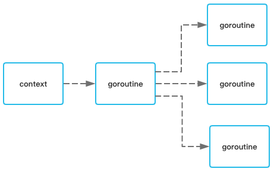
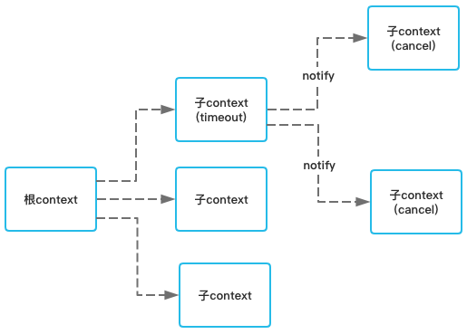
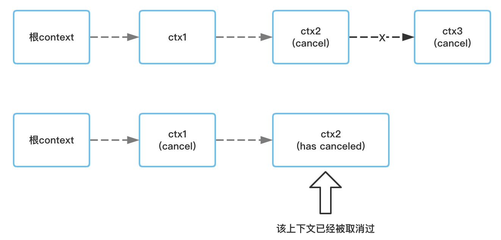

# 深入理解Go Context
[TOC]


## 什么是context？

在go语言中，提供了context来为上下文建立联系，最常用的就是在不同协程调用间建立取消和超时机制，也可以用于传递相关值。

可以看下在go的源码中是如何描述context的。

```
A Context carries a deadline, a cancellation signal, and other values across
```

翻译过来，Context就是携带了超时时间、取消信号和值的一种结构。



如上图所述，举一个我们最常见的web开发为例子。在Go语言中，当客户端的请求进到服务器时，服务器端会开辟一个协程进行处理。有时在处理的过程中，我们还需要创建其他协程来进行其他的并发任务。为了能在多个协程间建立联系，便可以使用context。

在接收到请求后，创建一个context作为根context，当需要创建更多的协程时，则基于这个根context来创建子context，并且将根context的信息携带给子context。同理子context也可以创建更多的自己的子context给后续创建的协程。当其中有一个父协程处理超时，可以通知自己下面的所有子协程，这样这些子协程也不用再继续自己的任务，避免浪费资源和性能。



从图中可见，根context的第一个子context执行超时了，它后续的所有子context都能接收到context被取消的通知，进而取消自己的context。

## 深入context源码

在go中，提供了几种不同类型的context，他们都实现了`context.Context`接口。

```go
type Context interface {
	Deadline() (deadline time.Time, ok bool)
	Done() <-chan struct{}
	Err() error
	Value(key interface{}) interface{}
}
```

* Deadline，返回context被取消的时间，当context没有设置取消时间时，ok则等于false；
* Done，会返回一个channel，这个channel会在任务完成或上下文被取消后关闭，多次调用会返回相同的channel；
* Err，会返回context结束的原因，在Done方法对应的channel还没关闭时，返回nil。在Done方法对应的channel已经关闭，返回非nil
  * 如果context是被取消的，则返回Canceled错误
  * 如果context是超时的，则返回DeadlineExceeded错误
* Value，可以从context中获取key对应的值，可以用来在不同的context间传递数据；

接下来我们来看下go语言提供的几种context类型

### context.Background和context.Todo

首先是`context.Backgrouond`和`context.Todo`，这两个context是我们最常用的context，两者其实都是返回的go中预先初始化好的context对象。

```go
var (
	background = new(emptyCtx)
	todo       = new(emptyCtx)
)

func Background() Context {
	return background
}

func TODO() Context {
	return todo
}
```

从源码中可以看到两者都是`emptyCtx`这个结构体的实例，而emptyCtx其实是Context接口的简单实现。

```go
type emptyCtx int

func (*emptyCtx) Deadline() (deadline time.Time, ok bool) {
	return
}

func (*emptyCtx) Done() <-chan struct{} {
	return nil
}

func (*emptyCtx) Err() error {
	return nil
}

func (*emptyCtx) Value(key interface{}) interface{} {
	return nil
}

func (e *emptyCtx) String() string {
	switch e {
	case background:
		return "context.Background"
	case todo:
		return "context.TODO"
	}
	return "unknown empty Context"
}
```

emptyCtx中的方法对Context接口的实现都返回了空值。Background和Todo可以认为就是互为别名，基本没有差别，很多时候互用也没有任何关系。但是go在源码中两者的注释上还是给做了解释：

* context.Background，是上下文默认值，一般用在主函数（入口函数）或者最初的根context，其他所有的context上下文都是基于它创建出来
* context.Todo，仅在不知道使用哪种context时使用

### context.WithValue

WithValue可以用于在父子上下文之间传递值，它会基于父上下文创建一个类型为`valueCtx`的子上下文，先看下使用的方式。

```go
ctx := context.Background()
valCtx := context.WithValue(ctx, "foo", "bar")
fmt.Println(valCtx.Value("foo")) // bar
```

接下来来看下源码：

```go
func WithValue(parent Context, key, val interface{}) Context {
	if parent == nil {
		panic("cannot create context from nil parent")
	}
	if key == nil {
		panic("nil key")
	}
	if !reflectlite.TypeOf(key).Comparable() {
		panic("key is not comparable")
	}
	return &valueCtx{parent, key, val}
}

type valueCtx struct {
	Context
	key, val interface{}
}

func (c *valueCtx) Value(key interface{}) interface{} {
	if c.key == key {
		return c.val
	}
	return c.Context.Value(key)
}
```

实现比较简单，valueCtx自己没有实现Err、Deadline等方法，而是代理到父上下文中。在使用value查找key对应的值时，如果没找到，就会从父上下文中查找，直某个父上下文中返回nil或者找到对应的值。

在key的使用上，必须是可以比较的key。虽然可以使用基本数据类型，如string、int等其他内置的基本类型作为key，但是为了防止key碰撞，不建议这么使用。

以上面的使用示例为例子

```go
valCtx := context.WithValue(ctx, pkg1.Foo, "bar")

valCtx := context.WithValue(ctx, pkg2.Foo, "bar")
```

这里`pkg1.Foo`和`pkg2.Foo`的值都是foo，导致用两个不同包的变量都能取到相同的值。

因此为了防止碰撞，最好的实践方式就是为key定义单独的类型，这个类型可以是string、int等基本类型，不过一般建议是struct，空的结构体不占用空间。

```go
// type ctxKey string
type ctxKey struct{}
var (
  Foo = ctxKey("foo")
  Foo = ctxKey{}
)

valCtx := context.WithValue(ctx, pkg.Foo, "bar")
```

这时即使其他包也存在类型为struct的ctxKey，也不会相等，即`pkg1.Foo!=pkg2.Foo`。

### context.WithCancel

WithCancel能够基于给定的context中派生出一个能够被取消的context上下文。一旦该context被取消，其所有子context都会被取消。

先看下使用方式：

```go
func demo(ctx context.Context) {
  ctx, cancel = context.WithCancel(ctx)
  defer cancel()
  
  go doSomething1(ctx)
  go doSomething2(ctx)
}
```

接下来看下源码实现。

```go
// 当context被取消时，则会返回这种错误
var Canceled = errors.New("context canceled")

func WithCancel(parent Context) (ctx Context, cancel CancelFunc) {
	if parent == nil {
		panic("cannot create context from nil parent")
	}
	c := newCancelCtx(parent)
	propagateCancel(parent, &c)
	return &c, func() { c.cancel(true, Canceled) }
}

func newCancelCtx(parent Context) cancelCtx {
	return cancelCtx{Context: parent}
}

type cancelCtx struct {
	Context

	mu       sync.Mutex            
	done     chan struct{}         
	children map[canceler]struct{} 
	err      error                 
}
```

理解WithCancel非常重要，因为后续的几种类型的context都是基于它实现的。

首先它会采用newCancelCtx创建一个cancelCtx结构体的实例，注意这个实例中保存了父context对象。同时cancelCtx实现了一个叫`canceler`的接口。

```go
type canceler interface {
  // removeFromParent 是否将上下文从父上下文中移除
  // err 上下文被取消的错误
	cancel(removeFromParent bool, err error)
	Done() <-chan struct{}
}
```

只要实现了canceler的context就能够拥有取消上下文的功能。也就是说cancelCtx实现了Context接口和canceler接口。

先来看看cancelCtx是如何实现canceler接口的。

```go
// 这种定义context value的key的方式非常重要
var cancelCtxKey int

func (c *cancelCtx) Value(key interface{}) interface{} {
	if key == &cancelCtxKey {
		return c
	}
	return c.Context.Value(key)
}

func (c *cancelCtx) Done() <-chan struct{} {
	c.mu.Lock()
	if c.done == nil {
		c.done = make(chan struct{})
	}
	d := c.done
	c.mu.Unlock()
	return d
}

func (c *cancelCtx) cancel(removeFromParent bool, err error) {
	if err == nil {
		panic("context: internal error: missing cancel error")
	}
	c.mu.Lock()
	if c.err != nil {
		c.mu.Unlock()
		return // c.err非空时，说明该cancelContext已经被取消了
	}
	c.err = err
	if c.done == nil {
		c.done = closedchan // 将一个已经被关闭的channel赋值给done
	} else {
    close(c.done) 
	}
	for child := range c.children {
		// 将该context下的所有子上下文全部取消
    // 注意这里第一个参数是false，即不会断开子上线对应父上下文的关联，这个断开关联的操作会由父节点来做
		child.cancel(false, err)
	}
	c.children = nil //这里来断开与子上下文的关联
	c.mu.Unlock()

	if removeFromParent { 
		removeChild(c.Context, c) // 将该context从父上下文中移除。c.Context，就是其父上下文对象
	}
}

func (c *cancelCtx) Err() error {
	c.mu.Lock()
	err := c.err
	c.mu.Unlock()
	return err
}

func removeChild(parent Context, child canceler) {
  // 只有当父上下文是个cancelCtx时，且还没
	p, ok := parentCancelCtx(parent)
	if !ok {
		return
	}
	p.mu.Lock()
	if p.children != nil {
		delete(p.children, child)
	}
	p.mu.Unlock()
}
```

* `Value()`，在遇到key是cancelCtxKey时，就返回它自己。如果不是，则从父上下文查找
* `Done()`，会返回一个非空的channel
* `cancel()`，会关闭c.done这个channel，也会将该context的所有子上下文全部关闭
* `Err()`，返回当前上下文的错误

上面说道，当一个上下文被取消后，需要取消下面的所有子上下文。除此之外，还需要断开与自己的父上下文的关联，目的是为了避免祖宗节点也取消上下文后重复的向下面的已经取消了的子节点发送取消信号。



图里，如果ctx2被取消后，只断开了和ctx3的联系，而之后ctx1也取消了，便会导致取消信号也传递到了ctx2。

是否和父上下文断开，采用了cancel函数的第一个bool参数来控制。也就是说，只有父节点是一个**可取消**的的父上下文时，才会执行断开（即上述源码中的delete操作）。

在断开上下文间的关联时，还出现了一个重要的函数`parentCancelCtx()`，这个函数go早期版本的实现会比较容易理解

```go
func parentCancelCtx(parent Context) (*cancelCtx, bool) {
 	for {
  	switch c := parent.(type) {
  	case *cancelCtx:
   		return c, true
  	case *timerCtx:
   		return &c.cancelCtx, true
  	case *valueCtx:
   		parent = c.Context
  	default:
   		return nil, false
  	}
 	}
}
```

很明显，parentCancelCtx函数的作用就是寻找parent中最近的一个可取消的父节点。

在后续的版本中，可能觉得用循环的方式性能较差，修改了这块的实现，现在这个函数的实现方式是这样的：

```go
// closedchan 代表一个被关闭的channel
var closedchan = make(chan struct{})
func init() {
	close(closedchan)
}

func parentCancelCtx(parent Context) (*cancelCtx, bool) {
	done := parent.Done()

	if done == closedchan || done == nil { 
    // 如果父上下文已经被取消了，或者不是个可取消的上下文，则直接返回
		return nil, false 
	}
  
  // 通过value，逐层向上查找，直到找到cancelCtx类型的context为止
	p, ok := parent.Value(&cancelCtxKey).(*cancelCtx)
	if !ok {
		return nil, false
	}
	p.mu.Lock()
	ok = p.done == done // 这里判断是否是自己的父节点，或者父节点是不是自定义的context
	p.mu.Unlock()
	if !ok {
		return nil, false
	}
	return p, true
}
```

即使通过`parent.Value(&cancelCtxKey).(*cancelCtx)`获取到父节点是一个cancelCtx上下文时，除了判断是否是自己的父节点时，还需要判断是否是自定义的context，因为也存在这样一种场景，会使得parent.Value获取到的也是个cancelCtx，但是它实际上不是个cancelCtx。

```go
type FakeContextCancel struct {
	context.Context
}

func (*FakeContextCancel) Done() <-chan struct{} {
	ch := make(chan struct{}, 100)
	return ch
}

func main() {
	ctx := context.Background()
	ctx1, _ := context.WithCancel(ctx)
	ctx2 := ContextCancel{ctx1}
	ctx3, c := context.WithCancel(&ctx2)
  fmt.Println(ctx3)
	c()
}
```

这里的FakeContextCancel里匿名包裹了一个context，在main函数中，我们将一个可取消的上下文ctx1赋值给了这个匿名的context。因此当调用ctx3这个上下文的父节点的Value方法时，也就是ctx2的Value方法，会直接调用其匿名Context实例的Value方法，也就是会调用ctx1的Value方法，最终返回一个可取消的上下文cancelCtx。

现在我们知道cancelCtx是如何实现上下文取消了，接下来继续看WithCancel后续的逻辑，我们再把那段代码贴出来。

```go
func WithCancel(parent Context) (ctx Context, cancel CancelFunc) {
	if parent == nil {
		panic("cannot create context from nil parent")
	}
	c := newCancelCtx(parent)
	propagateCancel(parent, &c)
	return &c, func() { c.cancel(true, Canceled) }
}
```

WithCancel在创建完cancelCtx对象后，会调用propagateCancel函数，目的是建立父子上下文之间的联系。当父context被取消时，这个被创建的子context也会被取消。

```go
func propagateCancel(parent Context, child canceler) {
	done := parent.Done()
	if done == nil {
    // 说明父上下文不会有取消信号，例如通过Background和Todo创建的context上下文
    // 因此不需要与父上下文建立联系
		return 
	}

	select {
	case <-done:
		// 父上下文已经被取消，子上下文也要执行取消操作
		child.cancel(false, parent.Err())
		return
	default:
	}

	if p, ok := parentCancelCtx(parent); ok {
		p.mu.Lock()
		if p.err != nil {
			// 父上下文已经被取消，取消子上下文
			child.cancel(false, p.err)
		} else {
      // 将child上下文加入的parent节点上
      // 这里所有的子context节点采用了map来维护，其中map的key为canceler接口
      // 也就是只有实现了canceler接口的context才能被加入到该children map集合中
			if p.children == nil {
				p.children = make(map[canceler]struct{})
			}
			p.children[child] = struct{}{}
		}
		p.mu.Unlock()
	} else { 
    // 父上下文是开发者自定义的类型
    // 开启一个新的协程，监听父子上下文取消的信号
		atomic.AddInt32(&goroutines, +1)
		go func() {
			select {
			case <-parent.Done(): // 当父上下文取消时，则取消子上下文
				child.cancel(false, parent.Err())
			case <-child.Done(): // 子上下文被取消，什么也不干，让调用者自己调用取消函数
			}
		}()
	}
}
```

有了前面的基础，理解propagateCancel就好多了。它也会通过parentCancelCtx来判断父上下文是否是一个可取消的上下文。当不是的时候，则会开启一个协程去监听自己和父上下文的取消信号。

### context.WithDeadline

有了上面的基础，理解接下来的两种上下文就不会有难度了。`context.WithDeadline()`和`context.WithTimeout()`也都能创建可以被取消的上下文。这里先讲`context.WithDeadline()`，它可以用于创建一个到达指定时间后能被自动取消的上下文。

看下使用方式，创建一个1分钟后便会超时取消的上下文：

```go
func demo(ctx context.Context) {
	t := time.Now().Add(time.Minute)
	ctx, cancel = context.WithDeadline(ctx, t)
  defer cancel()
  
  go doSomething1(ctx)
  go doSomething2(ctx)
}
```

接下来看下源码实现

```go
func WithDeadline(parent Context, d time.Time) (Context, CancelFunc) {
	if parent == nil {
		panic("cannot create context from nil parent")
	}
	if cur, ok := parent.Deadline(); ok && cur.Before(d) {
		// 父上下文的超时时间早于这次要设置的超时时间d，则基于父上下文返回一个可取消的上下文对象
		return WithCancel(parent)
	}
	c := &timerCtx{
		cancelCtx: newCancelCtx(parent), // 基于父上下文返回一个可取消的上下文对象
		deadline:  d, // 超时时间
	}
	propagateCancel(parent, c) // 关联父子上下文
	dur := time.Until(d)
	if dur <= 0 {
		c.cancel(true, DeadlineExceeded) // 当前时间已经超过指定的超时时间，执行上下文取消
    // 这里返回的上下文是一个已经被取消的上下文
		return c, func() { c.cancel(false, Canceled) }
	}
	c.mu.Lock()
	defer c.mu.Unlock()
	if c.err == nil {
		c.timer = time.AfterFunc(dur, func() {
      // dur时间后，会调用cancel方法
			c.cancel(true, DeadlineExceeded)
		})
	}
	return c, func() { c.cancel(true, Canceled) }
}

type timerCtx struct {
	cancelCtx
	timer *time.Timer

	deadline time.Time
}
```

timerCtx定义了一个超时的定时器timer，在到达指定时间后，便会取消上下文。

```go
func (c *timerCtx) Deadline() (deadline time.Time, ok bool) {
	return c.deadline, true
}

func (c *timerCtx) cancel(removeFromParent bool, err error) {
	c.cancelCtx.cancel(false, err)
	if removeFromParent {
		removeChild(c.cancelCtx.Context, c)
	}
	c.mu.Lock()
	if c.timer != nil {
		c.timer.Stop()
		c.timer = nil
	}
	c.mu.Unlock()
}
```

timerCtx的取消逻辑也很简单，一方面调用cancelCtx的cancel取消上下文，另一方面将timer停止。

### context.WithTimeout

和WithDeadline()类似，WithTimeout也是可以用于创建一个可取消的上下文，不同的就是WithDeadline指定的是一个具体的超时时间，而WithTimeout指定的是距离现在多少时间后超时。

```go
func demo(ctx context.Context) {
	ctx, cancel = context.WithTimeout(ctx, 30 * time.Second)
  defer cancel()
  
  go doSomething1(ctx)
  go doSomething2(ctx)
}
```

这里设定了30秒后，上下文便会超时，接下来看下源码实现。

```go
func WithTimeout(parent Context, timeout time.Duration) (Context, CancelFunc) {
	return WithDeadline(parent, time.Now().Add(timeout))
}
```

可以看到，WithTimeout实际上调用的也是WithDeadline()，返回的也就是timerCtx，所有的行为也都和timerCtx一样。

至此，基本上所有的context都已经阐明了，接下来我们来看看如何正确使用context。

## 正确使用Context

### RPC设计原则

我们在设计rpc的api的时候，应该具备如下能力：

1. 每一个RPC调用都应该有超时退出的能力
2. 超时之后，还需要有能力去结束那些不再需要操作的行为

基于这个原则，我们在接收到请求后，可以采用context.Background()创建整个请求链路中的第一个context上下文。这里需要记得，是每一次请求都创建一个，而不能全局维护一个。接下来我们可以基于这个context创建一个携带超时时间的上下文，后续调用相关的api时，如调用其他的api接口或者发起数据库访问，都应该调用具有context参数的函数。

```go
func QueryUserNameById(ctx context.Context, userID int) {
  ctx, cancel := context.WithTimeout(ctx, 15 * time.Second())
  defer cancel()
 
  conn := db.GetConn()
  sql := "select name from user where id=?"
  rows, err := conn.QueryCtx(ctx, sql, userID)
  // ...
}
```

有几点需要注意的：

1. 要将context作为函数参数传递，一般是第一个参数，不建议将context作为struct的结构体的字段来传递
2. 函数执行结束后，就应该结束context，即调用cancel取消上下文

### context.WithValue使用原则

前面我们已经讲过在使用context.WithValue的时候，key应该如何设计，这里还是需要多提一次。

从context的源码可以看出，context是immutable，即不可变的，即使采用WithValue为context设置一个key value，也是会派生出一个新的context，并将该key value绑定在该新context上。

为了更加严格的约束key的使用，最好的方式是将key作为私有变量，采用Getter和Setter的方式来操作key value。

```go
type ctxKey struct{}

var ctxReqID = ctxKey{}

func WithReqID(ctx context.Context, reqID string) context.Context {
  return context.WithValue(ctx, ctxReqID, reqID)
}

func GetReqID(ctx context.Context) (string, bool) {
  reqID, exist := ctx.Value(ctx, ctxReqID)
  return reqID, exist
}
```

另一方面，value也应该是immutable的，即不能先设置了一个值，在后续中又对该值进行改变，这是不合理的。也不要想着，在给一个context设置了超时后，企图在后续中去修改这个超时时间。这些是使用context都要遵守的法则。

基于这个法则，我们对存储在context中的value也有了约束：

* context伴随请求的生命周期，请求开始则开始创建，请求结束则全部销毁
* 这些值也应该是从请求衍生出来的，请求结束后值也应该被销毁，如请求id，或者被记录日志用的用户id

### go http请求是如何实现超时控制的

在日常开发中，经常会发起一个http请求对其他服务的接口进行调用，go中允许我们传入一个超时时间，如果达到超时时间后还没有返回则会返回错误。

```go
client := http.Client{
	Timeout: time.Duration(timeout) * time.Millisecond,
}
client.Do(req)
```

在Do方法的源码中，最终是如下方式实现了超时控制（这里为了方便理解，删除了一些不必要的代码）

```go
func setRequestCancel(req *Request, rt RoundTripper, deadline time.Time) (stopTimer func(), didTimeout func() bool){
  ...
  
  if req.Cancel == nil && knownTransport {
		// If they already had a Request.Context that's
		// expiring sooner, do nothing:
		if !timeBeforeContextDeadline(deadline, oldCtx) {
			return nop, alwaysFalse
		}

		var cancelCtx func()
    // 此处根据我们设置的deadline创建了一个可超时取消的context
    // 并赋值给了req.ctx
		req.ctx, cancelCtx = context.WithDeadline(oldCtx, deadline) 
		return cancelCtx, func() bool { return time.Now().After(deadline) }
	}
  
  ...
}
```

可见它也是采用context实现的超时取消，最终实现超时控制的关键代码如下所示，同理删除了一些不影响理解的代码

```go
func (t *Transport) roundTrip(req *Request) (*Response, error) {
  ...
  
  for {
		select {
		case <-ctx.Done():
			req.closeBody()
			return nil, ctx.Err()
		default:
		}

		// treq gets modified by roundTrip, so we need to recreate for each retry.
		treq := &transportRequest{Request: req, trace: trace, cancelKey: cancelKey}
		cm, err := t.connectMethodForRequest(treq)
		if err != nil {
			req.closeBody()
			return nil, err
		}

		// Get the cached or newly-created connection to either the
		// host (for http or https), the http proxy, or the http proxy
		// pre-CONNECTed to https server. In any case, we'll be ready
		// to send it requests.
		pconn, err := t.getConn(treq, cm)
		if err != nil {
			t.setReqCanceler(cancelKey, nil)
			req.closeBody()
			return nil, err
		}

		var resp *Response
		if pconn.alt != nil {
			// HTTP/2 path.
			t.setReqCanceler(cancelKey, nil) // not cancelable with CancelRequest
			resp, err = pconn.alt.RoundTrip(req)
		} else {
			resp, err = pconn.roundTrip(treq)
		}
		if err == nil {
			resp.Request = origReq
			return resp, nil
		}

		// 请求发生错误，这里会判断是否需要重试，需要的话，则进入新的循环
	}
}
```

通过在一个for循环的一开始包裹一个select，先判断context是否超时，一旦超时则直接返回超时错误，如果没有超时则继续后续的处理逻辑。这种使用方式要记住，是一种通用的超时控制使用范式。

看到这里，其实还是会有疑惑，如果一开始context并没有超时，但是发起请求之后context就超时了，这里后续请求操作（roundTrip）是不是会继续发起，如果发起了是不是也就达不到超时取消的作用了。

所以带着这个疑问，我们看下roundTrip是如何实现的，挑其中一个pconn.roundTrip来看即可。

```go
func (pc *persistConn) roundTrip(req *transportRequest) (resp *Response, err error) {
  ...
  
  var respHeaderTimer <-chan time.Time
	cancelChan := req.Request.Cancel
	ctxDoneChan := req.Context().Done()
	pcClosed := pc.closech
	canceled := false
	for {
		testHookWaitResLoop()
		select {
		case err := <-writeErrCh:
		case <-pcClosed:
		case <-respHeaderTimer:
		case re := <-resc:
		case <-cancelChan:
		case <-ctxDoneChan:
		}
	}
}
```

在这里我们能看到，在roundTrip中使用了大量的管道channel，同时结合for循环+select的方式去监听req.Context()和其他channel的请求，如果上下文先超时了，自然提前返回了错误。