## tcp建立连接
tcp连接的建立需要经历”三次握手“的过程。过程和两端的状态如下

1. client端为closed状态，服务端为listen状态
2. client发送SYN包（值为j）到server端，此时client进入`SYN_SENT`状态，此为第一次握手。
3. server端收到SYN包后，发送一个ACK（值为seq+1）确认包和SYN（值为k）给client，此时server进入`SYN_RCVD`状态。此为第二次握手。
4. client收到SYN+ACK包后，向server发送一个ACK（值为k+1），此时客户端便进入`ESTABLISHED`状态。server收到ack包后也进入`ESTABLISHED`状态，完成第三次握手。

client和server两端状态变化如下：

client:  
CLOSED->SYN_SEND->ESTABLISH  
server:  
CLOSED->LISTEN->SYN_RECV->ESTABLISH

通过wireshark来看看实际的握手流程

首先通过`nc`工具监听一个端口
```bash
$ nc -lk 11100
```
接下来用`nc`作为客户端连接该端口
```bash
$ nc localhost 11100
```
接下来用wireshark抓包，如图:  
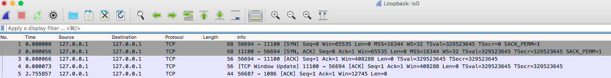

前三条数据，明显就是握手过程，需要注意的是，在wireshark的seq number是经过转化的相对数值。

#### 问题一：为什么是3次握手，不是2次或者4次呢？  
无论任何时候，我们都得假设网络是不可靠的，也就是说任何时候都可能丢包或者包延时到达。  
如果只通过两次握手，client发送一个A请求，由于网络原因，没有那么快送达server端。此时client便废弃该请求，重新发起请求B，请求B成功送达server端，并得到响应。  
如果此时便建立连接，若之前的请求A终于到达server端了，由于请求的格式都是正常的，于是也发送响应回去client，而client则认为该请求已经被废弃。于是server端就一直挂着这个请求，造成资源浪费。

那为什么不是4次或者5次呢？  
在客户端最后发完ack包后，服务端依旧可以回复一个ack的ack包，其实这是可以的，但是如此下去便进入一个死循环了，既然可以4次，也可以有40次、400次。  
在网络不可靠的前提下，即使在多次ack也无法保证是可靠的，因此也就没必要再多余的进行反复确认了。

#### 问题二：包的序号从0或者1开始么？  
包的序号不是从0后者1开始的，每个连接的起始序号都不一样。想象如下场景，A连上B后，给B发送了1、2、3个包，但是3号包绕路了，B一直没收到。  
此时A断线了，重连上B后，又发送了1、2号包，B也都收到了。此时那个绕路的3号包到达B了，B会认为它就是下一个包，于是发生了错误。

#### 问题三：如果服务端没有收到最后的ack包，客户端可以开始发数据么？
是可以的，而且实际上也是这么做的，因为客户端在收到服务端的syn和ack包后，就已经进入`ESTLIBASHED`状态，可以开始发数据。  
但是如果此时服务端一直没有收到ack包，那么通过滑动窗口机制，窗口大小会不断缩小，最终客户端会堵塞住，无法发包。   

#### 问题四：客户端尝试与服务器未对外提供服务的端口建立TCP连接，会怎么样？
```bash
nc 127.0.0.1 1100
```
这里我们请求去连接本地的1100端口，由于本地并没有监听该端口，肯定连不上，但是我们要看看具体收到什么数据
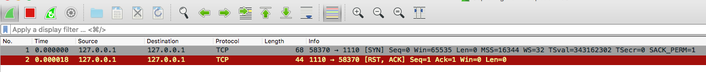
可以看到，服务端回复了一个叫`RST`的包给客户端，即`RESET`包。客户端收到该包就知道服务端无法建立连接了。


## tcp连接释放
Tcp释放连接的过程需要经历“四次挥手”的过程。
1. 由于服务端和客户端都可以主动断开连接，因此两端应该描述为发送方和接收方，此时两端状态均为`ESTLIBASHED`
2. 发送方发送一个FIN包给接收方，告诉对方要断开连接了，此时发送方进入`FIN_WAIT_1`状态
3. 接收方收到FIN包后，为了告诉发送方已经收到FIN包，于是发送ACK包给发送方，此时接收方进入`CLOSE_WAIT`状态
4. 发送方收到ACK包后，进入`FIN_WAIT_2`状态
5. 接收方在确认自己没有数据要发给发送方时，便会发送[FIN, ACK]包给发送方，告诉它我也要断开连接了，此时接收方进入`LAST_ACK`，等待发送方最后的ACK包
6. 发送方收到FIN包后，回复给接收方一个ACK包，此时自己进入`TIME_WAIT`状态，间隔2个MSL（Maximum Segment Lifetime，报文最大生存时间）后断开连接进入`CLOSED`状态。
7. 接收方收到ACK后，就进入`CLOSED`状态

因此发送方和接收方会经历如下状态的转移  
发送方:
FIN_WAIT_1->FIN_WAIT_2->TIME_WAIT->CLOSED  
接收方:
CLOSE_WAIT->LAST_ACK->CLOSED

同建立连接一个道理，基于网络不可靠的原因，最后接收方收到ACK后，如果再回复ACK的ACK，便进入死循环了，所以到收到ACK就完成断开了流程了。

同理，我们也通过wireshark看下具体连接断开的数据传输流程。
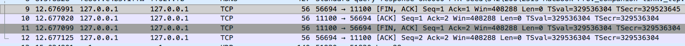

#### 问题一：为什么接收方在FIN包后不能一次性发送ACK和FIN包给发送方，就像建立连接时一次性发送SYN和ACK包一样。
在收到FIN包，只是发送方这边不再发送数据了，但是接收方可能还有数据在发送给发送方，所以此时不能直接断开连接，也因此不能立马发送FIN包。  
因此接收方先回了一个ACK包，等到确认自己没有数据要发给发送方了，自己也会做一些结束连接的准备，之后便再发送FIN包给发送方。

#### 问题二：CLOSE_WAIT的解释。  
我们知道接收方在接收到FIN后，发送ACK之前会进入CLOSE_WAIT，如果长期处于这个状态，或者说出现大量CLOSE_WAIT，说明ACK包一直没有发出，这时候就应该检查代码了。 

#### 问题三：这个TIME_WAIT的作用是什么？  
这个[博客](http://www.cnblogs.com/Jessy/p/3535612.html)是这么解释的。

原因有二：
1. 保证TCP协议的全双工连接能够可靠关闭
2. 保证这次连接的重复数据段从网络中消失

如果发送方在发送ACK后直接CLOSED了，那么由于IP协议的不可靠性或者是其它网络原因，导致接收方没有收到发送方最后回复的ACK。那么接收方就会在超时之后继续发送FIN。

此时由于发送方已经CLOSED了，就找不到与重发的FIN对应的连接，最后接收方就会收到RST而不是ACK，接收方就会以为是连接错误把问题报告给高层。  

这样的情况虽然不会造成数据丢失，但是却导致TCP协议不符合可靠连接的要求。  

所以，发送方不是直接进入CLOSED，而是要保持TIME_WAIT，如果再次收到接收方的FIN包后可以继续回复ACK包，这能够能够保证对方收到ACK，最后正确的关闭连接。

第二个原因，如果发送方直接CLOSED，然后又再向接收方发起一个新连接，我们不能保证这个新连接与刚关闭的连接的端口号是不同的。也就是说有可能新连接和老连接的端口号是相同的。  

一般来说不会发生什么问题，但是还是有特殊情况出现：假设新连接和已经关闭的老连接端口号是一样的，如果前一次连接的某些数据仍然滞留在网络中，这些延迟数据在建立新连接之后才到达接收方，由于新连接和老连接的端口号是一样的，又因为TCP协议判断不同连接的依据是socket pair。  

于是，TCP协议就认为那个延迟的数据是属于新连接的，这样就和真正的新连接的数据包发生混淆了。

所以TCP连接还要在TIME_WAIT状态等待2倍MSL，这样可以保证本次连接的所有数据都从网络中消失。  

#### 问题四：如果接受方在收到FIN包后就跑路或者回复完ACK就跑路了，会怎么样？
发送方在发送完FIN包后进入`FIN_WAIT_1`，收到ACK包就进入`FIN_WAIT_2`。协议上并没有规定，如果发送方一直卡在FIN_WAIT状态怎么办，但是linux系统有做一些处理。  
linux设置了一个超时时间`tcp_fin_timeout`，超过这个时间就可以不用管另外一端了。

#### TIME_WAIT注意事项  
从事例我们知道，主动关闭连接的一方会经历TIME_WAIT状态，在该状态下的socket是不会被回收的。而如果是服务器端主动关闭连接，则可能会面临处于大量TIME_WAIT的情况（因为连接很多嘛），会严重影响服务器的处理能力。  
怎么解决呢，那就减少服务器端TIME_WAIT的时间咯。

综上所述，发送方和server从建立连接到断开连接，整个状态的变化如下：

client:  
CLOSED->SYN_SEND->ESTABLISH->FIN_WAIT_1->FIN_WAIT_2->TIME_WAIT->CLOSED  
server:  
CLOSED->LISTEN->SYN_RECV->ESTABLISH->CLOSE_WAIT->LAST_ACK->CLOSED

## 连接异常断开分析
上面描述的都是连接正常断开的情况下，两端的状态的变化。如果不是正常断开呢，如进程被杀掉了，机器断电了会怎么样呢？

我们可以做几个实验  
首先启动一个tcp服务，这里直接使用`nc`命令行监听一个断开`11100`。然后我们用netstat查看下tcp的状态。
```bash
$ nc -lk 11100

$ netstat -an | grep 11100
```
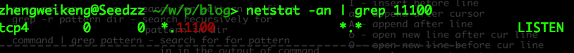

接下来我们模拟客户端连接
```bash
$ nc localhost 11100

$ netstat -an | grep 11100
```
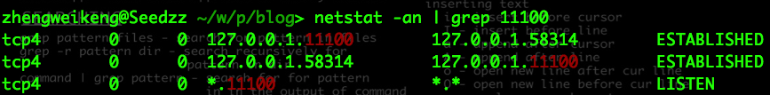

通过上图，我们知道服务端是fork了一个子进程来处理客户端连接。

两端都已经建立连接完毕，接下里我们做一些异常断开。

### 其中一端的连接被kill
我们先kill掉客户端的进程
```bash
$ ps aux | grep -v grep | grep "nc localhost 11100"
```
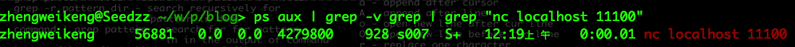
```
$ kill 56881

$ netstat -an | grep 11100
```
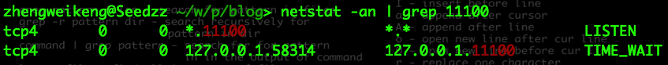

## tcp包头格式
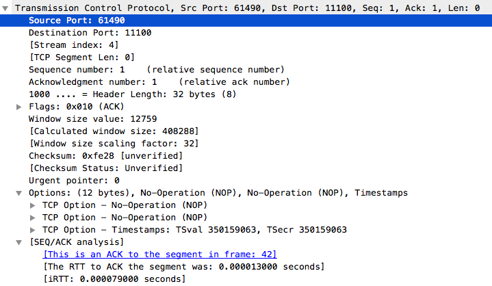

上面这张图片也是wireshark抓包来的，通过它我们可以来认识tcp包里的内容到底有什么，这里需要忽略[]里面的内容。

1. 首先是源端口（source port）和目标端口（destniation port），它们会各占16位（2个字节）。有了这两个端口，数据才能知道是发给哪个应用。
2. 接下来是序列号（sequence number），长度32位（4个字节），它用于给包编号，有了这个编号就可以解决乱序的问题。在这么复杂的网络环境下，序号非常重要。这个序号是在建立连接时计算机随机分配的一个初始值，之后会根据传输的字节大小不断累加，也就是`seq=pre seq + data length`
3. 然后就是确认序号（Acknowledgement Number），长度也是32位（4个字节），也就是我们常说的ack。通过之前的握手流程，我们知道，ack就是来确认哪些包已经被确认收到了，例如服务端回复了一个ack number为350，那么说明350之前的包服务端都已经收到了，接下来客户端就应该开始发送seq number为350的包了。如果客户端没有收到ack，那么就应该重复发送。
4. 然后是数据偏移位（data offset），长度为4位，单位为4个字节，它说明了头部的大小，也能说明数据是从第几个字节开始的，例如wireshark的截图中，offset的值是8，即`8 * 4 = 32`个字节，也即头部共占32个字节。
5. 接下来是保留位（Reserved），长度为4位，为了以后扩展用的，一般设置为0，即使收到的数据该值不为0也无所谓。
6. 然后就是控制位（control flag），长度8位（1个字节）。每一位从左到右分别是CWR、ECE、URG、ACK、PSH、RST、SYN、FIN。给相应的为赋值为1则代表了对应的含义。
    1. CWR（congestion window reduce）: 说明有窗口变动
    2. ECE（ECN-Echo），设置为1会通知对方，对方的网络到这边会有拥塞
    3. URG（Urgent flag），有紧急处理的数据
    4. ACK（Acknowledgement flag），值为1，确认应答的字段有效，协议规定，处理最初建立连接，即第一次握手的时候的SYN包外，该值都必须为1
    5. PSH（Push flag），为1表示数据立即传给上层协议，为0表示代表可以先缓存
    6. RST(Rest flag)，该位为1表示连接出现异常，必须强制关闭连接
    7. SYN（Synchornize flag），为1表示开始建立连接
    8. FIN（Fin flag），该位1，表示不会再有数据发送，希望断开连接
7. 接下来是窗口大小（window size），长度16位，tcp不允许发送超过此处所示大小的数据。例如上图中的值为12759，说明接下来客户端发送的数据最大大小为12759。如果该值为0，客户端可以只可以发送窗口探测，来询问服务端窗口大小是否有变化，这个探测数据必须是一个字节。
8. 然后是校验和（checksum），长度为16位，根据一定的规则计算出的值，用于判断首部和数据在传输的过程中是否被破坏
9. 接下来是紧急指针（Urgent Pointer），长度16位，伴随控制位的URG为1是产生，该值说明了，首部之后的数据，从0到第几位为紧急数据，例如你按了control + c。
10. 之后便是选项（options），长度最大为40个字节，用于提高传输性能。
11. 然后是填充（Padding）
12. 最后便是数据（data）了.


最终就是如下这张图：  
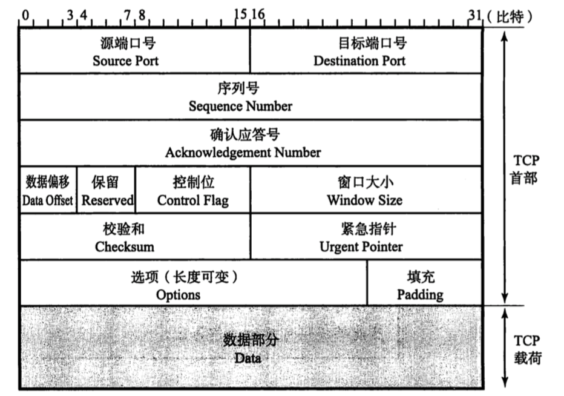

最后我们通过访问[百度](http://www.baidu.com)看看抓包的数据，来验证我们之前所讲的一切
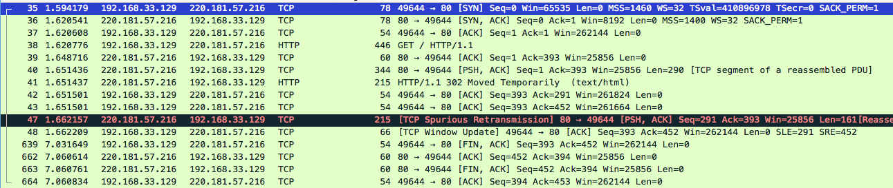

分析：
1. 从35-37号包，客户端和服务端一来一回的就是三次握手
2. 接下来38号就是客户端发起一个http请求，http是应用层协议，在它下面也是tcp协议，因此会包含tcp协议的东西，如下所示的Hypertext Transfer Protocol中的数据
    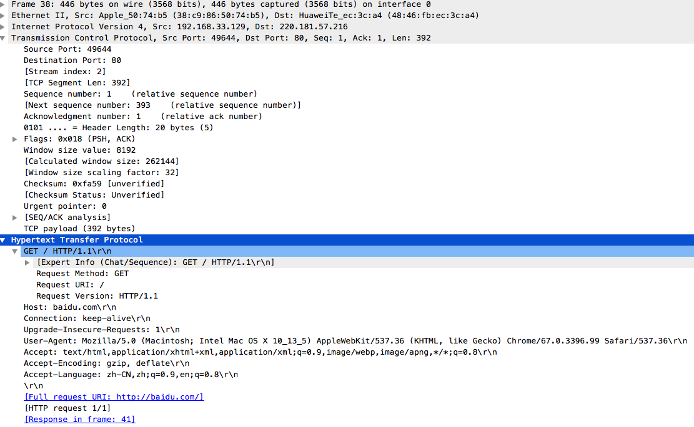
3. 服务端收到客户端的请求后，先回复客户端说你的请求我已经收到了，这就是39号包的作用。
4. 接下来服务端处理完请求后开始传输数据，一般来说数据都会比较大，一个包放不下，会分为几个包发，这就是40和41号包。
5. 其中41号包在上层多了个http协议，也即之前http的response，如下图所示：
    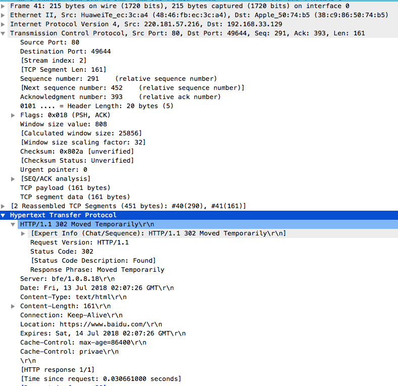
6. 客户端收到40和41的数据后，就回复了两个包，即42和43号包给服务端，说我已经收到响应了。
7. 47号包，有可能是客户端重复发送了包，服务端要告诉它不用重复发送了
8. 48号包，开始更新滑动窗口大小
9. 最后四个包639-664就是tcp的挥手过程了。

## 滑动窗口
现在我们知道，tcp两端的数据通信，都需要一来一回，即seq和ack对应。按照最简单的做法，就是客户端来一个信息，服务端回复一个信息，如图  
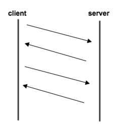

但是这样效率太慢了，客户端必须等到收到服务端的回复后才可以发送下一个数据，如果一直收不到，那下一个数据就只能干等着。这种串行的方式，肯定不可取。

那既然串行不可以取，我们是不是可以一次多发几份数据，提高发送效率呢？如下图所示  
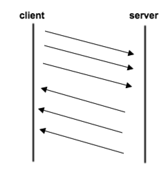

其实这是可行的，但是我们要保证多发的这些数据，都能收到回复ack，即要可靠的传输。  
另外，也不能让其中一端，如客户端，无节制不断的发送数据，这样把服务端带宽都占满了，而服务端的处理能力是有限的，因此也必须有一套机制来控制流量，在客户端发送太过频繁的时候“阻止”它，不让它发送，等到流量降下来了，再允许客户端发送。这就是“滑动窗口”的作用。

之前我们说过，ack numner不是简单将seq number+1，而是seqNum+包的大小，这种计算方式叫累计模式或累计应答（cumulative acknowledgment）。这种模式可以很好的解决上述情况，如果客户端一次发了很多个包过来的，服务端不用一个一个回复，而是回复客户端说，在这个number之前的所有包，我都收到了。

例如客户端发送了1,2,3,4包给服务端，服务端只需要回复ack是5，代表5之前的数据我都收到了，这样也就提高了回复效率。

接下来来看看滑动窗口的细节，假设下图是客户端的滑动串口示意图  
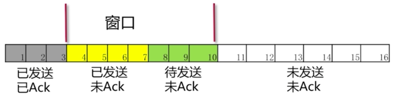

窗口分为四个部分
1. 已发送，已ack。
2. 已发送，未ack。
3. 待发送，未ack。
4. 未发送，未ack。

而滑动窗口的大小（Advertised window）就是上面的`第二部分+第三部分`，按照图中的话就是4-10，即大小总共为7。  
超过这个大小的数据，就不会被纳入发送范围。

这时候，如果客户端收到了4的ack了，于是窗口向右滑动一格，如图所示  
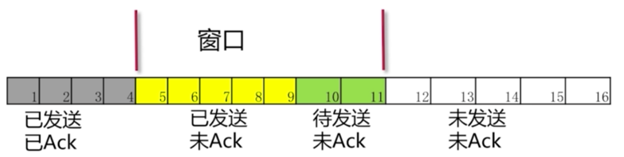

此时窗口就是5-11了，此时大小依旧是7。

对于服务端会相对简单一些，如图  
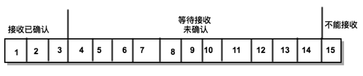

对于服务端而言，会有个最大缓存的量maxRcvBuffer，而窗口大小就是maxRcvBuffer-(接收已经确认的数据-接收但没被应用层读取的数据)，对于图片，即为`14-(5-0) = 9`

由此可见，由于服务端对数据的处理能力不会一直不变，所以窗口的大小会有在变化，服务端通过回复ack包时，在包中附带了窗口大小，客户端收到这个窗口大小，就会更新自己的窗口大小，这样便达到了控制发送速度的作用。

万一客户端没收紧，一下子把把10和11都发送了，但是5-11都没收到ack，此时客户端就得先等5的ack，才可以移动窗口，这时12之后的数据才能被发送。  


如果服务端的处理太慢了，服务端会缩减甚至将窗口大小设置为0。

上图中的窗口大小为7，此时服务端在收到5和6后，回复ack的时候将窗口大小设置为5。  
这时客户端收到ack后发现窗口大小被设置为5了，于是便将左边界右移了，到了7这边，而且也没法发送数据。  
如果服务端一直没法处理数据，导致窗口一直缩小，最终到了0，客户端在收到11的ack后，由于窗口为0了，也没法发数据了。

如果没法发送数据了，客户端怎么办呢，不能干等着吧。这个时候如果服务端调整了窗口了呢。

之前我们说过，这时候客户端会发送窗口探测包，这个包的大小只有1个字节。

#### 丢包或者网络延迟的情况
网络是不可靠的，因此丢包或者包延迟到的情况时常发生。

例如之前的图中，客户端发送了5、6、7包过去，但是6和7到了，但是5一直没有到，这时服务器端是不会回复6和7包的ack的，它会先把6和7缓存着，然后等5包过来。

客户端如果一直没收到ack，就会重发。如果这次服务端收到了就会回复对应的ack。此时如果，之前由于网络延迟导致的包最终到达服务端了，服务端通过ack能够知道这个包之前已经收多了，就丢弃了这个包了。

这里有一点值得注意，就是超时重传的时间，系统会根据RTT计算出一个初始时间，如果之后还遇到需要重传，这个时间会加倍，即下一次的超时时间间隔为先前值的两倍。频繁的超时说明了，当前的网络环境较差，不能够频繁的发送数据。

这种超时重传机制实在太慢了，于是有了一种叫快速重传机制，就是当接收端发现收到的包的序号大于下一个期望的报文时，就发送三个冗余的ack过去，发送端收到这三个ack后，就在定时器过期之前重传丢失的报文。

例如接收方发现4、6、7都已经收到了，其中7没有过来，于是便发送了3个6的ack，期望下一个收到的是7。当客户端收到这3个一样的ack时，就知道7丢了，于是不等超时马上进行重发。

## MTU和MSS
MTU(Maximum Transmission Unit，最大传输单元)=1500字节，这是能在网络上传输的字节大小。

这里举一个具体的例子说明IP包分片的原理。以太网的MTU值是1500 bytes，假设发送者的协议高层向IP层发送了长度为3008 bytes的数据报文，则该报文在添加20 bytes的IP包头后IP包的总长度是 3028 bytes，因为3028 > 1500，所以该数据报文将被分片，注意：分片时仅仅对上层的数据进行分片，不需要对原来的IP首部分片，所以要分片的数据长度只有3008，而不是3028. 这特别容易出错。

分片过程如下：
1. 首先计算最大的IP包中IP净荷的长度 =MTU-IP包头长度=1500-20= 1480 bytes。
2. 然后把3008 bytes按照1480 bytes的长度分片，将要分为3片，3008= 1480+1480+48。
3. 最后发送者将为3个分片分别添加IP包头，组成3个IP包后再发送，3个IP包的长度分别为1500 bytes、1500 bytes和 68 bytes。

而MSS（Max Segment Size 最大报文段长度）就是`MTU - ip头 - tcp头`，一般就是`1500 - 20 - 20 = 1460字节`

## 拥塞控制
拥塞控制和滑动窗口都是用来控制流量的，那有什么区别？

简单来说，就是滑动窗口是怕发送方把接收方的缓存塞满，而拥塞控制是为了避免网络塞满。

由于网络是共享的，就像公路一样，所有车都能在上面开，节假日高峰期的时候，公路都会异常堵塞，交通部门必须有一定的措施来解决堵塞问题。

同理网络也一样，当使用同一个网络通道的发送端多了，就会遇到堵塞，如果这时还发送一个非常大的数据包，极有可能导致网络瘫痪。拥塞控制就是来解决这种问题的。

拥塞控制主要是如下四个算法：
1. 慢启动
2. 拥塞避免
3. 拥塞发生
4. 快速恢复

#### 慢启动 - Slow Start
举个之前看过的例子，如果我们要往漏斗里倒水，水从漏斗底端流出，相当于服务端在处理数据。  
一开始的时候，如果一下子速度太快，全部往里面灌，水会溅起来。必须一开始的时候慢慢的倒，稳定之后再加快速度倒水，这就叫慢启动。  

而木桶总有满的时候，在木桶快满的时候，我们就得减小倒水的速度。

拥塞控制是结合滑动窗口一起做的，滑动窗口让发送到可以一次发几个包，总共有n个字节，那可以发多少，不能一下子丢给几十个包过去，导致几千个字节过去吧。所以tcp也有个慢启动的过程

慢启动的算法如下(cwnd全称Congestion Window，即拥塞窗口)：
1. 一条连接建好的时候，cwnd=1，表明可以传1个MSS的大小
2. 每当收到一个ACK，cwnd++，呈线性增长
3. 每当过了一个RTT，cwnd = cwnd*2，呈指数增长
4. 当增长到达一个阈值ssthresh(slow start threshold)时，就会进入拥塞避免算法。这个值一般是65535字节

一条tcp连接开始的时候，可以发送一个MSS，当收到一个确认之后，就加1，于是这时候就能发送两个MSS了  
这2个确认到来的时候，每个确认加1，于是值就变成4MSS了。4个确认到达时，值就变成了8MSS了

#### 拥塞避免算法 - Congestion Avoidance
当cwnd>=ssthresh时，就会进入拥塞避免，该算法为：
1. 收到1个ack时，cwnd = cwnd + 1/cwnd
2. 当每过一个RTT时，cwnd = cwnd + 1

这是个线性增长的过程，也就是说将原来指数增长变为线性增长，降低了增长速度。

#### 拥塞发生
当速度已经很快，网络已经无法承担，就会发生丢包，一旦丢包就会重传，我们之前介绍过两种重传机制，这两种的做法在拥塞控制上有些不同
1. 发生超时重传，tcp认为这很糟糕，于是：
    1. ssthresh = cwnd/2
    2. cwnd 重置为1
    3. 最终进入慢启动
1. 快速重传算法，tcp对这种重传认为不是很严重，采用的算法是：
    1. cwnd = cwnd/2
    2. ssthresh = cwnd
    3. 进入快速恢复算法

这里我们需要注意的是，并不是只有在拥塞发生的时候才会丢包，在网络环境很好的时候也是会有丢包发生的。

这时候一旦超时重传ssthresh会变成cwnd的一半，也就说明，然后又进入慢启动，开始指数增长，再慢慢变成线性增长，如此的往复控制着网络的流量。

#### 快速恢复 - Fast Recovery
快速重传后会进入快速恢复：
1. cwnd = ssthresh + 3 * MSS
2. 重传Duplicated ACKs指定的数据包
3. 如果再收到 duplicated Acks，那么cwnd = cwnd +1
4. 如果收到了新的Ack，那么，cwnd = sshthresh ，然后就进入了拥塞避免的算法了。

左耳朵耗子有张图可以很形象的说明拥塞控制的过程 [链接](https://coolshell.cn/articles/11609.html)
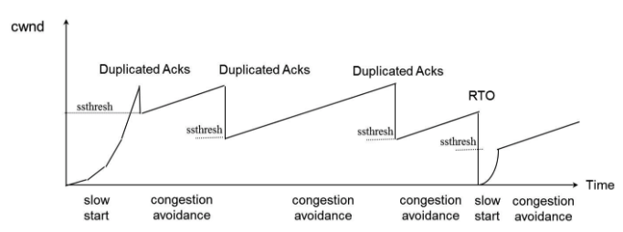

## Nagle算法
进行socket编程的时候，我们可以开启或者关闭Nagle算法。  

这个算法的作用是，如果让一些数据先缓存起来，不那么快发送过去，等到一定的条件满足了再发送。如果这些条件都不满足，则等待一段时间再发送。

这个条件为：
1. 已经发送的数据都收到了确认答复
2. 可以发送最大段长度（MSS）的数据时

第一个好理解，第二个最大段长度什么意思？

其实就是一个包能够传输的最大数据，除去了ip头和tcp头的数据，一般为1500字节。

采用Nagle会让数据缓存一段时间再发送，如果应用是时效性非常严格的话，就不应该打开该算法了。

## websocket
tcp是传输层的协议，tcp三次握手后，应用层协议http也便建立了连接。而对于当今web的发展情况，http仍有许多瓶颈。

1. 一条连接只能发送一个请求。
2. 请求只能从客户端开始。客户端不可以接收除响应以外的指令。
3. 请求/响应首部未经压缩发送，首部信息越多延迟越大。
4. 发送冗长的首部。每次互相发送相同的首部造成较多的浪费。
5. 可任意选择数据压缩格式。非强制压缩发送。

虽然已经出现了很多解决方案，如ajax、comet，但是他们最终使用的都是http协议，因此也无法从根本上解决这些瓶颈。  
因此也就诞生了一个新的通信协议,WebSocket协议，一种全双工通信协议。

该通信协议建立在http协议的基础之上，因此连接的发起方仍然是客户端，在http连接建立之后，再将协议升级为webSocket连接，在webSocket连接建立之后，客户度和服务器端都可以主动向对方发送报文信息了。

建立webSocket连接，需要先建立http连接，并在此基础上再进行一次”握手“。

client会发起一个”握手“的请求，请求首部含有upgrade:websocket（还有其他首部，具体看如下示例）。服务器端返回一个101状态码，确认转换协议。完成握手后便可以使用websocket协议进行通信。

Client（request）
```
GET /chat HTTP/1.1
Host: server.example.com
Upgrade: websocket
Connection: Upgrade
Sec-WebSocket-Key: AQIDBAUGBwgJCgsMDQ4PEC==
Origin: http://example.com
Sec-WebSocket-protocol: chat, superchat
Sec-WebSocket-Version: 13
```
Sec-WebSocket-Key其值采用base64编码的随机16字节长的字符序列，服务器端根据该域来判断client确实是websocket请求而不是冒充的，如http
Sec-WebSocket-protocol使用的子协议
Sec-WebSocket-Version该值必须是13

Server（response）
```
HTTP/1.1 101 switching Protocols
Upgrade: websocket
Connection: Upgrade
Sec-WebSocket-Accept: dGhlIHNhbXBsZSBub25jZQ==
Sec-WebSocket-Protocol: chat
```
Sec-WebSocket-Accept值是由client请求首部中的Sec-WebSocket-Key做SHA-1 hash计算，然后再把得到的结果通过base64加密而来

连接建立后，通信的url格式如下：  
ws://example.com/  
wss://example.com/

#### 参考资料
1. [TCP的三次握手(建立连接）和四次挥手(关闭连接）](http://www.cnblogs.com/Jessy/p/3535612.html)
2. [服务器TIME_WAIT和CLOSE_WAIT详解和解决办法](http://www.cnblogs.com/sunxucool/p/3449068.html)
3. [TCP 协议（半打开）](https://blog.csdn.net/q1007729991/article/details/69948617)
4. [针对TCP连接异常断开的分析](https://www.cnblogs.com/549294286/p/5208357.html)
