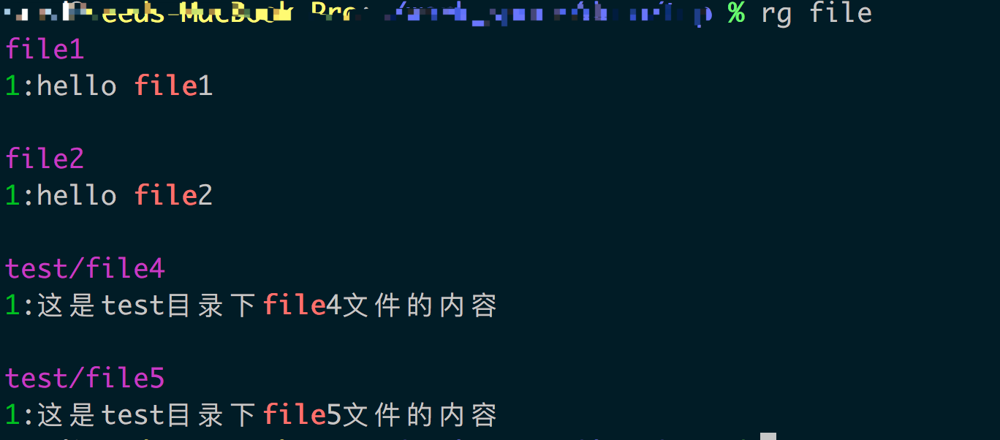
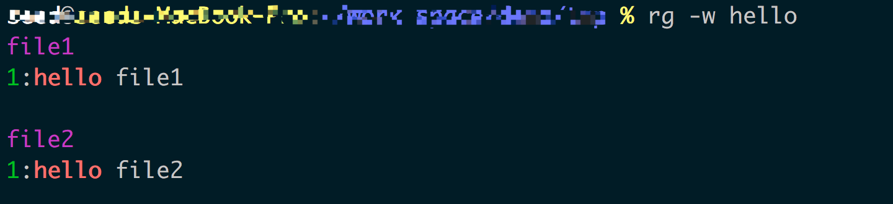
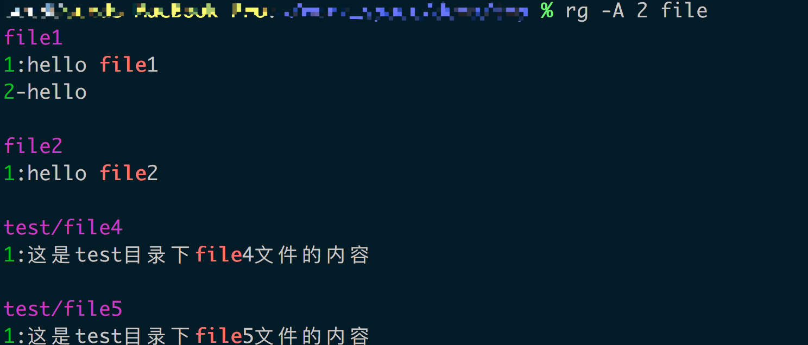
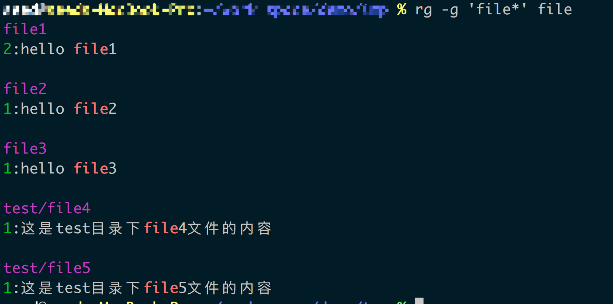
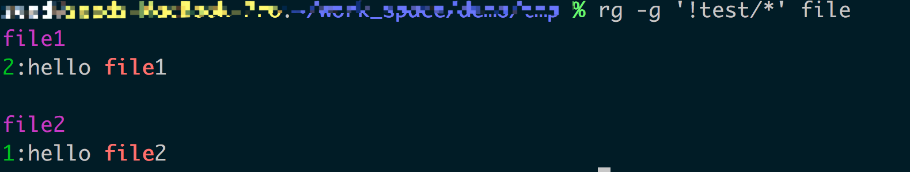

> vscode 在1.11.0中优化了搜索，使用了ripgrep进行搜索，因此看了下该工具，发现它的搜索速度比The Silver Searcher和ack这类搜索工具还快，因此想学习一下

## 与其他工具搜索速度的对比
该库与其他搜索工具做了一个搜索速度的对比 [quick-examples-comparing-tools](https://github.com/BurntSushi/ripgrep#quick-examples-comparing-tools)

可以发现其搜索速度是最快的，比Silver Searcher快了5倍多，ack就不用说了，快了126倍。

我们还可以看到在搜索大文件时（约9.3GB的文件），ripgrep的搜索速度也非常快，案例中说是2.5s左右

## 几个基本特点
1. ripgrep会递归的去搜索当前的所有子目录
1. ripgrep会忽略一些文件，一个是.gitignore中指定的文件。同时默认也会忽略一些隐藏文件和二进制文件
1. ripgrep可以搜索指定类型的文件，如`rg -tpy foo`则只会去搜索python文件
1. grep有的特性ripgrep也都有
1. ripgrep除了支持utf-8外还支持其他很多编码，如utf-16、latin-1、GBK等等

## 命令学习
环境准备
```
# file1 内容
hello file1

# file2 内容
hello file2

# file3 内容
hello file3

# ./test/file4 内容
这是test目录下file4文件的内容

# ./test/file5 内容
这是test目录下file5文件的内容

# .gitignore 内容
file3
```

### 基本功能
最简单的就是直接搜索了，搜索包含file的文件
```bash
$ rg file
```

搜索结果


可以看到ripgrep为我们高亮了匹配的段落，也为我们把所在行数也标志出来。

由于在.gitignore中忽略了file3文件，因此在搜索结果中没有看到file3文件

如果不想忽略文件，可以使用
```bash
rg -u file
```
这样会去搜索file3文件

如果还想搜索隐藏文件，可以使用
```bash
# 相当于 grep -r
rg -uu file
```
这时会把.gitignore也会出现在搜索结果中

如果还要搜索二进制文件（其实就是搜索所有文件），可以使用
```bash
# 相当于 grep -a -r
rg -uuu file
```

### 其他常用功能
#### 忽略大小写
```
rg -i FILE
```

#### 搜索被某个单词包围的文件
```
rg -w hello
```

搜索结果


#### 搜索结果行数定义
默认情况下，搜索结果只显示匹配文字所在的行数，如果显示匹配结果的后几行
```
rg -A 2 file
```
结果如下


如果想显示匹配结果的前几行
```
rg -B 2 hello
```

想同时使用，既显示匹配行的前后几行，可以使用
```
rg -C 2 file
```

#### 显示每个匹配文件的匹配数量
```
rg -c file
```

搜索结果


#### 搜索二进制文件
```
rg -a file
```

#### 不将搜索字符作为正则表达式进行搜索
正常下输入类似{}时，会被当做正则字符，这时需要使用转义字符。如果我们只是想将被搜索的字符当做普通字符串来搜索，可以使用-F
```
rg -F file
```

#### 定义待搜索的文件或者排除一些文件
很多情况下，我们只想搜索指定的文件，或者排除一些文件，我们可以这么做
```
rg -g 'file*' file
```
它支持通配符的格式，搜索结果如下


可以发现，搜索结果包含了file3文件，该文件本来已经被我们使用.gitignore忽略了，可见它会覆盖.gitignore的内容

也可以排除一些文件
```
rg -g 'test/*' file
```


#### 搜索指定类型的文件
先查看ripgrep支持搜索的文件类型
```
rg --type-list
```

如果我们想搜索js文件，可以这么使用
```
# js: *.js, *.jsx, *.vue
rg -tjs file
```

同时，也开始排除搜索指定的文件类型
```
rg -Tjs file
```