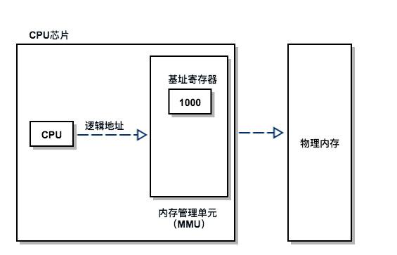

# 存储管理
我们知道，每个进程都有自己独立的内存空间，而且相互独立，无法互相访问，这是怎么做到的呢？

我们也知道，目前我们常用的是16G甚至32G内存，操作系统又是如何来管理和分配内存的。

### 地址空间
其实每个程序运行后，或者说进程创建后访问的并不是我们机器的物理内存，而是逻辑内存。

逻辑内存的大小和我们机器实际的内存大小没有关系，跟我们机器的位数有关，即是32位机器还是64位机器。

32位机器，即逻辑空间大小为2^32 = 4G  
64位机器，即逻辑空间大小为2^64 = 10^19 byte

因此，即使你的机器实际的物理内存有16G，而你的机器位数只有32位，那这个进程顶多也只能使用4G内存。

#### 那为什么直接使用物理内存呢？  
如果我们让所有进程都直接操作物理内存，就会导致多个进程间操作同一个地址，数据被相互覆盖。  
更加危险的是，如果某个进程存储在内存的数据是比较敏感的，就有可能会被另一个进程非法读取，做一些危险的操作，这是不允许的。

甚至如果进程直接访问物理内存了，它还可以通过寻址去找到它想要的其他进程的数据，这就更加危险了。

因此我们不能让进程直接访问物理内存，应该将其隔离开，由此才有了逻辑内存的概念。

#### 逻辑内存和物理内存
逻辑内存只是个逻辑概念，它并不是真正的内存，它也没法存储数据，真正的数据都是存储在物理内存的，那这之间又是如何关联的？

其实在逻辑内存和物理内存之间会有个映射关系，通过这层映射，知道逻辑内存地址就能找到物理内存的地址，也就能访问数据了。

操作系统会为每个进程分配独立的逻辑内存空间，而且相互隔离，没有任何关系，这些逻辑内存都会有自己的物理内存块，这样就将不同逻辑内存互相隔离了。

我们从图中可以看到，在寻址的时候，CPU会生成一个逻辑地址，用这个逻辑地址来访问主存时需要经过一个MMU（内存管理单元）来对这个虚拟地址进行翻译，把这个逻辑地址映射为真正的物理地址，对于每一个进程而言，它在执行的时候基址寄存器中的值是不一样的，比如图片中的寄存器中的值1000，当CPU执行一个指令的时候，它就认为所有关于内存地址的地址都是逻辑地址，然后发给MMU，经过MMU后就会将其翻译成真实的地址，最后，内存通过系统总线把数据给CPU传了过去。
