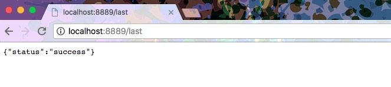
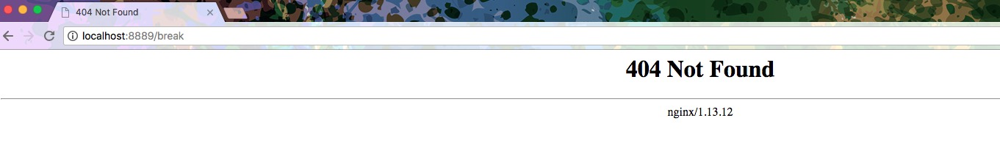

# ngx_http_rewrite_module
该模块可以对请求的地址进行跳转。我们经常看到苹果在发布新产品的前几个小时的时候，访问官网时会被跳转到一个维护页面，这种便可以采用nginx的rewrite来做。

rewrite规则如下:  
rewrite regex replacement [flag];

rewrite只能出现在server、location、if中

1. regex是正则表达式，具体规则可以网上搜寻。可采用pcretest测试写的正则表达式
2. replacement代表要跳转的路径
3. flag有如下备选值：
    * last：停止rewrite检测
    * break：停止rewrite检测
    * redirect：返回302临时重定向，地址栏会显示跳转后的地址
    * permanent：返回301永久重定向，地址栏会显示跳转后的地址

### 301重定向与302跳转有什么区别?
1、使用效果不同  
302跳转是暂时的跳转，搜索引擎会抓取新的内容而保留旧的网址。因为服务器返回302代码，搜索引擎认为新的网址只是暂时的。  

301重定向是永久的重定向，搜索引擎在抓取新内容的同时也将旧的网址替换为重定向之后的网址。

2、SEO使用方式不同
在搜索引擎优化中302跳转被众多黑帽SEO优化人员追求，对网站进行恶意302跳转至非用户目标访问网站，因此搜索引擎对于网站的302跳转通常是比较不友好。

常见的方式是对网站K站，在对网站进行URL规范化地址要使用301重定向而非302跳转。

## 事例
### 事例1，任何请求都访问同一个页面
如下事例，匹配任何路径，访问maintain.html页面
```nginx
server {
  ...
  rewrite ^(.*)$ /maintain.html break;
  ...
}
```

### 事例2，区分last和break
```nginx
server {
  listen 8889;
  server_name 127.0.0.1;

  root /var/workspace/app;

  location ~ ^/last {
    rewrite ^/last /test last;
  }

  location ~ ^/break {
    rewrite ^/break /test break;
  }

  location /test {
    default_type application/json;
    return 200 '{"status":"success"}';
  }
}
```

访问：`127.0.0.1:8889/last`，结果如下：


访问`127.0.0.1:8889/break`，结果如下：


1. rewrite last - url重写后，马上发起一个新的请求，再次进入server块，重试location匹配，超过10次匹配不到报500错误，地址栏url不变
2. rewrite break - url重写后，直接使用当前资源，不再执行location里余下的语句，完成本次请求，地址栏url不变 