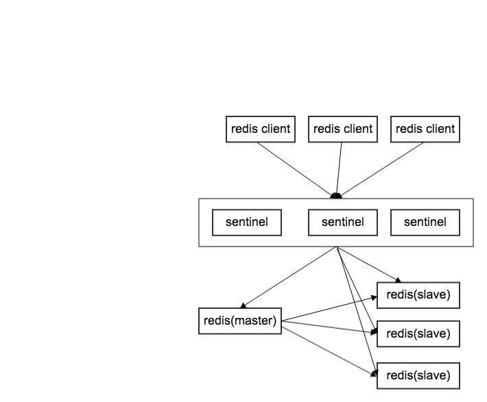

# 主从复制问题
主从复制能够让redis做到数据的备份和读写的分离，提高了redis的可用性。

但是同时它也引入了其他的问题，如主和从节点都有可能会发生故障，当节点发生故障的时候，需要进行故障处理

当读写分离是，从节点负责读命令，主节点负责写命令  
如果从节点发生故障，需要让客户端切换到可用的从节点进行读操作 
如果主节点发生故障则会更加麻烦，要么快速恢复节点，要么快速将某个从节点上升为主节点，并将其他从节点的主节点设置为这个新的主节点。

上面这些故障后的步骤如果人工手动，或者通过脚本自动来做都会增加一定的错误概率，这个过程也不好做。因此redis提供了哨兵，即sentinel帮我们来处理这样的过程。

## sentinel架构


sentinel故障转移：
1. 多个sentinel发现并确认master有问题
2. 选举出一个sentinel作为leader
3. leader选出一个slave作为master
4. 通知其余slave成为新的master的slave
5. 通知客户端slave变化
6. 等待老的master复活成为新的master的slave

另外sentinel还可以服务于为多个master-slave体系

setinel配置
```
port ${port}
dir /someDiskPath
logfile ${port}.log
# 主节点ip和端口，并且为该master所在集群起个名字
# 其中最后一个参数代表多少个sentinel认为master挂了才去升级slave为master
sentinel monitor mymaster 127.0.0.1 7000 2
# sentinel认为master失联多少毫秒后就算宕机
sentinel down-after-milliseconds mymaster 30000
# 重新选出新的master后，其他slave的并发同步数，1则代表每次一个slave来同步master的数据
sentinel parallel-syncs mymaster 1
sentinel failover-timeout mymaster 180000
```

## 实操
首先我们将redis设置成1主2从
主配置（redis-6479.conf）
```
port 6479
daemonize yes
pidfile /var/run/redis_6479.pid
logfile "6479.log"
dbfilename dump-6479.rdb
dir /Users/seed/work_space/data
slave-read-only yes
```
从节点配置（redis-6579.conf），
```redis
port 6579
daemonize yes
pidfile /var/run/redis_6579.pid
logfile "6579.log"
dbfilename dump-6579.rdb
dir /Users/seed/work_space/data
slaveof 127.0.0.1 6479
slave-read-only yes
```
另一个从节点配置也是和上述一样，只是把端口换成6679即可

启动主从redis
```bash
$ redis-server redis-6479.conf
$ redis-server redis-6579.conf
$ redis-server redis-6679.conf
```

接下来配置sentinel，这里启动3个sentinel，端口分别问26379、26380、26381

sentinel-26379.conf
```
port 26379
daemonize yes
dir "/Users/seed/work_space/data"
logfile "26379.log"
sentinel monitor mymaster 127.0.0.1 6479 2
sentinel down-after-milliseconds mymaster 30000
sentinel parallel-syncs mymaster 1
sentinel failover-timeout mymaster 180000
```
启动sentinel
```
redis-sentinel sentinel-26379.conf
redis-sentinel sentinel-26380.conf
redis-sentinel sentinel-26381.conf
```

接下来我们查看下sentinel是否成功监控所有节点了
```bash
$ redis-cli -p 26379 info sentinel
# Sentinel
sentinel_masters:1
sentinel_tilt:0
sentinel_running_scripts:0
sentinel_scripts_queue_length:0
sentinel_simulate_failure_flags:0
master0:name=mymaster,status=ok,address=127.0.0.1:6479,slaves=2,sentinels=3
```
观察最后一行，可见到mymaster集群的master为127.0.0.1:6479，并且有2个从节点，当前有3个sentinel。  
和我们配置的一样

接下来我们把6479端口的master杀掉
```bash
$ ps -ef | grep redis-server | grep -v "grep"
501 17007  2609   0  5:26PM ttys001    0:14.92 redis-server 127.0.0.1:6579
501 17010  3173   0  5:26PM ttys002    0:14.84 redis-server 127.0.0.1:6679
501 16774 65540   0  5:18PM ttys016    0:16.14 redis-server 127.0.0.1:6479

$ kill 16774
```

之后我们通过连接到sentinel中用命令`info sentinel`观察主从的变化，会发现主节点变成了6579
```bash
$ redis-cli -p 26379 info sentinel
# Sentinel
sentinel_masters:1
sentinel_tilt:0
sentinel_running_scripts:0
sentinel_scripts_queue_length:0
sentinel_simulate_failure_flags:0
master0:name=mymaster,status=ok,address=127.0.0.1:6579,slaves=1,sentinels=3
```

至此我们看到了sentinel是如何做到主从节点切换的，完全不用人工。

## 客户端
作为redis客户端，它需要知道master节点发生了变化，重新选择master节点这样的功能。

我们看下node里的[ioredis](https://github.com/luin/ioredis)
```javascript
const Redis = require('ioredis')

const redis = new Redis({
  sentinels: [{ host: 'localhost', port: 26379 }, { host: 'localhost', port: 26380 }],
  name: 'mymaster'
});

setInterval(async () => {
  const val = await redis.get('hello')
  const infoVal = await redis.info('server')
  console.log(val)
  console.log(infoVal)
}, 3000)
```
当master故障失联时，ioredis会去询问sentinel新的master节点的信息，并连接到这个新的master，同时在这期间的新的命令都会被存储到一个队列中，等到与新的master连接后，再讲这些命令发送过去，做到零数据丢失。

但是如果是slave节点失联，是什么情况呢？
```javascript
const Redis = require('ioredis')

const preferredSlaves = [
  { ip: '127.0.0.1', port: '6479', prio: 1 }
];

const redis = new Redis({
  sentinels: [{ host: '127.0.0.1', port: 26379 }, { host: '127.0.0.1', port: 26380 }],
  name: 'mymaster',
  role: 'slave'
});

setInterval(async () => {
  const val = await redis.get('hello')
  const infoVal = await redis.info('server')
  console.log(val)
  console.log(infoVal)
}, 3000)
```
如果从节点被升级为主节点，此时ioredis会将连接断掉，再重新像sentinel获取一个slave节点。

同理如果从节点宕机了，那么ioredis也会重新想sentinel获取一个新的slave节点重新连接
