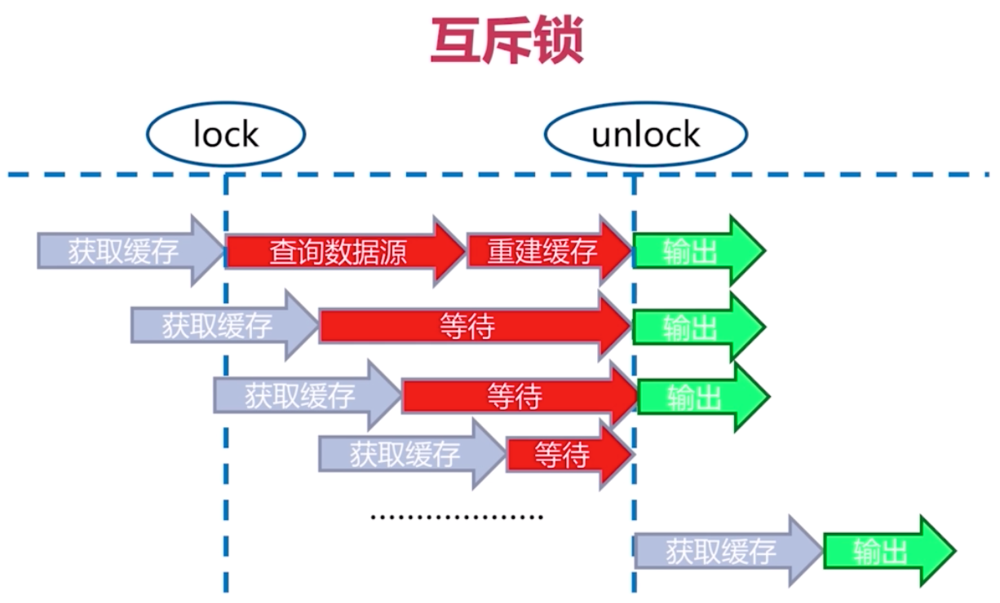

# 缓存穿透
当客户端请求查询缓存的时候，如果缓存查询得到结果，则返回缓存中的数据给客户端；缓存无法查询到数据时，会去查询存储层，并将数据存储到缓存层，再返回给客户端。

如果此时，客户端所请求查询的数据一直在缓存无法被找到，则会一直查询存储层，如果并发量巨大，服务端的压力就会急剧上升，此时缓存就相当于废了，这就是缓存穿透。

那遇到这种情况，要么是代码有bug了，导致一直无法从存储层查询到数据，因而缓存层也一直没有数据；要么是有恶意攻击，大量并发的去查询不存在的数据。

一般来说解决方案有：
1. 当存储层查询不到数据时，写一个空对象到缓存层中。这种方式可能会有如下问题：
    * 需要更多的key，这时一般可以通过过期时间解决
    * 缓存层和存储层数据“短期”不一致。
2. 使用布隆过滤器，将所有可能存在的数据哈希到一个足够大的bitmap中，一个一定不存在的数据会被这个bitmap拦截掉，避免了查询存储层，也即相当于给缓存层再加了一层缓存。这种方式比较适用于数据比较固定的情况。

# 缓存雪崩
当redis被当做缓存来使用时，如果redis宕机，这时请求则会来到存储层或者业务处理层。如果此时并发量巨大，那么就可能导致服务端压力急剧上升，恶劣的情况下还会有级联效应，各个依赖的服务都受影响，导致服务端逐个奔溃，这就是缓存雪崩。

当然redis只是一个例子，任何依赖资源都可能会引起雪崩，例如一个请求过来，需要A服务处理，而A会调用B和C，而B和C都会调用D，此时如果D不可用，会导致B和C都不可用，而B和C不可用也会导致A不可用，引发了雪崩。

一般解决方案有：
1. 采用redis sentinel或者redis cluster，在master节点宕机时能够及时的将从节点转变为master节点。
2. 流量控制，可以在网关处，或者负载均衡处进行流量控制，避免流量大批量进入服务端
3. 在用户层面，需要做一些柔和的提示，例如提示做一些加载动画，让用户进行等待
4. 服务熔断和降级
    * 熔断，来源于股市中，当波幅到一定的点位后，交易所为了控制风险而采取暂停交易的措施。用于软件系统中，也即关停一些处于过载的服务，防止引起更大的服务奔溃。
    * 降级，在整体资源快不够时，先暂时关闭某些服务，等到访问量下降后，再恢复服务。

以上措施中，熔断、降级和限流在微服务架构体系中十分常见。从用户角度来说只是某些功能的暂时不可用。

目前业界中普遍采用Hystrix作为服务的熔断和降级工具。

在服务熔断后，服务不会等待直到超时而是直接返回错误，这样可以直接快速响应。

参考：
1. [服务熔断、降级、限流、异步RPC -- HyStrix](https://blog.csdn.net/chunlongyu/article/details/53259014)
2. [谈谈我对服务熔断、服务降级的理解](https://blog.csdn.net/guwei9111986/article/details/51649240)

# 热点key重建
在使用redis做缓存的时候，会出现这样的情况：  
1. 查询的key是一个热点key，即key的访问量非常大，如时下的热点新闻
2. 缓存重新构建的时间比较长，或者比较损耗性能，如需要做一些计算之类的

如果我们采用通常的策略，即设置一个缓存过期时间，由于是热点数据，当缓存过期的时候，就会出现大量请求来重新构建缓存，如果缓存的构建需要复杂的计算，很有可能会拖垮服务端。

如何避免这种情况的发生？

## 采用互斥锁
在重建缓存的之前加一个互斥锁，其他线程等待该锁释放才可以获取数据
```javascript
function get(key) {
  value = redis.get(key)
  if(value == null) return value

  mutexKey = `mutex#${key}`
  if (redis.setnx(mutexKey, 1)) {
    redis.expire(mutexKey, 3 * 60) // 3 min
    value = db.get(key)
    redis.set(key, value)
    redis.del(mutexKey)

    return value

  } else {
    Thread.sleep(30)
    return get(key)
  }
}
```


在key过期的情况下，构建缓存时，如果获取到锁（redis.setnx），就进行缓存构建。  
如果获取不到锁，就等待30ms后再获取key，直到获取到为止。

这样有个弊端就是会造成连接堵塞，如果缓存迟迟构建失败，则会一直堵塞。因此最好有个退出机制，例如递归调用几次就不再递归。

## 延缓过期，并提前重建缓存
上述方式因为重建缓存导致了很多线程堵塞住，为了缓解这种情况，我们可以在缓存key即将过期的时候，延长下key的过期时间，并同时构建缓存

方式就是给缓存value设置一个timeout过期时间，这个时间比key的过期时间要早一些。  
当value的timeout到期时，延长value的timeout和key的timeout时间，并同时构建缓存。其他线程由于value的timeout被延长而依旧读取到旧值。
```javascript
function get(key) {
  key_mutex = `mutex#${key}`
  keyTimeout = 1 * 60 * 60 // 1hour
  value = redis.get(key)

  // 如果value.timeout已经过期，重新设置过期时间
  if(value.timeout <= now()) {
    if(redis.setnx(key_mutex, 3 * 60)) {
      value.timeout += 3 * 60 * 1000 // 3min
      // 重新设置过期时间，比vaue.timtout多2小时
      redis.set(key, value, keyTimeout * 2)

      // 重建缓存
      value = db.get(key)
      value.timeout = keyTimeout
      redis.set(key, value, keyTimeout * 2)
      redis.del(key_mutex)

      return value
    }
  } else return value
}
```

## 不设置缓存过期时间
首先如果key不过期，那么就不会出现热点key过期的问题。但是这里的不过期，只是在redis层面不设置key的过期时间。

然后我们把过期时间设置在value里面，如果当查询该热点key后发现value中的过期时间已经小于等于当前时间，那么通过开辟一个独立的线程去进行缓存构建，同时返回旧的value值。  
为了避免多个线程在构建缓存，需要用到分布式锁。

那么就会出现
```
  （T1）
获取缓存  ----无等待-------> 输出
获取缓存  ----无等待-------> 输出
   (T2)
获取缓存  ----发现value中的过期时间过期，进行异步更新-------> 输出旧值 （T4完成缓存构建）
  （T3）
获取缓存  ----无等待-------> 输出旧值
获取缓存  ----无等待-------> 输出旧值
  (T4)
获取缓存  ----无等待-------> 输出新值
获取缓存  ----无等待-------> 输出新值
```

如果使用node，由于是单线程异步的可以很简单做到这一点
```javascript
// 重新构建缓存，分布式锁还可以用redlock库来做
async function buildCache(key, value) {
  const keyMutex = `mutex:${key}`
  if (await redis.setnx(keyMutex, '1')) {
    // 避免锁无法释放
    await redis.expire(keyMutex, 3 * 60)
    // 获取最新的数据
    const newData = db.get(key)
    const newValue = JSON.stringify({
      data: newData,
      timeout: Date.now() + 10 * 60 * 1000
    })
    await redis.set(key, newValue)
    await redis.del(keyMutex)
  }
}

async function get(key) {
  const value = await redis.get(key)
  const {data, timeout} = JSON.parse(value)
  
  if (timeout <= Date.now()) {
    // 已经过期
    buildCache(key)
  }

  // 返回旧数据
  return data
}
```

# 分布式锁
感觉这篇文章分析的有道理

[Redis分布式锁的正确实现方式](https://www.cnblogs.com/linjiqin/p/8003838.html)
