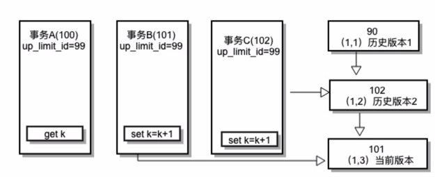

# 数据库事务
简单来说，事务就是满足ACID特性的一系列操作。我们可以用commit提交一个事务，也可以用rollback回滚事务。
```sql
- 事务开启
BEGIN
- 这里可以是一系列增删改查
COMMIT;
- ROLLBACK;
```

## ACID
### Atomicity原子性
即事务要么全部成功要么全部失败，中间有步骤失败就应该回滚。

例如A账户给B账户转账
```sql
begin transaction
update account set money = money - 100 where name='A';
update account set money = money + 100 where name='B';
if Error then
  rollback
else
  commit
```
如果没有原子性的话，A扣了100块钱后，突然断电了，那么B就没有加100，A却少了100。很明显这是不对的。

### Consistency一致性
数据库在事务执行前后都保持一致性状态。

在一致性状态下，所有事务对一个数据的读取结果都是相同的。

对银行转帐事务，假设在事务开始之前，A和B的账户总额为2000，那么不管事务成功还是失败，应该保证事务结束后ACCOUNT表中A和B的存款总额依旧为2000。

### Isolation隔离性
一个事务所做的修改在最终提交以前，对其它事务是不可见的。

例如两个事务都在对同个数据进行操作，如果没有相互隔离，那么将引起数据的不一致，进而可能导致错误。

举个栗子，假设有如下一张表:
```sql
mysql> CREATE TABLE t(val int) engine=InnoDB;
INSERT INTO t(val) values(1);
```
目前该表有一个字段，而且有一条数据，该字段值为1。接下来有两个事务，都对该表做如下操作

事务A | 事务B 
---------|----------
 启动事务，查询得到值1 | 启动事务
 - | 查询得到值1
 - | 将值1改为2
 查询得到值V1 | -
 - | 提交事务
 查询得到值V2 | -
 提交事务 | -
 查询得到值V3 | -

我们通过不同的隔离级别来分析V1、V2和V3的值

#### 未提交读（read uncommitted）
在这种级别下V1、V2、V3都是2，可以看到的是事务B在未提交时，V1查询到的结果已经是被事务B修改后的值，这种情况称之为脏读。也会有不可重复读和幻读的问题。

也就是说在这种级别下，事务中的修改，即使没有提交，对其它事务也是可见的。

这种隔离级别基本不会被用到。

#### 提交读（read committed）
在这种级别下，V1是1，V2和V3是2，可见其他事务在没有提交前，所做的修改对其他事务都是不可见的，一个事务只能读取已经提交的事务所做的修改。

这种级别，我们每次读取的时候就能够读取已经提交的数据，也解决了脏读的问题。

由于即使事务未提交，继续读取时如V2，拿到了其他事务提交后的值，也就导致了不可重复读的问题。

#### 可重复读（repeatable read）
在这种级别下V1、V2都是1，V3是2，可见事务开始后整个过程的数据都是一致的，前后读到的数据都不会变。

很多时候，我们希望在事务里面，只要我们没有修改数据，那么数据就不应该有变化，无论我们读取多少次，这就是可重复读，保证在同一个事务中多次读取同样数据的结果是一样的，这也就是可重复读的作用。

因此这种级别下，解决了脏读、不可重复读的问题，也解决可部分幻读问题。

为什么说只解决了部分幻读。举个栗子，如果我们事务B的update换成insert，我们选择插入一条数据，提交后（假设生成的id为2）事务A在提交前去查询数据，会发现查询不到这条事务B添加的记录，这说明解决了不可重复读和幻读。  

但是当我们事务A最后也insert一条id=2的记录，会发现最终报错了，但是事务过程中压根没查到这条记录，说明产生幻读了。

如果解决幻读呢，可以通过加锁的方式解决。
```sql
select ... lock in share mode
select ... for update
```
通过加共享锁和排它锁的方式，可以避免幻读。

#### 可串行化（serializable）
在这种级别下，事务B在执行到修改val值为2时会被锁住，必须等到事务A提交后才可以继续执行。此时V1和V2都是1，V3是2。

如果在执行事务的时候，有其他事务正在执行，那么它将等待其他事务执行结束之后才能被执行。相当于给数据加了锁。

#### 隔离性如何实现的
数据库会根据不同隔离级别判断如何创建和使用视图，通过视图来获取数据

隔离级别 | 视图创建时机
---------|----------
 可重复读 | 视图在事务启动时创建，整个事务期间都使用该视图
 提交读 | 视图在sql语句执行的时候创建
 未提交读 | 不使用视图
 串行化 | 不使用视图，采用加锁的方式

在mysql中，每条记录更新的时候都会同时记录一条回滚操作，通过这个回滚操作，都可以得到前一个状态的值

例如在一个事务里，一个字段从1改成2，再从2改成3，最终从3改成4，那么便会产生3个回滚操作：
```
-----------------------------------------
| （回滚段）                               |
|将2回滚为1 <--- 将3回滚成2 <---- 将4回滚成3 |  <----- 当前值4
-----------------------------------------
```

由此产生了数据的不同版本，这称之为MVCC（多版本并发控制）

具体的可以看这几篇文章：   
[数据库事务特征、数据库隔离级别，以及各级别数据库加锁情况(含实操)--read uncommitted篇](https://www.jianshu.com/p/d75fcdeb07a3)    
[MySQL数据库事务各隔离级别加锁情况--read committed && MVCC](https://www.imooc.com/article/17290)    
[MySQL数据库事务各隔离级别加锁情况--Repeatable Read && MVCC](https://www.imooc.com/article/17289)

### 锁
### 排他锁（X锁，悲观锁）
很多时候我们并不需要那么高的隔离级别，我们通过一种叫排他锁的也能够实现可串行化。

例如：`select * from goods where id = 1 for update;`

排他锁的申请前提：没有线程对该结果集中的任何行数据使用排他锁或共享锁，否则申请会阻塞。

for update仅适用于InnoDB，且必须在事务块(BEGIN/COMMIT)中才能生效。在进行事务操作时，通过“for update”语句，MySQL会对查询结果集中每行数据都添加排他锁，其他线程对该记录的更新与删除操作都会阻塞。排他锁包含行锁、表锁。

假设有A、B两个用户同时各购买一件 id=1 的商品，用户A获取到的库存量为 1000，用户B获取到的库存量也为 1000，用户A完成购买后修改该商品的库存量为 999，用户B完成购买后修改该商品的库存量为 999，此时库存量数据产生了不一致。

此时我们可以采用排他锁
```sql
begin;
select * from product where id=1 for update;
update product set count=count-1 where id = 1;
commit;
```
每次获取商品时，对该商品加排他锁。也就是在用户A获取获取 id=1 的商品信息时对该行记录加锁，期间其他用户阻塞等待访问该记录。悲观锁适合写入频繁的场景。

#### 乐观锁
加锁会对数据库有一定的性能损耗，因此我们还可以通过一种叫乐观锁的机制来实现上述过程
```sql
# 先读取产品数量
select * from product where id=1;

# 接下来开启事务
begin;
update product set count=count-1 where id = 1 and account = currCount;
commit;
```
注意这里的`and account = currCount`，通过程序中获取到的产品数量与数据库中的产品量相等才执行更新。

每次获取商品时，不对该商品加锁。在更新数据的时候需要比较程序中的库存量与数据库中的库存量是否相等，如果相等则进行更新，反之程序重新获取库存量，再次进行比较，直到两个库存量的数值相等才进行数据更新。乐观锁适合读取频繁的场景。

当然我们也可以给表加一个版本字段，每次更新行的数据时，版本就加1。然后更新的时候判断版本也是可以的。

### Durability持久性
一旦事务提交，则其所做的修改将会永远保存到数据库中。即使系统发生崩溃，事务执行的结果也不能丢失。

可以通过数据库备份和恢复来实现，在系统发生奔溃时，使用备份的数据库进行数据恢复。

## MVCC
提交读和可重复读都是通过一份数据快照的方式，保证数据读取时的一致性，只是他们获取快照的时间点不同，进而数据一致性也会有所不同。

那这份快照是怎么生成的，不可能每次事务开始的时候都去把表中的数据复制一份作为快照。mysql中其实是在MVCC中实现的快照功能，它也称之为**一致性试图**，也叫**consistent read view**。通过它便能支持RC(Read Committed)和RR(Repeatable Read)隔离级别的实现。

假设有如下表结构
```sql
CREATE TABLE `user` (
  `id` int(11) unsigned NOT NULL AUTO_INCREMENT,
  `name` varchar(255) DEFAULT NULL,
  `age` int(11) DEFAULT NULL,
  PRIMARY KEY (`id`)
) ENGINE=InnoDB;

Insert into user(name, age) values('Zhangsan', 20);
```

目前表中有1条zhangsan的记录，并且我们假设数据库的隔离级别为RR，即可重复读。

下列两个事务中①~⑤得到的zhangsan的age是什么，两条update语句的现象是什么样的？

线程A | 线程B
---------|----------
 start TRANSACTION; | start TRANSACTION;
 select * from user; ① | -
 update user set age=age+1 where name='Zhangsan'; | -
  - | select * from user; ②
 select * from user; ③ | update user set age=age+1 where name='Zhangsan';
 commit; | select * from user; ④
  - | commit;
  select * from user; ⑤ | -

首先是①的查询，毋庸置疑age是20；  
然后线程A执行update语句成功；  
线程B的②，由于RR隔离级别的原因，读取的age依旧是20；  
线程A的③，读取的age是21；  
线程B执行Update时会被block住，必须等待线程A事务提交；  
线程A提交事务后，线程B的update执行成功；  
线程B的④，读取的age是22；最后提交事务；  
最终⑤读取到的age就是22。

这里线程A的一系列操作我们都能理解，就是在线程B的update语句的结果，我们看到了不一样的地方。  
在线程B的②中，读取的age是20，但是执行update语句后，在事务提交前，select读取的age却是22。这是为什么呢？

要知道这个原因，就得知道快照在MVCC里是怎么工作的。

### 快照在MVCC里是怎么工作的
事务在每次开始的时候，都会通过自增生成一个transaction id。而表里的每行数据在添加的时候都会记录对应的事务id，标记为`row trx_id`。当更新该行记录的时候，也会对应的更新事务id。

同时旧的记录的事务id也会作为历史版本被保留，我们通过这些事务id便能快速的定位到这些版本，通过一定的方式得到旧记录中行里的数据。

可以用简单的示意图来理解这个版本变更的过程
```
V1 age=20          V2 age=21          V3 age=22          
row trx_id=10 <--- row trx_id=15 <--- row trx_id=20
```

当前版本为V3，更新它的事务对应的事务id为17。但是其实数据库并不会去记录每个记录中字段的值是什么，而是通过回滚日志undo log来计算出来的。例如要知道V2版本中age的值，只需要拿到V2到V3的操作日志，这里为age=age+1，那么就可以反推出V2中age的值，即age=age-1。同样的道理V1中的数据就是由V3、V2的undo log计算而来。

基于这个理论，来分析可重复读是如何做到数据读取一致性的。

当隔离级别是可重复读时，会在事务开始的时候，去获取一份数据快照，然后在事务运行期间，这份快照是不变的。  
这个快照的获取方式是这样的：  
1. 找到已经提交的事务的最大事务id，记录为`up_limit_id`。  
2. 在之后查找数据的时候，会去比较数据的版本对应的`row trx_id`和`up_limit_id`，逐个版本遍历，找到一个`row trx_id`小于等于`up_limit_id`的版本，使用它作为查询的结果
3. 自己事务里做了更新操作，后续的查询查询的就是自己更新后的结果。

有了这套方法，即使其他事务里去做任何更新操作，也不会影响本事务的查询结果。

以上面示意图为例子，如果我们事务开始的时候拿到的最大事务id为18，即`up_limit_id=18`

当我们要查询age的时候，此时V3是另外一个事务（id为20）做的更新操作，由于`20>18`，所以就放弃了该版本，来到V2的版本  
V2中`row trx_id=15`，刚好15<18，因此这个版本是合适的，通过undo log，计算出age=21，并最终作为查询结果返回。

InnoDB的这个功能，让数据库做到了瞬间就能拿到数据快照的能力。

### 数据的更新逻辑
```sql
mysql> CREATE TABLE `t` (
  `id` int(11) NOT NULL,
  `k` int(11) DEFAULT NULL,
  PRIMARY KEY (`id`)
) ENGINE=InnoDB;
insert into t(id, k) values(1,1),(2,2);
```

线程A | 线程B | 线程C
---------|----------|---------- 
begin | - | -
select * from t where id=1; | - | -
 - | begin | -
 - | select * from t where id=1; | -
 - | - | update t set k=k+1 where id=1;
 - | update t set k=k+1 where id=1; | -
 - | select * from t where id=1; ① | - 
 - | commit; | -
 select * from t where id=1; ② | - | -
 commit | - | -

这里线程C中，没有显示的开启事务，我们的假设是数据库的`autocommit=1`，即每条sql语句都是自动提交事务的，因此它的update语句执行完后就会立马提交事务。

结果为①得到的k是3，②得到的k是1

分析：

假设当前在线程A的事务开启之前，数据库的最大事务id为99。id=1的那一行，当前的`row trx_id=90`。三个线程的事务开启后，id分别为100，101，102。



第一个被提交的事务为事务C，将k由(1,1)变成(1,2)，并且修改了该行数据最新的`row trx_id=102`。

第二个做更新的事务是事务B，因为要执行的是更新语句，所以引擎不会去采用快照的方式读取，而是读取最新数据，称之为“当前读”，数据即(1,2)，因此它便把(1,2)变成了(1,3)，并且更新了`row trx_id=101`，此时自己的`up_limit_id`还是99。  
接下来事务B查询的时候，由于自己的事务id和当前的`row trx_id`均为101，也就是说之前的更新是自己的事务做的，这个必须承认，所以也就拿到了k=3的值。

到了最终事务A去读取的时候了，由于事务A的`up_limit_id`依旧为99，查询的时候，它会先看到101的版本，发现大于自己的id，便放弃掉，继续往前搜索。接下来是102的记录，依旧大于它，还是放弃，然后就到了90的记录，发现小于99，符合要求，于是取了它的值，即k=1。

现在我们知道了，update语句通过当前读拿到的当前最新值。如果我们给select语句加上锁，也是能使用当前读的功能拿到最新值的，如下所示：
```sql
# 加写锁（X锁，排他锁）
select * from t where id=1 for update;
# 加读锁（S锁，共享锁）
select * from t where id=1 lock in share mode;
```
通过上面两种方式读到的k值都是3。

另外还有一点要说明的是，事务在启动的时候除了获取最大事务id外，还要检查有没有尚未提交的事务，将他们加入一个列表中，之后的查询结果都要屏蔽这个事务里的更新操作。

例如新开启的事务id为100，当前最大事务id为99，如果数据库中还有个事务id为90的事务还在执行，如果不屏蔽的话，如果99的事务也更新了数据，此时`row trx_id=90`，而id为100的事务中，`up_limit_id=99`，由于`row trx_id`小于`up_limit_id`，所以导致查到了更新后的值，读不一致了。

因此InnoDB需要在事务中，屏蔽那些之前尚未提交的事务。
