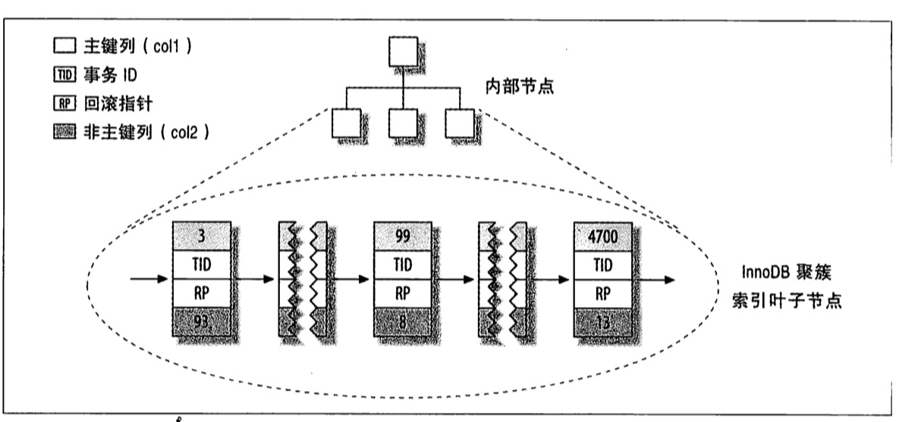
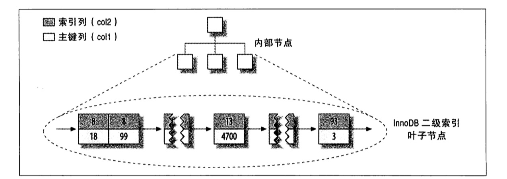
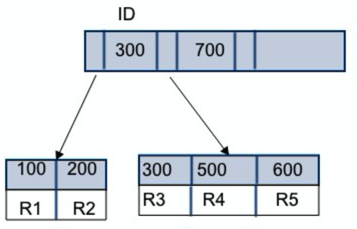

# 索引
索引是在存储引擎层实现的，不同的存储引擎的索引的工作方式也不一样，也不是所有的存储引擎都支持所有类型的索引，即使多个存储引擎支持同一种类型的索引，底层实现方式也可能不一样。

mysql中的索引采用的是B+Tree这种数据结构来存储数据，因此采用索引查找的时候会有最左前缀的限制，即与创建表时定义索引的顺序有关。

```sql
CREATE TABLE People (
  last_name VARCHAR(50) NOT NULL,
  first_name VARCHAR(50) NOT NULL,
  dob DATE NOT NULL,
  gender ENUM('m', 'f') NOT NULL,
  KEY(last_name, first_name, dob)
)
```
上述sql语句指定了一个联合索引（last_name, first_name, dob）。

该sql相当于创建了三个索引
1. last_name
2. last_name, first_name
3. last_name, first_name, dob

由此可见，实际情况中，应该讲查询语句中where子句中使用最频繁的一列放在索引的最左边，如上面的last_name，优先级最高。

接下来分情况讨论

### 全值匹配
当你的查询语句中查询条件包含这三个索引字段时，mysql就能使用索引
```sql
SELECT * FROM People WHERE last_name='Allen' AND first_name='Cuba' And dob='1991-10-21';
```
该sql能够有效利用mysql索引。

如果把sql稍微改变下
```sql
SELECT * FROM People WHERE first_name='Cuba' And dob='1991-10-21' AND last_name='Allen' ;
```
这里查询条件中索引字段的顺序被调换了位置，是否依旧能够利用索引进行查询呢？  
答案是可以的，mysql中对这种情况有进行优化过。

### 匹配最左前缀
当只使用部分索引字段时，必须按照索引顺序来使用，如下面的sql只使用了第一列：
```sql
SELECT * FROM People WHERE last_name='Allen';
```
也可以使用索引前两列：
```sql
SELECT * FROM People WHERE last_name='Allen' AND first_name='Cube';
```

下面的查询都不满足最左前缀（参考上述描述中创建的三个索引），例如下面的语句都是无法使用索引：
```sql
SELECT * FROM People WHERE first_name='Cuba';
SELECT * FROM People WHERE dob='1991-10-21';
SELECT * FROM People WHERE first_name='Cuba' AND dob='1991-10-21';
SELECT * FROM People WHERE last_name='Allen' AND dob='1991-10-21';
```
mysql会根据创建的索引顺序，即最左前缀规则，逐个去查询语句中逐个查找。  
第一个查找的是last_name，上述四个sql语句中，都不包含该列，所以都无法使用到索引。

### 匹配列前缀
可以只匹配某一列的值的开头部分，例如以`Al`开头的last_name；
```sql
SELECT * FROM People WHERE last_name LIKE 'Al%';
```
但是如果是模糊匹配以`len`结尾则无法使用索引，如下面的sql：
```sql
SELECT * FROM People WHERE last_name LIKE '%len';
```
同最左前缀一样，这里也只能使用第一列进行模糊匹配，如下面这条sql就无法利用first_name的索引。
```sql
SELECT * FROM People WHERE first_name LIKE 'Cu%';
```

### 匹配范围值
例如可以查找last_name在`Allen`和`Mike`的人。
```sql
SELECT * FROM People WHERE last_name IN ('Allen', 'Mike');
```
虽然用了IN，但是其实也只是相当于被拆分成多个条件，因此能够利用所以查询，如下所示：
```sql
SELECT * FROM People WHERE last_name='Allen' AND last_name='Mike';
```

### 精确匹配某一列并范围匹配另外一列
查询语句中可以有精确匹配，也可以有模糊匹配
```sql
SELECT * FROM People WHERE last_name='Allen' AND first_name LIKE 'Cu%';
```
但是此时，如果还是用了dob作为查询条件，是无法使用dob的索引的。  
换句话说，即如果查询有某个列的范围查询，则其右边的所有列都无法使用索引优化查找。
```sql
SELECT * FROM People WHERE last_name='Allen' AND first_name LIKE 'Cu%' AND dob = '1991-10-21';
```

以上列出了几种查询情况能够使用索引的方式，当然这些不仅是在`WHERE`子句中生效，在`ORDER BY`只要满足上述查询方式，索引依旧有效。

## 索引下推
考虑这条sql
```sql
SELECT * FROM People WHERE last_name LIKE 'Al%' and first_name = 'Cube';
```
我们知道由于最左前缀规则的原因，索引只能使用到last_name过，first_name是无法使用到索引的，假设我们查找到1000条以al开头的last_name时，这时候就得回主键索引表查询剩余的字段进行匹配，这个回表次数也是1000次。

到了mysql 5.6，它引入一个叫索引下推优化(index condition pushdown)，可以在索引遍历过程中对索引中包含的字段优先做判断，直接先过滤掉不匹配的数据，减少回表操作。

如上面再查找完last_name后，会继续在联合索引中查找符合Cube的first_name。假设两个条件最终找到50条的话，那么只需回表50次就能查找到剩余的字段的值。

## 哈希索引
哈希索引是基于哈希表实现的，只有精确匹配索引所有列的的查询才能有效。存储引擎会对所有索引列计算一个哈希码，它是一个较小的值。然后引擎会维护一个哈希表，key为之前计算的哈希值，value是对应行的指针。

在查找数据时候，先计算列对应的哈希值，通过哈希表找到行指针，还要对比行指针中列的数据是否是之前指定的数据。

在mysql中，只有Memory引擎显示支持哈希索引，也是它的默认索引。  
另外，Memory引擎支持非唯一哈希索引，如果多个列的哈希值相同，索引会以链表的方式存放多个记录指针到同一个哈希条目中。

```sql
CREATE TABLE testhash (
  fname VARCHAR(50) NOT NULL,
  lname VARCHAR(50) NOT NULL,
  KEY USING HASH(fname) 
) ENGINE=MEMORY
```
网数据库中插入几条测试数据

fname | lname 
---------|----------
 A1 | B1 
 A2 | B2 
 A3 | B3 
 A4 | B4

引擎中的哈希函数，假设为hash()，可能会有如下值返回
```
hash('A1') = 2323
hash('A2') = 7437
hash('A3') = 8784
hash('A4') = 2458
hash('A5') = 2458
```

这时哈希引擎维护了如下这样一张哈希表：

槽（slot） | 值（value）
---------|----------
 2323 | 指向第1行的指针
 2458 | 指向第4行的指针 --> 指向第5行的指针
 7437 | 指向第2行的指针
 8784 | 指向第3行的指针

这时如果你的sql如下
```sql
SELECT * FROM testhash WHERE fname='A3';
```
这时将fname哈希后值为8784，通过哈希表知道它`指向第3行的指针`，故能快速定位到表的第3行中，这个是常数时间。

虽然哈希索引很快，但是也有一些弊端
1. 由于采用的是将索引字段哈希，故无法用于排序
2. 哈希索引只包含哈希值和行指针，而不存储字段值，无法使用索引中的值来避免读取行
3. 哈希索引不支持部分索引匹配查找，因为哈希索引始终使用索引列的全部内容来计算哈希。因此如果在数据列(A,B)上建立哈希索引，如果只查询数据列A，则无法使用该索引。
4. 哈希索引只支持等值比较查询
5. 当出现哈希值冲突时，底层采用了链表来存储所有的行指针，此时需要逐个遍历行指针。例如上面示例中A5的哈希值和A4一样，则哈希表会维护一个链表，遍历后能够知道A5在第5行。
6. 哈希冲突很多的话，对数据的删除很不利。因为每次删除数据，需要逐个遍历链表找到对应的行，删除对应行的引用。

鉴于以上弊端，我们很少直接使用哈希索引。如果我们既想使用哈希索引高效的查找速度，也想拥有B+Tree索引的特性（如：排序、部分列查找）该怎么办。这时我们可以在B+Tree基础上创建一个伪哈希索引

### B+Tree和哈希索引结合
有这样一个场景，假设我们经常需要通过一个url来查询，而由于url本身很长，索引存储的内容很大，性能上会不大好，如果我们增加一个url_crc的列，它是个整型值，值来自于url的crc32值，由于crc32的值都会比较短，性能上能够得到提高。

```sql
CREATE TABLE btreehash (
  id INT UNSIGNED NOT NULL auto_increment,
  url VARCHAR(255) NOT NULL,
  url_crc INT UNSIGNED NOT NULL DEFAULT 0,
  PRIMARY KEY(id)
)
```

接下来创建一个触发器，在每次写入和更新的时候都自动计算url_crc值
```SQL
DELIMITER //

CREATE TRIGGER btreehash_crc_ins BEFORE INSERT ON btreehash FOR EACH ROW BEGIN SET NEW.url_crc=crc32(NEW.url);
END;
//

CREATE TRIGGER btreehash_crc_upd BEFORE UPDATE ON btreehash FOR EACH ROW BEGIN SET NEW.url_crc=crc32(NEW.url);
END;
//

DELIMITER ;
```
创建测试数据
```sql
INSERT INTO btreehash (url) VALUES ('http://www.mysql.com')
```
数据如下

id | url | url_crc
---------|----------|---------
 1 | http://www.mysql.com | 1560514994

这时我们用如下查询语句查询
```sql
SELECT id, url FROM btreehash WHERE url_crc = crc32('http://www.mysql.com') AND url = 'http://www.mysql.com';
```
由于`url_crc`是个整型值，会比字符串的查找效率更高，而且存储的数据更少。

这里需要注意的是查询条件中记得带上url字段，否则有可能因为哈希冲突查找到多行数据。

## 聚集索引和非聚集索引
### 聚集索引（聚簇索引）
数据行的物理顺序（存储在磁盘的顺序）和某一列（一般是主键那一列）的逻辑顺序相同，一个表中只能有一个聚集索引。

也就是说如果有某一列采用了聚集索引，那么该列是可以排序的，并且决定了表的排序顺序，从而决定了在物理存储中的存储顺序，也因此一张表中只能有一个聚集索引。

举个栗子：  
一张表就好比新华字典，聚集索引就像是拼音目录（A-Z排序），每个字存放的页码就是数据的物理地址。  
当我们需要查找一个“我”字时，会去拼音目录查找`wo`所在的页码，便可以定位到“我”字所在的位置。也就是说，拼音目录对应的A-Z的顺序，和实际文字的顺序是一样的，也就是说索引的顺序决定了物理存储的顺序。

对应到索引文件中，聚集索引的b+tree中，叶子节点保存了完整的数据记录，因此通过聚集索引可以快速的找到数据。

在mysql的表中，主键就是聚集索引，如果没有主键，则会选择一个唯一的非空索引代替，如果没有这样的索引，InnoDB会隐式定义一个主键来作为聚集索引。

一般在建表的时候就会创建聚集索引。如果表中已经有大量数据，这时再创建聚集索引，由于数据需要重新进行排列，这个过程将会十分耗时。

聚集索引的每一个叶子节点都包含了主键值、事务ID、用于事务和MVCC的回滚指针以及所有的剩余列  
考虑如下表:
```sql
CREATE TABLE table (
  col1 INT NOT NULL,
  col2 INT NOT NULL,
  PRIMARY KEY(col1),
  key(col2)
)
```
则innoDb存储方式如图


```sql
CREATE TABLE t (
  id INT PRIMARY KEY,
  name VARCHAR(255)
)
```
上述sql创建了一个t表，由于id是主键，因此数据库将会自动在该表上的id字段建立聚集索引

考虑如下sql
```sql
SELECT name FROM t WHERE id = 2;
```
由于id是聚集索引，索引中除了包含主键值，还会有name这个非索引列，可以直接被查询到，而不需要去二次查找表数据，效率非常高。

### 非聚集索引
非聚集索引中，数据行的物理顺序和索引的逻辑顺序是不同的，因此一个表中可以有多个非聚集索引。换句话说，就是索引文件和数据文件分开存储了。

举个栗子：  
例如新华字典中可以按照偏旁来查找文字，偏旁就是索引，偏旁的顺序，也就是索引的顺序，但是它和文字的顺序是不一样的，偏旁需要记录文字的拼音所在的页码，通过该页码能够找到文字的位置。

如果是MyISAM引擎，采用的就是非聚集索引，叶子节点中存储的是一个指针，指向对应数据行的指针。

而对于innoDb，非聚集索引的叶子节点中存储的不是“行指针”，而是主键值，并以此作为指向行的“指针”，因此如果非聚集索引不包含待查询的列，就需要通过该主键值去聚集索引中进行二次查找。  



也就是说，非聚集索引的值是表的主键，因此使用非聚集索引查询数据时，大部分情况下都需要回表查询，也就是说通过非聚集索引查询到主键id，然后通过该id，回到聚集索引中定位到该数据行，也就是需要两次索引查找。

如何减少两次索引查找，那就需要优化我们的查询字段，例如你只需要查询主键id时，就不要去使用`select *`这样的查询了。

假设有如下表
```sql
CREATE TABLE t (
  id INT PRIMARY KEY,
  name VARCHAR(255),
  dob DATE NOT NULL,
  KEY(name)
)
```
其中id是聚集索引，name是非聚集索引。此时如果进行如下查询都是可以直接通过索引获取到数据
```sql
SELECT id FROM t WHERE name = 'hello';
SELECT name FROM t WHERE name = 'hello';
SELECT id, name FROM t WHERE name = 'hello';
```

但是如果是下面的sql
```sql
SELECT dob FROM t WHERE name = 'hello';
```
上述sql需要二次的查询去获取原数据行的dob

这时候可以采用复合索引，将(name, dob)作为非聚合索引，这样便可以不需要获取原数据行了。但是需要注意的就是，联合索引会受最左前缀影响，这个在之前介绍索引时已经讲了。

聚集索引和非聚集索引总结：
1. 聚集索引的查询效率会比非聚集索引高，，但是写入的性能不高，因为数据在磁盘中排好序存储的，如果新插入数据，则需要移动后面的数据
2. 非聚集索引可以采用联合索引的方式，这样性能也会很高
3. 小数据量的表不要建立索引

## 索引的维护
我们知道索引是采用B+树实现的，那么为了维护树的有序性，那么在插入和删除新值的时候就需要调整树的结构。



来看看插入一条数据的情况。假如我们要插入一条ID为700的新的数据行，此时只需要在R5的记录后面插入即可。

但是如果需要插入的ID为400，便需要挪动R4之后的数据了。严重的情况下，R5所在的数据页已经满了，需要新开辟一个新的数据页，然后挪动部分数据过去，这个过程称之为*页分裂*。出现这种情况，性能就会受到影响。

有页分裂就会有页合并，当你删除了部分数据时，就会触发页合并。

## 应用
### 主键id为什么建议使用自增id，什么时候业务字段也可以作为主键
之前说到，新插入的数据的id，根据插入的位置，会引发页分裂导致数据库的性能问题。当是当我们插入的数据的id是自增的，那么就不会有挪动数据的问题了，也不会触发页分裂的问题了。而如果使用业务字段作为主键，它的插入位置是不确定的，便容易引发页分裂问题。

正因为如此，我们才正常情况下都会使用自增id作为主键。

从存储空间来看的话，假设你使用了像身份证号这样的字符串类型的字段作为主键，它的长度有20个字节，那么首先你的聚集索引会比较大，最重要的是，由于非聚集索引存储的值是主键字段，也就导致了每个非聚集索引叶子节点的大小至少是20个字节。而如果只是使用int类型作为自增id的主键的话，一个int才4个字节，这个数据量很大时空间的节省是非常可观的。

那什么时候业务字段也能作为主键呢？   
很简单，就是你的表只有一个索引，并且为唯一索引的时候，那么可以将该唯一索引作为主键，也就不用考虑其他非聚集索引导致的问题了。

### 重建普通索引和重建主键索引
```sql
alter table T drop index k;
alter table T add index(k);

alter table T drop primary key;
alter table T add primary key(id);
```

很多时候，我们发现索引导致了严重的页分裂时，会选择重建索引来重新分配空间，提高空间利用率。

重建普通索引是合理的，可以达到节省空间的作用。

但是利用上述后两台语句的方式来重建主键索引就不合理了。这种方式下，重建索引后，会使得普通索引k也得重新建立，性能损耗很大。

这时应该采用系统优化的方式：
```sql
alter table t engine=INNODB;

# OR 
optimize table t;
```

### 使用索引来排序
索引本身是排序的，因此查询的时候可以利用索引来对数据进行排序。采用explain查看sql的时候，如果type列的值为`index`，则说明mysql中使用了索引扫描来做排序。

索引的列顺序和order by子句的顺序必须完全一致，并且所有列的排序方向也必须一致，mysql才能使用索引来对结果做排序。

记住：order by和查找型查询的限制是一样的，都要遵循最左前缀的要求，否则mysql无法利用索引排序。有一种情况例外，下面的例子会分析。

看一张表
```sql
CREATE TABLE `score` (
  `id` int(11) unsigned NOT NULL AUTO_INCREMENT,
  `classId` int(11) DEFAULT NULL,
  `subjectId` int(11) DEFAULT NULL,
  `score` int(11) DEFAULT NULL,
  `date` date DEFAULT NULL,
  PRIMARY KEY (`id`),
  KEY `classId` (`classId`,`score`,`subjectId`)
)
```

##### 查询1
```sql
EXPLAIN SELECT score FROM score WHERE classId=113 ORDER BY score
```
结果为：  
1. type: ref
2. key: classId
3. Extra: Using where;Using index

order by不满足最左前缀规则，这时却可以利用到索引，并且没有出现文件排序(filesort)，这是因为`WHERE`语句中，classId是个常数值。

也就是说`WHERE`或者`JOIN`中对这些前导列指定了常量，可以让`order by`不满足最左前缀规则。前导列和order by列共同组成了最左前缀。

但是如果是下面的语句就会文件排序了，因为前导列和order by列无法组成最左前缀
```sql
EXPLAIN SELECT score FROM score WHERE classId=113 ORDER BY subjectId;
```
结果为：  
1. type: ref
2. key: classId
3. Extra: Using where;Using index;Using filesort

##### 查询2
```sql
EXPLAIN SELECT score FROM score WHERE classId=113 ORDER BY score desc, subjectId asc;
```
结果为：  
1. type: ref
2. key: classId
3. Extra: Using where;Using index;Using filesort

由于采用了两种不同的排序方式，所以无法使用索引排序

##### 查询3
```sql
EXPLAIN SELECT score FROM score WHERE classId=113 ORDER BY score, date;
```
1. type: ref
2. key: classId
3. Extra: Using index condition; Using filesort

sql中order by里引用了不在索引中的列，导致无法索引排序。

##### 查询4
```sql
EXPLAIN SELECT score FROM score WHERE classId=113 ORDER BY subjectId
```
1. type: ref
2. key: classId
3. Extra: Using where; Using index; Using filesort

该sql无法构成最左前缀，无法采用索引排序

##### 查询5
```sql
EXPLAIN SELECT score FROM score WHERE classId=113 AND score IN (1,2) ORDER BY subjectId
```
1. type: ref
2. key: classId
3. Extra: Using where; Using index; Using filesort

虽然已经构成了最左前缀，但是对于排序上来说，这是一种范围查询

## 注意事项
1. 索引不会包含有NULL值的列。即索引无法利用NULL值的列，尽量不要将索引列的默认值为NULL
2. 使用短索引。如果索引列的前n个字节里，多数的值是唯一的，那么可以不要将整个列都设置索引，将索引长度设置长度为n，节省磁盘给空间和I/O操作
3. 索引列排序。mysql查询中只能使用一个索引，如果where子句中已经使用了索引的话，那么order by中的列是不会使用索引的。最好采用数据库默认排序，也尽量不要包含多个列的排序。
4. 不要使用NOT IN和<>操作

### 冗余索引优化
假设有如下表结构
```sql
CREATE TABLE `geek` (
  `a` int(11) NOT NULL,
  `b` int(11) NOT NULL,
  `c` int(11) NOT NULL,
  `d` int(11) NOT NULL,
  PRIMARY KEY (`a`,`b`),
  KEY `c` (`c`),
  KEY `ca` (`c`,`a`),
  KEY `cb` (`c`,`b`)
) ENGINE=InnoDB;
```
即我们使用a、b字段作为联合主键，并且还建立了三个非聚集索引c、ca、cb

如果我们有如下查询需求：
```sql
select * from geek where c=N order by a limit 1;
select * from geek where c=N order by b limit 1;
```
请问上述建立ca和cb索引的方式是否合理。

我们知道非聚集索引的叶子节点会存储主键，因此ca索引下还会有b的值，也即构成了cab，这和索引c的组成是一样的。    
我们使用第一条sql查询的时候，只有索引c就能够利用到a来进行索引排序了，因此ca索引是多余的。

而当我们用第二条sql查询时，只用c索引是无法满足索引排序的，因此需要建立cb索引优化排序。

可以用下面的具体例子来更深入解释

主键(a,b)组成了表的物理顺序，假设如下：   
```
–a--|–b--|–c--|–d--
1     2     3   d
1     3     2   d
1     4     3   d
2     1     3   d
2     2     2   d
2     3     4   d
```
采用主键排序，先按a排序，再按b排序，c无序，相当于如下：
```sql
select * from geek order by a,b;
```

索引ca的排序为，先按c排序，再按a排序，同时记录主键，这里便是主键的另外一个字段b，由此构成cab
```
–c--|–a--|–b--
2     1    3
2     2    2
3     1    2
3     1    4
3     2    1
4     2    3
```
这和只使用索引c是一样的。

而索引cb的排序为，先按c排序，再按b排序，同时记录主键a，构成cba
```
–c--|–b--|–a--
2     2    2
2     3    1
3     1    2
3     2    1
3     4    1
4     3    2   
```
因此cb索引不能删除。

参考资料:
1. [SQL中的索引](https://zhuanlan.zhihu.com/p/33222651)
2. [聚集索引与非聚集索引的总结](https://www.cnblogs.com/s-b-b/p/8334593.html)
3. [mysql组合索引与字段顺序](https://blog.csdn.net/gang_strong/article/details/54289433)
4. [MySQL索引原理及慢查询优化](https://tech.meituan.com/mysql-index.html?utm_medium=social&utm_member=OTI0MTY3NzhiZWZjMzQ5MGU0MmQ4NDA5NDMxMDEwY2U=&utm_source=wechat_session&from=singlemessage&isappinstalled=0)
5. [MySQL索引背后的数据结构及算法原理](https://www.cnblogs.com/tgycoder/p/5410057.html)
