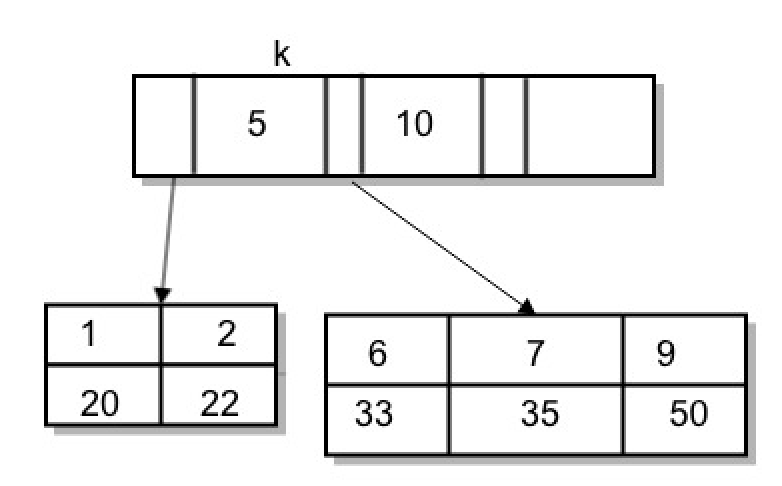

# 索引的性能
当我们需要给一个字段添加索引的时候，我们可以添加唯一索引也可以添加普通索引。当我们的业务代码已经保证了不会重复写入数据的时候，这两种索引在使用上便没有什么区别了。

但是在数据库的性能考虑的话，这两种索引真的没有区别么？

分析两者的性能差别，需要从索引的使用来看，使用索引会涉及到的有查询和更新

## 查询
```sql
select id from t where k=6';
```
所以是基于B+树进行构建的，因此采用索引查找数据时候也是基于树进行查找的。最终会定位到对应的叶子节点，也就是对应的数据页。然后在数据页中查找指定的数据。



如果是普通索引，那么在查找到第一个匹配的记录(6,33)后，它还需要继续往后面找，直到遇到第一个不满足条件的记录，这里是(7,25)。   
为什么是第一个不匹配的呢，因为索引是有序的。

如果是唯一索引，那么查找到第一个匹配的记录(6,33)后，就不需要继续往后面找了。

看起来好像唯一索引的查找会更快一点，毕竟不需要再继续查找了。  
但其实这个性能的差异是非常小的。

正如上面看到的，InnoDb在读取数据的时候，并不是直接去磁盘中把这条数据读取出来，而是数据所在的数据页读取出来放入内存中，每个数据页的大小为16KB。

引擎定位到数据在数据页中的位置后，后续的查找就在数据页中操作了，由于是在内存中，无非就是指针的移动和计算罢了。所以说性能差异非常小。

但是如果我们要查找的数据刚好在数据页的最后一条，那么引擎之后还需要再将下一个数据页从磁盘中读取出来，从下一个数据页继续读取数据，这种性能损耗就会比较大。

但是这种情况发生的概率比较低，所以整体来说，在查询上，普通索引和唯一索引的性能差异不大，基本可以忽略不计。

## 更新
更新一个数据，需要理解一个概念，**Change Buffer**

当需要更新一个数据的时候，如果数据所在的数据页已经在内存中，就直接进行更新。  
如果这个数据页还没有在内存中，在不影响数据一致性的前提下，InnoDB引擎会将更新操作缓存在一个叫change buffer的内存块中。   
在下次查询的时候，由于数据页已经在内存中了，然后再执行change buffer中与这个页有关的操作，就能得到正确的数据。

数据库会定期的去将change buffer中的操作应用到数据页中，即purge操作。

由于更新是记录在change buffer中，也即是在内存做的操作，减少了和磁盘间的交互，所以更新语句的执行性能会得到很大的提升。

对于唯一索引来说，由于在更新的时候是需要做一次唯一性约束的校验的，那么需要将数据页读到内存中才能进行判断。但是如果数据已经在内存中了，我们其实可以直接操作内存就可以了，并不需要使用到change buffer。  
才能对于唯一所以来说，它并不会用到change buffer。

change buffer有一部分是在内存里的，存在于内存buffer pool里，可以通过下面的配置进行设置大小
```
# change buffer 最多只能占用50%的buffer pool
innodb_change_buffer_max_size=50
```

change buffer的另外一部分在磁盘里，存在于系统表空间ibdata1里。

### 实际案例
```sql
INSERT INTO t(k) VALUES(8); 
```
如果这个数据应该在的数据页已经在内存中了：
1. 如果是唯一索引，找到7和9之间的位置，判断有没有冲突，如果没有，插入数据；
2. 如果是普通索引，找到7和9之间的位置，然后插入。

如果这个数据应该在的数据页不在内存中：
1. 如果是唯一索引，需要将数据页读入内存中，判断是否有唯一键冲突，如果没有，插入到内存的数据页中。
2. 如果是普通索引，则将操作记录在change buffer中，结束语句。

由此可见，唯一索引有可能会有频繁的IO操作，而普通索引总是在进行内存间的操作，性能可想而知。

### change buffer的应用场景
其实也可以说是普通索引的应用场景。如果你的业务有频繁的写操作，但是读很少，例如日志系统、账单系统等等，就非常适合采用change buffer。

采用change buffer最好的情况就是，大量的写的操作记录都记录在change buffer中，然后在某个时刻批量purge到磁盘的数据页中。一般来说这个时刻会是查询数据页的时候，或者数据库手动关机的时候。

但是如果说，你的表会有大量的写和读操作，那么采用change buffer就会有性能问题了。在将写操作记录在change buffer后，又立马有读操作来让change buffer中的记录purge到数据页中，这时change buffer中的记录也不是很多，这种情况反而增加了change buffer的维护代价，得不偿失。

因此如果是这种情况，最好就是关闭change buffer功能。

### 结论
分析了读取和更新操作的流程，我们能够知道，如果你的表有频繁的更新操作（insert、update、delete），采用普通索引，性能会非常好。当然，如果更新操作后马上伴随读取的话，最好关闭change buffer功能。

在读取方面，唯一索引和普通索引没有多少的性能差别。

### 综合redo log 和 WAL
从一条sql语句分析说起
```sql
insert into t(id,k) values(id1, k1), (id2,k2);
```
假设k1所在的数据页page1在内存中，k2所在的数据页page2不在内存中。

执行流程如下：
1. page1在内存中，直接更新内存，即page1中插入(id1,k1)
2. page2不在内存中，就在内存(buffer pool)的change buffer区域，记录“需要在page2中写入(id2,k2)”
3. 将1和2的过程一起写入redo log中。

至此，这条sql的执行就结束了，事务便也可以提交了。效率非常高，性能非常好。

接下来我们需要读取这两条数据了
```sql
select * from t where k in (id1,id2);
```
假设读取的时间，在上述写入操作之后，这是为了避免change buffer中的数据已经被purge回磁盘的数据页了。

过程如下：
1. 读取page1时，直接从该数据页读取数据。这时候，虽然磁盘中的数据还是旧的，但是我们返回的数据是最新的数据。
2. 读取page2时，由于page2不在内存中，需要从磁盘中读取到内存里，然后将change buffer里的操作执行到page2中，产生正确的结果。
3. 将1和2的结果返回。

**如果内存中的change buffer在还没有purge回内存时，机器断电了，重启后会不会丢失change buffer里的数据，进而丢失更新的数据？**  
buffer change有部分记录是已经写入到磁盘的系统表空间ibdata1中，因此重启后这部分数据可以直接恢复。  
在事务提交后，change buffer也有记录在redo log中，因此断电重启后，直接根据redo log恢复数据即可，即将redo log里的change buffer记录取出来，进行数据恢复。数据并不会丢失。   
如果是在事务过程中断电了，但是事务也尚未提交，因此数据可以直接忽略。