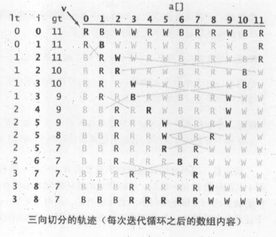

# 快速排序
快速排序也是采用分治法来进行排序，和归并排序有点像。  

归并排序是将一个数组分为两个子数组分别排序，不断切分数组进行排序组合，最后将两个有序的子数组合并成一个完整的数组。  

快速排序则选定一个切分元素，也会切分两个数组，左子数组小于切分元素，右子数组大于切分元素，将这两个子数组排序，最后合并成完整数组。

由此可以见，这个切分元素非常重要，这个切分元素也叫基准值，这个基准值找得好，快速排序将会很高效，否则将会变得很慢。  

```
伪代码实现
quickSort(p...r) = quickSort(p...q-1) + quickSort(q...r)

终止条件
p >= r
```

最终代码实现：
```go
func quickSort(arr []int, start, end int) {
	if start >= end {
		return
	}

	pivot := partition2(arr, start, end)
	quickSort(arr, start, pivot-1)
	quickSort(arr, pivot+1, end)
}

func partition(arr []int, start, end int) int {
	fmt.Printf("partition前start=%d,end=%d: %v\n", start, end, arr)
	pivot := arr[end]
	i := start
	j := end - 1

	for {
		for arr[i] < pivot {
			if i >= end {
				break
			}
			i++
		}

		for arr[j] > pivot {
			if j <= start {
				break
			}
			j--
		}

		// 两者相遇，终止循环
		if i >= j {
			break
		}

		arr[i], arr[j] = arr[j], arr[i]
	}

	// 此时的arr[i]有可能已经大于pivot，所以要交换一次
	arr[end], arr[i] = arr[i], arr[end]

	fmt.Printf("partition后pivot=%d: %v\n", i, arr)

	return i
}

func partition2(arr []int, start, end int) int {
	fmt.Printf("partition前start=%d,end=%d: %v\n", start, end, arr)
	pivot := arr[end]
	i := start
	j := start

	for ; j < end; j++ {
		if arr[j] < pivot {
			arr[j], arr[i] = arr[i], arr[j]
			i++
		}
	}

	arr[i], arr[end] = arr[end], arr[i]

	fmt.Printf("partition后pivot=%d: %v\n", i, arr)
	return i
}
```

## 算法复杂度
最理想情况每次选择的基准值都能将数组平分为2部分。

最坏情况是数组是有序数组，而你选取基准值的方式是选取数组第一个元素（或者最后一个元素），这就导致你每次都会造成左数组为空，右数组为原始数组的情况。
```
12345678
[]①2345678
   []②345678
      []④5678
      ...
          []⑥78
```
明显，在这个调用栈里，每层都会涉及到O(N)个元素，总共N层，即O(N^2)  

换个情况
```
12345678
123[4]5678
1[2]3 5[6]78
         [7]8 
```
这时我们的调用栈只需要4层，经过数学证明的是，理想情况下总过会有O(logN)层，每层的栈长依旧是O(N)，因此总共为O(NlogN)。

## 选择切分点
常用的方法有：
1. 三数取中法。从首、尾和中间各取出一个数，取它们的中间值作为切分点。但是如果数据量非常大，可能需要改成五数取中法或者十数取中法。
2. 随机法。随机中数组中选择一个数作为切分点。
3. 也可以将数组打乱，避免数据是有序的

## 有重复元素时
如果我们的集合序列中存在大量的重复元素，采用快速排序可能会得不偿失，因为它依旧会不断去执行迭代排序，最终有可能会将算法复杂度上升为O(N^2)

这时我们可以采用*三项切分*，将元素切分为三部分`a[lo..lt-1] < v = a[lt..gt] < a[gt+1..hi]`

```java
public class Quick3Way {
  private static void sort(Comparable[] a, int lo, int hi) {
    if (hi <= lo) return;

    int lt = lo, i = lo + 1, gt = hi;
    Comparable v = a[lo]

    while(i <= gt) {
      int cmp = a[i].compareTo(v)

      if (cmp < 0) exchange(a, lt++, i++);
      if (cmp > 0) exchange(a, i, gt--);
      else i++;
    } // a[lo..lt-1] < v = a[lt..gt] < a[gt+1..hi]

    sort(a, lo, lt - 1)
    sort(a, gt + 1, hi)
  }
}
```



如果有大量的重复内容时，三项切分可以将复杂度有对数时间降级为线性时间。

## 总结
1. 快速排序是一种就地排序算法，无须引入额外的空间。
2. 快速排序不是一个稳定的排序算法，根据切分点交换元素的时候，会导致元素相对位置发生变化。
3. 时间复杂度：
   * 最好情况下，通过切分点可以将数组平均切分成两份，此时时间复杂度为O(nlogn)
   * 最坏情况下，数组是有序的，而切分点选择不当（例如最后一个元素），导致左右两个区间不均等，此时时间复杂度退化成O(n^2)
   * 平均情况下，时间复杂度为O(nlogn)

## 思考题
### 思考1：查找第K大元素。
假设有N个元素的数组，如何在这个数组里找到第K大的值。

最简答的方法就是，逐个遍历先找第1大的，再找第二大的，最后找到第K大的，每次需要遍历N个元素，总共需要遍历K\*N次，所以时间复杂度为: O(K*N)

虽然有些情况下可以忽略常数项，但是当K值很大的时候，例如K=N或者K=N/2时，就变成了O(N^2)了，这就很慢了。我们需要寻找更好的方式。

可以借助快排的思想，找到一个pivot，例如第一次是数组的最后一个元素，将数组分为3个部分：  
arr[0...p-1]、arr[p]、arr[p+1...N-1]

其中arr[0...p-1]>arr[p]，arr[p+1...N-1] < arr[p]

也就是说，此时下标为p的元素，是数组中第p+1大的元素。

如果`p+1=K`，那么p对应的元素就是我们要找的元素。

如果`k > p + 1`，说明要找的元素还要小于arr[p]，此时则需要从arr[p+1...N-1]查找，使用同样的方式进行查找。

如果`k < p + 1`，说明要找的元素大于arr[p]，此时需要从arr[0...p]处查找，同样用以上方式查找。

由于每次分区后都会选择一半的元素再继续进行分区，因此会处理元素：  
n + n/2 + n/4 + ... + 1 = 2n-1

也就是这种思路，时间复杂度为O(n)

### 思考2：归并排序一直都是O(NlogN)的运行时间，为什么不选择直接用归并排序？
归并排序不是就地算法，即它需要引入额外的空间（和待排序的数组相同）O(N)来换取快速的排序时间，是一种空间换时间的做法，这在集合非常大的时候很不可取。 

例如当你需要排序一个100M的数据时，如果采用归并排序则还另外需要100M的空间。

而快速排序是一种就地排序，不需要额外的空间，或者说只需要常数级别的空间O(1)，在原数组下即可完成排序。平均情况下只需要O(NlogN)，那么我们应该做的就是如何去处理最坏情况下导致的时间复杂度为O(n^2)问题。

最主要的就是如何选择这个切分点的问题，如果简单的选择数组第一个或者最后一个作为切分点，不考虑数据的特点的话，就会很容易出现之前的问题。