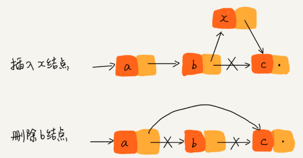

# 数组
数组是一种线性表数据结构，拥有连续的内存空间，来存储一组具有相同类型的数据（静态语言）。

像链表、队列和栈也都是线性结构，而二叉树、堆和图等就是非线性结构。  
线性结构下，数据一般都是简单的前后关系，每个线性表上的元素最多只有前和后两个方向。

数组的第二个特点，就是会在一开始的时候分配一个连续的内存空间，用于存储数据。基于该特点，数组可以实现**随机访问**。  
例如我们要存储10个数据类型为4个字节的整型数字，假设此时内存中空闲的地址为1000，于是有：
```
int a[10]
0  a[0]  1000-1003
1  a[1]  1004-1007
2  a[2]  1008-1011
...
9  a[9]  1036-1039
```
此时我们说数组的base_address=1000，通过它便可以快速定位到数组中的任意元素，时间复杂度为O(1)
```
a[i]_address = base_address + i * data_type_size
```

## 数组的缺点
数组的插入和删除比较低效
1. 在中间任意位置要插入一个新元素，需要将后续的所有元素向后移动
2. 删除数组的任意一个元素，需要将后续的所有元素向前移动

对于插入操作的优化，如果数组对元素的位置不是很敏感，为了避免大规模迁移，我们可以将指定位置的元素作为新元素插入到最后一个位置，然后将待插入的元素直接插入到指定位置中。
```
    x
a b c d e

a b x d e c
```

对于删除操作的优化，可以将待插入的元素都标记为删除状态，可以避免每次删除都进行一次大规模迁移。等到空间不够的时候，再批量删除，做一次数据迁移。
```
a b c d e f g

 -------
| a b c | d e f g
 -------
```

# 链表
数组分配的空间是连续的，例如申请长度为100的数组，就需要有100个连续的内存空间，这种数据结构对内存的要求比较高。

链表则不一样，它的内存空间不需要是连续的，它通过指针的方式将各个内存块串联起来，这些内存空间可以散落内存的各个地方。

```go
// 单链表
type linkList struct {
  value int
  next *linkList
}

// 双向链表
type dLinkList struct {
  value int
  prev, next *linkList
}
```
可见每个链表的节点除了存储数据，还会存储指向下一个节点的地址，最后一个节点指向的下一个节点为null。对于双向链表还会有一个前置指针，指向上一个节点的地址。

## 链表的优点
对于链表，添加和删除一个节点都非常高效，只是指针的改变。时间复杂度为O(1)  


但是需要注意的是，我们指的是添加和删除这个操作的时间复杂度。我们以删除一个单链表的节点为例子来说明。

对于删除节点，一般都是以下两种情况：
1. 删除节点中“值等于某个给定值”的节点
2. 删除给定指针指向的节点

对于第一种情况，我们需要遍历链表找到给定值的节点，这个时间复杂度是O(n)，加上删除节点的时间复杂度，总共时间复杂度还是O(n)。

对于第二种情况，虽然我们已经知道要删除的节点，但是要删除它需要知道它的前驱节点，而单链表并不支持获取前驱节点，因此又需要遍历链表，这个时间复杂度又是O(n)，总共时间复杂度是O(n)。

但是如果我们的链表是双向链表，第二种情况就可以优化为O(1)了，通过双向链表的前驱指针就可以找到前驱节点。

对于插入操作，如果我们需要向指定节点前面插入新节点，这时候双向链表也可以在O(1)下快速完成。

链表的另一个优点，它不会受大小的限制。对于数组，一旦声明后，大小就固定了，如果添加的元素超过容量，就得扩容和拷贝。而链表就会受到这种限制。

## 链表的缺点
随机访问某个元素时，链表的效率很低，只能不断的遍历链表，时间复杂度为O(n)。

链表会占用更多的空间用来存储下一个节点的指针，如果频繁的添加和删除节点，还会导致频繁的内存申请和释放，容易造成内存碎片。

## 基于链表的简单LRU缓存淘汰算法
首先有一个有序单链表，它的特点是：越靠近链表尾部的节点是越早之前访问的。

当有一个新的数据被访问时，我们开始从表头开始遍历链表
1. 如果在链表中找到该数据，则将该节点从原来的位置删除，然后再插入到链表的表头
2. 如果在链表中没有找到该数据，则需要分为两种情况考虑：
   *  如果此时链表还没满，则将节点添加到链表的表头。
   *  如果此时链表已满了，则将链表尾节点删除，将新的节点插入到链表的表头。