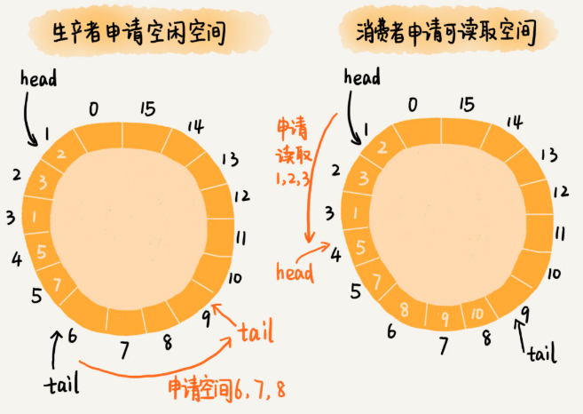

# 队列
队列满足先进先出的特点，实现方式上一般有两种：
1. 数组方式实现的有界队列，缺陷就是队列满的时候可能需要扩容，或者阻塞入队操作。
2. 链表方式实现的无界队列，缺陷就是内存无法控制，容易造成OOM（Out of Memory）。

## 队列的实现
### 数组方式实现队列
```go
type queue struct {
    items []string
    n    int
    head int
    tail int
}

func newQueue(size int) *queue {
  return &queue{make([]string, size), size, 0, 0}
}

func (q *queue) enqueue(item string) bool {
    if tail == n {
        return false
    }

    q.items[tail] = item
    ++tail
    return true
}

func (q *queue) dequeue() string {
    if head == tail {
      return ""
    }

    result := q.items[head]
    ++head

    return result
}
```

### 链表方式实现
```go
type Node struct {
    value   string
    next    *Node
}

type queue struct {
    head  *Node
    tail  *Node
    n     int
}

func newQueue() *queue {
  return &queue{nil, nil, 0}
}

func (q *queue) enqueue(value string) {
    node := &Node{value, nil}
    if q.tail == nil {
        q.tail = node
        q.head = node
    } else {
        q.tail.next = node
        q.tail = node
    }

    q.n++
}

func (q *queue) dequeue() string {
    if q.head = nil {
      return ""
    }

    result := q.head.value
    q.head = q.head.next
    q.n--

    return result
}
```

## 循环队列
在使用数组方式实现的时候，虽然我们在队列满的时候选择返回false，但实际上我们经常是选择扩容的方式，但是扩容的话对性能就会有影响。  
但是如果我们使用循环队列就可以避免对数组就是扩容，循环队列就是一个环，当队列满了之后，继续入队则会回到队首，即新的元素会添加到队首。

```go
type CircularQueue struct {
    items     []string
    capacity  int
    head      int
    tail      int
}

func NewCircularQueue(size int) *CircularQueue {
    if n == 0 {
      return nil
    }

    return &CircularQueue{make([]string, size), size, 0, 0}
}

func (q *CircularQueue) Enqueue(item string) bool {
    if (q.tail + 1)%q.n == q.tail {
        return false
    }

    q.items[q.tail] = item
    q.tail = (q.tail + 1)%q.n
    return true
}

func (q *CircularQueue) Dequeue() string {
    if q.head == q.tail {
      return ""
    }

    result := q.items[q.head]
    q.head = (q.head + 1)%q.n

    return result
}
```

这里需要注意的是判断队列是否满的方式`(q.tail + 1)%q.n == q.tail`

## 并发安全
以上实现的队列都不是并发安全的，也即如果两个线程同时操作队列，得到的结果大部分情况下都会是不正确的。

以数组队列为例子
```go
func (q *queue) enqueue(item string) bool {
    if tail == n {
        return false
    }

    // 1
    q.items[tail] = item
    // 2
    ++tail
    return true
}
```
假设有两个线程要同时enqueue元素为10和15的数据，假设此时tail为2，当第一个线程执行了1时，此时`q.items[2]=10`，在还没执行2时，线程二执行了1，使得`q.items[2]=15`，这个结果就不正确了。

一般来说有几种方式可以解决
1. 加锁的方式，但是对性能有影响
2. CAS的方式，即乐观锁，对性能比较友好。

有一种消息队列，它也实现了并发安全，即Disruptor，它是一种内存消息队列，性能非常优秀。

### Disruptor消息队列


简单来说，就是在想要入队的时候申请空间的时候，批量获取一批空间，而获取空间这个操作是要加锁的。获取到空闲空间后，就可以直接往这些空间添加数据了，不需要加任何锁，因为这些空闲都是线程私有的。

当想要出队的时候，也是批量申请可读取的空间，这个过程也是要加锁。获取到后，后续的读取就不需要加锁了，这些空间也是线程私有的。

这里有一点需要注意，如图中所示，申请到了6、7、8空间，此时另外一个线程如果也申请空间，申请到了9、10、11空间，但是在6、7、8空间还没有完全写入数据之前，9、10、11空间的数据是无法被读取的。