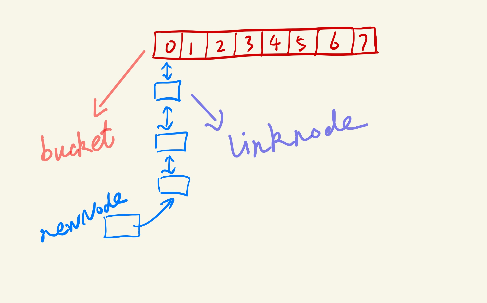
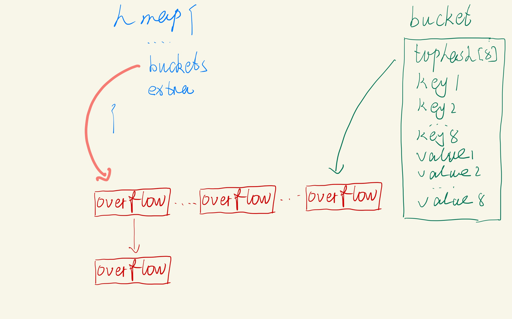

# Golang中的Map
## 基本操作
Map在Golang中的使用很简单

```go
personSalary := make(map[string]int)
personSalary["Jack"] = 10000
salary := personSalary["Jack"]
```

需要注意的是，Map的零值是nil，使用的时候必须采用make初始化
```go
var personSalary map[string]int
if personSalary == nil {
  personSalary = make(map[string]int)
}
```

获取一个map中的一个元素的时候，如果元素不存在，则会获取其相应的零值。
```go
salary := personSalary["Tim"] // 0
```

如果想知道这个元素是否在Map中，在可以如下使用
```go
salary,ok := personSalary["Tim"]
if !ok {
  fmt.Println("Tim is not exist on Map")
}
```

删除一个元素也很简单
```go
delete(personSalary, "Jack")
```

需要注意的是Map也是一种引用类型，因此将其赋值给其他变量的时候，如果修改了其中一个，也会导致另外一个也被修改
```go
personSalary := make(map[string]int)
personSalary["Jack"] = 10000
fmt.Println(personSalary["Jack"]) // 10000

newPersonSalary := personSalary
newPersonSalary["Jack"] = 20000

fmt.Println(personSalary["Jack"]) // 20000
```

两个Map之间也不能判等，Map只能和nil进行判等操作
```go
personSalary := make(map[string]int)
personSalary["Jack"] = 10000

newPersonSalary := personSalary

// 这里永远都不相等
if personSalary == newPersonSalary {
  fmt.Println("personSalary is equal with newPersonSalary")
}
```

## Map键的类型
Golang中Map的键的类型不可以是引用类型，即不能是函数类型、map类型和切片Slice类型。

Map中的键必须是可以支持判等操作的，而引用类型的值并不支持判等操作，因此不可以将其作为Map的键。

需要注意的是，接口类型是可以作为Map的键的，但是需要注意接口的实际动态类型也不能是引用类型中的其中一个。
```go
var badMap2 = map[interface{}]int{
	"1":   1,
	[]int{2}: 2, // 这里会引发 panic。
	3:    3,
}
```
注意这里第二个键的类型是切片slice类型，因此会引发panic，但是编译是能通过的。

同样的道理，如果Map的键类型如果是数组类型，那么数组类型的值也不能是引用类型。例如`[1][]string`也是不允许的。

## Golang中Map的实现原理简述
Map或者说是HashMap的实现方式都是，HashTable+链表来解决，例如先对Key进行哈希后，会对应到某个哈希节点上，每个节点都会挂一个链表，主要是为了解决哈希冲突，即不同的Key的哈希值是相同的。查找到哈希节点后，将数据添加到链表中。同样的道理，查找的时候，也是哈希到对应的节点，然后对链表进行遍历查找。而为了提高查找效率，有些语言会将链表转化为红黑树（例如Java和C++）。



而golang的实现原理也和这个差不多，我们用简单的方式模拟Golang实现上述过程。

### 简单模拟实现Map
首先Map最外层是一个结构体，Golang中采用数组的结构来存储每个每个节点，即哈希槽。
```go
//HashMap木桶(数组)的个数
const BucketCount  = 8

type HashMap struct {
  Buckets [BucketCount]*LinkNode
}

func CreateHashMap() *HashMap {
  m := &HashMap{}

  //为每个元素添加一个链表对象
  for i := 0; i < BucketCount ; i++  {
      m.Buckets[i] = CreateLink()
  }

  return m
}
```
buckets就是我们所说的哈希槽，这里定义了每个map中包含8个哈希槽，每个哈希槽是一个链表结构。每次往map中添加数据的时候，就要将key进行hash，最终对应到这个8个哈希槽中的其中一个（最简单的例如对8取余）。

接下来需要定义链表结构
```go
type KV struct {
  Key   string
  Value string
}

type LinkNode struct {
  Data KV
  Next *LinkNode
}

//创建只有头结点的链表
func CreateLink() *LinkNode {
  //头结点数据为空 是为了标识这个链表还没有存储键值对
  var linkNode = &LinkNode{KV{"",""}, nil}

  return linkNode
}

//尾插法添加节点,返回链表总长度
func (link *LinkNode) AddNode(data KV) int {
  var count = 0
  //找到当前链表尾节点
  currNode := link
  for {
    count += 1
    if currNode.Next == nil {
      break
    }else {
      currNode = currNode.Next
    }
  }

  var newNode = &LinkNode{data, nil}
  currNode.Next = newNode

  return count+1
}
```
链表的数据结构里，包含一个KV的数据结构，用于存储我们的数据，还有一个指向下一个指向下一个节点的指针。每次添加数据都是添加到链表的尾部。

基本的HashMap就是这样，当然还需要有哈希函数的实现，一个优秀的哈希函数要考虑到很多细节，尤其对性能的要求，这里不是我们的重点。

具体哈希函数的性能比较可参考：[http://aras-p.info/blog/2016/08/09/More-Hash-Function-Tests/](http://aras-p.info/blog/2016/08/09/More-Hash-Function-Tests/)

接下来我们看看如何在一个map中添加数据。

```go
func (m *HashMap)Add(key string, value string) {
  //1.将key散列成0-BucketCount的整数作为Map的数组下标
  var mapIndex = HashCode(key)

  //2.获取对应数组头结点
  var link = m.Buckets[mapIndex]

  //3.在此链表添加结点
  if link.Data.Key == "" && link.NextNode == nil {
      //如果当前链表只有一个节点，说明之前未有值插入  修改第一个节点的值 即未发生哈希碰撞
      link.Data.Key = key
      link.Data.Value = value
  }else {
      //发生哈希碰撞
      index := link.AddNode(KV{key, value})
  }
}
```
对于从map中查找就不实现了，也比较简单，也是先计算hashCode，再从遍历链表从而取出数据。

### Golang中的实现
首先golang中对函数算法是根据硬件选择的，如果cpu支持aes，那么使用aes hash，否则使用memhash，memhash是参考xxhash、cityhash实现的，性能非常好。

golang中，在把hash值映射到buckte时，golang会把bucket的数量规整为2的次幂，而有m=2^b，则n%m=n&(m-1)，用位运算规避mod的昂贵代价。

```go
// 最外层的map结构
type hmap struct {
  count     int     // 元素数量
  flags     uint8   // 状态标志 
  B         uint8   // 可以最多容纳 6.5 * 2 ^ B 个元素，6.5为装载因子
  noverflow uint16  // 溢出的个数
  hash0     uint32  // 哈希种子
  buckets    unsafe.Pointer // 桶的地址
  oldbuckets unsafe.Pointer // 旧桶的地址，用于扩容
  nevacuate  uintptr        // 搬迁进度，小于nevacuate的已经搬迁

  extra *mapextra // 其他字段
}

type mapextra struct {
  overflow    *[]*bmap
  oldoverflow *[]*bmap // 用于扩容
  nextOverflow *bmap
}

type bmap struct {
  // 每个元素hash值的高8位，如果tophash[0] < minTopHash，表示这个桶的搬迁状态
  tophash [bucketCnt]uint8
  // 接下来是8个key、8个value，但是我们不能直接看到；为了优化对齐，go采用了key放在一起，value放在一起的存储方式，
  // 再接下来是hash冲突发生时，下一个溢出桶的地址
}
```
可见，go中的map就是由三个部分组成：
1. hmap，它是map的最外层结构，包括了map的各种信息，如大小，哈希槽（buckets）
2. mapextra，它用于记录map的一些额外信息
3. bmap，代表bucket，每一个bucket最多放8个kv，最后由一个overflow字段指向下一个bmap，注意key、value、overflow字段都不显示定义，而是通过maptype计算偏移获取的。

整体结构如下：


简单来说，每个bmap就是一个哈希槽，它可以放8个kv，当遇到哈希冲突的时候，如果bmap里元素的个数小于8时，直接以key1key2value1value2的方式存放。这样减少对象数量，减轻管理内存的负担，利于gc。  
 
如果插入时，bmap中key超过8，那么就会申请一个新的bmap挂在这个bmap的后面形成链表，优先用预分配的overflow bucket，如果预分配的用完了，那么就malloc一个挂上去。

hash值的高8位存储在bucket中的tophash字段，每个桶最多放8个kv对，所以tophash类型是数组[8]uint8。通过这种方式，不用比较整串哈希值。

#### 关于map的扩容
当元素个数/bucket个数大于等于6.5时，就会进行扩容，把bucket数量扩成原本的两倍，当hash表扩容之后，需要将那些老数据迁移到新哈希槽上。当然数据搬迁不是一次性完成的，而是逐步的完成（在insert和remove时进行搬移），这样就分摊了扩容的耗时。这是典型的COWS模式。

同时为了避免有个bucket一直访问不到导致扩容无法完成，还会进行一个顺序扩容，每次因为写操作搬迁对应bucket后，还会按顺序搬迁未搬迁的bucket，所以最差情况下n次写操作，就保证搬迁完大小为n的map。

## 并发Map
普通的Map不是并发安全的，也就是如果两个线程同时读写同一个map，会造成结果不正确的结果。

不过Golang已经为我们提供了一个并发安全的Map，即`sync.Map`。先来看下如何使用。

```go
m := sync.Map{}
m.Store("a", 1)
value, ok := m.Load("a")
fmt.Println(ok, value) // true 1

value, ok = m.LoadOrStore("a", 2)
fmt.Println(ok, value) // true 1

value, ok = m.LoadOrStore("b", 2)
fmt.Println(ok, value) // false 2

m.Delete("a")
value, ok = m.Load("a")
fmt.Println(ok, value) // false nil
```

### 实现原理
并发安全Map，如果只是单纯使用锁来实现，当Map很大的时候会有很大的性能问题，Golang也只是在1.9后才最终支持并发安全Map。

实现思路总体如下：
1. 采用空间换时间的方式，通过冗余的两个字段（read和dirty）实现加锁对性能的影响。
2. 使用只读数据（read），避免读写冲突
3. 动态调整，miss多了之后，将dirty转化为read
4. 延迟删除，删除一个键值时只是打标机，只有在提升dirty的时候才会真正删除。
5. 二次检查，这个后面源码都会看到
6. 优先从read中读取、删除和更新，因为对read的读取不需要加锁。

首先，看一下`sync.Map`的结构体的定义，加了些注释方便理解

```go
type Map struct {
  // 涉及到dirty操作时，需要加锁。
  mu Mutex
  
  // 是一个原子Value类型的字段，其中一个原生的Map会被存储在该字段中
  // 因为是只读的，通过该字段可以直接并发读取Map里元素，无需加锁
  // 实际上，实际也会更新这个数据的entries,如果entry是未删除的(unexpunged), 并不需要加锁
  // 如果entry已经被删除了，需要加锁，以便更新dirty数据。
	read atomic.Value // readOnly

  // 存储了另外一个原生Map，键的类型是`interface`，会把值进行转换和封装后再进行存储
  // dirty数据包含当前的map包含的entries,它包含最新的entries(包括read中未删除的数据,虽有冗余，但是提升dirty字段为read的时候非常快，不用一个一个的复制，而是直接将这个数据结构作为read字段的一部分)，有些数据还可能没有移动到read字段中
  // 当dirty为空的时候， 比如初始化或者刚提升完，下一次的写操作会复制read字段中未删除的数据到这个数据中。
	dirty map[interface{}]*entry

  // 是一个计数字段，当从Map中读取entry的时候，如果read中不包含这个entry,会尝试从dirty中读取，这个时候会将misses加一，当misses累积到 dirty的长度的时候，就会将dirty提升为read,避免从dirty中miss太多次。因为操作dirty需要加锁。
	misses int
}
```

通过read和dirty，将数据冗余的存储在两个字段中，虽然浪费了空间，却能有效的提高读写性能。

dirty字段会包含read中被标记为删除的entries（即键值数据），而且新增的entries也会被存储在该字段中。

这里还有个entry的数据结构，后续我们会说。

#### Load方法
接下来具体来看一下sync.Map中读取数据的方法是如何实现的。

```go
func (m *Map) Load(key interface{}) (value interface{}, ok bool) {
  // 1.首先从m.read中得到只读readOnly结构的数据，
  // 这个过程是通过原子的方式获取的，因此不需要加锁
	read, _ := m.read.Load().(readOnly)
  e, ok := read.m[key]
  
  // 2. 如果没找到，并且m.dirty中有新数据，需要从m.dirty查找，这个时候需要加锁
	if !ok && read.amended {
    // 由于需要在m.dirty中读取，需要先加锁
		m.mu.Lock()
		
    // 双检查，避免加锁的时候m.dirty提升为m.read,这个时候m.read可能被替换了。
		read, _ = m.read.Load().(readOnly)
    e, ok = read.m[key]
    // 如果m.read中还是不存在，并且m.dirty中有新数据
		if !ok && read.amended {
      // 从m.dirty查找
			e, ok = m.dirty[key]
			// 不管m.dirty中存不存在，都将misses计数加一
      // missLocked()中满足条件后就会提升m.dirty为m.read
			m.missLocked()
		}
		m.mu.Unlock()
  }
  // 如果还是没找到，则直接返回。
	if !ok {
		return nil, false
  }
  
  // 返回找到的数据，它会将指针转换回原始数据
  // 这个数据有可能是直接从read中读取的，也有可能是从dirty读取的。
	return e.load()
}

func (m *Map) missLocked() {
	m.misses++
	if m.misses < len(m.dirty) {
		return
  }
  // 当misses累积到 dirty的长度的时候，将dirty提升为read
  m.read.Store(readOnly{m: m.dirty})
  // 重置m.dirty和m.misses
	m.dirty = nil
	m.misses = 0
}

type readOnly struct {
  m       map[interface{}]*entry
  // 如果Map.dirty有些数据不在m中的时候，这个值为true
	amended bool 
}

type entry struct {
  p unsafe.Pointer 
}


func (e *entry) load() (value interface{}, ok bool) {
	p := atomic.LoadPointer(&e.p)
	if p == nil || p == expunged {
		return nil, false
	}
	return *(*interface{})(p), true
}
```
首先我们看到对于read的读取，是不需要加锁的，由于它的类型是`atomic.Value`，即是一个原子类型，因此不需要加锁即可实现并发安全读写。  
这里就是通过`read.load()`来原子的读取值，它会返回一个接口类型值，并最终断言为`readOnly`类型的数据。

这个readOny就是read的具体数据结构，amended用于说明Map.dirty是否有`readOnly.m`未包含的数据。  
如果从Map.read找不到数据的话，则需要到Map.dirty中查找。  
对于`readOnly.m`，它就是我们熟悉的普通的Map，我们的数据就是存储在它里面（当然dirty也有一个一样结构的字段）。它的key是`interface{}`类型，因此可以存储任何类型的key，而value的类型是一个指针类型，指针类型是一个叫entry的数据结构，该entry中包含了一个指针p，指向了用户存储的具体值。

entry为什么要用指针了，其实也是为了节省空间，像read和dirty中会冗余的存储相同的键值，这些数据会通过指针指向同一个数据，因此占用的空间并不会太大。

p有三种值：
1. nil，entry已经被删除，并且m.dirty为nil
2. expunged，entry已被删除了，并且m.dirty不为nil，而且这个entry不存在于m.dirty中
3. 其它：entry是一个正常的值

从`Map.Load`方法中，我们能够知道，如果我们的Map很少有更新，即使去获取key很多的Map，其性能也基本和无锁的Map没什么差别。

#### Store方法
接下来看看如何进行更新或者新增一个Entry

```go
func (m *Map) Store(key, value interface{}) {
  // 如果m.read存在这个键，并且这个entry没有被标记删除，尝试直接存储。
	read, _ := m.read.Load().(readOnly)
	if e, ok := read.m[key]; ok && e.tryStore(&value) {
		return
	}

  // 如果`m.read`不存在或者已经被标记删除
  m.mu.Lock()
  // 同样需要进行二次检查
	read, _ = m.read.Load().(readOnly)
  if e, ok := read.m[key]; ok { // read中包含这个key
    // 标记成未被删除
		if e.unexpungeLocked() {
			// m.dirty中不存在这个键，所以加入m.dirty
			m.dirty[key] = e
    }
    //更新
		e.storeLocked(&value)
	} else if e, ok := m.dirty[key]; ok { // read中不存在，m.dirty存在这个key，则直接更新dirty中的值
		e.storeLocked(&value)
	} else { // 如果m.dirty也不存在这个key，则需要做新增操作，即新增一个entry
		if !read.amended {  // m.dirty中没有新的数据，往m.dirty中增加第一个新键
			//从m.read中复制未删除的数据
			m.dirtyLocked()
			m.read.Store(readOnly{m: read.m, amended: true})
    }
    //将这个entry加入到m.dirty中
		m.dirty[key] = newEntry(value)
	}
	m.mu.Unlock()
}

func (e *entry) tryStore(i *interface{}) bool {
	for {
		p := atomic.LoadPointer(&e.p)
		if p == expunged {
			return false
		}
		if atomic.CompareAndSwapPointer(&e.p, p, unsafe.Pointer(i)) {
			return true
		}
	}
}

func (e *entry) unexpungeLocked() (wasExpunged bool) {
	return atomic.CompareAndSwapPointer(&e.p, expunged, nil)
}

func (e *entry) storeLocked(i *interface{}) {
  // 存储的也是value的指针值
	atomic.StorePointer(&e.p, unsafe.Pointer(i))
}

func (m *Map) dirtyLocked() {
	if m.dirty != nil {
		return
	}

	read, _ := m.read.Load().(readOnly)
	m.dirty = make(map[interface{}]*entry, len(read.m))
	for k, e := range read.m {
		if !e.tryExpungeLocked() {
			m.dirty[k] = e
		}
	}
}

var expunged = unsafe.Pointer(new(interface{}))

func (e *entry) tryExpungeLocked() (isExpunged bool) {
	p := atomic.LoadPointer(&e.p)
	for p == nil {
    // 将已经删除标记为nil的数据标记为expunged
		if atomic.CompareAndSwapPointer(&e.p, nil, expunged) {
			return true
		}
		p = atomic.LoadPointer(&e.p)
	}
	return p == expunged
}

func newEntry(i interface{}) *entry {
	return &entry{p: unsafe.Pointer(&i)}
}
```

Store里最耗性能的就是在`m.dirtyLocked()`，在某种情况下（初始化或者m.dirty被提升了），它会不断的去从read中复制数据，如果这个read的数据非常大，可能会影响到性能。

#### Delete方法
接来下看看是如何删除一个键

```go
// Delete deletes the value for a key.
func (m *Map) Delete(key interface{}) {
	read, _ := m.read.Load().(readOnly)
  e, ok := read.m[key]
  // 如果这个entry不存在于m.read中，并且m.dirty中有新数据，则加锁尝试从m.dirty中删除。
	if !ok && read.amended {
		m.mu.Lock()
		read, _ = m.read.Load().(readOnly)
		e, ok = read.m[key]
		if !ok && read.amended {
			delete(m.dirty, key)
		}
		m.mu.Unlock()
	}
	if ok {
		e.delete()
	}
}

func (e *entry) delete() (hadValue bool) {
	for {
		p := atomic.LoadPointer(&e.p)
    // 已标记为删除
		if p == nil || p == expunged {
			return false
    }
    // 原子操作，e.p标记为nil
		if atomic.CompareAndSwapPointer(&e.p, p, nil) {
			return true
		}
	}
}
```
可见，在删除数据时候，并不会将数据从map中删除，而是先标记为nil

#### Range方法
想要遍历sync.Map，无法采用普通的for range，因此golang额外提供了一个Map.Range方法

```go
func (m *Map) Range(f func(key, value interface{}) bool) {
  read, _ := m.read.Load().(readOnly)
  // 如果m.dirty中有新数据，则提升m.dirty,然后在遍历
	if read.amended {
		m.mu.Lock()
		read, _ = m.read.Load().(readOnly)
		if read.amended {
			read = readOnly{m: m.dirty}
			m.read.Store(read)
			m.dirty = nil
			m.misses = 0
		}
		m.mu.Unlock()
	}

  // 遍历, for range是安全的
	for k, e := range read.m {
		v, ok := e.load()
		if !ok {
			continue
		}
		if !f(k, v) {
			break
		}
	}
}
```
使用的时候，提供一个回调函数即可

```go
m := sync.Map{}
m.Store("a", 1)
m.Store("b", 2)
m.Store("c", 3)

m.Range(func(key, value interface{}) bool {
  fmt.Println(key, value)
  return true
})
```

[Go 1.9 sync.Map揭秘](https://studygolang.com/articles/10511)
