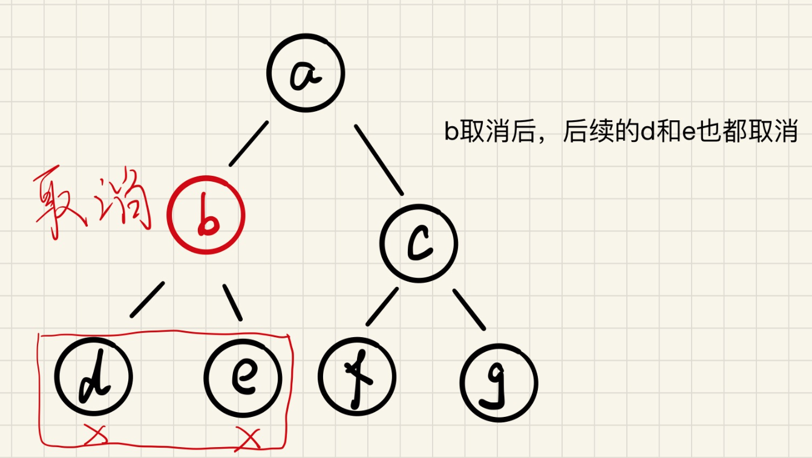
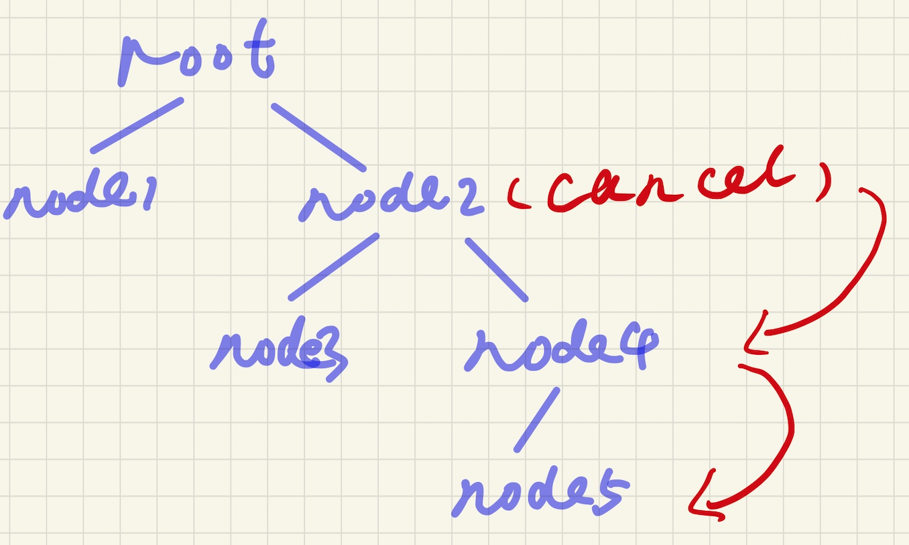

# Golang中的Context
有时候我们会有一些这样的场景，例如我们有很多并发的任务在执行，但是当某个任务出错或者超时的时候，我们希望所有任务都停止不再执行。

对应到golang中，我们希望在一些特定的场景下，能够通知所有的goroutine都停止执行并返回。典型的场景如http请求超时的时候，我们希望后续的操作都能停止并返回。

Golang中提供了Context来帮助我们实现这个功能。

## Context的简单例子
假设我们的场景为：有个任务需要一直执行，每执行一次需要1秒，当它执行到3秒的时候，我们希望能够停止它。

代码实现如下：

```go
func doWork(ctx context.Context) {
	for {
		time.Sleep(time.Second)
		select {
		case <-ctx.Done():
			return
		default:
			fmt.Println("working...")
		}
	}
}

func cancelDemo() {
	ctx := context.Background()
	cancelCtx, cancelFn := context.WithCancel(ctx)

	go doWork(cancelCtx)

	time.Sleep(3 * time.Second)
	cancelFn()
	fmt.Println("done!")
}

func main() {
	cancelDemo()
}

```

运行结果可能如下：
```
working...
working...
done!
```

这是一个简单的关于Contenxt的例子，案例中我们采用WithCancel这种Context。在Golang中总共有4中Context：
1. WithCancel，可取消的Context
2. WithTimeout，可定时取消的Context，根据设置的超时时间来取消Context
3. WithDeadline，也是一个可定时取消的Context，只是将超时时间改为截止时间
4. WithValue，可产生一个携带额外数据的Context

以上4种Context都是需要继承一个父Context，例如案例中的`context.WithCancel(ctx)`，它继承了一个根context。

通过不断的继承父context从而构造了一个树形的Context，当任何一个字节点被取消后，后续的节点都能够得到取消。



### timeoutCancel
接下来看看超时类型的Context

```go
func timeoutDemo() {
	ctx := context.Background()
	timeoutCtx, cancelFn := context.WithTimeout(ctx, 3*time.Second)
	go cancelHandler(timeoutCtx)

	time.Sleep(5 * time.Second)
	cancelFn()

	err := timeoutCtx.Err()
	fmt.Println(err)

	fmt.Println("done!")
}
```

WithTimeout可以设置一个超时的Context，当超过一定时间后会被自动取消。

运行结果为：
```
working...
working...
context deadline exceeded
done!
```
这里有一行代码需要注意`err := timeoutCtx.Err()`，它可以得到context被取消的原因，通过错误可以知道是认为取消还是自动取消，上述代码是自动取消，因此错误为`context deadline exceeded`。

如果我们修改下这段代码`time.Sleep(5 * time.Second)`，修改为`time.Sleep(2 * time.Second)`，此时结果就是`context canceled`，即人为取消。

再来看个复杂一点的，如果我们会执行3个并发任务，我们希望每个任务的执行时间不能超过3秒，总任务时间不能超过5秒，否则任务应该都被取消，代码如下：
```go
func RunJob(ctx context.Context) {
	wg := sync.WaitGroup{}
	wg.Add(3)

	// 执行三个任务
	for i := 0; i < 3; i++ {
		// 每个任务执行时间最长为3秒
		c, _ := context.WithTimeout(ctx, 3*time.Second)
		go func(c context.Context, i int) {
			defer wg.Done()
			ch := make(chan struct{})
			// 执行的任务
			go func() {
				n := rand.Intn(3)
				// 模拟任务耗时
				time.Sleep(time.Duration(n) * time.Second)
				ch <- struct{}{}
				close(ch)
			}()

			for {
				select {
				case <-c.Done(): // 任务被取消
					fmt.Println("job", i, "cancel")
					return
				case <-ch: // 任务顺利完成（小于3秒）
					fmt.Println("job", i, "done")
					return
				}
			}
		}(c, i)
	}

	// 等待所有任务完成
	wg.Wait()
}

func main() {
	// 所有任务完成的时间不能超过5秒
	ctx, cancelFn := context.WithTimeout(context.Background(), 5*time.Second)
	defer cancelFn()

	doneChan := make(chan struct{})
	go func() {
		RunJob(ctx)
		doneChan <- struct{}{}
		close(doneChan)
	}()
	
	for {
		select {
		case <-ctx.Done(): // 总时间超时
			logger.Info(nil, "task timeout!!!")
			return
		case <-doneChan:
			return
		}
	}
}
```
案例中，我们每个任务都会基于父context派生出子context，这个后面会讲到。子context会接收父context的信号，一旦父context取消后，所有的子context都会收到取消的信号进而取消所有context。

在案例中，ctx是父context，它基于`context.Background()`派生而来，它是个超时取消的context，这里设定的超时时间为5秒。一旦有任务运行时间超过5秒，它就会触发取消信号，该信号会被传递到所有的子context，即任务中每个`c, _ := context.WithTimeout(ctx, 3*time.Second)`。这时所有的子context都会触发取消信号。

另外我们设定了每个子context的超时时间为3秒，因此超时了也会被取消。

WithDeadline的作用和timeoutCancel一样，只是参数是具体的某个时间。上述的例子改成WithDeadline为：
```go
ctx, concelFn := context.WithDeadline(ctx, time.Now().Add(3*time.Second))
```

### WithValue
可产生一个携带额外数据的Context。

```go
ctx := context.Background()
valueCtx := context.WithValue(ctx, "trace_id", 123)

traceID, ok := valueCtx.Value("trace_id").(int)
if !ok {
  fmt.Println("some wrong")
  return
}

fmt.Println(traceID)
```

## Context信号的传递
当一个Context被取消之后，这个context下面的所有子context都会被取消，取消的信号会逐层往下传播



```go
ctx := context.Background()
	ctx1, cancelFn1 := context.WithCancel(ctx)
	ctx2, _ := context.WithCancel(ctx1)
	ctx3, _ := context.WithCancel(ctx2)
	ctx4, _ := context.WithCancel(ctx3)

	go cancelFn1()

	<-ctx1.Done()
	<-ctx2.Done()
	<-ctx3.Done()
	<-ctx4.Done()

	fmt.Println("done")
```

但是这里有个例外，通过context.WithValue得到的context是不可撤销的。

撤销信号的传递是基于深度优先的，直接分支的产生时间越早，其中的所有子节点就会越先收到信号。

## Context的使用原则
1. 不要把Context存在一个结构体当中，显式地传入函数。Context变量需要作为第一个参数使用，一般命名为ctx；
2. 使用context的Value相关方法只应该用于在程序和接口中传递的和请求相关的元数据，不要用它来传递一些可选的参数；
3. 同样的Context可以用来传递到不同的goroutine中，Context在多个goroutine中是安全的；
4. 在子Context被传递到的goroutine中，应该对该子Context的Done信道（channel）进行监控，一旦该信道被关闭（即上层运行环境撤销了本goroutine的执行），应主动终止对当前请求信息的处理，释放资源并返回。
