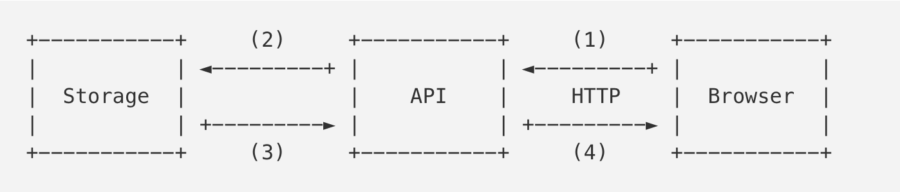

> 原文：https://medium.freecodecamp.org/million-websockets-and-go-cc58418460bb


# 1.介绍
在描述我们故事的上下文前，需要先解释下为什么我们需要这样一个服务。

Mail.Ru有很多有状态系统。用户邮件存储系统是其中一个。有很多方式可以跟踪系统状态的变化和系统事件。大部分都是通过定期轮询系统或者系统订阅的方式来实现状态的变化。

两种方式都有利和弊。但是对于邮件系统来说，用户收到新邮件的速度越快越好。

邮件拉取涉及到每秒50000的http查询请求，但是有60%基本都是返回304状态，这意味着邮箱中是没有任何变化的。

因此，为了降低服务器的负载，和加快给用户发送邮件的速度，我们决定重新造轮子，写一个订阅/发布服务（就像众所周知的bus、message broker或者event channel），一方面它会在状态发生变化时发送通知，另一方面可以接受通知的订阅。

之前：  


现在：  


第一种方案展示的就是之前所说的，浏览器定期的轮询拉取api，询问存储器（邮箱服务）的变化。

第二种方案描述了新的架构。浏览器通过订阅通知api建立一个WebSocket连接，通知API就是Bus服务器的客户端。收到新的邮件后，存储器发送通知到Bus（1），Bus会将其发送订阅者（2）。API判断要接收通知的连接，将消息发送到用户的浏览器。

所以今天我们要聊的就是这个API或者WebSocket服务器。进一步的，我要告诉你这个服务将会实现3百万的网络连接。

# 2.常用的方式
让我们来看看在没有任何优化的情况下，如何使用简单的go特性来实现服务器的某些部分。

在使用到`net.http`之前，我们先来说下如何发送和接收数据。构建在WebSocket协议之上的数据（例如JSON对象），在下文中将会被称之为包（packets）。

让我们先实现Channel结构，它包含了在WebSocket之上发送和接收包的逻辑。

## 2.1 Channel结构体
```go
// Packet 代表应用级别的数据
type Packet struct {
  ...
}

type Channel struct {
    conn  net.Conn    // WebSocket 连接
    send  chan Packet // 要发送的包队列
}

func NewChannel(conn net.Conn) *Channel {
    c := Channel{
        conn: conn,
        send: make(chan Packet, N)
    }

    go c.reader()
    go c.writer()

    return c
}
```

我希望你能注意到读取和写入这两个goroutine。每个goroutine都需要有自己的内存栈，其初始大小约为2到8KB，这取决于你的操作系统和GO的版本。

由于我们上面提到的会有3百万的连接数量，总共将会需要24GB的内存（4KB的堆栈大小）来维持所有连接。而这还没包括为Channel结构分配的内存，对外发送的包`ch.send`还有其他内部字段消耗的内存。

## 2.2 I/O goroutine
让我们来看下“reader”的实现

```go
func (c *Channel) reader() {
    // 我们创建一个带缓冲功能的read，用于减少读取的系统调用
    buf := bufio.NewReader(c.conn)

    for {
        pkt, _ := readPacket(buf)
        c.handle(pkt)
    }
}
```

这里我们使用`bufio.Reader`来减少`read()`的系统调用，并读取与buf缓冲区大小一样的数量。在无限循环里，我们期望新的数据到来。请记住这句话：期望新的数据到来。我们等下还会回到这里。

我们将不考虑传入数据包的解析和处理，因为它对我们即将要讨论的优化并不重要。但是，buf值得我们关注：默认情况下，它是4KB，这意味着我们的连接还需要额外的12GB内存。对于“writer”也有一样的情况。

```go
func (c *Channel) writer() {
    buf := bufio.NewWriter(c.conn)
    
    for pkt := range c.send {
        _ := writePacket(buf, pkt)
        buf.Flush()
    }
}
```

我们遍历包发送管道`c.send`，然后将其写入buffer中。正如我们细心的读者已经猜到的那样，每个连接额外需要4KB的内存，300万个连接则总共额外需要12GB的内存。

## 2.3 HTTP
我们已经具备一个简单的`Channel`，现在我们需要有WebSocket连接和它一起工作。由于我们还处在常用的方式标题下，让我们以相应的方式来做。

> 注意：如果你不了解WebSocket是如何工作的，可以这么说，客户端切换为WebSocket协议是通过具体的http机制，即Upgrade实现的。在成功处理Upgrade请求后，服务端和客户端就通过TCP连接来交换二进制WebSocket数据帧。[这里](https://tools.ietf.org/html/rfc6455#section-5.2)有篇文章描述了连接中帧的结构。

```go
import (
    "net/http"
    "some/websocket"
)

http.HandleFunc("/v1/ws", func (w http.ResponseWriter, r *http.Request) {
    conn, _ := websocket.Upgrade(r, w)
    ch := newChannel(conn)
}) 
```

请注意，`http.ResponseWriter`会为`bufio.Reader`和`bufio.Writer`分配内存空间（它们每一个都是4KB缓冲大小），它们用于`*http.Request`的初始化和之后的响应写入。

无论使用哪一个WebSocket类库，在成功响应升级请求后，服务器会在`respinse.Hijack()`调用之后连同TCP连接接收I/O缓冲数据。

> 提示：在一些例子中`go:linkname`可以通过使用`net/http`来调用`net/http.putBufio{Reader,Writer}`来返回`sync.Poll`的缓冲区。

因此，我们还需要24GB的内存来维持3百万的连接。

我们的应用什么都还没做的情况下就需要72GB的内存。

# 3.优化
现在让我们来回顾下之前介绍中提到的，记住如何处理用户连接的。在切换为WebSocket后，客户端发送一个相关事件的包，也就是订阅事件。然后（不考虑诸如ping/pong等技术信息），客户端可能在整个连接生命周期中不发送其他任何信息。

> 一个连接的生命周期大约从几秒钟到几天不等。

所以在大部分情况下，`Channel.reader()`和`Channel.writer()`都在邓艾接收和发送数据。他们每个都会占用4KB的I/O缓冲区。

明显的，这些都是可以做得更好的，不是么？

## 3.1 NetPoll
还记得`Channel.reader()`的实现么，它在等待新的数据到来前会在`bufio.Reader.Read()`中锁住`conn.Read()`。一旦连接中有数据到来，Go运行时会“唤醒”goroutine，并允许它读取接下来的数据包。读取结束之后，这个goroutine又会被锁住等待下一个数据的到来。让我们来看下Go运行时是理如何理解goroutine需要被“唤醒”这件事的。

如果我们去看看`conn.Read()`的实现的话，我们就会看到内部关于`net.netFD.Read()`的调用

```go
// net/fd_unix.go

func (fd *netFD) Read(p []byte)(n int, err error) {
    // ...
    for {
        n, err = syscall.Read(fd.sysfd, p)
        if err != nil {
            n = 0
            if err == syscall.EAGAIN {
                if err = fd.pd.waitRead(); err == nil {
                    continue
                }
            }
        }
        //...
        break
    }
    //...
}
```

> Go会在非阻塞模式下使用套接字。EAGAIN说明当套接字没有数据的时候，不要锁住空套接字的读取操作，操作系统会返回控制权给我们。

我们从一个连接的文件描述符中看到一个`read()`系统调用。一旦read返回了EAGIN错误，运行时会调用`pollDesc.waitRead()`。

```go
// net/fd_poll_runtime.go

func (pd *pollDesc) waitRead() error {
    return pd.wait('r')
}

func (pd *pollDesc) wait(mode int) error {
    res := runtime_pollWait(pd.runtimeCtx, mode)
    //...
}
```

如果我们深入研究，我们将会看到netpoll的实现方式，它在Linux是采用epoll，而在BSD系统中是采用kqueue实现的。为什么不让我们的连接都是用相同的方法呢？我们可以分配一个读缓冲区，然后在有必要的时候再开启一个读的goroutine：当套接字真的有数据的时候。

> 对于github.com/golang/go，有个关于netpoll函数的[讨论](https://github.com/golang/go/issues/15735#issuecomment-266574151)

## 3.2 摆脱goroutine
假设我们有Go的netpoll的实现。现在我们可以避免在内部缓冲区使用`Channel.reader()`，然后再连接中订阅数据读取事件。

```go
ch := NewChannel(conn)

// 通过netpoll实例监控连接
poller.Start(conn, netpoll.EventRead, func(){
    // 我们开启了一个goroutine，避免poller在从ch接收数据时因等待循环被锁住
    go Receive(ch)
})

// Receive 从连接中读取数据包，然后处理数据。
func (ch *Channel) Receive() {
    buf := bufio.NewReader()
    pkt := readPacket(buf)
    c.handle(pkt)
}
```

`Channel.writer()`使用是很容易的，因为只有当需要发送包的时候，我们才能运行一个goroutine和分配缓冲区：

```go
func (ch *Channel) Send(p Packet) {
    if ch.noWriterYet() {
        go ch.writer()
    }

    ch.send <- p
}
```

> 请注意，当操作系统在`write()`系统调用后返回EAGIN时，我们不处理这种情况。对于这种情况，我们依赖Go运行时来处理，因为这种服务器很少见。尽管它可以采用相同的方式来处理。

从`ch.send`读到要发送的包后，writer将会完成操作，goroutine栈和发送缓冲区都会被释放。

完美！通过摆脱两个连续运行的goroutine中的堆栈和I/O缓冲区，我们节省了48GB的空间。

## 3.3 资源控制
大量的连接不仅仅只是涉及到高内存消耗。在开发服务器时，我们会经历反复的竞态条件和死锁，通常是所谓的自我DDoS，这种情况是应用程序应用客户端肆意的尝试连接到服务器，从而破坏服务器。

例如，如果由于某些原因我们没有处理`ping/pong`信息，但是空闲连接处理器会去关闭这样的连接（假设连接断开，因此没有数据提供），客户端的现象就是每隔N秒就断开连接，然后客户端会不断尝试重连而不是等待事件。

如果被锁定的或者过载的服务器只是停止接收新的连接，并且负载均衡器（例如nginx）将请求都传给下一个服务器，这样会导致服务器的压力是巨大的。

此外，无论服务器负载如何，如果所有的客户端突然间想要以任何原因发送包过来（可能是bug的原因），之前节省的48GB将再次出现，因为我们将恢复到每个连接使用goroutine和buffer的这种初始情况。

# Goroutine poll
我们可以通过使用一个goroutine池的方式来限制同时处理的包的数量。以下就是一个goroutine池的简单实现：

```go
package gopool

func New(size int) *pool {
    return &Pool{
        work: make(chan func()),
        sem:  make(chan struct{}, size),
    }
}

func (p *Pool) Schedule(task func()) error {
    select {
        case p.work <- task:
        case p.sem <- struct{}{}:
            go p.worker(task)
    }
}

func (p *Pool) worker(task func()) {
    defer func() { <- p.sem }
    for {
        task()
        task = <- p.work
    }
}
```

现在我们的netpoll代码如下

```go
pool := gopool.New(128)

poller.Start(conn, netpool.EventRead, func() {
    // 当池中的所有workers都很忙时，我们会阻塞poller等待循环
    pool.Schedule(func() {
        Receive(ch)
    })
})
```

现在我们读取包，不仅是通过在套接字的可读数据，还通过第一次在goroutine中获取的空闲goroutine。

同样的，我们将更改`Send()`：

```go
pool := gopool.New(128)

func (ch *Channel) Send(p Packet) {
    if ch.noWriterYet() {
        pool.Schedule(ch.writer)
    }
    ch.send <- p
}
```

不使用`go ch.writer()`，我们想要写一个可重用的giroutin。因此，对于N个goroutine池，我们可以保证对于N个同时处理和到达的N+1个请求，我们不会分配N+1个缓冲区进行读取。goroutine池还允许我们限制新的连接的`Accept()`和`Upgrade()`，也能避免被大量的DDoS攻击打垮。

## 3.4 零拷贝upgrade
让我们稍微偏离下WebSocket协议。之前我们已经提到，客户端是通过Http升级请求从而切换为WebSocket协议的。就像下面所示：

```
GET /ws HTTP/1.1
Host: mail.ru
Connection: Upgrade
Sec-Websocket-Key: A3xNe7sEB9HixkmBhVrYaA==
Sec-Websocket-Version: 13
Upgrade: websocket

HTTP/1.1 101 Switching Protocols
Connection: Upgrade
Sec-Websocket-Accept: ksu0wXWG+YmkVx+KQR2agP0cQn4=
Upgrade: websocket
```

这也就是说，在我们的例子里，我们需要Http请求和它的头部的原因就只是为了切换为WebSocket协议。通过这个认识，还有存储在`http.request`中的信息，暗示了如果想要做优化，我们可能可以在处理Http请求的时候抛弃非必须的内存分配和拷贝，并放弃使用标准的`net/http`服务器。

> 举个例子，`http.request`包含一个具有相同名称的请求头类型，它通过从连接中拷贝数据以此来无条件的填充所有请求头。想象一下这个字段可以存储多少数据，超大的的cookie头部就是一个例子。

但是要来做什么呢？

# WebSocket实现
很不幸，几乎所有的能够优化我们的服务器的库都只能通过标准的`net/http`服务器来进行upgrade。此外，没有一个库能够做到上面所说的读和写的优化。为了是这些优化能够正常工作，我们必须使用一个相当低级别的API来处理WebSocket。为了能够重用缓冲区，我们需要有下面所示的协议函数：

```go
func ReadFrame(io.Reader) (Frame, error)
func WriteFrame(io.Writer, Frame) error
```

如果我们有一个这样的API的库，我们可以从连接中读取数据包，如下所示（数据包的写入做法也是一样的）：

```go
// getReadBuf和putReadBuf用于重用*bufio.Reader(例如配合sync.Pool)
func getReadBuf(io.Reader) *bufio.Reader
func putReadBuf(*bufio.Reader)

// readPacket 当数据能够从连接被读取时必须调用该函数
func readPacket(conn io.Reader) error {
    buf := getReadBuf(conn)
    defer putReadBuf(buf)

    buf.Reset(conn)
    frame, _ := ReadFome(conn)
    parsePacket(frame.Payload)
}
```

简而言之，现在是制作我们自己库的时候了。

# github.com/gobwas/ws
为了避免将协议操作逻辑强加给用户，于是我们写了个`ws`库。所有读写方法都符合标准的io.Reader和io.Writer接口，可以使用或不使用缓冲或任何其他I/O包装器。

除了来自标准net/http升级请求之外，ws支持零拷贝升级，升级请求的处理和切换到WebSocket都不需要分配内存空间和拷贝。`ws.Upgrade()`接收一个`io.ReadWriter`（net.Conn实现了这个接口）。换句话说，我们可以使用标准的`net.Listen`，然后将接收到的连接从`ln.Accept`立即转移到`ws.Upgrade`。该库可以复制任何请求数据以供将来在应用程序中使用（例如， Cookie以验证会话）。

以下是升级请求处理的基准数据：标准net/http服务器与net.Listen()加零拷贝升级：

```
BenchmarkUpgradeHTTP    5156 ns/op    8576 B/op    9 allocs/op
BenchmarkUpgradeTCP     973 ns/op     0 B/op       0 allocs/op
```

切换到`ws`和使用零拷贝为我们节省了另外的24GB，这是由`net/http`处理程序请求处理时为I/O缓冲区分配的空间。

# 小结
让我们来讲讲我们所做的优化。
* 一个缓冲区的读goroutine是非常昂贵的。解决方式：netpoll（epoll，kqueue）；重用buffer。
* 一个缓冲区的写goroutine是非常昂贵的。解决方式：只要需要的时候开启goroutine。重用buffer。
* 大量攻击的连接，netpoll将不起作用。解决方式：重新使用数量限制的goroutines。
* `net/http`不是升级为WebSocket的最快方式。解决方式：采用零拷贝，在连接上使用零拷贝升级。

```go
import (
    "net"
    "github.com/gobwas/ws"
)

ln, _ := net.Listen("tcp", ":8080")

for {
    // Try to accept incoming connection inside free pool worker.
    // If there no free workers for 1ms, do not accept anything and try later.
    // This will help us to prevent many self-ddos or out of resource limit cases.
    err := pool.ScheduleTimeout(time.Millisecond, func() {
        conn := ln.Accept()
        _ = ws.Upgrade(conn)

        // Wrap WebSocket connection with our Channel struct.
        // This will help us to handle/send our app's packets.
        ch := NewChannel(conn)

        // Wait for incoming bytes from connection.
        poller.Start(conn, netpoll.EventRead, func() {
            // Do not cross the resource limits.
            pool.Schedule(func() {
                // Read and handle incoming packet(s).
                ch.Recevie()
            })
        })
    })
    if err != nil {   
        time.Sleep(time.Millisecond)
    }
}
```

# 结论
> 过早优化是万恶之源。 Donald Knuth。

当然，上述优化是有意义的但并非所有情况都如此。例如，如果可用资源（内存，CPU）和在线连接数之间的比例相当高（服务器很闲），则优化可能没有任何意义。但是，您可以从哪里需要改进以及改进内容中受益匪浅。
