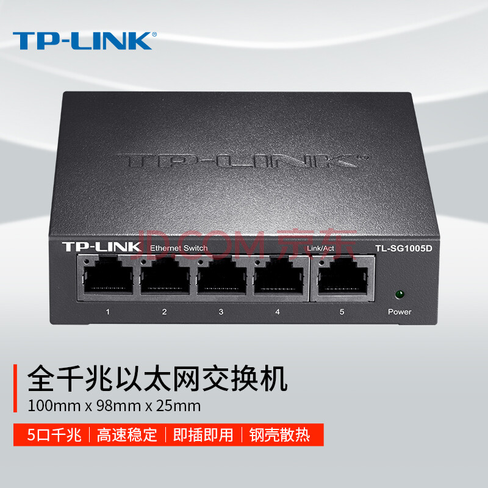

## 家里普遍都是怎么上网的

### 光猫上网
现如今上网都是光纤到户，在运营商购买宽带后，会分配给你一个光猫，光猫插上光纤，浏览器登录其后台系统页面，输入运营商分配的账号密码后即可完常网络配置。

这时最简单的上网可以有两种方式，一种是电脑用网线插入到光猫的网线插口，但很显然现在都不是这么上网的。另一种则是采用wifi连接。

目前我们都是设备（手机、电脑、电视等等）连接wifi上网，有些光猫自身也携带了无线信号发射，只需在光猫的后台页面中设置好wifi的账号和密码后，我们的手机便可以连接该wifi来上网，用图来说就是这样的。

![[2023-01-05 14.39.15.excalidraw.svg]]

### 光猫+路由器上网
光猫作为wifi接入点，存在以下几个问题：
1. 光猫硬件配置一般都比较低，当我们接入的设备比较多时，对光猫性能影响很大，势必也影响网速。
2. 光猫的无线信号覆盖面积比较小，离光猫远的设备，网速影响较大，甚至可能出现无法搜索到wifi信号的情况。
3. 大多数家庭的光猫都会放在弱电箱里，进而导致无线信号受到影响。

因此大多数家庭不会直接使用光猫作为wifi发射器使用，而是在光猫旁边配置一个**路由器**，由路由器来发射wifi无线信号，而且路由器功能也更加强大，除了有更多的天线来覆盖更大范围，其本身硬件配置也更高，还具备很多额外的wifi管理的功能（如设置2.4G和5.8G的网络等），用图来说就是这样。

![[2023-01-05 16.25.58.svg]]

接入过程如下：
1. 将光纤插入到光猫的光纤插口，电脑登录光猫后台管理页面，配置好宽带的账号和密码。
2. 将光猫的千兆口（往最高选没错）用网线连接到路由器的WAN口。WAN口，就是用来接入外部网路的端口，LAN口就是用来组合内部局域网的。这里的网线，最好买5类或者6类网线，毕竟现在都是wifi6的时代了，如果家里的网线比较久，建议直接换掉，否则可能影响带宽。
3. 电脑登录路由器的后台管理页面，网络模式选择DHCP自动发现（即自动发现ip），简单理解，此时路由器便会直接使用光猫的网络，无需做额外上网账户的配置。
4. 最后路由器设置好wifi的账号和密码，即可完成网络配置。

到这里，如果你的家是个两房一厅的小户型，五六十平米左右的，基本上wifi信号都已经足够覆盖，可能离路由器较远的房间，隔的墙比较多时，信号稍微有些弱，但是勉强也都能用。

### 光猫+路由器桥接
当家里的面积比较大时，单单只靠一个路由器，信号的覆盖面积有限，即使市面上有很多路由器宣称可以穿透几面墙，但是每穿透一面墙，信号就会大幅度衰减，这个事实是无法避免的。

那既然wifi信号会减弱，是不是可以在减弱的地方（例如房间）再加入一个或者多个路由器进行信号的桥接，将上一个路由器的wifi信号接入到下一个路由器中，达到信号逐渐传递的作用。显然，这是可以的，这种便是我们常说的**无线接入点模式**，即AP模式，目前主流的路由器都支持这种网络模式。

![[2023-01-05 18.08.58.svg]]
接入过程如下：
1. 光猫接入路由器的过程，和之前的路程一致。
2. 在信号弱的房间，放置一个新的路由器，登录路由器管理后台，网络模式选择无线桥接。这时路由器便会让你选择桥接哪个wifi信号，按步骤设置即可。

经过这种方式的网络布局后，手机里看到的无线信号都是满格了，然而这是一种假象。

### 光猫+交换机+路由器 * n
经过上面桥接后的网络，虽然信号看似正常，实则是一种假象。仔细想想，我们会在什么地方放置新的路由器来桥接无线网络，不就是在信号弱的地方。我们基于一个弱的信号来延长网络信号，即使可以使用类似信号放大器这样的硬件设施，但是信号也无法达到原信号的标准。

如果你的家里，已经有在各个房间预留好网络接口，则不建议这么来设置网络。

正因为如此，很多人也想到另一种方案，那如果我的各个房间都有网线接口，我是不是可以把路由器也放在这些房间，然后采用和弱电箱里与光猫连接的那个路由器相同的方式，来设置另一个wifi，我在客厅就连客厅的wifi，在房间就连房间的wifi。

例如家庭地址为A栋123号，客厅的wifi是弱电箱里的路由器配置的，则叫A#123，房间的wifi则叫A#123-room，有多个房间也可以通过序号来标明。

因此我们在新房装修的时候，便要记得在弱电箱里往各个房间拉好网线，在各个房间里装上网线接口，以方便我们后续根据需要，可以在房间直接插网线使用。

![[2023-01-05 17.42.39.svg]]

如图假设有4个房间，我们的弱电箱放在客厅的角落里，这时便可以在弱电箱里拉4条网线到各个房间里，此时你的房间应该就有这样的插座。

![ahCz22HT6fVTPiCKU3epJw.jpg][../images/ahCz22HT6fVTPiCKU3epJw.jpg]

我们还需要使用一种新的硬件设备，**交换机**。你可以不用理解什么是交换机，只需要知道它能让插在它上面的设备都能上网即可，而且也比路由器便宜，一个千兆交换机也就百来块钱。

上图就是一个拥有5个接口的千兆交换机，需要接口根据需要购买即可，例如有4个房间，可以考虑买5个的。

先来看下网络接入图：

![[2023-01-05 18.48.07.svg]]

这里我们假设除了客厅，我们还需要在另外两个房间加新的路由器来

接入的流程：
1. 弱电箱里放了光猫、路由器和交换机，并且预埋好了通往各个房间的网线，并在房间里装好插口。
2. 光猫配置好网络后，将其千兆口用网线插到交换机的一个接口，将路由器的WAN口用网线插到交换机的另一个接口。配置好路由器的wifi账号和密码，例如之前说的叫A#123。
3. 将预埋好的各个房间的网线，在弱电箱这一头的插口插入到交换机的其余接口中。这时第一个路由器的配置就完成了，我们的设备便能搜索到第一个wifi信号A#123。
4. 接下来我们去房间里放置新的路由器，同样将其WAN口和房间的网线插口连接，完成wifi账号和密码的设置即可，例如之前说的，叫A#123-room1，另一个房间的就叫A#123-room2。这样便完成了所有网络配置。

这里简单提一下为什么路由器的WAN口没有和光猫连接也能够上网。这就是交换机的作用了，咱们是把光猫和交换机用网线连接了，这样只要和交换机的其他接口连接的设备就都能上网了，而路由器的WAN口和交换机连接了，自然可以上网了。

经过这一系列网络配置后，我们在客厅就连接A#123，到了房间1则去连接A#123-room1，去房间2则去连接A#123-room2，wifi信号也不会减弱。

说到这里，我相信你也看出这种组网的问题了。我们从客厅走到房间，有时手机并不一定会自动帮你切换，我们就得手动选择。这种走到另一个区域就得切换wifi的方式，显然是反人类的。咱们的宽带就一个，为什么不能只使用一个wifi信号来覆盖整个屋子。

## 全屋mesh组网
### 为什么选择mesh组网
前面章节的一系列组网方式，都是目前家庭常见的组网方式，这也是很多缺少网络知识的人的常见组网做法，这些做法都存在或多或少的缺陷，局限性非常大。

接下来我们就提供一种当前更加合理的组网方案。

要想实现全屋用一个wifi，目前常见的方式有两种：
* AP组网，通过购买AP组网设备（不便宜）来进行组网，这种方式一般适用于大别墅多楼层的场景，费用比较高，一套做下来可能也得两千多。
* mesh组网，也分为有线mesh组网和无线mesh组网，只需要购买能够支持mesh的路由器即可组网，一般便宜的一个也就两三百，一个150平左右的家庭，两个mesh路由器即可完成全屋覆盖。

AP组网和Mesh组网的区别：
1. mesh组网部署安装比较简单，有些设备甚至能够做到傻瓜式一插即用。而AP则相对复杂一些，需要有一定的网络专业背景知识。
2. mesh组网更加稳定，因为采用了主备路由器的方式，即使备用路由器发生故障，信息可以由其他路由器通过备用路径传送，不依赖于某一个单一节点的性能，所以比ap组网更加强健、更加稳定。
3. 相对于ap组网而言，mesh组网可以选择经多个短跳来传输数据从而获得更高网络带宽，这也正是它的优势之一。

基于以上原因，我们选择mesh组网。

### mesh组网流程
之前《光猫+路由器桥接》和《光猫+交换机+路由器的 * n》的章节中，都存在一个共同点，**路由器都和光猫被绑定在一起**。

光猫为了接入光纤，都会放在弱电箱，而弱电箱一般都会安置在客厅或者家里一个偏僻的角落，而路由器本身作为wifi信号发射器，却也和光猫被放置在这个角落里，导致wifi覆盖的范围不合理，甚至因为在弱电箱里的原因，信号刚发出，就被第一层隔档掉一部分。

接下来要说明下，在mesh组网中，我们的路由器有**主路由**和**副路由**之分。

主路由负责网络接入，也就是从光猫过来的网络接入，由主路由负责（当然，它也会发射wifi信号）。主路由就像之前介绍的一样，接入光猫后，只需要负责设置好wifi的账号和密码即可。主路由只有一个。

副路由则根据主路由的网络配置，发射相同的无线信号。副路由可以有多个，根据家庭面积分配即可。

基于以上这些不合理之处，我们的组网计划修改为如下：
1. 路由器（主路由）和光猫分离，将主路由器放在一个主要活动的区域，一般来说会放在客厅的电视墙下，这样客厅和餐厅都能被最大范围的覆盖到。另外电视盒也需要连接网络。因此我们选择将主路由放在客厅电视墙的位置。
2. 根据家庭面积，在其中部分房间放置副路由器，以我家190平的情况，在其中一个房间放置1个副路由器即可。

接下来要说下线路的问题，这个是重点：
1. 在弱电箱，需要先埋好两根网线，拉到电视墙的地方，其中一根作为进网，一根作为回程使用。在装修的时候，一定要和布网的师傅讲好。
2. 各个房间还是和之前一样，从弱电箱拉网线过去。

整体的组网布局如图所示：

![[2023-01-06 22.12.57.svg]]

组网材料：
1. 光猫，运营商提供
2. 交换机，建议选择千兆级别以上交换机，价格一百多
3. 主路由器，必须选择包含mesh功能的路由器，例如小米的AX3000、AX6000，它们都是千兆级别路由器，而且都支持WIFI6，放在客厅电视墙下，而且还可以接入电视盒子还有智能电视，因此其性能建议选择稍好一些的。
4. 副路由器，也同样是必须包含mesh功能的路由器，而且必须和主路由器同个品牌的，因为不同品牌的mesh组网协议都会有些差异，同个品牌下的协议都是一致的。副路由的性能要求不高，选择一个普通的即可，例如红米AX3000。

组网流程（有线mesh组网）：
1. 弱电箱只放光猫和交换机，还有埋好通往客厅和房间的网线，其中客厅2条，每个房间各一条（案例中我们只用到了两个房间）
2. 光猫配置好后，将千兆口通过预埋好到客厅的网线，连接到客厅的主路由器的WAN口中，配置好主路由的wifi账号和密码，例如叫A#123。完成这一步，我们就可以在客厅搜索到wifi信号，且能正常上网了。
3. 完成了第二步后，可以将电视盒子和智能电视通过网线连接到你的主路由器的LAN口上（现在主流的路由器，LAN口一般都有4个以上），这里一定要留一个LAN口，给后面的步骤用。完成后，电视和电视盒子便可以正常上网了。
4. 接下来一步很重要，之前预埋好的弱电箱到电视墙的另一根网线，将其插入主路由的LAN口，在弱电箱这一端的这跟网线，插入到交换机的一个接口中。这跟回程的网线，连接了主路由和交换机，而主路由连接了光猫，进而保证了之后任何接入到交换机的设备都能正常上网。
5. 将弱电箱中的埋好的各个房间的网线，都插入到交换机中。
6. 接下来你可以用手机装一个speed test的app，连接上wifi后，去各个房间测试，哪个房间的信号较弱，选择在那个房间部署新的mesh路由器。
7. 当我们选择好了房间后，则用网线，一端插入房间的网线插口，另一端插入mesh路由器的LAN口（记住，是LAN口），接上电源后即可完成，不用做任何其他事情。
8. 接下来便可以去主路由的后台管理页面去发现mesh子设备了。如果你用的是小米的AX3000或者AX6000，它们都会自动发现mesh子设备，不用你手动去配置。

这里说几点注意：
* 第1步中，如果电视墙没有拉出两条网线，也可以看下是否有类似房间那样的网线插口。因为有些布网的师傅，为了省事，都只拉一条网线到弱电箱，而且直接还帮你把这条网线插到电视中。
* 第3步中，如果电视墙周围要接入网络的设备较多（例如监控电视、KTV设备），主路由的LAN口不够，有几种方式可以解决：
	1. 采用wifi的方式接入。即让智能电视等设备不使用网线的方式有线接入，而是用无线wifi的方式接入。
	2. 用交换机的方式接入。有些设备不支持无线方式，此时我们可以再购买一个交换机，而交换机一般接口都比较多，将主路由的LAN口用网线插入到交换机其中一个接口中，其他设备也都同理用网线插入到交换机的接口中，这些设备即可正常上网

经过上述流程，就完成了全屋组网，接下来你便可以用同一个wifi畅游全家了。

### 一些注意事项
这里还需要注意几点事情：
1. 弱电箱的埋的网线，包括到电视墙和各个房间的，最好都选择能支持千兆甚至万兆级别的网线，主要也是为了未来接入更高的带宽时，不用更换网线。
2. 同样的道理，连接所有路由器和相关硬件设备的网线，也都最好选择支持WIFI6的6类网线，毕竟至今都有人从运营商买了个500M的宽带，最后因为用了过时的网线不支持百兆以上时，去投诉运营商的事情大有人在。
3. 路由器也需要购买跟你宽带网络级别相符的级别，理由同2。